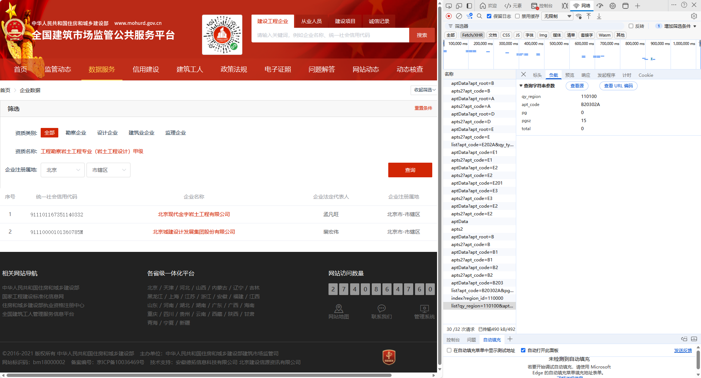

### 企业数据 

#### 分页查询企业数据

资质数据查询 https://jzsc.mohurd.gov.cn/APi/webApi/dataservice/query/comp/list?qy_region=110100&apt_code=B20302A&pg=0&pgsz=15&total=0


#### 对应界面



#### 参数说明

| 名称      | 可空 | 位置  | 说明                                                         |      |
| --------- | ---- | ----- | ------------------------------------------------------------ | ---- |
| qy_region | y    | query | 企业注册属地                                                 |      |
| apt_code  | y    | query | 企业资质代码<br />B20302A: 工程勘察岩土工程专业(岩工程设计)甲级 |      |
| pg        | n    | query | 页码,从0开始                                                 |      |
| pgsz      | n    | query | 单页数量,默认15                                              |      |
| total     | /    | query | 限制查询总条数,页面上仅展示前450条,所以点击查询时为0,点击分页按钮则为450 |      |

apts2接口用于级联查询资质信息,比如 工程勘察=B,工程勘察专业资质=B2,工程勘察岩土工程专业=B203,此接口返回数据就标识对应分类级别下的子类型,如果不返回数据就表示无子类型数据

#### 响应密文

```json
5588a9e126c91a28cc2f6813e3793369c25469a35a79a5541917e64a1f6f6af3f55e740c95225fbef531f1f6866162beeebd6a236c0d68b85945a270cd51b0ed887007c82ea15bf8c9effa785b7db82c7b76fc2db59ca0db60d7a831d476b5c2324108ad3d284cabd10c7f829cdcc0c6e71b0f66cbab555a74dd5ac8ca81bdc39955fd8455e3e8adcfd56ab76ab3dedff1383814b223c28b444d5118688a716b3f3a55a32d0dc98d707d4e260240e1dfbeb575a4bb7cd6f9bd69190276fdbd70c265a56262e580c0d1831500bb9c5433562951a5385a8c57f091e2542006ec0133a0e7827ff269d53e7f3ca7689077de3d01bcd89f82c8155fb7237ac658024c3321ffce498deaabf394ae72c4f75c84eab665e38ff90cd6be2c668369d702217853e2ce74c3ca7189a9209d59edeb77729cf146368d060ad7b8b7c0d70cfcac9de02c2a7d760ce1a678e2d7bbee3fc2bae09e6383b82dd06ced643aea0d40683b13c743bef6e308dc6d6cb0910d522499fec55e8ae4776ca9a2e5b9d9be42019139af47073f22768674fec7ed4cc56f81e063fa95602eb08bb8613468e1b0fa07e281075c16ad408031a7c9481666371c0c7bd5be255ce01a07fae9b9ea72d12f161bff5be9a9cdc30e4e03b9a67ad19bbbc9cf3e3797edbf31c4afcfa915ddbead6ad0bdbcd3382aebbc99ff1853b6a2eb640673c84ef7eea133cb810872e75ce8649c5cf87429befb5c62c5c715d043385eb6f91e383b137f0cff5b36b0b2321a013c928994744c7595396660063d160c2a95e074195089bc38895865cf0d8b4e06da7d9d6afb99cd3397408b0fb6bec026e7b587466fb40acc3c039198fbb2a2ce711fda04d54cf905e60db21c999c967dfe7242a7373c3546d91a3de766b784ca17da27e7b2a88a384a5992ef493d7f0c3ee992bc6947a4803528d7b580ca1719742088d49f02ba3c94097b88ad06bddd886db435abd5c60fc28c4f463c324ff0edbbdd9fdbeb62b3d0863f037b969ff1619009abed4aca490e340ad04262113c574dd9b8ebc833015e786f1858751fb20940f7f7e9a03f586bf08d2803432923b2d7df39fcae9ae0ff85b2429ea034a4ec2801055f0f263997c713539be4278a5c87b70a29f8d3dcd08ba182af55912f985bcf8e35fafeb4d256351113d09b5168bd7e8d627820e9d14fd4ad8b3e7aa61e3eabd7aef7e989dd2d05695e44075b5035f2aa695e19e26242ff65c206c330a4f73d280f54b204cf3ee897549f7c6ddaef9cab923867e90b205182c0adfab8f3e4b6d1b3d277595f0f17421d7d22c2cbb81e362917013f2da740b2eb981442c29a663e644df9e710495fb4dfeae7ffd82352048d6f765cb335be1e1ae95a60cf80d42c0b73258830012f0c3ba045d43dca6721cf73858daaab2e484f8c3afa72154a5920b47d30943bb528c45929bb4dc4fb765bb92975c6d6d434d897643fa460ab9a71482e6e35eb7ec54d16aae5e122abd10e1977febc48f1cac3b38f6faa7d847ddd528fb5e69ed8a9da28d21cda6c39c1de2d489b2e0d9a6b5e63fbc103cb8c172ee2f1ef87f465a74f034e88d2a7d45a701b5474820cfed90ba6fddecb7d576f1fb20dfd48e9d6c160730a591b26f89b2ddacb1ae178b1854b0d4873c556c839b9ccb8b34a28433cc336108a4d1349f0fa69c70ea9171b29d223449c28f57c92c9159d5eae46084fe80a3b069cfc8ff932f24cc11609185d1f7c9d78083a8c1a95bfc9eb1930e6b96b6c7006fe327924ae5870468c332d35019939c622e4ab04a7df16a6381ac9d8d11b3adad13b7eb369534c708dc029637e3d972691ee1a8a25015c2eb45578ca7018e949fdcb8ecb0ca5b035b048b5ac13b9aa5876fdf796b9a43f93e2b3a3218613b2021e0f0ce53cd3805ff8311facadb54a40e37ac783fd58e3728705c49326fa92148c4c7ffe12d639f5c4d40804abb72f2a5956be01977b1fa43387a6a2574a11b24f8c5683827d933a89420a52c2f3ea9df1469fe386ef3c41fd0ada6f5c9e191115d56e498dfba91d491c2a439e01c17d786073f50b2ac48fbe96106b2a3ca60b3e5e4bcca7013530d4663951531c7a3d78346029b35b002e57bf1353bb715995c3cfb2afbe0c6cb61f2254e6fd83f79af468a4468bee4d035fd6d8f2e497a4f51f6daa2d54ef295e20933c8018e8cbf7d61a3056fad8b6856710cb2aacffc7e74f7d12870b7270c6f04a5bc22e5587333b73905ec3f35d3a4331dfa80e6b104587d1f74ee78c7a6865f8cca9b8791806c98823fb327a41bcbd6209f16dd41fb225440f61aff74c88f8da67e49019efb5930e4889aa90191be87464c6ed36905c16407fcac6b4ac1ef682c3019768d5e0afed6e3aa73e0de60c3dd6dc61e3dd15ec0c6830f13febd81eccc7240fa2b4457c7d76d1127c5af4b1cdd847763d37947986f3bfc462c5b7dbe483aa61189d75c21cbd341708176050dce15bf8bfe7e627a53e88c9e8795c42d012a2b315017c2a919f6f1b4867cecd8364b2a9085d54f750d1cfc0cc03d997995549d22c5de54ca293a173c9a5ff9dd8f482ff2e1f9075b8729ca780ab09435842941371ad1be8f37918510b4005c8503a8511755eebe2d1d559a00bdc0a5798a2f3c411fea20fc480583971fa493ddc48faba439b5473a39287dffb9a556b26989e8bcbb46c57172050e6407c08c7b105386bf7b9ca6518d4642a47a614f825bd015fad1e021fa124edf0bdb99953caa334bd6c311ec7b16682c5b37cf0ad444c11eb64e10785a9cf9b7aed5d9dad914982991b6097e63a2ad552aebc3db885b94642bf2630925a5771c5becc20b216f2b5c0f4306892e9686986e7f8a4fca27e2daab0180a38cada6eeb9b41e02ac66baf04dec6c3291a20df6db9104a82c1e9c9655d1f142c3a450515e67bfdd26508417b3d00aec9e9cdc21542884c560d4e140908ef698602df3856c8fff139824ebb56535c57c9094699624aa4d3e5b3c1f3d9d1b5e6a0acedb39664bd89feb09598748387a428231896c56c445d1d644fd6b841fd2754d04350854fc0c24f31fda52d61278d2b0abe286f2a6ba881f40a7959745da92c7152d00d83b39215b4c8a446c7161fee7acfd9c7df81b25cbcf6c223229ba88419fe2861b3dff19df90f14c61b44c278c0d281f9b6841b38ec27a89187d297ee9d54a0e53d0010b39a4ab890464cd759101bbbea503e448647ab3c4d8f929b44b02b6dc0349e9d0e11b6d6815c595b25339fb5c57110462698662de9846f56e533a6d6f262b39398393cb931472ee9348401a30bbaad5340e0dcd3bb4d4329a9c315af221e854cf5a8e9514775ef101133d3701de16d82a0577141c4cbf402becd0c19840d369aef0854d71a24aa3a3a5c292a7381cb26c269df962243c0142e943b867f15e25dc51dc470de2634aeef86030f548b595a565ae37668d8518b54f5510d6dc259cda029989d0e04c9dc517bcc0e60bc1a048efc85cd20ebd8e4c42716269ab071e809a321ded5584bdbe6930d851fcd5ed584e422ff23ca300a50a6e37599b38237a972f7e2b55c85aa0e31bc5dd4584e2c5e41bdb6322b0150d4f71f72fe934efb8ce7bdcca1bf8963b62ba41f982824556b9660c41518d2faa1ef171599ee64fcff70842fc94b065debaa750c16989b0ff2953a42a26c673f9f8d55aa9054d40c0dabd755f80e90d2580571807a72d896b2c722649030e1590babb631b79297514cb7b830402b9666246643244a89ec1ace9f2d6cb2a5e01b2c67d641dcd00be20a5dff05ac4f4663545e75a19deab60e2fa55079d23d40971bd27965cda7ff32a6e55d4ea8e614eacf9d79024e6f391ef78a508c7c033dbd4b6ea7f6c373244afc096314094e6d5e94e2134a3d8f9bf562465d2c4eecd1362e3b41cf6465af129ebedd7cb9d88317989267556e3ee9cee3154961b48a8b41364a0c66920da0ce26217b1a26d8d6f700dd162203909030a35164ae7f8ec3ffeb904f80a8e2afc07386256b6022925a6733ffd863ab1b86a125909b15f16692f609d4cd9e09770624c61e44b70b85d3b050f0518afe566376aa545e418906c52e51e77543459d8814608b016fbc79a82a630e67e7694fc5c2387ff3b5361f6210b68cfdc4f6f18f1cd1b7eb14a3772c54d0e138441a43fef1c0c4e855ade16490b956f71b4d02482f6ab02f63fe9812eb234c8ea6c7d00fef55d8a0672898426d6980d2584fc722ab10f33f5f62a8eba8a1c4fb7c933ea1b3b5f4744b304554c1788752c1329d41a17c021b08c5a32aef4feba23b95f54a17b1539c6ed8adb9873fd7caf0d7b8792e52ed1788ff6cb2c8e33f7de8f40f37bc19485182e77e55801151e350d3e05b2c4085747544bb58d492e348e845733b3d98996844264d9c69d47a7ad949f7831d72fc98b7c8392694c26f4df2550f69d14b5149f1a0febe1eb7f6e071b944f26d5872c607176443c11bd4037018a1422d62c783aff4d76461b0bf517b541edf858bfea477dbfc9d2cdc747560af1b772bb33db4f6e0f84dd4996b46675cdc786765a9c2221d1c0a5abd1164023c3c07f23c813b515dd41ad4c5bf97150a93a1c8c9c8e1836ff8d37ca5862c2db5d2f6045094e0aad959ecb3ed4869b3d221c664a9b08a57a93991a7ec6acf15be54fcaa18a0150bb2c4608821cceabd4e7b34f6a73b72029ab36a30c64be453063da7704d41efd57348d5f5f0e67cf1fd88382f1db19cff4baeb4cee16ae2f0d0b10691b85347bc81e0751aefc567da24b698f749cba09504acdc3c5889eae084ca6f437dc7791997f92042ad4d40c2343a4c09afb888b160c368f462f9f7bf3b92ecb233e42879a4d93ebf790b3ba06ef8b12239f37dac4a7d7f5f43ccc2a3139c05d6c2b7874a5473ee1ff7f234d82bdb9bbdb4586753ab4f5557a44ba8364e0bf377ba509257474b4c12169dc8bfb59ddd16bb9b951d884422c6dfa8a48e17f79493150d0dbf14e194556163540340b5f2c505a4c52850d120a7f65df214f88c5d0f6362a241e35e77545349437beba040209c9007c935489948eb048647d8c3efb2388ecb5b2f40639e79c17003ccdee460383f783d8224d2dca00bc9541bc5b0f812a682d15ce86d5725f78bcc8f73da3fc62f889972e0f551f185f1c9c8e3ba7c9f5a3fa9431ec65f4fa427026084d25afd557a933db3486d0725d456167eb770d1ae739be1e91a8322beb77e5bf8d1163ca51b6d27a31fc0be33c3ff0cb411271acc5900d2ebf5bed9eca96eec642e0186ff4f21d051a9a7b8257af9b891e74c87eb20bed3a6bdfc3c6ce911bb2141e6df99e3f4b1eb6d8dfecb94018f877a4b79a7a14abd9cc85df93351f93b430a6001ea59f2daca2ce7cfcbe0d3fb8b4ceae07c22b7276c64057e17635b91a83e14b777605183379fc9c1e9f5e6d99421f3244c5d570b58f753a2bde033672cf17e730752e56fac880e45a2f443d2a88a250596fc4d11f3914f3bc2ea7cf9f39b5215f0741439e5d71a8f4fd83eda462c718a2b978c123e7d0ad5f9614dabe07286568e27b1da7f53603bafdf3498b5faa37c3222eab50a1aa896339a41d68a3c897edeadca1bb66b53ee0c562ee778cd2d4780f827605d005e5bcc31c4abbd1b584431a6a8fc2173308f2c829eeee26c7203423338eb6e4e37191f0a341c4f4df98b76551bb13fa17ade35f1c705491a3024b2150df0b5aa361c52d8987085e17e77dcc7fb4b0de8a7bab46a96c9e873006c33de37181b330845fda1a2523ab295f41b7219dd590b7212376e3895fd8003096f573f41431b48747634fe2782a8d2b42f4df197e5d2b639fe7d5f02d97bd2777aaabfd02e36a87808c056d0107eaa0d3466042af67b1151fd259131f1ad631db86293adefe660a229af2a2e01b1fabbe6668c92da0cfd1cdfb200512731cbfe8524121ae4fd12449777f6d8e6bab3546267b4307e29cdd3d8805878ab21897e477b52a991ef239889b6142b07cfa582a8c2a896e2f649a16d1443eea38a960d4bf73d124c3af49ed9b807abc817961268ff1a0966416ea10a206de3665d90de1ed6e273647c4151b54f428a6036b2a47a32bd013642be4deada15e70f5317725690c7cb9e33e13eb904dc1d07073d888174951d88b0e5424f2cb29a32647d92bc5b63f9a51250298e67800c4007ffa6737ba01744604ba72bec5c6c3b85f78fa430af3a31093968b86a44a18f3c71f1a74ff4f14005483fa1ad1e96cac3e8b560d8f82a830cbe8858a1479ac882923e9075b207fdd2be0070460aa2b289fe3f13abe2
```

#### 响应明文

```json
{
  "code": 200,
  "data": {
    "list": [
      {
        "QY_FR_NAME": "马拴柱",
        "QY_REGION": "610800",
        "QY_NAME": "榆林永邦建设工程有限公司",
        "QY_REGION_NAME": "陕西省-榆林市",
        "QY_ORG_CODE": "91610800064834709T",
        "COLLECT_TIME": 1622263196000,
        "RN": 1,
        "QY_ID": "002105291239451309",
        "QY_SRC_TYPE": "0",
        "OLD_CODE": "064834709"
      },
      {
        "QY_FR_NAME": "陈新玺",
        "QY_REGION": "310000",
        "QY_NAME": "上海东海海洋工程勘察设计研究院有限公司",
        "QY_REGION_NAME": "上海市",
        "QY_ORG_CODE": "91310115425090769Q",
        "COLLECT_TIME": 1622263196000,
        "RN": 2,
        "QY_ID": "002105291239451310",
        "QY_SRC_TYPE": "0",
        "OLD_CODE": "425090769"
      },
      {
        "QY_FR_NAME": "施青松",
        "QY_REGION": "330100",
        "QY_NAME": "杭州国海海洋工程勘测设计研究院",
        "QY_REGION_NAME": "浙江省-杭州市",
        "QY_ORG_CODE": "91330108732413329M",
        "COLLECT_TIME": 1622263196000,
        "RN": 3,
        "QY_ID": "002105291239451311",
        "QY_SRC_TYPE": "0",
        "OLD_CODE": "470085168"
      },
      {
        "QY_FR_NAME": "胡泽建",
        "QY_REGION": "370000",
        "QY_NAME": "青岛海洋工程勘察设计研究院",
        "QY_REGION_NAME": "山东省",
        "QY_ORG_CODE": "913702124274093748",
        "COLLECT_TIME": 1622263196000,
        "RN": 4,
        "QY_ID": "002105291239451313",
        "QY_SRC_TYPE": "0",
        "OLD_CODE": "427409374"
      },
      {
        "QY_FR_NAME": "王丕波",
        "QY_REGION": "370200",
        "QY_NAME": "青岛环海海洋工程勘察研究院有限责任公司",
        "QY_REGION_NAME": "山东省-青岛市",
        "QY_ORG_CODE": "91370200264617434T",
        "COLLECT_TIME": 1622263196000,
        "RN": 5,
        "QY_ID": "002105291239451314",
        "QY_SRC_TYPE": "0",
        "OLD_CODE": "264617434"
      },
      {
        "QY_FR_NAME": "李海东",
        "QY_REGION": "350200",
        "QY_NAME": "厦门海洋工程勘察设计研究院有限公司",
        "QY_REGION_NAME": "福建省-厦门市",
        "QY_ORG_CODE": "91350200705483954P",
        "COLLECT_TIME": 1622263196000,
        "RN": 6,
        "QY_ID": "002105291239451315",
        "QY_SRC_TYPE": "0",
        "OLD_CODE": "705483954"
      },
      {
        "QY_FR_NAME": "陈少刚",
        "QY_REGION": "320900",
        "QY_NAME": "盐城市弘厦建设工程有限公司",
        "QY_REGION_NAME": "江苏省-盐城市",
        "QY_ORG_CODE": "91320902140530767N",
        "COLLECT_TIME": 1622263196000,
        "RN": 7,
        "QY_ID": "002105291239451317",
        "QY_SRC_TYPE": "0",
        "OLD_CODE": "140530767"
      },
      {
        "QY_FR_NAME": "史留玉",
        "QY_REGION": "650100",
        "QY_NAME": "新疆澳阳建筑装饰工程有限公司",
        "QY_REGION_NAME": "新疆维吾尔自治区-乌鲁木齐市",
        "QY_ORG_CODE": "91650100712969207B",
        "COLLECT_TIME": 1622263196000,
        "RN": 8,
        "QY_ID": "002105291239451324",
        "QY_SRC_TYPE": "0",
        "OLD_CODE": "712969207"
      },
      {
        "QY_FR_NAME": "李长江",
        "QY_REGION": "220200",
        "QY_NAME": "吉林市电力建设监理有限公司",
        "QY_REGION_NAME": "吉林省-吉林市",
        "QY_ORG_CODE": "91220214702333264B",
        "COLLECT_TIME": 1622263196000,
        "RN": 9,
        "QY_ID": "002105291239451325",
        "QY_SRC_TYPE": "0",
        "OLD_CODE": "702333264"
      },
      {
        "QY_FR_NAME": "张玉军",
        "QY_REGION": "650100",
        "QY_NAME": "乌鲁木齐市燕江装饰工程有限公司",
        "QY_REGION_NAME": "新疆维吾尔自治区-乌鲁木齐市",
        "QY_ORG_CODE": "91650100726954495Q",
        "COLLECT_TIME": 1622263196000,
        "RN": 10,
        "QY_ID": "002105291239451326",
        "QY_SRC_TYPE": "0",
        "OLD_CODE": "726954495"
      },
      {
        "QY_FR_NAME": "王元忠",
        "QY_REGION": "630100",
        "QY_NAME": "青海省力天建设工程监理有限责任公司",
        "QY_REGION_NAME": "青海省-西宁市",
        "QY_ORG_CODE": "91630100710494017J",
        "COLLECT_TIME": 1622263196000,
        "RN": 11,
        "QY_ID": "002105291239451329",
        "QY_SRC_TYPE": "0",
        "OLD_CODE": "710494017"
      },
      {
        "QY_FR_NAME": "尹章盛",
        "QY_REGION": "650100",
        "QY_NAME": "新疆中洲交通科技有限公司",
        "QY_REGION_NAME": "新疆维吾尔自治区-乌鲁木齐市",
        "QY_ORG_CODE": "91650103676310092P",
        "COLLECT_TIME": 1622263196000,
        "RN": 12,
        "QY_ID": "002105291239451332",
        "QY_SRC_TYPE": "0",
        "OLD_CODE": "676310092"
      },
      {
        "QY_FR_NAME": "王莉",
        "QY_REGION": "650100",
        "QY_NAME": "新疆锦绣资源工程有限公司",
        "QY_REGION_NAME": "新疆维吾尔自治区-乌鲁木齐市",
        "QY_ORG_CODE": "91650100738372388B",
        "COLLECT_TIME": 1622263196000,
        "RN": 13,
        "QY_ID": "002105291239451334",
        "QY_SRC_TYPE": "0",
        "OLD_CODE": "738372388"
      },
      {
        "QY_FR_NAME": "雷芳",
        "QY_REGION": "510100",
        "QY_NAME": "四川蓝蓝公路勘察设计有限公司",
        "QY_REGION_NAME": "四川省-成都市",
        "QY_ORG_CODE": "91510000682370817C",
        "COLLECT_TIME": 1622263196000,
        "RN": 14,
        "QY_ID": "002105291239451336",
        "QY_SRC_TYPE": "0",
        "OLD_CODE": "682370817"
      },
      {
        "QY_FR_NAME": "李小鹏",
        "QY_REGION": "650100",
        "QY_NAME": "新疆印象建筑规划设计有限公司",
        "QY_REGION_NAME": "新疆维吾尔自治区-乌鲁木齐市",
        "QY_ORG_CODE": "91650100679295027N",
        "COLLECT_TIME": 1622263196000,
        "RN": 15,
        "QY_ID": "002105291239451337",
        "QY_SRC_TYPE": "0",
        "OLD_CODE": "679295027"
      }
    ],
    "pageNum": 0,
    "pageSize": 15,
    "total": 677511
  },
  "message": "",
  "success": true
}
```

#### 分页查询企业资质

https://jzsc.mohurd.gov.cn/APi/webApi/dataservice/query/comp/caDetailList?qyId=002105291239451309&pg=0&pgsz=15

##### 参数说明

qyId: 002105291239451309 来自分页查询接口的QY_ID字段

pg: 页码

pgsz: 单页数量

##### 响应密文

```
5588a9e126c91a28cc2f6813e37933695200acf48c974f58b6a551d08a5efbb212d9653f977f6d2b4ad915e7104d9f9aca86f905955999145581c45fefa6aa4f2993e0d4636243c14f784270d293019c9326ef89c7d18633451a8a403241f54fce33bf6b4581c3918f7e24706ad7fd98dd2ffcf3e264a3ea92d5f59eaa7c71cef24b190c3278873398002111b88a82f519c758307f1eff414eeb686f0386d8647eab0e4c08fab0ee9a9c52d162fce7299ce7fa361205ca4a5b0cd5ed2a02ba92b95ea14f012816f28ee5cb4fc9c2ae6fa89a120d433a2a1fa213759b2619505a514543944cc9a230ed1b7638e76979e9f3a41a62f06efafd8c8e9afd78e287705152e6d656ef38e1bf8793cbc8849ada1c11c25ce97fe2f8e177c9dcd4c6d45a9525b132185cc6826a0e5d912fd376f07208abdead4f826a79ac9475cefb9c4d80b6ef09a70676eea7e1e227b9d8395fabc92b61e3bb725a6fe3416a0ac94de9ba773e1762ce5adf6862d07619f60c9b985bb7b75d9103aea91ab68228f906a5e3b03be8caa9f62784aac7455d76e1e01e8e8b7b8168e5a172741718b2e0078321f1508132ddf17cb1587f7e863381dcd35fe57e08c7153e55696aa3eb63aecde6d2f04748854f5e025d3f027cb687bef200cc280a7990753be05ea41a7de9a3e58006af3ae3748d1e672bc545c319362fe0bdf838a16c596125e50185e26a9ab1dd4231aca2979d23d6aad9cf9d131a1fecdbf7f03a9ec0d22c537db5bfaa16a6dc7feb92bd09976ac7ff2aecc44f37eb303f63bd6bf83d8746e3828a43173e7a415afab53dad8c473f01baac3e158b2c7a734d5584e01c4c16b377c56f0c708f863aa779c8a7bff7638dbca1d21c7df01e262b6a5eba74d4ccc92bc6712da2e01349ee987ac0caaab53b0f28e9b2b974615565a81f5e4f5a0bc7ebeb4591cb1a62a928edcd19176172d2c02b3d4010bd168d3d7384f80819d622ab30cd2f332501a0b0f3b1aea584f8890b099c05b77572965a9eaef2ad8b59dae806009c17c727f4cd4865b1cfa429fd67b0a2471f238eb36152074db7aff5b870156e8ca5d6a29180da20d1b16bb5a1ece09939731259228e61dba9d8b8d3a94cf649b098f4cb3627be5325bff4af16f714979a84a3d1898358dc15dd4a57b3de533104de471191bff9e9d3d999fb72e8dfd7f1bfbb5d02c3c865f7a6c39902810326710ba3a2069ee4f6fe24990aaff0948718b9d781a90e3d3813960ed7a9c2f1b904d2b9b29c54eb204b4df33cf5943f1b00f3ec6d8df02dfe315647a07d4a3aa863499b5d5af7b6b66c2b27d04a76e761c150b28018423c5f580b4420bbcb659b93bfd697335e45fb799cbfc1d7e0a2183498231a42d86c02dfb855f891bc16d39c7a40ec32934d1671fc7cd61db2fd2b8610a44d50f5c25cf3c5278459c030319ec465a77e69e82893e58d937e9437d22e0699afc8c7763524f22e77a5bc099e5a987707cbb48310aa30ad8edae9942579e06551be5565953b04f09dbac1e0f28284d3abf48b3dc34803b055787244be30402d24ee69067ef606a9b93062445118471ee5947d66520dc1a8b6cb23c292bf0634a27df3c47251893fb77e69760524c6b0ec1202ec60990a4ff01c37b4e45c9ce94c42219c87721ecbff92c5880e1c3dbb4654fc10627d469eb6b4a598792ae37dbf40da3bdd42101ca5ad761497a716d36b90176004f6108096358dc845da6a526ab657138716db4e59d4e5bf7bdaec29ba6f8f3d93463d7d0a12ad33f77893921d2d9fa7da72af74381fe108f08a8420e5b6918b98c48d3bbcace46261a9aba8bfdf0125c805dc78144b971963b9b876bbc7e9f0fb66cadfd6f8ea4eb765b189cae8aa57abec63e46ebc844e59f948d8458f7d382973ee353aed95948ed4ff61f0ba02ce33df812a656c9c93582bb72796f686118fc740974a1211006c8ed972236b7e67d709e8ca85de769cdbed441da77610e71d460f289a4fcfd0ec8a7c74203531379c21b2ea7c58522945e1dd8ff638d0fc9b6568a4908ce170c8820c2c076f5e8915dffa561ce612623b85b524f49e909c5a695df373de2ed6b228c0255177c52e53a8d6420eb9eaf5a3ff48bc8b175bf1c349a588dbf5a3a978a49a9d298a61a2d3e24febadb17b54e9e2af3911d2d482d97b92a59b1afe2c711ddc91342edda64679cb44ea871914875db6872e68b7d223e171cb424f41d153875ddfea4b05aa97f487927f12e4290740666c0c71b179243f8d7498c4992179d4d09b41e236fc5e03dffd3f80c7248de8adb08eaf36dd481c8dc27d5edf0b5e620ef34816691aea901f95541892c0211e27c0c408eb3a66f7204d8d67c589abe9f80afafa6185c3c3993b34d50b04d9ce7ec3922f348474642da3c6b15be7ff7bad8aa6a90f0b90308beba10826268164ca79a6a495a5975ce290ff90ecdce6243c162b383b41212c47cae48716a5b32abed094d16ce56b0d07e8bd78cb02e7506d7cb38f09de069e5d46be0465f8034e43195fa33fda7b85c54612dd8925de85cd308c28a41cf6f6a6582440df1d5ff69273b6dff622c8f085f4e66b3a6bcc8666501d1b4c84d08eaa0496a9ab2365589aedc4b905fe562f0f2ab6c3f45084ea0392ffba2ff594172faba461c499fd0aef05d6c4a6dd06c0b534240cc8943c171791a915022f6c48c21f9c30596afcc630a67cfb57d55e8eb425e1eff0e274ff52901959d999328cf13b88d24832fe34e4b0c69e306b2b431ce68a0a1b2ef5b077d3a17bbd6ddd8d1a056b5fcd0b36af7d63f4902d6c211dc8d3566b659e30a59078a0bbcbd2e567ccb808f8ce9ceb016f192ac884884808721e45efef8edc33278e46af1c06e06f128e4ef96a005b3c3006b3fc22f8144448067952e7570576d6d90f82fa10e0c29009433864194a30c0d7ada41a49460751d5657108da518eb193b6cf8326d011b33a52cc924d10900a68f809de4e91739486aa38c33ce7631ca274ee1ccc54d605b334555b6525dfac58473cdede312b9895757697df118b4caa80d47bce4100a02f27b13c3b7f4baf4397f544d4052fc2b447d4598ca584ab1d7c661be70280e93a93e83012fe54aca207529ef47cc913112a962ebd20ea5b404cb8b7db88e3b37e86b4addd35f7b173e5385f757221854f75a41117bbcfd22a6b382b7ceb2751e05b9dfc7021f375e468c4fee0168f15b5f914bfab9978dab16d9cab378ad572a8f5f5b1b8535ad5308760419df8af467c3bb8fbb802277da226fb1271f4ad96f15cf3cc7c32b40c2e423aeae4c5af1447698b752171a1b7b038bd834b92ebb067704b590e013eb0aae1b9effafe96c2e213164c5b005c537b46c123589bd84307b44dfc86e151c03db87280ba1dcd8e28439cccd5c56d0bf5ac1661b1ebe18c578994bb946d2000b80f680c5d085de2c703547dcd85542b8462c26664d2ce98d8c0e3fb5ba8464e75da42b75f3aeb98ec438d8851f84f712e8da72aa44f08e8153d47de3ffe12a2591bfa7fa3321231fbd54aac9327eb107265a4592ae600ab4bcabd96e81ac02549eff9ec0defa0df105dc019732bcd0b7d17fd09a9c022509f1357e26c6bacfb5623c828db7f99e9f49ca7483e4c6a22eaebf2b770495aadf684ab44db1f78d0d4e176cf8f2a8430e119c30e26ac21e19f136eb0c40820809789160cab68a52ce280667b369841c2a8425225758038322f09d29e3d68255742b31f9cd4ecd034a3906a26234ec38ce4cccdf68d4aaed2450d62f329056bf1411676341def36b016f33a09a4b261e6c2e67d15f534a2004f712e9ff2930a8a2e6f005106cfb12d7a4db75b856f590063b61ab8445e3b4659e0f2b32867d8c8c895e6d7fd21b9ff55b4ea6320b4c04e04b554b5d3edadb539a3b3c52c0aa7d258bd509e3a067c0d2564345044c2b2934341dd97eb635365021fad7ff98f8bfa7e686e886a55ddf3710e2e3639b97c41f231c78ce863f681d7fffe789d7e088895f5c878b290200ddfbe06c0de455b1df7a8b5b6fe1f233e9d6b53e073c1e24497448b75034b824a52d77baa2ec4f0037165b2e811a22cc560b2d13f723d02c52f488b811aab0cfe3a4b62f3fbd0af7c05a1990c29eb9345c6e74bfe82a1428433cb45f5c47d9406211a40b61bd973178fe4f53f059737dd8cd500d4f8af879fc6d63d5dea2f934699e8462ec5dbb8373597af73a522b1a71f125e70f08612501c7c0304e802119a0bab13098d48ee3220f3bbc2d07262a969db0e1d8a46c593f7a7995f01176f1aacf80696ed11234b3245143132b3115fafc05da49163cc86f0bada43e831eb90a49bb8a34569081079988a21957ca675eb3db307f638067d47d372ed69a7e80697b79da6c47350753dae72dcb7d87f62ee52f2c9e8be348ff494cf58c70b4c1fb0082ba117957819f8473ccd2785eb9d668064652fae5f1c9b3b60c79827ad299a7546e12b60f65a3fb15db98408e2d41dd3b90523c31227d423358b7916a34b1a85a1e13df32b1f877bcde8be847d09c19fc75d727323a87820e523cdabdd91bbdf418c233a0c9b28f254772b4d995ba758294e74ff64f7d61114e18072d7041a73781532ef6ed5e2ededa48473981043d178d6b55f14570aab44396ea6ba8ffa3eb41328db9698f97969582bf6f8a4dd8bbd17d1f8bc316558c549061f9722c73985d02f53266b1d24593d2ebbd04712c57edc89b33efe2543086a741dfa0388f438fe7129524728dedc8b113f66d56b320b91f8be206af386c023b4e99a868cc0421a848e5d0733ad51fdef687f342fd63597afb38b9e8ff40969a04399c0b9715bcac657c5507e863dc31d8d6d11b1a82c6317cf3a33a9483e240275b388095f8696fa437fd8ce6f10761e107e14df6217adb1c3dc4e6e4bf1928d558dc8d47ce9a30e1b2d21ed9445642b38cefda6c6a46fc32fa41a2d4bb1fa1f8326085742c0bcb20254f2954df8f18b34b3d12f51f7a53dca18255ffd5dd9b135772e27eb700a505367e01b458b1b9cc845f1d9bb436dc160fc188f0162a1d4ccdd140043857c1224941f42987af501ca6e8b11193f53e2db78f7efd4cb7ab48f57ce6fdd70cfae12959fbe636cfff741178533f27d35f1d8ddd8ba89e3a0489acbe9b3c54ed0d5c44cff1569807e1abb63318a05683e09ce00c567bfc562444e0ecd1087950f16a03e0af25861d093f587ae92c282aaee811b040bb86e6fbf828ef9f22d5cdc719cdde0a9c75d17ff97eaa48a31c3ec3c10254643d75d6c7a9f3cf4edda63482236268f51bdba09e2ad2d3596f3cb087c76f6df63d8e75db54f0cc42779c136ac17165454fd6dc1d392b1c43deb804c55afecbcd67b835cfa445e6e5fec691c52324c782a4422a5f40183410d3694b39b80e52b79fa7f06b3588e63f4de9e660beb8891698901ceea899b1a1fe88683eeb02bc5dae74db38fd4cba672d9b26cde62b3440e7db6c40aa58788252d13eeb1bab526a8809760b051ae3d1020e9445e1ca4672ef16ea5e6b229e7c230f3e10464831b97d7bca869cd965dfb62ab321a8c6054462d746e380684b680786dab4cb178645c4c44b8119d77bf25f3663c5a9ada669b2e8a3e09bb896db66926637b609b275eb762b390b4298ba52a13d433f2b5d540c2d49c019e6eb95cfb2d2c74d5b56c5a03c118568c9a2385ffbc8ae4942a534a378451cefbeaf3801d94187eb7d7054daf27074262334d5ee4781b919558c18a0364abdda296ed31b6921c0cc9ea811a30f39477d924f60e1501ac7108f1d7c488fdaabf8e71a95b7c9d02232702deac702131921200c7b93b2983b32ca688392998c1d63de5cd42d486afb9173603dea4687209f5a1f4d74e46c2185c8ff3fdfb61dd39280198533b1e6878c5fa499456ae8fbb45fae83996db5572f3822c966f30cde3f2a4f5559b84902d03c6054d7b308f622fa4deeec8a75e1c5b4bfed8ea9ce93d429231c9240d8213c846d7d802d73f980ef850bc0878a6969dfff9f8aad38c5daabe6b43dc38c831c7c3549ffc5d334b8bf37863ea616a87d0145997f8d4758ea8a235a7594b197c833c0ae0c66d1736c1544b94eae53c2218bdc1b18a703700e52ccdaa57dfb68de89e50288ec690743fae34138563ea01ab52eee1a0ca68c37bdb635553c2b6edaa7755f03e10d5bdf7b0923c951ecf1f5aac8f75454b2eefef350535f555807e027fd912f613827213fd68b6d233af228a78038c43556e1faa63b4499f44681346faa30f23878c5ecea61e5f42ec4d85c747c7686e2497628acf8215b754040a2029b314fe195f3958fbfcd6f56284e7fdd3c36a15b24cdcca2fc13b09cee4c24dc7609fe2a1418799a45cc2bc743cb2519708b1f9cefc0a62e9274cffc241031f6dc573e9005e108ca221ccf3e9a34f1ad46eece2fb70523182c21387004f83b9bc2f2301e3a985e87aca0e95503b6dc7b24dff8bf27c0bc5e8affbae091bad5ecc69a50a2520dbb834f52d165c2299587d08da6d728d6f2b5a3882c76156c87777fcb1a3b22a966747667665404e5acd1d685d5a5140fc9c081e3001ce9219dcd1a703f8703564732efd3d566aaae3414652b0daa8c170afb40d139fc5143e95b7a42add7ea5420b5e0bbe6d007127d3acdae8281dc9261ed1c04e26a4eb4a356ec7c04f4751bbbadc3e388d2884c623c3045ebdc006d0caec8ae12116da06197c7e1e82f4fa2c921c1b9fd526e00479618b10d4ae56e1d161c5f3ff7098a9a72f85c42fca057393a5d17f405c0b26df764b606308fef59bda3d8abbd50e15f6c813d01ab9819184dba0b67681c0719f11d6c82c944b059cbecccddf638ce29affc3f3e38b0976a97897d975ee600a92206f829e437648f8546e5a6e67f9cb7c288aae7c35c26bf7b4b7362021e48c695815e3fbde099b9f86b1c47808707820dd910a8dd965d5476c6c735e821e94a841ffb1be9d582b13ad3982f6bf7da6f2b4d60d20a3e049107a5990812c584c97d06b20dcb904c20f0eb7a9fd69fc5fcdbde089dcba0a26b57efdb49cc2ed41d67b28be835531dfb0cc38da43311a81c0c3a70c3695e60fcaa528b3fbf3f577428d779fa74b377a1d833feee87b2995555e3c5d21075254f97b8ddaafa1c305d0ceb10382c376111006d56457422bb430610feb8f0666a796c65ffa7a93dac4e54cfb83377c7d3553541b3adb6328d51c9c307fded29bf97a541960ec5ce2cfa91f2ea4910b4f1ad37a6635e7ba6ae21f5a0a2d1299ed674edb912e66a1143827b264688ad54019268dd4cfc9f4aaac2450bcd4ef788d722c48925ac22e991fe721335681f94710f44df0d34a20e662a26adcef5a0edd5e58f6af6b36440971e6b407bad5480a232ff9377d3276a164350fe35b19c258aad9907a01c49a726eed5aa751d6a163379e75961f288329a35daf6dc40cb6640ecc595a295dfe17bd2d72ca90cc7e00ce98ba9e6bf040384d9421ce7091946e3c39915da54509bf588e94c82e7be545156cee090330bdd71390d48b6f93e016a4d0900db73f71dcfa7c359ee7a948702270e5432113bed4a7b216d517b4ab186edb214002175051064664488056795ba22de97514b38b5fcc893571f08c374d8e0991b5eb3524fff56f9d488f76cc318f7642559d4327c2ca3b143b3a28c8bd59087b33f0a7de585bb6830dd8b4946161e72e753542759d2f74ce0417a4b27e9af0db13518d2335f8056a6e8beb499c02f743d00907500ae45a6e0b812b7486a6b3cf74409c48b4302053971dd6a82977b937d3c46a087ca27130fd12da02cdf6596460ad47e35378208887af717953b152c9e29278c7e92edaffa34961c8d6025efc3bc643941ac3b8434f7e3f74ac38c9d9a6ca5d2f554b8026b0b91752c8f5aa388252d707f343ee8468ce10624b695852512ef6b05c7f592b8a80d25f61c1fb957a8a1afde87bcb37cf9f2038b9cdd689e3991b910f23ab1d5250fa1d976edb49f1070864292acaf223579785083ead121960cad8aeb57b25814f8cff44120b22592712ab6e76a3024ff8475c852112b56e8d043f0fd7f3498e3ec92f881968571dc68a6b4d77edf99774ad62cc98f502db071b9259e74f7f243d6cd5973b53d2638c92ff5057d0f1c443473a66aa2c7e68bbbfbd112c85bf236f0beb2c8b1ab2b7e4e66e222cdb66d647ca90cd2370f4d95e87a06eda83cc06e189f1948c36722369b860ed2f9bc8307d3b1afb907535f6db77dcef83b506b41c3a8eafae0691a720eb87e147e8be7ec996904f5e9b744aaaef452e5b27d71cc1fb3291c3a6f6689f829db3d7a79c8b90208e3349e2d21e8dcc9ed15b5a79a87fe2426c3ee11b7c08fc79cc6b4358f41261f8b20ceaf8467e1c3a69c1d5ea2217c92df56c5ffa7c7a3044c053bfabe5409aaef3dfc0409b1977006e8d7ff6f00f786fd2a19074ca6bfd146e8cf9bc23da470caa78f60767b790c5305a106455976ff123bf3fa29d178c74e9f0e71fda23ed25dc122df753133fe2a71cfc2bab3106f317477c91bec03f8207fae021e977cb1af8e0cc423443b0739188bb90f50b57037de04ba7564f708e2618cae34f2a49919bf6338a073090bc778367db24a484aa9f17977afc130db4aaf3cb58307acf447b151d8e8352f37bc667e95bb8d00d1383daa7d9f6b17174a7f950a81c66eac0ac0f9bae10c7df58d8a97b2262c492577f68a76d584da7b3931df5a3804326ccc98c0ecee3dbed28d353557a3387ea463c45d6f25a66e7d9b770fa95f8a049307ab05be6bcb0653e09b2b1ddd54eb064dd6940f55ccc91618308d94fa51637e07b62ca596436c51e40904f5f1b4ea81980e1d226fb3258c6200431fd32625b360761bc17b70f438b21964482b95a5c809729f966d34cbc0aa6cf7186ba644812ff2c1f27228d50aeb67ac98c7643e085ef943ba7eae70d91ca5bc33fb643346bb50e02693024d8e49671ce8536586d66486f26a2c207f6454824ea10f93d279bbdee2a9289ac3727176a0c20f3405b2fd0429b2e28bb28095fd361ae988a19806e03d7f1f5e736251b60866dcae620a99caf3502736e90422f8e35e8c52d6bac699413f10be2c2080d4a86d3e3e71ed8617cd77143434e39131c5dd66458cd8cf9266eb13aeb3ca2a3724ef4159944b0fd37b1212a7a44a882406abec9e0e0cf7d3c888e1b4da33c9c26854ada1c9e7c15f321abfa0f67008f23965ff9f80e3193ada1900c659297b15db0f2f5942738de06c7a3ccc7d8ee5bc16f1412cc0c2ce25fe9c56c62c691ddf2fda160ddfa542454f5a132353838458c87a25bb132750a517acbc1794a53fc8614ed4cf22ae78860d5c74ef10192d8a2ffe66268071fd5a3527ac2bd1a1fd1794f4469300ebff4af934f85d9b58ebe20acda64cfad18fa55fcfed0459535303e9d0439d8eb8f522a0564a6d1a36f92fccd6159cefa98990d372e34c801b453ffdbcd06b0bc50edd17e0f340ac2459fcc348fac4cf9d9d0b5c1ca3fe007bed939cbd56f497cb9cdbf890c519d5ee466656afefb870e88cf6236b28c2668d3bd3bbb046d827b98a2cd4ac0d91fb40ace4118f1c05281c70f083d4bfb55c0ad23f4b55c7ac344c1f7b4d1bceb7e53872ca63d9a4f28302a6d74ca58110612be99c9360f28f271b2b2bb6edebbe6339fd9abfb3a8bdeb4cce5c96e190d2d92bc9a7eeab8371369311d02ce6e667e3f31006edab82c4f474bddbebceccb4b53f9a11b01c96cbc647a62b48b9614319266c1d6fe3c15359c0c67962828196e6404e5084c895a2f480f2aae116e4fe2344767005c152b2c77a59ebaf75d58293ec19ce93b64c9b05dc7551943a69c5d480236e2c2e6397b91d144834f236487eb1b2d136441327bf8fc9feada61ab24338ab459c364efff30fc04babe04c852525f651367feb964a48cf0cf7b681be4c580ed399ae3b2f7b6049f6713841aefac59a3eb343ab8688c5f4c7d8ec8e76cfbd83bb28a1a826bbc0f8c451c01f5b03f288df3a4048a5d5e07c681b452b022bc0a4925c608b7751bc0eb72bc4706081628168300d7b0c2330a23fd275492e24f76a7c9a7b53142678ee5e0c9f070cafe4b7ef7e03b8ffabe230a4ba1210a7d604d469b5f16645713f4549ace0fe2e8fd8f2f4735130529b65aa60d2ae78bce0172041f1f43946449d21d5cc06d6ab6603665abca21ac75552d855f2ab39b2066be5ab19276bde6d9053022768befe50caffb2282674438dd46d791cd1449f546bbd4f2432563dc25d03974b8196983e885c365e5381ee66e74b0a209abaa75fe928300ef38c1819193546c60e982f3a26bf961c7313bd9684b0d9f04f10ca131590e372dec65d59c9802c6f29432c55882318fa00be0843604a1715dcc64061730ef6777aff7a9d436afb85a4bffe025614d1bdd00273b5d1b8fd60b995e08799f247a8f959283b2659bd58bb2021dc2c061113c2d2344f50426fd992be9a4234ffe78c46d776ff8cdee754433c1287e821103b67925fd03856fe7f6e4da9ad61d9509d59bd254a47bcdddf87a132884ef7068b3e0bd7f8757eb8c038a57ed88ffdee1e659c4432bd179da7949f08c1a742b7743f45a2a9e062298cd3ad3a5fb131ca2475f3d471940d3af3f5409fcd0e313b3345b29e5b219ac72a618b50d6fa4028d2630183888cee7d3c277d8ce49bb60bb7d6f20d0f0b2c0e5fd1586e69c4db561302050dd0b865358a9708d3efa974ef5502391fd8c26c9e17cb79a39d73c14c5e369b65d2e823066b1878c095d12a7dc420bead797f176edd0271d6a88eb06749619c672824bdfe6a33cf5a7ec4c9069b8dc3962bee811f878cf86
```

##### 明文

```
{
  "code": 200,
  "data": {
    "orderStr": "apt_certno asc, apt_id",
    "pageSize": 25,
    "pageList": {
      "total": 10,
      "pageSize": 15,
      "list": [
        {
          "QY_ID": "002105291239451309",
          "QY_SRC_TYPE": "0",
          "IS_LIMIT": "0",
          "APT_NAME": "建筑工程施工总承包二级",
          "QY_NAME": "榆林永邦建设工程有限公司",
          "APT_GET_DATE": 1730131200000,
          "APT_GET_TYPE": "QY_ZZ_QDFS_001",
          "APT_TYPE_NAME": "建筑业企业资质",
          "APT_STATUS": "B_ZGZT_001",
          "IS_LIMIT_NAME": "不受限",
          "APT_STATUS_NAME": "有效",
          "APT_CHECK_ID": null,
          "OLD_CODE": "064834709",
          "APT_GRANT_UNIT": "陕西省住房和城乡建设厅",
          "APT_LIMIT_CONTENT": null,
          "APT_EDATE": 1887897600000,
          "APT_ID": "240101210427632315",
          "APT_TYPE": "QY_ZZ_ZZZD_001",
          "APT_GRANT_UNITID": null,
          "QY_ORG_CODE": "91610800064834709T",
          "APT_CODE": "D101B",
          "COLLECT_SOURCE": "ZS##D261047095",
          "APT_GET_TYPE_NAME": "申请",
          "COLLECT_TIME": 1704114267000,
          "RN": 1,
          "APT_CERTNO": "D261047095"
        },
        {
          "QY_ID": "002105291239451309",
          "QY_SRC_TYPE": "0",
          "IS_LIMIT": "0",
          "APT_NAME": "市政公用工程施工总承包二级",
          "QY_NAME": "榆林永邦建设工程有限公司",
          "APT_GET_DATE": 1730131200000,
          "APT_GET_TYPE": "QY_ZZ_QDFS_001",
          "APT_TYPE_NAME": "建筑业企业资质",
          "APT_STATUS": "B_ZGZT_001",
          "IS_LIMIT_NAME": "不受限",
          "APT_STATUS_NAME": "有效",
          "APT_CHECK_ID": null,
          "OLD_CODE": "064834709",
          "APT_GRANT_UNIT": "陕西省住房和城乡建设厅",
          "APT_LIMIT_CONTENT": null,
          "APT_EDATE": 1887897600000,
          "APT_ID": "240101210427632316",
          "APT_TYPE": "QY_ZZ_ZZZD_001",
          "APT_GRANT_UNITID": null,
          "QY_ORG_CODE": "91610800064834709T",
          "APT_CODE": "D110B",
          "COLLECT_SOURCE": "ZS##D261047095",
          "APT_GET_TYPE_NAME": "申请",
          "COLLECT_TIME": 1704114267000,
          "RN": 2,
          "APT_CERTNO": "D261047095"
        },
        {
          "QY_ID": "002105291239451309",
          "QY_SRC_TYPE": "0",
          "IS_LIMIT": "0",
          "APT_NAME": "建筑装修装饰工程专业承包二级",
          "QY_NAME": "榆林永邦建设工程有限公司",
          "APT_GET_DATE": 1731513600000,
          "APT_GET_TYPE": "QY_ZZ_QDFS_001",
          "APT_TYPE_NAME": "建筑业企业资质",
          "APT_STATUS": "B_ZGZT_001",
          "IS_LIMIT_NAME": "不受限",
          "APT_STATUS_NAME": "有效",
          "APT_CHECK_ID": null,
          "OLD_CODE": "064834709",
          "APT_GRANT_UNIT": "榆林市城乡建设规划局",
          "APT_LIMIT_CONTENT": null,
          "APT_EDATE": 1889280000000,
          "APT_ID": "221223203344899636",
          "APT_TYPE": "QY_ZZ_ZZZD_001",
          "APT_GRANT_UNITID": null,
          "QY_ORG_CODE": "91610800064834709T",
          "APT_CODE": "D211B",
          "COLLECT_SOURCE": "ZS##D361094546",
          "APT_GET_TYPE_NAME": "申请",
          "COLLECT_TIME": 1671798824000,
          "RN": 3,
          "APT_CERTNO": "D361094546"
        },
        {
          "QY_ID": "002105291239451309",
          "QY_SRC_TYPE": "0",
          "IS_LIMIT": "0",
          "APT_NAME": "防水防腐保温工程专业承包二级",
          "QY_NAME": "榆林永邦建设工程有限公司",
          "APT_GET_DATE": 1731513600000,
          "APT_GET_TYPE": "QY_ZZ_QDFS_001",
          "APT_TYPE_NAME": "建筑业企业资质",
          "APT_STATUS": "B_ZGZT_001",
          "IS_LIMIT_NAME": "不受限",
          "APT_STATUS_NAME": "有效",
          "APT_CHECK_ID": null,
          "OLD_CODE": "064834709",
          "APT_GRANT_UNIT": "榆林市城乡建设规划局",
          "APT_LIMIT_CONTENT": null,
          "APT_EDATE": 1889280000000,
          "APT_ID": "221223203344899637",
          "APT_TYPE": "QY_ZZ_ZZZD_001",
          "APT_GRANT_UNITID": null,
          "QY_ORG_CODE": "91610800064834709T",
          "APT_CODE": "D206B",
          "COLLECT_SOURCE": "ZS##D361094546",
          "APT_GET_TYPE_NAME": "申请",
          "COLLECT_TIME": 1671798824000,
          "RN": 4,
          "APT_CERTNO": "D361094546"
        },
        {
          "QY_ID": "002105291239451309",
          "QY_SRC_TYPE": "0",
          "IS_LIMIT": "0",
          "APT_NAME": "建筑幕墙工程专业承包二级",
          "QY_NAME": "榆林永邦建设工程有限公司",
          "APT_GET_DATE": 1731513600000,
          "APT_GET_TYPE": "QY_ZZ_QDFS_001",
          "APT_TYPE_NAME": "建筑业企业资质",
          "APT_STATUS": "B_ZGZT_001",
          "IS_LIMIT_NAME": "不受限",
          "APT_STATUS_NAME": "有效",
          "APT_CHECK_ID": null,
          "OLD_CODE": "064834709",
          "APT_GRANT_UNIT": "榆林市城乡建设规划局",
          "APT_LIMIT_CONTENT": null,
          "APT_EDATE": 1889280000000,
          "APT_ID": "221223203344899643",
          "APT_TYPE": "QY_ZZ_ZZZD_001",
          "APT_GRANT_UNITID": null,
          "QY_ORG_CODE": "91610800064834709T",
          "APT_CODE": "D213B",
          "COLLECT_SOURCE": "ZS##D361094546",
          "APT_GET_TYPE_NAME": "申请",
          "COLLECT_TIME": 1671798824000,
          "RN": 5,
          "APT_CERTNO": "D361094546"
        },
        {
          "QY_ID": "002105291239451309",
          "QY_SRC_TYPE": "0",
          "IS_LIMIT": "0",
          "APT_NAME": "钢结构工程专业承包二级",
          "QY_NAME": "榆林永邦建设工程有限公司",
          "APT_GET_DATE": 1731513600000,
          "APT_GET_TYPE": "QY_ZZ_QDFS_001",
          "APT_TYPE_NAME": "建筑业企业资质",
          "APT_STATUS": "B_ZGZT_001",
          "IS_LIMIT_NAME": "不受限",
          "APT_STATUS_NAME": "有效",
          "APT_CHECK_ID": null,
          "OLD_CODE": "064834709",
          "APT_GRANT_UNIT": "榆林市城乡建设规划局",
          "APT_LIMIT_CONTENT": null,
          "APT_EDATE": 1889280000000,
          "APT_ID": "241114212335035896",
          "APT_TYPE": "QY_ZZ_ZZZD_001",
          "APT_GRANT_UNITID": null,
          "QY_ORG_CODE": "91610800064834709T",
          "APT_CODE": "D209B",
          "COLLECT_SOURCE": "ZS##D361094546",
          "APT_GET_TYPE_NAME": "申请",
          "COLLECT_TIME": 1731590615000,
          "RN": 6,
          "APT_CERTNO": "D361094546"
        },
        {
          "QY_ID": "002105291239451309",
          "QY_SRC_TYPE": "0",
          "IS_LIMIT": "0",
          "APT_NAME": "城市及道路照明工程专业承包二级",
          "QY_NAME": "榆林永邦建设工程有限公司",
          "APT_GET_DATE": 1731513600000,
          "APT_GET_TYPE": "QY_ZZ_QDFS_001",
          "APT_TYPE_NAME": "建筑业企业资质",
          "APT_STATUS": "B_ZGZT_001",
          "IS_LIMIT_NAME": "不受限",
          "APT_STATUS_NAME": "有效",
          "APT_CHECK_ID": null,
          "OLD_CODE": "064834709",
          "APT_GRANT_UNIT": "榆林市城乡建设规划局",
          "APT_LIMIT_CONTENT": null,
          "APT_EDATE": 1889280000000,
          "APT_ID": "241114212335035897",
          "APT_TYPE": "QY_ZZ_ZZZD_001",
          "APT_GRANT_UNITID": null,
          "QY_ORG_CODE": "91610800064834709T",
          "APT_CODE": "D215B",
          "COLLECT_SOURCE": "ZS##D361094546",
          "APT_GET_TYPE_NAME": "申请",
          "COLLECT_TIME": 1731590615000,
          "RN": 7,
          "APT_CERTNO": "D361094546"
        },
        {
          "QY_ID": "002105291239451309",
          "QY_SRC_TYPE": "0",
          "IS_LIMIT": "0",
          "APT_NAME": "古建筑工程专业承包二级",
          "QY_NAME": "榆林永邦建设工程有限公司",
          "APT_GET_DATE": 1731513600000,
          "APT_GET_TYPE": "QY_ZZ_QDFS_001",
          "APT_TYPE_NAME": "建筑业企业资质",
          "APT_STATUS": "B_ZGZT_001",
          "IS_LIMIT_NAME": "不受限",
          "APT_STATUS_NAME": "有效",
          "APT_CHECK_ID": null,
          "OLD_CODE": "064834709",
          "APT_GRANT_UNIT": "榆林市城乡建设规划局",
          "APT_LIMIT_CONTENT": null,
          "APT_EDATE": 1889280000000,
          "APT_ID": "241114212335035898",
          "APT_TYPE": "QY_ZZ_ZZZD_001",
          "APT_GRANT_UNITID": null,
          "QY_ORG_CODE": "91610800064834709T",
          "APT_CODE": "D214B",
          "COLLECT_SOURCE": "ZS##D361094546",
          "APT_GET_TYPE_NAME": "申请",
          "COLLECT_TIME": 1731590615000,
          "RN": 8,
          "APT_CERTNO": "D361094546"
        },
        {
          "QY_ID": "002105291239451309",
          "QY_SRC_TYPE": "0",
          "IS_LIMIT": "0",
          "APT_NAME": "水利水电工程施工总承包二级",
          "QY_NAME": "榆林永邦建设工程有限公司",
          "APT_GET_DATE": 1731513600000,
          "APT_GET_TYPE": "QY_ZZ_QDFS_001",
          "APT_TYPE_NAME": "建筑业企业资质",
          "APT_STATUS": "B_ZGZT_001",
          "IS_LIMIT_NAME": "不受限",
          "APT_STATUS_NAME": "有效",
          "APT_CHECK_ID": null,
          "OLD_CODE": "064834709",
          "APT_GRANT_UNIT": "榆林市城乡建设规划局",
          "APT_LIMIT_CONTENT": null,
          "APT_EDATE": 1889280000000,
          "APT_ID": "241114212335035899",
          "APT_TYPE": "QY_ZZ_ZZZD_001",
          "APT_GRANT_UNITID": null,
          "QY_ORG_CODE": "91610800064834709T",
          "APT_CODE": "D105B",
          "COLLECT_SOURCE": "ZS##D361094546",
          "APT_GET_TYPE_NAME": "申请",
          "COLLECT_TIME": 1731590615000,
          "RN": 9,
          "APT_CERTNO": "D361094546"
        },
        {
          "QY_ID": "002105291239451309",
          "QY_SRC_TYPE": "0",
          "IS_LIMIT": "0",
          "APT_NAME": "环保工程专业承包二级",
          "QY_NAME": "榆林永邦建设工程有限公司",
          "APT_GET_DATE": 1731513600000,
          "APT_GET_TYPE": "QY_ZZ_QDFS_001",
          "APT_TYPE_NAME": "建筑业企业资质",
          "APT_STATUS": "B_ZGZT_001",
          "IS_LIMIT_NAME": "不受限",
          "APT_STATUS_NAME": "有效",
          "APT_CHECK_ID": null,
          "OLD_CODE": "064834709",
          "APT_GRANT_UNIT": "榆林市城乡建设规划局",
          "APT_LIMIT_CONTENT": null,
          "APT_EDATE": 1889280000000,
          "APT_ID": "241114212335035900",
          "APT_TYPE": "QY_ZZ_ZZZD_001",
          "APT_GRANT_UNITID": null,
          "QY_ORG_CODE": "91610800064834709T",
          "APT_CODE": "D235B",
          "COLLECT_SOURCE": "ZS##D361094546",
          "APT_GET_TYPE_NAME": "申请",
          "COLLECT_TIME": 1731590615000,
          "RN": 10,
          "APT_CERTNO": "D361094546"
        }
      ],
      "pageNum": 0
    }
  },
  "message": "",
  "success": true
}
```

#### 分页查询注册人员

https://jzsc.mohurd.gov.cn/APi/webApi/dataservice/query/comp/regStaffList?qyId=002105291239451309&pg=0&pgsz=15

##### 参数说明

qyId: 002105291239451309 来自分页查询接口的QY_ID字段

pg: 页码

pgsz: 单页数量

##### 响应密文

```
5588a9e126c91a28cc2f6813e3793369972d9835598457b59835c82a79d79a6ff42f3519edc90e53d800338fb19e508aa44796bbffec1a11e556647c17f703d0c665408dd2c00ac11e36010c30ee4f5564288b2f19eaa346c42012397b6f3d06b32c6c1ad3318215a142a84e8739c78b8955834824024bef7f8e9003eb9cc5de45e66d9a9735ced73e8143c99c723623356f1af45429882e4d9bee937c9ab7f1a8f9b501d71f098fdfbd404007657acf9420b2ac97c66a5a243dd2661950e3aa8b618fb13522f580017b68fab975e9236deeec476db715abba6d40d89ca671c5544ce6506e8d442ea4ec6fbbbe05300204e6936b25fc45eda80a222cdb69859db4ff6a44654e6af1ed5fa7ab931b7de30eb72530eb5a97dab2569382d598c3f749407bc1f0ca8f71f8ef66a4230b339b0d14526d065f15cfb01b858804e693d8b9619b5794b692944792b5667d74b3633130f9929a97dad64844f6e28856366096c3eb9c6951ee238481b74cc188a9ea8889310cc9a9bd7d7a6b54e32c0cec1f8ca79886ff371128e4fd7993c7380cf27dd19d2f51b736d5f0afe525079a8c753db78dd5803738c75051b5f341e56a20a856851d2d22151c4e1fbb674e3b8413ebe5f18bde6fce7f14427f319e5a2a84ed3833424a45545116a98405848fb94a66410de760370a845c74bd793b41fe002cc9b6cf53a09740b251af4a5345cab9523b50ef49daff7f3fc0bb75dd7e6da2ffa7e7cef6f127a2b371d522ae80e153997b487c88520ad2adfd1dcb1917764c570f88fc245c963fde760f8867d9fb5419056815e6577a3c657513bb6b47a5ec5cd3d908edebe8536b32f71380ab854c02a65010848630f34107d1459cbfbcd07650cc91160cc6cb283c954132e475af97ad432814d5ba4b063d1067e1d8dccef2a8bd2e1a9f110a5b04794fd8284e7f5d68ff803416bb3003f798742122b17ec7c1a55af45c9fd3a71d107ab1bd9cda2a5594dea26abeaccdf321c8ff2e2cd9a17de550bb9e77008d350f277f80fc05d2c10a857c066427d7b8ac0469f68bbaece5f98a32b2ca75e1591c54ae9f1b6b5e3d462a4a27077058ec6dd3c94897445631fe310f7446e8ae83004a8631fdfe6c9af6391d584950e4952befaff0e4ed6a2ebdb25df5af188190dd1051f638704d0c362acdef2953384f3feecc89b8547b976850dc220b84c1bacebfe83ed27c6821a7cc61a31cf5d432056865188e3ff5614a7a1cab84da13a9a8d3ad1be55fcdb938790a36690b73d17ee31d1187f2f94a2f55f60fa55921bc92993c8275196386f8bffd2a74df9492e82a255fde8c274cc385b409af4b4a658fd44a77af8619039f136f87f59bddde559c25d3e8a9c04f7a2154e91c73ac9fa708a60bf8d50691206dfddc0baeac7da464263814a8e7ee9076a44eb84b463289fc8f8589db5f7f42ba14a95c3ee8544120de5fc440a89c9e687bb7b143e74c1d1cf1614e92bd1ebfce0fa3ecb43499dcfe8f77e1d9fdc6860ec2d801cd9578e83e9c04381b298d4ed9660edf42228f716b0568bf1f615c1d342ea6b1c31a3dc69f1b4be3de196292aa8d819bb3df5ddec4b0438ea894d4f563ab01de2057776e1777d37111bd3417a6fd81483ce9117df6991e5e6d5078cbbce4c3597eb3cf372bbea166ab9342f157c822da3b95f3d36d20723885215bca72089784276eca329ec57eb23ead44f166e1f5ebc86f18d3da85534b09125739f28db883ac8d326fe9b75f6526ba0df4f46bb108d1408d8eb64f9d619b6375fdb91c046180c2b53042282b025178e0201b9c1a66977aeb2523e46d831ea84af81eaffa764eb5e1b6bde1641190c246185aab0ee02dea5aa133ec1caa8c204ed26ed2c3046c576db429b00de7c07aa014bbc502d05f3251695e7e1e3ac0b88d057168ac880b6fb2323a22d6397f54a6989c5c120b24a9fef38117610ca4b72d7fab58eb7458eb9e9214e10fe39c9c7677af83bb5618f1c952bc8da21acc8d899f1d2799f903025598941df8e4d8049e2f7ef47e4dbf5a7e848d1078cf09bafa73dc751a096fb5f520386ec684ec22578a8798f7a286344047e1285667b219e3686d2865e41e159b0a452b9d58550b9273610c4f37145b86157ab45240ae4dfaacd2d92f702fe0e1ba50766572cf36df42fd7cadaa42c0747944cd5d68e8026135abcdf97eb09bdaecb6f4fae73e2f127713192fa165b1fca6301978d2f89df99a47664f376ebb02d0cd85997e27e149bc82d7ec24eb6c2404c7bb2c6ea1dba17a61f704f6baba2abd5337c7d830d3c43a024287e50cbcfd0c3b03edc4023beddc5787b5d2b27ec3e52c61823dfb71dcefe2f83a441a336abf08db5c101445d8c9330d43af48acd29f78dca7fdf37d18db88406751d139fa80402b56bf49e09b7f17d908606781465bd2df4b8705447ac7ac9b3fc0bdac6cff1c9ccbea4f0d8e76dc1dbab47e889093504d566a60a66f606534eabd9814784791961e1df9b50c869ff505ac9800373d9d10eed420f50ef601bd1306b5a42fed79ad70219bbe2e66e13e08c4c7c1c3577ee236ec2ad3d8341a163dff384be15e86636cad2c3aeb9e1ce2f8dc9bafdd314ac6635897e17cd50748689fb8ac0ab2da70995ef85a61a25a77627dbfb54ff7cffbebc02ac454771f7f7da9cfac07bd320a735a78f9d2e4d37420fcdb0f67b8c5ef3124e4899909feebd5fa884f1fe2e5bbae84a47af2409e45cd6baefe6731c5b47e7698f7978bd4d16f62435dca1fb639ad656b55c831f1af6538af6955ffba4b47cf7c7c323715139f7417de5772eb747108d6c2ce51aa41a4b96274d4e24ef8f1a35cb24c8708eb2ee53c097cda8ee41014a7719b3c212826766cf6a50a409a838c8bbeec83a00d3cf3f6771039db754bda5697749130cb19706994124319e1e6b44704e38edb156ef9b1d443e9cbf4f486e322abd3b2e2f49f52047e5b4063598f530e8c5aed34af71599daa0fccdaf5e8288adae22cccf46dae4be0b0de47a8878d78a2bb90a12b30f229201b8f7a42b2e8f97daba008c69b98cd00559c581f23a7b426d683d9aec25f6b6cfe8ac2a8186fea8e08a70a94dabdc5f021a15247a046ac9c18f2cf07576ce2e71d5ffe1d3609ea490dfe5e781baada056cb94e20b305efc8c205f6730ce5429435f2612c22aa7ecd2e5b6e3b3c9f9923b5bd030e1653810ceace3cbda4d41973a92b891389f085d175296ff872e3d1c42458094a30a00056a83d90985a94c47199ed68301526eca7d020bd4a06692df212bdeb84909aa5576ecbf963db259ddb6db131a3a5b2195ab7c893b1f2bca6995e8482a0a68c4a8851852b30824f676e6338b7b706d03ec9324d76f22c6a04249f112dbc3c2c1a4a16bc98e5a2a5890a29f3a7930b10ec716e9e9a96c172d523bb50b533fd95fb81c21990b36cdfa8d780933a7498bb9516816d432db7735cca988dfe113cd4156525a839ab0fadeb0e0bf2f382c6657e51ba6d39836ea750330568dfd23e7665a914cafc47b20ba1fbe2f4177b8c35f76a2792f281be7aa04fb4aff359cf42f229d2e24aca4727c17c8df24a0ffd5bf0fdeb775be36c183d31ef0c22237c4fe32bc53ad063c6c9bbf0604eea71e6c89709a2c96a30bdfd6c3dff4f15e3018cd659943f609f0b13e9055db3d9a4a77db85aae379b612ee6069af9746c72b7547c41e6881c1da5c79a34ba59bb80c5ce56a4a0943b7928bbb6c9ff9d49429fd576158e60395f57674a1306a36fa4bd983585e1c37d5535c454ba244bfad92c6731c3988cd8eeff9e6d68c3f6213ee31bfe5196813351537b62e2bf8bb43f33ea04e4084edf9d1bdc41dbe85186d475ab0395141432e44f40063f7e7c1cb9c1108195bb206ac5fe06685ee98b41b95dda2936e488e7d1045f92a266026ec3fed418898c179f86631821cf855d82b6b38cb9eb5cb9f897b9d790912bc9cdab24575e73afba7ce339f34435a29a3e5371795a40f319779bf07159d3ac816d05901423226d39232fbbf28b1f74bc430320715d3df78c3e49d1a499038f2a0a95684e03a20ee74168c7b5f66a9774480a86e8b4a2149846246e3e212c49f84dcbaafad3134c39b30095feac6afabf269399be350cee056699707ee888d54567a8910105d5cacd1e87b2608dbc3f041690a595ca479c1f02bf9213f477369db0d70eecdde13cc6f4af9e2b637689bef75142e2d8632db6b13b752403016aebfd811aebb03c85c84f693cff3aaa4fbcc978995e221b3af3e8d23397f30fdf55de347d88c6cf32c69709fdf2326412f7bfa69d770a5a9dfe19c9680caa21bea0394c87a9f8ba736c000416277d134baf58b38b68ea8a7e357c2c41e8d4787b5317ed5b7981fcd762ee0907a8466ebcb11928894a40ea11a87ad323d7240d76e1f7a749cf07483beb89d8d8245be36cb66832f586f78ec386b1f9c1352bc6f175cd921d61c8a0418514e2cdad6402770cbf4a4a5aa18de56b16294f9c42cb71b89f5e6a508f4adfdf9be7cdd2f7fbdc8dda5d8dd8af6a953cc31dae35f2c75b428393ece8ab98134b2ee71fe00939f18fbe838ed500043b7a5f0d722a297a8ca44a721233089fd079021dfd98c5c35669305563c14d0d359f4b9cebc7f5d3f2b511b6b20cd610064f69dda0a1a7173ac74f059ea9cf0555c68210dbce10c468002255cad0e6aa9edbcba8eb3fa1eb57f792890cb542c71f4f79aacc74f796e92bc359cc415bcf04641f51fa2b8a36f1424623e1025a813afb1a1434cf876ba1269ccf8e6d69e5a0681058ab6f8828b405eef1e47161bc3f57a587a9875a307f2590304eb7695d55d14bf7f26bfb65ffdd4b216c4671579ea667f59b10f85e430be56630fcfdc09e94c034cd5f147b5602b3483927ef63fb40f4bc32b40a00e7cf67352e469bafca0a36d2a51e31c6808f1884f87acc0e482c68096121b876f98c1e58212dc7e60fdc2835d7f936676f02a99a14af3781b96423f8b26fbd65f3a0b740efde755ec1248ae81c1523a75b8930c6405c9b6749701074bf83e39a1ed8a20238a074461b3f448caecf8491da6377401cdcfced862fe8d02b290c853f05b217582a398d6ab5eb12ae0afb80735a14b2d5dcab79cbca323f179917110ce49739b2da2bc5f32f3200eec199846c2c7baa68d4501a2db5bb12f3b5e4a09aecb758e72f4b676ad1d050d3543491ef794d705545cb9d797c2c302f9bd42f3846986c0f72c2134508666aa270d88020e8cc127cb592f03d3adcb67825432660fbd9d41c8d3bd7813e82bed3bbe6817e91195894c02cc69855ed9c30d91fad5c3c38ec7bc140887e5a23e22556c8d9fc3a1ba0a7e9617bd1cb06a945456339f09d9ebe20b127496a8be5d4aa54e6f9e67cb4a39400a07f1ff4d1c8c28767d720689a73f0218ac5b4486f6ea99edd9377ccdc98f29ae967e313bbeae1db3603ed9a2c80c501ec38aa1bf0f32ff70d3972a68a594c56a4955a87e39110c24b2e07d4d252e511d0e4420bc7d3e8d4c6699d90d24a2cd6b1b1f3d899027f4c11101cbf5958a053c4bcd20f4af1e82b97d05c015addc6a0c29100614ef14d4d059b07b65e63b19d9bfcd2082410b5c33bcdf7cfdcb1dd40266fcecd98b6fc3f3b559973bfebd0d8403c7575f0891adbdbc8d4d06d65d8b2ff40b9b917fd41a4d5ecde03334dc0cb972a1100ab4f1e0c710b7b1cbce9ca2ba38b141ac0439bd08391204e029ee0ce6c14c896f6b9465120c69416d19e640278f0018bd2524ab8fd6350a32050063fc22e87a784b5a7215b96b47af0eb9a3c480146d5f495c3aa0032a6046f111c5f653b59c78d2ca7bb6fc3bf2a2c44a8fc349e14d1a954690af9cb35456a848848ed6a27a437d3d2784dca4d71a16fa76a3652f06fd12a5fcf688f98f16c40c6b132d5c8b38e781065a6f683c32d0c8f17d376c924f4595fc865fa47245e44b009164a6a3095084a9982a39de4734d88a59612f85ab70db5da08eac7cc4f91b5dc29b0a9fd9ac68556916463b529ced7bbaada16fcf3ca16b8d8c6e293284362c41c2669ae45ebb526fe4fb9d605351cb63eef32dbed323d563c16fd6a702b632f37b9048595b578f4afe792d5cb543ec992af107bfb9d68070fba659e17242c8c9cb5e8f225dc5bd2974ff332a8b89cd0fc862d33de290c3577710222bfbd77e48decd8c97016aa943ab4fc8626fb112745dbba306f2385b18bd4a0c3789e19ad95f272b1f10339679b5455e22392ad711fee488541490f639db6e8e6f4e5b10b948677b39a7592187bb81f85cc96dc22d79e95326d5383baaf3347bf70eea17206ef69c86d421919d736f1f911a2f9f9230863722ef29312c9335dd8a5b08cc92024119cd8db53352c7ce5e2ccb7254f4e0d4376082fff83c9cae1735264628e965aced7b022a9aa8585f0dfb6bac97a5daba97258d968eab94ecefe9df37d177de7dd660bdb4ee92f4031ac3070176ea7f8e06a6e7b9a252e4982519316c25e66dbd771b6d297b6c65396aed5a2449199524c444e2919b3f7de96141045b868dd216f028ef4ffb392cced8c74ce9f527485b4c1e53a41c57fa610c7939c580e3eeb813a1e8d8d75ad192b561de0a7b209ed931eef948b0260ae8cb33c7de8a20ee14451fceb792606a50be2f94af0d384d182530b0ddc108636e800917434f2f60cbb26d02be6984a198d8a8ec25cfc4165a33eadef307c79d0da34e3931e7e3c43c74cb4218091db08bd53a1bc83cda097146a423574ed039f2023d41947665f9c1cb85c6efa806a32687e28435c0b19eea82923c95599e407746cf09561fcb8d5766527dbbd0284a01c1e158e97a7569e4898967a527d824a3a43040728c899a7991d973db9bcb747c317276cebe77c41fc566752d50101a9a831a404e87fa4aaecd3bb32d074a24dd07eadd75320a4633b65050933c9e431d3cfa66b10ac6ea0ce88320a8872241d237c75b7ba84dbe9d496c6a97ea7878a180cf2357496723f4ef0ef3f09f898866b531871d47a81706144ce157f779b9a0f3c644e16788443f95e298fbd926aa1f96d02ed06048d99a5ed81474e022f2e84ea60f2fc8eb840b63d053bd9a279ac5e0ea538ad73023500ff8a6a2abc09d8422064833e070ac289c52ea624db31692fd4f445801495b76ae18d732a8a4aced93ddf42f8ab7fe2fdf245fa1aba913454aba596379a2d05bff0e7a83bb5bb9e9f3df5dabb24
```

##### 明文

```
{
  "code": 200,
  "data": {
    "qyIdSet": [],
    "orderStr": "reg_type desc,reg_certno,reg_seal_code,reg_prof_name",
    "qyId": "002105291239451309",
    "pageSize": 25,
    "reg_type": "",
    "pageList": {
      "total": 15,
      "pageSize": 15,
      "list": [
        {
          "REG_TYPE_NAME": "二级注册建造师",
          "REG_SDATE": 1744300800000,
          "REG_CERTNO": "30306120",
          "IDCARD": "612701198******13",
          "REG_QYID": "002105291239451309",
          "RY_CARDNO": null,
          "RN": 1,
          "REG_SEAL_CODE": "陕261141556894",
          "REG_TYPE": "RY_ZCLB_072",
          "RY_ID": "002303160119888497",
          "RY_NAME": "刘平",
          "REG_PROF_NAME": "公路工程"
        },
        {
          "REG_TYPE_NAME": "二级注册建造师",
          "REG_SDATE": 1744300800000,
          "REG_CERTNO": "30306120",
          "IDCARD": "612701198******13",
          "REG_QYID": "002105291239451309",
          "RY_CARDNO": null,
          "RN": 2,
          "REG_SEAL_CODE": "陕261141556894",
          "REG_TYPE": "RY_ZCLB_072",
          "RY_ID": "002303160119888497",
          "RY_NAME": "刘平",
          "REG_PROF_NAME": "机电工程"
        },
        {
          "REG_TYPE_NAME": "二级注册建造师",
          "REG_SDATE": 1744300800000,
          "REG_CERTNO": "30306120",
          "IDCARD": "612701198******13",
          "REG_QYID": "002105291239451309",
          "RY_CARDNO": null,
          "RN": 3,
          "REG_SEAL_CODE": "陕261141556894",
          "REG_TYPE": "RY_ZCLB_072",
          "RY_ID": "002303160119888497",
          "RY_NAME": "刘平",
          "REG_PROF_NAME": "建筑工程"
        },
        {
          "REG_TYPE_NAME": "二级注册建造师",
          "REG_SDATE": 1744300800000,
          "REG_CERTNO": "30306120",
          "IDCARD": "612701198******13",
          "REG_QYID": "002105291239451309",
          "RY_CARDNO": null,
          "RN": 4,
          "REG_SEAL_CODE": "陕261141556894",
          "REG_TYPE": "RY_ZCLB_072",
          "RY_ID": "002303160119888497",
          "RY_NAME": "刘平",
          "REG_PROF_NAME": "市政公用工程"
        },
        {
          "REG_TYPE_NAME": "二级注册建造师",
          "REG_SDATE": 1744300800000,
          "REG_CERTNO": "30306120",
          "IDCARD": "612701198******13",
          "REG_QYID": "002105291239451309",
          "RY_CARDNO": null,
          "RN": 5,
          "REG_SEAL_CODE": "陕261141556894",
          "REG_TYPE": "RY_ZCLB_072",
          "RY_ID": "002303160119888497",
          "RY_NAME": "刘平",
          "REG_PROF_NAME": "水利水电工程"
        },
        {
          "REG_TYPE_NAME": "二级注册建造师",
          "REG_SDATE": 1758816000000,
          "REG_CERTNO": "陕261222265095",
          "IDCARD": "621002199******14",
          "REG_QYID": "002105291239451309",
          "RY_CARDNO": null,
          "RN": 6,
          "REG_SEAL_CODE": "陕261222265095",
          "REG_TYPE": "RY_ZCLB_072",
          "RY_ID": "002303160119953569",
          "RY_NAME": "黄振华",
          "REG_PROF_NAME": "机电工程"
        },
        {
          "REG_TYPE_NAME": "二级注册建造师",
          "REG_SDATE": 1758816000000,
          "REG_CERTNO": "陕261222265095",
          "IDCARD": "621002199******14",
          "REG_QYID": "002105291239451309",
          "RY_CARDNO": null,
          "RN": 7,
          "REG_SEAL_CODE": "陕261222265095",
          "REG_TYPE": "RY_ZCLB_072",
          "RY_ID": "002303160119953569",
          "RY_NAME": "黄振华",
          "REG_PROF_NAME": "水利水电工程"
        },
        {
          "REG_TYPE_NAME": "二级注册建造师",
          "REG_SDATE": 1758816000000,
          "REG_CERTNO": "陕261222305554",
          "IDCARD": "612524198******27",
          "REG_QYID": "002105291239451309",
          "RY_CARDNO": null,
          "RN": 8,
          "REG_SEAL_CODE": "陕261222305554",
          "REG_TYPE": "RY_ZCLB_072",
          "RY_ID": "002403160152914944",
          "RY_NAME": "邬燕",
          "REG_PROF_NAME": "水利水电工程"
        },
        {
          "REG_TYPE_NAME": "二级注册建造师",
          "REG_SDATE": 1758816000000,
          "REG_CERTNO": "陕261222308208",
          "IDCARD": "610623199******10",
          "REG_QYID": "002105291239451309",
          "RY_CARDNO": null,
          "RN": 9,
          "REG_SEAL_CODE": "陕261222308208",
          "REG_TYPE": "RY_ZCLB_072",
          "RY_ID": "002310170216322753",
          "RY_NAME": "白龙彪",
          "REG_PROF_NAME": "水利水电工程"
        },
        {
          "REG_TYPE_NAME": "二级注册建造师",
          "REG_SDATE": 1758816000000,
          "REG_CERTNO": "陕261232402949",
          "IDCARD": "610602199******42",
          "REG_QYID": "002105291239451309",
          "RY_CARDNO": null,
          "RN": 10,
          "REG_SEAL_CODE": "陕261232402949",
          "REG_TYPE": "RY_ZCLB_072",
          "RY_ID": "002405280356560002",
          "RY_NAME": "徐宏蕾",
          "REG_PROF_NAME": "水利水电工程"
        },
        {
          "REG_TYPE_NAME": "二级注册建造师",
          "REG_SDATE": 1758816000000,
          "REG_CERTNO": "陕261232410929",
          "IDCARD": "612527199******27",
          "REG_QYID": "002105291239451309",
          "RY_CARDNO": null,
          "RN": 11,
          "REG_SEAL_CODE": "陕261232410929",
          "REG_TYPE": "RY_ZCLB_072",
          "RY_ID": "002411030227095548",
          "RY_NAME": "刘莉",
          "REG_PROF_NAME": "水利水电工程"
        },
        {
          "REG_TYPE_NAME": "二级注册建造师",
          "REG_SDATE": 1758816000000,
          "REG_CERTNO": "陕261232411608",
          "IDCARD": "610323199******27",
          "REG_QYID": "002105291239451309",
          "RY_CARDNO": null,
          "RN": 12,
          "REG_SEAL_CODE": "陕261232411608",
          "REG_TYPE": "RY_ZCLB_072",
          "RY_ID": "002411200058093617",
          "RY_NAME": "见琪瑞",
          "REG_PROF_NAME": "建筑工程"
        },
        {
          "REG_TYPE_NAME": "二级注册建造师",
          "REG_SDATE": 1758816000000,
          "REG_CERTNO": "陕261232411608",
          "IDCARD": "610323199******27",
          "REG_QYID": "002105291239451309",
          "RY_CARDNO": null,
          "RN": 13,
          "REG_SEAL_CODE": "陕261232411608",
          "REG_TYPE": "RY_ZCLB_072",
          "RY_ID": "002411200058093617",
          "RY_NAME": "见琪瑞",
          "REG_PROF_NAME": "水利水电工程"
        },
        {
          "REG_TYPE_NAME": "二级注册建造师",
          "REG_SDATE": 1758816000000,
          "REG_CERTNO": "陕261242408811",
          "IDCARD": "610423199******42",
          "REG_QYID": "002105291239451309",
          "RY_CARDNO": null,
          "RN": 14,
          "REG_SEAL_CODE": "陕261242408811",
          "REG_TYPE": "RY_ZCLB_072",
          "RY_ID": "002506040046381017",
          "RY_NAME": "孙梦",
          "REG_PROF_NAME": "建筑工程"
        },
        {
          "REG_TYPE_NAME": "二级注册建造师",
          "REG_SDATE": 1758816000000,
          "REG_CERTNO": "陕261242408811",
          "IDCARD": "610423199******42",
          "REG_QYID": "002105291239451309",
          "RY_CARDNO": null,
          "RN": 15,
          "REG_SEAL_CODE": "陕261242408811",
          "REG_TYPE": "RY_ZCLB_072",
          "RY_ID": "002506040046381017",
          "RY_NAME": "孙梦",
          "REG_PROF_NAME": "水利水电工程"
        }
      ],
      "pageNum": 0
    }
  },
  "message": "",
  "success": true
}
```

#### 分页查询工程项目

https://jzsc.mohurd.gov.cn/APi/webApi/dataservice/query/comp/compPerformanceListSys?qy_id=002105291239451309&projectRegion=110101&pg=0&pgsz=15&projectType=01

##### 参数说明

qyId: 002105291239451309 来自分页查询接口的QY_ID字段

projectRegion: 项目属地

projectType: 项目类型,房屋建筑工程=01,市政工程=02,其他=99

pg: 页码

pgsz: 单页数量

##### 响应密文

```
5588a9e126c91a28cc2f6813e379336977159750a8fdd0f1f27d1527b2df4113222b0df25e9ecb2d9b82a52d9f1f98fcf00fb8185c187fc2751d56e4fc344717d3df0ea17c4f8d6326dc20b648225dae984eb6dfc211794da433ebf9d215acb6f61925e16f12355926b6c61efb56f58d01687649f8ef8115cd367ebdd70766242e5c3c57513419e7e673064fa23cfb3b8ebff43ef6375b3c52aaf9ed0bd00085b508114995896f3aa49dc8b075c81ff3ed3f1a6bad2f02ed16f3075a6f2b8f7913e6a8e83d5883493eb67096ab12617c0f1055f8ea76c7deed4dd928e419e4ef2ecaf79050483c5b29d40d4ff8f2bf779462ec8b9c5b1c5981bddba121dd5ed554b0633df4e46be549c1da036b82875350199f7b3690035e4994b89bbeb10f4a437a33d07eefd13e178a37f60933d16b5cc1c4e0b293d454c239a7d49f660fbc8b2f12a3d204a9bcca6dc6d6c980f3d1b49956d2915c1069a1cda586fb92a388e1e33860f5241b1ba507fcd6eb5e9406234dca0b7befd28e28de08a9cd2ab62f8215108d85dd93642806a938bc773d6554d000f3f4a3d3b213860d1acd1d3c78955e7822e6ea48129adb27e532637558fe0209d0dc5ae7c78d85e36689e01db66dc733ce199919018a3e12417ebef2889aa43898f5ed34eb0f52026f650594ca242344b1929261dd50f1e6819e692ac9acdc4f39b08f7e7458c31c2f8fc30624cc572afaff31f5508aa8b913350d7987afb41349ba69fb1250fc124fbc85c0586273ad5b2a37c88d80ccb5e4200f5d6e954bea307ba7c49936a0d4231e9aeb08fb68d9120ae4e76353c72256b9b57f2962bcaccad6b14a7cc2d5aeeb68c5fd8b0cae7971a00b243c960218492b81cf82a2f6d841b5665ec5638a4798d5441839b5accd99cfe169c588c8474a86be71b8497a21f28ebca7a417381e9ffa2e6f9b0fe2d058294aa489f016e5c34b63577d3460504f13ac0f844b4576ce9d487f5e78e831fc729f6c18d3ede22ecd00270b8747283e9e6d205bc9494ef583bf0648761cbdb0930d5d2bb7d2098df2eaa3a37dfe10b88a0b3998f555ef41903ae8345e68b8b765e5d474b3d37e1a31f4bfeb03e7ad24a9e8603786e84c45b83f05d2f70b814b0942c711747d56183d85173ea4f298c64c245de6906587626e3cde351ee508efdb9b9cb8f248cb50573b82a5bf7af41c4b4a15205ea19cebfeb53a1b89e5dbc390dde59cb95aad6d179018fe181e244de13cb92772f84d6a79f34cdbf47a6ede21c8b82a06ec4a27a78d06c9423d139b67d195d5ebc885d7c1f88f4c87cd73f81eb3bf97fdd24d9f298a6a1776e1e3ca1e8160601fed6160de75feac76dcbcc31bb7dfaaa9c0b06b5a594e44740fee363707f99a2d6a519518ac085c52278ed472bcdac4f0ae63a37d8fae43e1ea283be85aaa9db751e3573dcf285b1514ebdf9d68711a742717fb7339a864e4b45ebfe05fc38df3c580026f8f046ea2cb530e86de6381b123a738439f574baed7da4a3b70d06845d18e9339a89a5f7b52997e1f2b30971168721795b1991f16170135a8f925712e2fbcda0c66765d93d2970881ff81b49a66ffcdfa75620b2405e98c97308f26cccc042fa048026c24f6fc67ceef55dca3b3d8187da906ec31d07a0a72952af4ac9c0e5bda32dfdeb4150798aec49385f57970c4d69aa572e8b449e2852ab9c77b34558c991974594ee5fa2d10bde065aa6827845ae55d1630dc1cf5e11b0177511e02f19270dc9743806017dddacc633a2105470600ffee216d78cacb3743c076eba24fa2b11fc9ad862a2bda6b388bc299599bcf3b96a8253108b9c57a1dd8e58338f724f32960975f1d6c3b33e2be6c078cb320f471311654c3b0d55a2c95680c9e444c79f79f314a42cab49f71389a75cfa8aabcf8deb6514d5d27d396e5c0a5082e8bf80650f2fdff10ecfc59e35623fc46179dd3cc5556f08c85075e44051dcaddcbeac153dde54f2968ae8726e2a8ed1a3ab0f442798c21c7fc670aed539a23ccb4d0b188fea69062ac25a6091963646e03257d2800e7cf6ecb953ed65859379717ca869eca4ec4a275110e4d8f763fcfc808ab4ea2a2ec3fbf9e9506a6463212af9a82a22876d33412d884b81c56b76a7c29a5ca4ca5e592ff6a690e45c75d13f0041e1ef29811195389544c850c86c392c8ad6e6d358afdeaeeb46797986e06f913cd3a3c6847c5ca2fdbfa5ee50b025e6c2cbffc4e52ec4aab71386247f3751bbd7e720d5187dc4a5d5d22b7639c3f5180135ac0a4bb1747ee620f6eb98def046f6c68d3096613ffb08b61eea4c23e76bc11387a3736bc407313980a5ae7bff6c3ea3900da6795b1e096d478d6dfba3c1832e254fc5c7b4f618f509bfef0966f26728ef97376af2c6896d71a53e12d726c7285f3198105475bbadfc94ec4d3e0f1e1c65e3f3700d60279bbbbe2311ab72bcb63be3bdc33050cdc5d6ed2219570ac8153cea2dac479ab911859bb08417250582d44c12f54a9a4ef13b24fe12a174cec56cf8fc07d2390c84923185165a8b5ff943ada2199d2ea2a09d5f50c23acd51269ebb87de195830a1e9cfcd2078cdefcc78c1e3146f7957cd2b2e9b781bec3dbb01c9d85922c08e52811656b33d4aae5f7cdff9f6d49d532bd9e410a5a32d783de1912323c858394303d46db256814804523c4eb263c1023b857c06f2588248d075992fe15c5f802efa2cf5eb7fe60c1959a232320fc69f4146cff583afc81f1c535f4df20eb29fde82fe071c9c8e49dc8bfeeb9d086459b497b7db4c688d1a11c2a876f736313bcc55a1f635aa49f9357378830f04ed64313fe3d67cdc48c23823fc5cad284ab5b63cb350894925b5bf4c14a60307f219227601f4fe8e0282742cd2b97fad32a9f954a434ac37bf58014aa6cfdd7325e6eb974e1b6e564f499546a318564eed7e25ad7af9dfe34df6174f0013bc86656c7ce68463734bfd2a026e0a0fe82a5ab4a38a0103f6c8ebabc9cff311577dc966b0f8d463b5a940ad903fe6bdc7c8fb2754c304ca7b315662c4a0880b1e6e04eb146df31a5b8285722b46bfcd01919eb953efb2c5f5c1da81cf4d6d90161e54af804b4a689d02a80c86d5d88bb67de83ecbdda2ec3d6646d6cbfec37dc2078be6429c1c09d5c6b0ba3c9d109252d0a45e8fb9143af2b91c3c9cf119fd9117bbc35af37757c697de9deded21c0fe7749cc07f8b61e2467eed061ea65afa5fd47b70207f36a06f2f21efe78ff047fa3138d1397ae80d2180ab2102374ab4398f8665afa2c90676330edc8a5ae2d84b6f668fe2b6c47d4a4e0e07576194a5a14630ea6fd878af4571a56251a645593923ab4542576f60328997353ac6056e37d278d26ed1bdf485eb60a33bd73318bc5982d894ee6fbc0144e31db138fbcaf4efa875472cf313c6b62888ac3e3efbd98a37ebb7b772dca586634f7433444d0fc3e9ec5be396102ec0ffb7b7b85c321406013bba99cb5c41931fd3a30cdc11605da10dec47fb49a012026fd1ea0b9cd5792a8a7c211c5ab6e60168f0448152f8fa8e06ad89d4be810529ef54e863188633caf092877a63e76a550622cac333ff5fa8ca2fb82bfd2ee29ac984d3635b8f15384334fce83e936058ec69cd038079708e6035c9e84c5c4aa39d4da7951dc06a0e7774329a17f848de4c6dcfd22d19353db2ee52e31adbde7771b233af66915333f4f7770f7650f00ced24c46f02df3b2b1087928541813f81989500b1e922a55713d78f4dc2255a23c398676398ca6117549f775cafdb3ca62994cfa12645eaad253094bb5223ee52cf6d1a4624c5e18f7dacf3ce4bbbd15e7a71d19fa086cf0bcd2a7baf702a007be0e6b950ddbbc794f418dd8d06905f060aa7288ebe2eb0d847c587d09ab3d38f5088c6f5911f9f94683c7e26118b3ce7ff6263576db58569797719e869e3101ea19735488512ddc1bc08bbb29283f05aabf197215d8e8854d554d8a20dc108a8e21141a195c701b7e12e9187b8596526b2831db3f26f4f39fd935aa321e3bf192e0d1f30d92d9eb82912d4fb17cc27cd1036d5728602c05aeab2e175f2839e8547afb280e6fa0b91026551da6a4c09147a2d153bdb91b97736332a6e78ccbd76f12f621fa03d49cbef6c7863655df6f9e1e20414ab9a096b93d41d2d8cf23d5b9b069ff0892378c2adc4dea9bef2db5a21a2755dc96f8e132bb9c4e2aba3b0062a19c33a0758fe58849955875f74c33fd6f9cacf8ca2cbab9a4ea05ba77719d1974399feeb01ed376796a5c3975f9b8786bfa0ee681175de30d1eb1b8e5c4b29ecb25bb25c6ba36d9904a5663a39bee9466a3b6ba3e861dcb3ac1e5bcd5d667cead7022e18e8355b20d37eb496fdc746af512c292ab7b32507d7737edd73ae604a608677176d63593c9690611f78f3fd8fd1688d3e0e5db1164bd5c0b48ef98c524d2b831c8306b967ebd15ea7b519775af634f4f17fd9a1c8b62b2e5efe4013fdb197ef592002ae088aa576d96769419f1ddc78125b0fd6db6d8ad806c5cd7e69b6fc4480333e362a66193365d4c9dc10bd495d5dc75451bcfa419d329611ab3818893f5faf80ab38113c894a0fc843e590fc0d446ee0502a4df2eb6bf6145abe1fdd86c2faaaa8b8c6fb3a2ef3c7ef0dfef9bdb81684254f14d401c0ccfdf502ae757bb761d7aec2ca4af23dd2de82313224fa3cfc6d5b85e8ce85fb46c14896b324eb76d97f04dba330164f82b1c1d0cb118ebffe65055745a00a7720e2ee7c89338dd7b51dd29922503a847026e759c0660c7cd084cc7ec536e2c8d87e70dd657fd6500b5926f75f8f70a56277391e7fd17c1c80e4e52037b4d233d20eb4f0b61a39e83f9fa5330b9486b02516fca1d58a7077db2e99fd819d1f23048bd96d4c05dbc80d7c13ccc42dd82b56c12605d743e8600eced939e8f0ab0853eaced3bdce0ec1d71503582d337a98a9db7d2b6cf460730080c8760bd60ff4ad01996b3a4c48df4172b9cace0fee1ff352a02ed1f1d066dc6ac464bc92470afda7a34f0bbc30012c2ae68bb6ff337ea2f3b93c91503002272f2a338dc257047c3262a676dd552f72326a1a7c27e68b4c429af97fbb5121e0459f068ecb80e32163627b7450baf5306d9c8c91fb46e11adc89cd1920d9442afe6a420212cd4a9899a8c095d271dac041bb7e324a9f7d79dde9d64e36a103d77ee1a108f1efcc12f84867b19c56ab80eb8b2342c9a1e53e511de5b4ddfe4c09da19c15ab61a0c0cd1ad0b18c37dd9edd67fc230ff22d91262dfc329f5c1606febc2793fe61110b4eee0d90ce8ebf778379753a56754e8d637af7a7ad923dae87983e73fe92208089b1fec2867d2812c3d3347ab51e589557483cbc992da7d2b6374d05ca76e863c7a71c44f3811aacb7906555152ad9ac552b95e57f9a27997da02ab9cea41465ff17cd38bdac6b45d95bda5435be98f027c6adaefa7eaea084d238204ea654a415c9587a3c62ef9181000eb4013013ce41658e3c8ed53578038a5ac189064b7c21f0c9c5c1cf15551c975b2b15cafa8fca3b4d2b7e8248e7ed0c1f2e70111212185d4e5367298ae098d575dc40408b5c29d7a90743ba67401055f2736105fd5a3a41c972f1a3e705f7b041a9e83d1484276b6e9a54e2f35d42f09bfe442aca9c1002e6b729c8040afb0180daa94be8cd068fd8600b926f84655e4bc3e45250685308b256ea6c0089a3f5d83958deceab1c9f876496c4866a57fc08a63a8cb2527c67ddbd818625ef1ce2c24b278e128c35c45c08aa37c7e34e624f27fcfd9b38ea83899188970c5005aa4a0bef1fdfbd62539bdab1d987d8f12f1a73ff224db40d84f497ac9245dd5b05f4c701c8402b3d8cc594797b0ec6805ac63a4f6f5393ccf370c371416936cba331e005811318c78425e41e2a27b1e23ef559b9202d1ede258280afedc896bc7c53803fc6239de6b4be6317ec28205f12ecc6add041a14f1a15c07dedda1008c201dd040c1693969f35b322595b740a2ed2b067b07302c615c6529a08c451648aac65bc22a793285d6c42598aa8e70a91a18ad3e13b13c65b3ed9067de6ca75b89889c027e2cf9f727bb6c17fad9ec8203e024d7e397e130cdab2b28e33b496aef156bbbd5f5b85f300eab2d4ab10827a59a79257b9ef9dd979b65cdcc438cad06ce84c12f87071f495464cfabad824c5174aebe20896b564fa9c1fd6f24791af1d8b5bdd9faa3f39bb56e55228873418a13d9d61eb526402a0f84df2a3dfac842e68deaa69896a0ed51e67585c840017127f893f941b2863a2499c4b3c909fe8b201a9966694b0e53dceab681ae5b1de3b5a184822e5a62154f1b439901d9d93f26d2101714497b85d93b92f9b3e126c655517350f50bb84252593afcc2dfb1dc3668ef22e65ef35eb4627bed99e490b90f32eea1beab5e2a0b30dd8fe853571b0d32eac80ef93500317f24fbe265f3fbf48473d5758785a8fab23a5bd5ed3d5a2d3b9bf16ef8ca26c0429117032cbb5b94776ac7b36ff44cd35e49db303718617938e320db7fa297337ee9f15d6f00843fc18720c7befdf7c34567fab292bcb9504a46a5020e6f33d7e96689b566997b87ef127cf4a1973369f1b04f07257eb548f1762c281b6ee102359e139d01976a808e542c40158677e7e9f868aee8f95ae3fb520cd99a9d4c8b57f47b96fc7823f30f5afada3ceacc3fd40fa9d71936539890afb2ca0ffbd80ae7d17383232ed64c07a87ce32207fa400b0ac9512ae1e223926eeba145eea0a957915bbd4971e1e5578e156f0141d30962a8496bf0d96266ac312ee027348a280acc3bf6b448b7c4a095123a6215c019b283da6695a99e2be821605df34e4f4ee4ad8cb12ef6b03a3d59e49b72810a5b58006441180fdafca157d76d9563a31e6e9766651a76f8f99e13d6edaaf108e559f0c2171598a8b07d71355d897b086b00022681fa4fab87146373efa1712b7ee79a0ea4ca9dcbed454786d7fd58c92fb32170c234b0e6fce7fa2de72aa8a2420bff051950c24f10caffef1a076dfc8c958cb244c47b14e002fec348eb93f4cd21a627b879cfafe5dc38037a294218f191f1ad5322d0785a4e81cebbe25daab6da443e382810ceaf907aee8497f83a7dc85ed82b9856ed5df956b09fd6a8580017158a8d24ffa79851585801e4343a790a6112db711db9ee08c5f78b919d9529806f44fa910ad5fd7251665a41e1de1d9392318e35903dae8497c255fe9fff7993acd1fb4c41f078b7046704186f8516f2f9761299f5f790d6d53c1b8483da0b5a496196e9876966f42ca10dad45ef2728ed476478386582e1577a2aeea15e3c97afd359a0b4a45de876ab37adfd9a6be7f767782a3d88783dccf552164c2e0815834c91315a94ee9e27dbc662ae832fe8
```


##### 明文

```
{
  "code": 200,
  "data": {
    "list": [
      {
        "LASTUPDATEDATE": 1486188879000,
        "PRJNAME": "星光小区1-5号楼工程",
        "PROVINCENUM": 610000,
        "COUNTYNUM": null,
        "CITYNUM": 610822,
        "BUILDCORPNAME": "府谷县城市投资经营集团有限公司",
        "PRJTYPENUM": "房屋建筑工程",
        "PROJECTTYPE": "01",
        "IS_FAKE": null,
        "PRJNUM": 6108221409150101,
        "CITY": "府谷县",
        "PROVINCE": "陕西省",
        "ID": 609080,
        "RN": 1,
        "COUNTY": null
      },
      {
        "LASTUPDATEDATE": 1486188879000,
        "PRJNAME": "府谷物贸大厦工程",
        "PROVINCENUM": 610000,
        "COUNTYNUM": null,
        "CITYNUM": 610822,
        "BUILDCORPNAME": "府谷物贸大厦",
        "PRJTYPENUM": "房屋建筑工程",
        "PROJECTTYPE": "01",
        "IS_FAKE": null,
        "PRJNUM": 6108221404150101,
        "CITY": "府谷县",
        "PROVINCE": "陕西省",
        "ID": 620829,
        "RN": 2,
        "COUNTY": null
      },
      {
        "LASTUPDATEDATE": 1486188879000,
        "PRJNAME": "天元大桥工程",
        "PROVINCENUM": 610000,
        "COUNTYNUM": null,
        "CITYNUM": 610821,
        "BUILDCORPNAME": "神木县新村建设管理委员会办公室",
        "PRJTYPENUM": "市政工程",
        "PROJECTTYPE": "02",
        "IS_FAKE": null,
        "PRJNUM": 6108211406200202,
        "CITY": null,
        "PROVINCE": "陕西省",
        "ID": 620943,
        "RN": 3,
        "COUNTY": null
      },
      {
        "LASTUPDATEDATE": 1486188879000,
        "PRJNAME": "四环路工程",
        "PROVINCENUM": 610000,
        "COUNTYNUM": null,
        "CITYNUM": 610821,
        "BUILDCORPNAME": "神华神东煤矿集团有限公司",
        "PRJTYPENUM": "市政工程",
        "PROJECTTYPE": "02",
        "IS_FAKE": null,
        "PRJNUM": 6108211407200202,
        "CITY": null,
        "PROVINCE": "陕西省",
        "ID": 621036,
        "RN": 4,
        "COUNTY": null
      },
      {
        "LASTUPDATEDATE": 1486188879000,
        "PRJNAME": "河滨路工程",
        "PROVINCENUM": 610000,
        "COUNTYNUM": null,
        "CITYNUM": 610821,
        "BUILDCORPNAME": "神木县新村建设管理委员会办公室",
        "PRJTYPENUM": "市政工程",
        "PROJECTTYPE": "02",
        "IS_FAKE": null,
        "PRJNUM": 6108211404200202,
        "CITY": null,
        "PROVINCE": "陕西省",
        "ID": 625987,
        "RN": 5,
        "COUNTY": null
      },
      {
        "LASTUPDATEDATE": 1486188879000,
        "PRJNAME": "靖边县杨家畔镇人家茆村大街工程",
        "PROVINCENUM": 610000,
        "COUNTYNUM": 610824,
        "CITYNUM": 610800,
        "BUILDCORPNAME": "靖边县杨家畔镇人家茆村",
        "PRJTYPENUM": "市政工程",
        "PROJECTTYPE": "02",
        "IS_FAKE": null,
        "PRJNUM": 6108241504050201,
        "CITY": "榆林市",
        "PROVINCE": "陕西省",
        "ID": 625988,
        "RN": 6,
        "COUNTY": "靖边县"
      },
      {
        "LASTUPDATEDATE": 1486188879000,
        "PRJNAME": "通达路地下排水管道工程",
        "PROVINCENUM": 610000,
        "COUNTYNUM": null,
        "CITYNUM": 610821,
        "BUILDCORPNAME": "神华神东煤矿集团有限公司",
        "PRJTYPENUM": "市政工程",
        "PROJECTTYPE": "02",
        "IS_FAKE": null,
        "PRJNUM": 6108211504200201,
        "CITY": null,
        "PROVINCE": "陕西省",
        "ID": 626074,
        "RN": 7,
        "COUNTY": null
      },
      {
        "LASTUPDATEDATE": 1486188879000,
        "PRJNAME": "开源大桥工程",
        "PROVINCENUM": 610000,
        "COUNTYNUM": null,
        "CITYNUM": 610821,
        "BUILDCORPNAME": " 神木县新村建设管理委员会办公室",
        "PRJTYPENUM": "市政工程",
        "PROJECTTYPE": "02",
        "IS_FAKE": null,
        "PRJNUM": 6108211405100201,
        "CITY": null,
        "PROVINCE": "陕西省",
        "ID": 626617,
        "RN": 8,
        "COUNTY": null
      },
      {
        "LASTUPDATEDATE": 1499233865000,
        "PRJNAME": "神木县杨家沟桥工程",
        "PROVINCENUM": 610000,
        "COUNTYNUM": null,
        "CITYNUM": 610821,
        "BUILDCORPNAME": "神木县市政管理所",
        "PRJTYPENUM": "市政工程",
        "PROJECTTYPE": "02",
        "IS_FAKE": null,
        "PRJNUM": 6108211505180201,
        "CITY": null,
        "PROVINCE": "陕西省",
        "ID": 786810,
        "RN": 9,
        "COUNTY": null
      },
      {
        "LASTUPDATEDATE": 1499233865000,
        "PRJNAME": "综合办公大楼工程",
        "PROVINCENUM": 610000,
        "COUNTYNUM": 610824,
        "CITYNUM": 610800,
        "BUILDCORPNAME": "中国农业银行靖边支行",
        "PRJTYPENUM": "房屋建筑工程",
        "PROJECTTYPE": "01",
        "IS_FAKE": null,
        "PRJNUM": 6108241509210101,
        "CITY": "榆林市",
        "PROVINCE": "陕西省",
        "ID": 787133,
        "RN": 10,
        "COUNTY": "靖边县"
      },
      {
        "LASTUPDATEDATE": 1499233865000,
        "PRJNAME": "神木县崖阳沟桥工程",
        "PROVINCENUM": 610000,
        "COUNTYNUM": null,
        "CITYNUM": 610821,
        "BUILDCORPNAME": "神木县市政管理所",
        "PRJTYPENUM": "市政工程",
        "PROJECTTYPE": "02",
        "IS_FAKE": null,
        "PRJNUM": 6108211506100203,
        "CITY": null,
        "PROVINCE": "陕西省",
        "ID": 787997,
        "RN": 11,
        "COUNTY": null
      },
      {
        "LASTUPDATEDATE": 1499233865000,
        "PRJNAME": "复康路至人民路地下供水管道",
        "PROVINCENUM": 610000,
        "COUNTYNUM": 610802,
        "CITYNUM": 610800,
        "BUILDCORPNAME": "榆林自来水公司",
        "PRJTYPENUM": "市政工程",
        "PROJECTTYPE": "02",
        "IS_FAKE": null,
        "PRJNUM": 6108021604110203,
        "CITY": "榆林市",
        "PROVINCE": "陕西省",
        "ID": 788028,
        "RN": 12,
        "COUNTY": "榆阳区"
      },
      {
        "LASTUPDATEDATE": 1499233865000,
        "PRJNAME": "神木县精煤路工程",
        "PROVINCENUM": 610000,
        "COUNTYNUM": null,
        "CITYNUM": 610821,
        "BUILDCORPNAME": "神木县市政管理所",
        "PRJTYPENUM": "市政工程",
        "PROJECTTYPE": "02",
        "IS_FAKE": null,
        "PRJNUM": 6108211510150201,
        "CITY": null,
        "PROVINCE": "陕西省",
        "ID": 788033,
        "RN": 13,
        "COUNTY": null
      },
      {
        "LASTUPDATEDATE": 1499233865000,
        "PRJNAME": "麻黄梁村棚户区改造及室外、街道硬化工程",
        "PROVINCENUM": 610000,
        "COUNTYNUM": 610802,
        "CITYNUM": 610800,
        "BUILDCORPNAME": "榆阳区麻黄梁镇人民政府",
        "PRJTYPENUM": "市政工程",
        "PROJECTTYPE": "02",
        "IS_FAKE": null,
        "PRJNUM": 6108021509010202,
        "CITY": "榆林市",
        "PROVINCE": "陕西省",
        "ID": 788037,
        "RN": 14,
        "COUNTY": "榆阳区"
      },
      {
        "LASTUPDATEDATE": 1499233865000,
        "PRJNAME": "府谷县滨河路",
        "PROVINCENUM": 610000,
        "COUNTYNUM": null,
        "CITYNUM": 610822,
        "BUILDCORPNAME": "府谷县市政管理所",
        "PRJTYPENUM": "市政工程",
        "PROJECTTYPE": "02",
        "IS_FAKE": null,
        "PRJNUM": 6108221605100203,
        "CITY": "府谷县",
        "PROVINCE": "陕西省",
        "ID": 788385,
        "RN": 15,
        "COUNTY": null
      }
    ],
    "pageNum": 0,
    "pageSize": 15,
    "total": 21
  },
  "message": "",
  "success": true
}
```

#### 分页查询业绩技术指标

https://jzsc.mohurd.gov.cn/APi/webApi/dataservice/query/comp/getCompBizPerfList?qyId=002105291239451408&pg=0&pgsz=15

##### 参数说明

qyId: 002105291239451309 来自分页查询接口的QY_ID字段

pg: 页码

pgsz: 单页数量

##### 响应密文

```
5588a9e126c91a28cc2f6813e379336923bf42c9814280cca7955d2725a88b284024545480c8c173af5c18095870f6f28ce0d6f7c26bcebc7f730a45be7d89d6fa79ee8ea386b36ece9c807efb871209db27462c00cd5334f4c74bf7fa2c2e67b2c822fce10ca4410279e1f1dc1c867d5d9efd8429569bea46130edd990b4196baab9b1fea6e5c5d86aee074d84781b2ae4e1765a337f691374602017bb1aa204eec453deaaf496520802950f5b7b080fa3aeff4162c000d8164e440f1916b127b0c1c9a03db854a162a8908aff56790f423f78879a06c81d2b8ccec2956a7a736d0a9f7db93a749a058031ca54e23a148a88161ba158a665f1d7aa84a9662d6cc2d681bf26c16a1842215e909bc0609323ca64fbc9522bc3b3cc413dd890fa3651783ca281022cd99507a89ac67d9d629a89bec8951c7afaaec85c1078562b5fd27d83bbcdc3e67e08b406cad163c5de9a37c10bed505c70a2ef0b53a95769d99593aed7efd6b1312f26e5030496746917d82c3f84b4cde8f38150128c9dc871db513467bcc28f7c616085f74b6dedfef509ae798b0d40a31894bcbbfcae4e97587a1105be877b67e328bf8d403516ecff86f759c9fc6f9d0def1f2ec817f78755aebe2e004d35ecce4af493aa18dca0339eddc336a856980f950d538b25bea4961008e815d92db1fc024b40f9208c98f4f100d5b869df145fd01a17e2e552f95c7b77ee165b187315c8109e42f2b1848872bec7785bfe3975073e8063513c301f32b9b1e946c8f75813b82b42d7ffe9849d74b30a3934b486e9323ee29000b205302b2b948cae842c5df9f3d1b872253fc23956b2dcee3c8a6dadf36509f3afb2970746a7270e027ccf9fb3feb050f0dbebfed05a4e50e635987763698b4bd9b129d95c45d3c501eb04ea579254a3541d5e0d0127aec91fc45ca65ac57c4071e94a228149fc59b3f694d5dc375e17ecada3d565bc2b325dd25830b707b12b9bf5b11ed2b73c1914cb6a9f0814d2f64b0f645c6decf570e320f2bc87865a814bd1efffbbeda2bcdc277977def9a825f5fb98681b1f82897c63368dd7a104e66bbe1265ca083affc3795dee2c468c41097e0eeac537f57ac7c2a00cf948dc1a2750344a48a3c65b00b2c9cb0f362b9bc6babfedb6c97dcb7cfde05f9d674b4efd68caaca36ba8dedca21855124cec5364d1aec39a2dd30db1406220a6f309a248add5a066500c074fb0e959eb74b76a5900950dfad66adef8c29784a6d2fa8e6db1e9ab5d2caecfdac8cdbeae0070a70
```

##### 明文

```
{
  "code": 200,
  "data": {
    "list": [
      {
        "RN": 1,
        "PERFNUM": "YJ-3401242501030001-801",
        "PROVINCEPERFNUM": "YJ-3401241510288001-801",
        "PRJNUM": 3401242501030001,
        "PROVINCEPRJNUM": "3401241510288001",
        "PERFNAME": "神皖合肥庐江2×660MW发电机组工程",
        "CORPNAME": "中国电力工程顾问集团华北电力设计院有限公司",
        "CORPCODE": "91110000100010724P",
        "PERFTYPENUM": 2,
        "APTITUDECONTENT": "工程设计综合资质甲级",
        "TECHPARAMINFO": "2台单机容量66万千瓦机组",
        "BDATE": 1450368000000,
        "EDATE": 1546099200000,
        "CHECKDEPARTNAME": "合肥市城乡建设局",
        "CHECKPERSONNAME": "王天然",
        "DATALEVEL": "B",
        "PKID": "1b23cedf7fd13797ee067df4d0ee0d50",
        "LASTUPDATEDATE": 1752187915000,
        "PROVINCELASTUPDATEDATE": 1736825400000,
        "WANDAOLEE_ROWGUID": null,
        "PREFIX": null,
        "JSBJGSIGN": "340000",
        "ISHIS": 0,
        "PRJID": "3693725",
        "QY_ID": "002105291239451408",
        "ID": "138581"
      }
    ],
    "pageNum": 0,
    "pageSize": 15,
    "total": 1
  },
  "message": "",
  "success": true
}
```


#### 工程基本信息

https://jzsc.mohurd.gov.cn/APi/webApi/dataservice/query/project/projectDetail?id=3693725

##### 参数说明

id: 工程id,取自分页查询业绩技术指标.PRJID

##### 密文

```
5588a9e126c91a28cc2f6813e3793369ec84b055973f6f2ff792b8423730ebf09afcd3344f6b3a9124a1077398f84a6473e0fe3de9881fd038fde020973e5e367cf9a4904c8d8e5327cc6dfb33f7f57542012f1c8b9d646a3037b42e7a18a221912a98512181017f61e22a34adbefd3cdec45d4fb39a7752278ae93d6f573a2165ad138208582afd4b7ffdccdc5eb23e6bb01b14e114a04c8c90406578b2885b50914b63169035ea7dcab8be0980d52c981aeba7c42a78106e45cc40664e5442232f07cee7a2ef50eb58fef582b2d4ef69a7430f807638e6cfa3b912f36fde6181fba23d702461c3230b9b129a73b66537a326b3b34d5d5532dd1c8c658ba1cfda98966d7d8e9062efb6a1c32c1090c439a4ca1c816ed87041ade53a32f232f688fa6b421c5fe80779dfe9c81599dbbb9ab24739327dff5bc7a2c7bca6df0d2ac70a1083e2e65c81880f0ee0845ef1bfab2f4b14127b1ff58292be0729c97740e3b9437e1497b00ee8e2309653b6e1f78015ea6f535ba28c28d27dcce3cbde65dfa6ac8bc2ead3cae9cad1cc4ad63e020c01db3f43a04979ff60a5feb00526bf55c31c110f9f38c4dd5e001e93ee0075b479aa3bf95040a8094b3071164d3d1a2fc9de9809960ac7d9e36daeb64db869acd0f15be5df3903e0a5bc2d87d76ca569d5bb936bf2fc90a2f29b05dc2ba5dc229a8389ff7b48b04184b21903057207cbf7026cbd43fe981c6a55a7afc1886b21d52e0fa8203ba0f848797c992100fa567de6d65c2d8b11ec56a1ebcaa4dd512c73bd5eddf7f7666fbd9f44054f082a8ab22c62346af4389f205192e13926c64844b3a2fec45323cf8e6f50c77321b44988064b59ca059edb52d591c79b1453545d41a342d5718cb0209c9ada04916883dff1d7db999486d1907f949d0592aa9a9d8e68f55b132110cc24a905ba4ba5083f1b84242c9ea6e3177389cef7ca5d45bc48befb64053bcb3fe83d586a7cb72b4061b3a210e2333ecac253cf52638ae6477bf5e2d56751d52219aea76111268b9dbe6892abaa2dd09fbfb88400959804694ed8db67b51af587a59ac7d791391b6eed84527058017f1b85d9cac7dff4b7bfefb47b41f3fc9d78725b16eece355c2e70004d37c0d1508ba15f54f9dd7aab8c22d110aec42caab42dbddd97520072aaf2581cca1295a224bbb002151110a3da8672c873149f50e6daddf4f4400cadaba25c26f4108cbd2bbe336ab2e0261fbe377df7df39cd9d77a25088fcba039451d9292246457bd2589993b8599503247c222d79ee77f7c7ea9396b77bdc47e6bfaf2178f7632ca03b267342e440d230342518dc8a923dc35498a00d60682e8abcc65a78125a7f06b351492e755f5a1853abbfde7fdac2f84d6253fb124a98d60727c4d86cda39ebf8b484f9f3e6aeae9a8f3a661993ca877299db54413719b065b174c7eb5d8d7b3dd29493229e440e89dc6f98996ca484e0a784775e97f21d5b8251486b139e49056d872737188d90a313dfcf573089d7fa473e6dca176ac75554d3cdd6016b50f7eafdb4b8523a6f3ec9f96c2a147c83bf1509c30842919fe7e46e85f06bd756d1a6d1fa332303f1db535bc37c2e31ea9cd74734b7cec0f209ce2161dbe889aacc341a7d4dc7db460c207607e443882047c33d95f62bec8be5f3e5f59f6401ac679e973119a3f04739ed246548b5a02a3906b86fe05a300aadc975c8414a89def044d15104655af0c17e0895413eaac078eb6102829c238e06398b1168e4e6e8e3da63cd6338ab0e88de19106b419ef3d350b9c818d733f11f4c639836d100b79353dc6ced33baacd2b4ca2c43b1feec05b14a2c35f6081ba558793815e7e1e3c7bd6f6f2c40790694e6e4a7e83d378c95666d7ca76cc99e99cb9611276b99d50f0b30beba314275018f1b275ba856b7703ec2cc662113ede4ff3581f6928ae70f11c09f6ddaaddefd34e887d4d8d4d0531f9e79a2823c6a34e6927f0eb64d96b7ef961942149e1dbc201b3fce66fbd848711a0226a24be1e87df0441fe82cb30116551047a85e30fdc148b934f624e08907410bdbf105eef7184fe7050fc4a16be72e7c03382a4c08b02c369d99a1105eee9703b30661886dd488cc28266dae76580a827c1b80db64b7564684b084544d853fd8bdd67ceb1903e0fa105d1169f4a2f77d41e9519606220d7b36b80fd888bcd70740494356d0fe22e37a7dd59cc6fbd28e91247e7aa96bfe82f5c3d0da862c5885bdd7b0
```

##### 明文

```
{
  "code": 200,
  "data": {
    "ID": 3693725,
    "PRJTYPENUM": "电力工程",
    "PRJPROPERTYNUM": "新建",
    "PRJAPPROVALLEVELNUM": "省级",
    "PRJFUNCTIONNUM": "其他",
    "PRJNUM": 3401242501030001,
    "PRJCODE": null,
    "LOCATIONX": null,
    "LOCATIONY": null,
    "FUNDSOURCE": null,
    "NATIONALPERCENTTAGE": null,
    "ALLLENGTH": null,
    "ISMAJOR": 0,
    "JZJNINFO": null,
    "PROVINCEPRJNUM": "3401241510288001",
    "PRJNAME": "神皖合肥庐江2×660MW发电机组工程",
    "BUILDCORPNAME": "神皖合肥庐江发电有限责任公司（国能神皖合肥发电有限责任公司）",
    "BUILDCORPCODE": "91340124343847107L",
    "PROVINCENUM": 340000,
    "CITYNUM": 340100,
    "COUNTYNUM": 340124,
    "PRJAPPROVALNUM": "皖发改能源（2015）579号",
    "BUILDPLANNUM": null,
    "PROJECTPLANNUM": null,
    "INVPROPERTYNUM": "102",
    "INVPROPERTY": "国有企事业单位投资",
    "ALLAREA": 497200,
    "ALLINVEST": null,
    "BEGINDATE": null,
    "ENDDATE": null,
    "CREATEDATE": null,
    "LASTUPDATEDATE": 1735855608000,
    "PROVINCELASTUPDATEDATE": 1734688844000,
    "WANDAOLEE_ROWGUID": null,
    "PRJSIZE": "2台单机容量66万千瓦机组",
    "SORTNUM": null,
    "PREFIX": null,
    "JSBJGSIGN": "340000",
    "PKID": "169376bbdba0845a147e310fd2f5299e",
    "CXXMINFO": null,
    "CHECKDEPARTNAME": "合肥市城乡建设局",
    "CHECKPERSONNAME": "王天然",
    "DATASOURCE": 3,
    "PRJTWODIMCODE": null,
    "PRJAPPROVALDATE": 1445961600000,
    "PRJAPPROVALDEPART": "安徽省发展和改革委员会",
    "ADDRESS": "合肥市庐江县龙桥镇",
    "MARK": null,
    "DATALEVEL": "B",
    "DATASOURCENAME": "历史业绩补录",
    "IS_FAKE": null,
    "DATALEVELVALUE": "由市级住房和城乡建设主管部门审核确认",
    "PROVINCE": "安徽省",
    "CITY": "合肥市",
    "COUNTY": "庐江县",
    "fakeList": []
  },
  "message": "",
  "success": true
}
```

#### 参与单位及相关负责人

https://jzsc.mohurd.gov.cn/APi/webApi/dataservice/query/project/projectCorpInfo?jsxmCode=3401242501030001&pg=0&pgsz=15

暂未发现数据

#### 单体信息

https://jzsc.mohurd.gov.cn/APi/webApi/dataservice/query/project/projectUnitEngineering?jsxmCode=3401242501030001&pg=0&pgsz=15

暂未发现数据

#### 招投标信息

https://jzsc.mohurd.gov.cn/APi/webApi/dataservice/query/project/tenderInfo?jsxmCode=3401242501030001&pg=0&pgsz=15

##### 参数说明

jsxmCode: 工程id,取自分页查询业绩技术指标.PRJID

##### 密文

```
5588a9e126c91a28cc2f6813e379336977159750a8fdd0f1f27d1527b2df4113b2babb7763f227509f0a6cc3b0c358fc02a8b142cf568d30fc078381c7f1c8d6ba933188c38244aca0de359fad6969e039948d5cafc9adb5824ea50e8fd9ff93210b7575224c3065bf8a0bddde1d6ffe7ed8927be53ae43bf1a4852442a0f4feffb831daaabcecce799d487a0bec7f0a88364921cfe42d9b847cb6ea77b93f166203290fd06005d590772b9c3d01c3ef94852bf876b2f5a5ba46371c5546134c47a6d5a1503423319535fa0dd680fed401ac9a288d6fb92c466c65dcbd31c4cd9e4cfc9440065bb57fb22b65fd7411beb1cdc2691c83ba5861f8708221dbea6be30f5bce501d6b4d19e6ab827f511bb20c6d5231617781497d4c62e4d66f1acb6592d340e9138c7ee7eb5fd5211c3e8bb7c125ecabce9e933dd4a16b7dc9dec0221d9cb26dbe8588c1f05a2b0a47d2486515f32409c46b7bcf6608f52a0ba50d8b7b6b308445f93fa32b04440f53be76285fdd86cebd7ce6bb2081768129457d72a22e8f03cd2bad96118abac50470d44e5ab854b379df5a73f72ce66be87c6a63752e5a249f5ca6588c16ad0512b4573ea90d0ddf58ac5fd77fd21434e2a53c98d1c39d9ca9984d0b03f362ab878af51ca3a8750ba8e7d770fe7a1e919903cc013047dee95033d0ef7c568d844ec634ce9c6354f55cb418cc077514721eb8e3b5450d523caf4af57e20c183059d9c557e4f8b501f76df0ba68a04c06d1ae6c728c930095faa6942ed8c54158cd9a313e8f11d6f73bf893d78c9dbb88a8aae54afb37cf62ee586b242e1bc3a77c7f6936851c7735a93b340ad43df3a583003607f476170664aa6be2859c62af75ebd9081a613b54a062171159b2082f6faff3dc459abba388141e62633a60f9fa445a903e71603dc94882e7948363f4c277fc8
```

##### 明文

```
{
  "code": 200,
  "data": {
    "list": [
      {
        "LASTUPDATEDATE": 1736202471000,
        "TENDERRESULTDATE": 1448035200000,
        "OLDCORPCODE": null,
        "DATALEVEL": "B",
        "TENDERPRJNAME": "神皖合肥庐江2×660MW发电机组工程",
        "PRJCODE": null,
        "TENDERCORPNAME": "中国电力工程顾问集团华北电力设计院有限公司",
        "TENDERTYPENUM": "公开招标",
        "CONSTRUCTORID": null,
        "TENDERMONEY": 373458.3,
        "AGENCYCORPID": null,
        "PROVINCETENDERNUM": "GSIE15054779",
        "PRJNUM": 3401242501030001,
        "TENDERNUM": "3401242501030001-BZ-001",
        "TENDERCORPID": "002105291239451408",
        "ID": 1854922,
        "TENDERCLASSNUM": "工程总承包",
        "RN": 1,
        "OLDCORPNAME": null
      }
    ],
    "pageNum": 0,
    "pageSize": 15,
    "total": 1
  },
  "message": "",
  "success": true
}
```

#### 招投标详情

https://jzsc.mohurd.gov.cn/APi/webApi/dataservice/query/project/tenderInfoDetail?id=1854922

##### 参数说明

id: 招投标id,取自招投标信息.ID

#### 合同登记信息

https://jzsc.mohurd.gov.cn/APi/webApi/dataservice/query/project/contractRecordManage?jsxmCode=3401242501030001&pg=0&pgsz=15

##### 参数说明

jsxmCode: 工程id,取自分页查询业绩技术指标.PRJID

##### 密文

```
5588a9e126c91a28cc2f6813e379336977159750a8fdd0f1f27d1527b2df4113b2babb7763f227509f0a6cc3b0c358fc861c697e51f1d0973c907b609a9021ea74e7a1bb37c79023c01c92a0f01d99b07968858b9a1a1bc4a7040b9eb8b31dd54d55ec51bbf09a2392fee5118759c9b0aeb2aeb7eeb9550980d8d6235b599e522f10aaad069fc2b7a76f8897b57047e62c1a1b83afd55e74c6bcf3162abf01c13dcdf18c457f86c414cedb6b0312382316359ce234f2ed2c7f0000428ad3423f49532d41276d87827519e28486dd399363c59a15bef8f676bed493b359ee846e2466b5f6d25dd0c2f3c0b2dc798cd876892140f7634853fff2a40ada3af65cde1135dafdc5248dbede62ff5dc8d4883a0f79e73f95002a174595ba96dd1f96d1daab717ddb243ca73c3d9794ead72da823fa3daccb7c1c3c9a4abaf28d1629b59a528af4c6c90d2b7f3a3d0c2f700bd982599a658197790b7330ee5824d8faa19f49ae3016de039dcae30d1dafa32124f3de7282807c0c616cdc5c8a4e3333a92922c285e6cff0251425aef3c07326bf92f813189477424845465fb6b91ead405dfb94dac527f3c3715c735f4054d855a9b177e1cf848cd4df6f9edd8b2b4ef479d090facc40f04bae517b92d778bcbdebd2b8dc645ca356bcbf86b5197edee58ddd319c7975252cea5d1282a0a6e7c29164a3f310183accc324a07754182c57b36df3d69271800f0cb1ef1babaf49db200ecb21d0f5438ab8289a70977409472a0cc2ab12d0388ca1c562413361c2fb8c2208dbad3b7ed30ed549621fc9aaef137837a8ffb5f49ca334bc948c2566af9a3f21d99e63d68a8ba9fbf4d047f9447b5f827cddb936d91c4343c9e31168e66e6a4f92bf23a1e23f23ed0afebfcbaebeed63941f57184e0397d2e64da9d42edd71fc67a7220502f7f4733bd1fe91a0dd52e116762df3a15f054025747467c76898ea8e9f9c58cd682c74ae06b321c12c60e15be013f16812860aa32d6f3d376622ec7e0bf185f56e148426ed1de3c6285ee9d964d705cf612e44f055e1b8e9dddf32e2f5579fb23eeca09e5b3e7c51cdd7b2fae3032f97659f4a8d6fd7eec871504fb41d0d1353046c65435dc1e3a45f9fe0fa9d2df46f3f08fc6e4801c7bf69b268773d3bde17b28809d0ff53ecd0
```

##### 明文

```
{
  "code": 200,
  "data": {
    "list": [
      {
        "LASTUPDATEDATE": 1736202501000,
        "CONTRACTORCORPNAME": "中国电力工程顾问集团华北电力设计院有限公司",
        "CONTRACTTYPENUM": "工程总承包",
        "OLDCORPCODE": null,
        "RECORDNUM": "3401242501030001-HG-001",
        "DATALEVEL": "B",
        "PRJCODE": null,
        "CREATEDATE": 1734451200000,
        "PROPIETORCORPID": null,
        "PROPIETORCORPNAME": "神皖合肥庐江发电有限责任公司（国能神皖合肥发电有限责任公司）",
        "CONTRACTORCORPID": "002105291239451408",
        "CONTRACTDATE": 1450368000000,
        "PRJNUM": 3401242501030001,
        "CONTRACTNUM": "SWLD/01-08-12-2015",
        "CONPRJNAME": "神皖合肥庐江2×660MW发电机组工程",
        "DATASOURCE": 3,
        "CONTRACTMONEY": 0,
        "ID": 7078142,
        "RN": 1,
        "UNIONCORPID": null,
        "OLDCORPNAME": null,
        "PROVINCERECORDNUM": "3401241510288001-HG-801"
      }
    ],
    "pageNum": 0,
    "pageSize": 15,
    "total": 1
  },
  "message": "",
  "success": true
}
```

#### 施工图审查-专业技术人员名单

https://jzsc.mohurd.gov.cn/APi/webApi/dataservice/query/project/projectDesignEconUserInfo?jsxmCode=3401242501030001&pg=0&pgsz=15

#### 施工图审查-施工图审查信息

https://jzsc.mohurd.gov.cn/APi/webApi/dataservice/query/project/projectCensorInfo?jsxmCode=3401242501030001&pg=0&pgsz=15

#### 施工图审查-违反强制性标准情况

https://jzsc.mohurd.gov.cn/APi/webApi/dataservice/query/project/projectDesignErrInfo?jsxmCode=3401242501030001&pg=0&pgsz=15

#### 施工许可-施工许可信息

https://jzsc.mohurd.gov.cn/APi/webApi/dataservice/query/project/builderLicenceManage?jsxmCode=3401242501030001&pg=0&pgsz=15

#### 施工许可-质量监督信息

https://jzsc.mohurd.gov.cn/APi/webApi/dataservice/query/project/projectQualityCheck?jsxmCode=3401242501030001&pg=0&pgsz=15

#### 施工许可-安全监督信息

https://jzsc.mohurd.gov.cn/APi/webApi/dataservice/query/project/projectSafeCheck?jsxmCode=3401242501030001&pg=0&pgsz=15

#### 施工许可-施工现场安全专业人员信息

https://jzsc.mohurd.gov.cn/APi/webApi/dataservice/query/project/prjSafeUserInfo?jsxmCode=3401242501030001&pg=0&pgsz=15

#### 施工许可-施工现场管理人员信息

https://jzsc.mohurd.gov.cn/APi/webApi/dataservice/query/project/prjManageUserInfo?jsxmCode=3401242501030001&pg=0&pgsz=15

#### 施工许可-施工现场特种作业人员信息

https://jzsc.mohurd.gov.cn/APi/webApi/dataservice/query/project/prjOperationWorkerInfo?jsxmCode=3401242501030001&pg=0&pgsz=15

#### 施工许可-施工现场主要机械设备信息

https://jzsc.mohurd.gov.cn/APi/webApi/dataservice/query/project/prjMechanicsinfo?jsxmCode=3401242501030001&pg=0&pgsz=15

#### 施工许可-施工现场检查信息

https://jzsc.mohurd.gov.cn/APi/webApi/dataservice/query/project/prjSpotCheckinfo?jsxmCode=3401242501030001&pg=0&pgsz=15

#### 施工许可-施工现场工程监理人员信息

https://jzsc.mohurd.gov.cn/APi/webApi/dataservice/query/project/prjSuperViserInfo?jsxmCode=3401242501030001&pg=0&pgsz=15

#### 竣工验收-竣工验收备案信息

https://jzsc.mohurd.gov.cn/APi/webApi/dataservice/query/project/projectFinishManage?jsxmCode=3401242501030001&pg=0&pgsz=15

#### 竣工验收-竣工验收信息

https://jzsc.mohurd.gov.cn/APi/webApi/dataservice/query/project/projectFinishCheckInfo?jsxmCode=3401242501030001&pg=0&pgsz=15

##### 参数说明

jsxmCode: 工程id,取自分页查询业绩技术指标.PRJID

##### 密文

```
5588a9e126c91a28cc2f6813e379336923bf42c9814280cca7955d2725a88b2841ec1d7df3920ea837d0065f321916b6c2146f4dc45b5599a85c312d33ac65c0de232dbbf2fe910d91ea5c2d2e35b107f923470eaded7440441ddda66a94f220f2322f6d5f572b0a5755791e18bcae7c8d554884ca3d03004cb52b165a6d30858c2c82c7389ba66cd5248f8265998a9acb7fd2e96da2ada034cb21f06f2d16a48056fcb6921d640d374908269781899f6b22936ee81934add1745a130b65f7681800c0944a856cc6ebab9127867935a0e572cf383e75c26e3283180bfa080dcabd1b42b71f3af45a597414742f22b5e76ce4be359f08566b39d9e89db2b3250b21c56dbf3498e10681d3d7bb42454571364977a0fd7673bf78a003778c76ee65249fb36dd8c7422107e976b0dcf5c10ee03248446bfbec77c2c1efc98a2039112de5cdfc0c5c46a94aa26a7301c694a0702124772c0ed93ce1adb698d1da76693b565ba11f9f759017e0fa2afac5ba8cbaf1d5d45e5a240291de285f29487474317aab46c081e6147d00efcacf09b40e9ce134560dc31c9512b4db6701a02e6dd673c995f6724d029016142488950bb5ad0b922a75744667a78d64b622e008220c7cb4c3d637aab062ac3cc76b5e2e320077d8d3d9d6c8ef43f9514ec74e1eb62a0e820c4daa4be876f300eef6eabf2f7617b96872de31d37e5d46f8425533e938b0451b59222d49db879e977304464368f4e773ee79052b04d942ee850e0be4aedfe3bfcb82a4ccfcb6ac5c8bb876d256a86fe17775c3af9e681a7fbbf6eee20b4fd126f396c0ea7853d94d1a657196fc2cf66afd9675c693a2fca7dccc673849384e3a64a81ce3440435331f1c16fd9a09e06a3d162d7bc7ddb8640e363cadd72acd8d451f8367a5bb32aa96d20f096aa70d7e46d0098b211e594e44b18eb6eb5becd6f1ed3db79a39359f251a747845ae829397d11de05ba7d86c35b01d8ddd13adb7e6da0fa89a4b749739dcee820d0f1cb2d4136168bdc7340e4de48f824efbb3c2f4e7a7c647875e1792cdda038b27bba8f95464c7720feb250e0f50758336765c756c0f0a4ebdf9a511ae79436d30d8b5a483bb2a021346100033aa26a687216a7cd078ec394440c8374a391e59e843056a2d28ea3dc6cf758e3bbda8dacaff8fabe402409f2dadbfaec8ed16cae4953a68c7586936748a4177ddb73b38053f86e265542ee44a214a5c49caf2aded93be4b8ef5e9f44d0be7f5064559a24ad2e2449495e9a326e8cd6c60670bb6ed6c3ca9e527c1866aec5c6f13eac80dc618c6e91a6c7667657b2d8bcd59e037fd74a88ac740a367804aa3a4b6874e21d8bdbd9ca006f5aaad3f8fa8196269606a75949caa9a165fb7b92aa157cd83f5fc55798ac1c3a5cf2d0bbe1498c8654a808d1cf3a2c03d78adfe026df17ac44c0339c41aa403105f2504385274db989362b887863ba488d2195f1de28d0f58decd5ac27684446681e9c28f7495af8fea6b758f8233f28d8e805446659374a1da35444aec6ee2ecbd07d678e6c493ba91791507529727d4bffff6f5bd2254e01317a65d7f4396a8c7b18a2a71ddfe4e052a00667e3cab0a90aeb5e3398312fc54af30020a9a0b7a894ca8f481e412d33b75feb198b5dd2f58a4411640ea27a4906b4b56de1ba50ad96f9e64f240e445fa4ec9104136474ec0723461ee02779a20261cd46188e90b15131bf1e72e5679a72bd339c9f23d574b04714bdff206bb6a7cccb093c3f7cbe91490d3aef4b9eb67944f6b62b4248a89a6167ffadaf0dc07f20dbf37779576197375f75fe7a2ed07c9756fb47dcadcaa0ca6c100d14e9e2263624845a99146065fe445ee71aa15e5914e41766f914d6a113a6950217d86872bb7162b766d87d13fabd2e4ebd127d9de34faf0f456dbe026997e82fe79033df61347c55debc38c07ef74ee6b651376a2625d836ef6a0491e1447dd7f65fc05ce2738f660035fb69329b70c25c1b6e3a0332e818118741f05268e2e3927fe4f954f835bc1afa95abff2715f3a6440480f6b34f92197c1a28750abaac454e51b9ed00da27cdf513a771627738b6c102f4b74177b0e58514084645d7599baf0420ec1c0119d444572c14e5215f83973c34c30b267afca8d04c22bec476c3a720a5a2334d44383a29ef84b75ceed4f289a8999f4c37bd955cf0926f3809df4d13effa2839eaba9a092d78d2005516a8420ffa1b2c596bf835ad20a2882d1eff6260f621a8deafb2ddcfd5286bfa388355df248b36f36947eace599885e71cb50
```

##### 明文

```
```


#### 分页查询不良行为/良好行为

https://jzsc.mohurd.gov.cn/APi/webApi/dataservice/query/comp/compCreditRecordList?compId=002105291239451309&mark=0&pg=0&pgsz=15

##### 参数说明

compId: 002105291239451309 来自分页查询接口的QY_ID字段

mark: 不良行为=0,良好行为=1

pg: 页码

pgsz: 单页数量

##### 响应密文

##### 明文

暂未发现有企业能返回有效数据


#### 分页查询黑名单记录

https://jzsc.mohurd.gov.cn/APi/webApi/dataservice/query/comp/compCreditBlackList?compId=002105291239451309&pg=0&pgsz=15

##### 参数说明

compId: 002105291239451309 来自分页查询接口的QY_ID字段

pg: 页码

pgsz: 单页数量

##### 响应密文

##### 明文

暂未发现有企业能返回有效数据

#### 分页查询失信联合惩戒记录

https://jzsc.mohurd.gov.cn/APi/webApi/dataservice/query/comp/compPunishList?corpId=002105291239451309&pg=0&pgsz=15

##### 参数说明

corpId: 002105291239451309 来自分页查询接口的QY_ID字段

pg: 页码

pgsz: 单页数量

##### 响应密文

##### 明文

暂未发现有企业能返回有效数据

#### 查询变更记录

https://jzsc.mohurd.gov.cn/APi/webApi/dataservice/query/comp/aptChange?qyId=002105291239451309

##### 参数说明

qyId: 002105291239451309 来自分页查询接口的QY_ID字段

##### 响应密文

##### 明文

暂未发现有企业能返回有效数据

#### 网站访问量查询

https://jzsc.mohurd.gov.cn/APi/webApi/visits/count/query

```
5588a9e126c91a28cc2f6813e3793369567ae8eec6ff61b2ced27d32ae9cb72c26dcdf854adf0cfec7e0b0f78cb3550c2c3be5aa36125ab4a1045442f1a8b9c6
```

```
{"code":200,"data":2741720574,"message":"","success":true}
```

#### 记录访问量

https://jzsc.mohurd.gov.cn/APi/webApi/visits/count/incrSitePv

#### 天地图名称转经纬度

https://api.tianditu.gov.cn/geocoder?ds={%22keyWord%22:%E5%90%88%E8%82%A5%E5%B8%82%E5%BA%90%E6%B1%9F%E5%8E%BF%E9%BE%99%E6%A1%A5%E9%95%87}&tk=f9128bf359e0a464cdd6b75d761a06a1