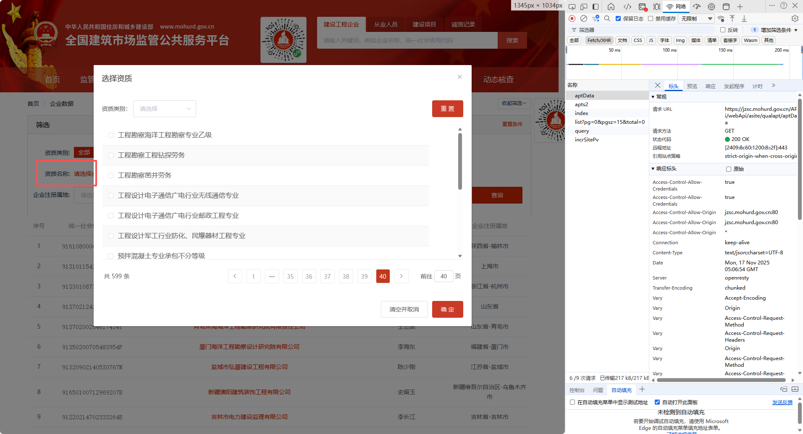

### 资质数据 

资质数据查询 http://jzsc.mohurd.gov.cn/APi/webApi/asite/qualapt/aptData

资质类别查询 https://jzsc.mohurd.gov.cn/APi/webApi/asite/qualapt/apts2

#### 对应界面



#### 参数说明

| 名称     | 可空 | 位置  | 说明                                                         |      |
| -------- | ---- | ----- | ------------------------------------------------------------ | ---- |
| apt_root | y    | query | 资质类别<br />B: 勘察企业/工程勘察<br />A:设计企业/工程设计<br />D:建筑业企业/建筑业企业资质<br />E:监理企业/工程监理 |      |
|          |      |       |                                                              |      |
|          |      |       |                                                              |      |

apts2接口用于级联查询资质信息,比如 工程勘察=B,工程勘察专业资质=B2,工程勘察岩土工程专业=B203,此接口返回数据就标识对应分类级别下的子类型,如果不返回数据就表示无子类型数据

#### 响应密文

```json
5588a9e126c91a28cc2f6813e37933695200acf48c974f58b6a551d08a5efbb2f45d07e96c1f6a0d082652fc522bc744d371c656253950487a826439243ec9ca0e34af98edf80ae3419c605ddcfd110a72fb2fa5d03ea25abefcf33a748e4111468f7810ca09874275aa587f3ae42e0d1fe1a9a387e2965edc108d8ee5a2e0e064b8418e0d6aacb78a884e9a4ac63f7a840138bc639a586f0ae376afd6966bd60ebf56e2c47627519ec90c46f7ac297584ff173a1485d4f3f016bf65eb0c3e078d828bcf436f55b80d71054b13689cf38ca3739e6f317a08de34e2231826e51f605d920b89b4a760d9e2ea1a6052f6a24d68f6d302cd55bd5a5f64e806734d86f3fd5fd3f19f1fe7ee1dc5a24127c3370b9f2dc9f4fedf3274018fa6d7fa9e854febb9e0bc9f114d9b52e17d4477f4901d27827a0780c6b1df8b1602b87da3cedb0f4a67562a7c8c3eb0a2f8475a9a38c9079db97f8db1ff991bf5d6cc9b0b322082755955e0306ae906c6644c2a0897283cee0213281ab552e0c8c5c073ad9d948e522bf46151ef8a166c933d02cbeeaed240bba8a0d40a99348fb5f6407f6ee959421ec8e0b3e93c3ae903bde21e25dbfcfba777db5971dad886bfb318ee16cf2c62652b766e8bba69f9ba760a5537dbe84d9a7939aee021b37baacf3f74b6fa7ffcd92231c591c66731f45c00df0a85b9bab358d652eaa25191134e329e94460dd3259d457c5d532e7d502a256ae0c9c449c53e77ed0a514ea10e7c3a4d75c9c26e2ff8efc030c0122c28b0c45933b9fe7f3966a7d4adcd079ec08f04d99b735d7cf4997abafa87cb5e82d3321e2140b6a9d1e2818fc8e3e2b1edbd3e463b75a0cef361ea216700596efcb11f29ab228c6ab3ac43ce8c843f2da980dbb5cf6c363b95307f8cf15fd9ee000e237ebedf82f0f931fc55421775c8618cdaf1fa0b14aae74aad2330b4a7a9936d7b417b13500d19445b3ded907802aa15cb62c64572692de7cdc5c08f4011f6cea3be5f4f4e50d36b227ab4c35c0c1c4b7c76bef28e1339c7c689a381f1b940fbea7dfe03fceef42a0ba8bd11f5ad58d8d55b095656580a817decc1b5671d792af668cd1aa38d1096eb6ec3046a59a51c87d10e808550063e0d7bd0f06df5467e75e2cdd70242a8e6d4cd67c1cfa48cff251b5a3ecb9019faefa07394d99370841b734a2698d85dd03f4375cbce2fb189da831d81fe8e20704c2102770d98617f21d66eb326fe527a57888a5e5db34d1dfd513f1e0549f00cc3c50c4a1b4256690e2212977a4f4f18d0ab31248f651e37ca916bfa28271a0bfa9875b91f8c2b950b8a94bb94f19f27c589681627dccf03b5491350f9f48dea6cafa3c1b95dff31542ee5633eab0621e7247aeeddff391ec78b794eb0f8558e6e9544752becc24386b15bc004bbb306ae9e3f423f1922800d8e6ff0d14a9e5212a8067ec8fa3132da602bb50c5948105f4d1cc319ec0c78089ff865c28990c8466265d03053a4e46f16d673b89ab3168564a84599c2e9686ee4757e822f6342099130abb9679eb6c42e2f05d92d242f07ad892c49bd37f67e2a83dacccb7c6f4c9cdfa94672d5fb0c8b1a0383eaae9fdd272d2e50df5dec7dec526405a126f52a8f60766c9773d4f103400555166e29edc6d24ffb4aff7e03808014337a52d364a6be859a0c27d7470a88e40020ab9387dee8c55a11fbe3d9b738829d94098bd3aaba234a051579c44776bacddd136cbeb73fad687d6b6374a38a90cc1ee986da9354fc2960286061b63be6292714b5dee734575c13f98bf835772f72c42efec567a4e1408b279306f0724f823f860c9255408a7044713aa4c3d945a304669e891e1f7bccbd981f2235acbea85858a4c93cab8728afdb1d7f7c58c86f05e541932d7a964e4b7452a6d01f3d7bed171877986c77356cd41564a987efacf7c8b9328f9302f0d1b533fa616ac3206e5515893c1947fe3196f8a4265929bedc352ac753ec0518c65ee1662e60f09484882fb2bcdbdaa25e8e23474f53f8694a2a1bd7f4dc6cd55b3ad758d8bb28eeeb6cde54b87cc52d7c1cef0174dd234dff99109dea6db9fd196a176681bc249d8906e520ae36a86db66cf852ece404afbf2497965348a03a2539cf25630cb02d3e6f990344104740b9ab5a610c162689c0d9af314170748e5fad83180b3ff084fd73382c81b56b1ff7eec0920d65c6f52207627eca3a0a8f5cdeabe08ee83b59217a305936b162719654c573f87ec7835aa0ad569796552cd86975f118a0104a973dfcfba00f4f3a88a9814bca0fae8b92269e82a2c195086ecdbe218f76c32d7b5c4103cf218cb08ebeb6ab070f66b7be498c9807bf824a94386b263788c18795394bc532d3c3a7441df5d499485c2afa28d4c83e725683be63f5423b08cc18b69dbc2cc46f018526d4a9256da6c5a8920a91a274cbfc3b217f3358e1c98a29e611723e17b7358ce800853934bdc522f707618921de6d5adcc60da441bff55f6f7b9a6d50be0d0b31c9ec4189c9a711514f811d3b0bc9d262f7a44eebdb9651cddf8de7b7e4aef14000b988540f1c79e3feb6bd89a274cfad38491d875ced6004ff03a7f26dd8dd46f8878136881cc9ab3ea8d64d2d1c323d72e5b6f39aad0cbfe4005317dd05bf2d1a09973b16217a56de032078255a2e952d6b3819df9c62dbf0134b3e7dcc010a7f4d987bdf1fc0ec84825cbcf4cb3e99ec49c34fa73d198aac5b6d8f52fbe90a247e5aadf1fa3d4761dd6dd8cf4c405e9f42648ff37910451d7772ccddd6582c3035c27f2b61ca5046701998c8f363893992845f5ff9a6f61c80b50fb89c7f9d2db754367ed026729bb74b796e74c0b6ecd30beb99ea4a9877df06fd8647debe95748c862dd108a4a933d6b8835561b01af428abe5b868a73e68685526e9011eb826efc9f572533ea79b882e7fcac09a4bcd23d9331b0ec5d24d34bb61603b6dd86eb55bc3e423d4484846566549626a629f6461b77e675644640b183fbc0c09029caa19dad44104c7345dbfd7ea41d3fab27b9c12a5df1760c4ed8f43eb78f8b4fc6ddff7b3bdef781a646dca394ff49fc7a71459fdefb47953dd83cc891e91fc1e981a2fb2ea35c2974232bbbfb388c10d94f37dd30cf06854055488a0953cabf7aa4c189b26cc1f38eedeb4bd3b7d22ce77cbf260414cbd22f8866a58a15000c75447d7c6b45f1515f321b3890f4fa03f5a9270deae66e3efa1dc62b12223e94ba51d8fa0343b0fc03d22870634a97dfc01cf877d677b1b0d09cbd8ad6f537ef79597ef2bc688453888c8c400f9037bfe1e55653ac84afa0ba9642f9ab44357d09816207cf6508f3a9bc23af0b5b4d40a9dd30a7963c1458130d686378f8995e69ecc535db37281a88e1d7dbbd8037e3a8aec5828cd71bd2802ba95a45fa6fb3197f48c082de619051943dad2bf6505ded779c3c0bd21b2117d33947b5c2b9f0a4b83f0439d4c9bffc9a38f78284ed34faa90d16737a1b05dca0c2606a95386dadc48af77fa2fc7364963dbd2d1094e24ef150042143f728094e27000957237d0a2687b8ed8609a6e86e3e6e528f6d16d2a671c9bdbca54e22be7b67b1074a892c6ee39641b87ac9b71c9c39c27b38c3807c73c99a5153a0a6ae0fd521b970d5268403a6aaca41cf79dbcf4d93259189475fa5990b3d3c098eca3f599b64fb649051ea048c714b8c7aa6c052fc5b1c28ae5fd910d4fe481a46de7232129db236ee9d87cf26bd7d035b1ea22671824a59cd41c7b517aed8c2b13555a3c473d960ab0425817036778ed85453830b97dd43574926d2c3a9973246914f4406870a65f76d3b0c50e25417c22374c2dd20b5419587a26845b502fc375390f95df51c8b3642fc75b277e0e0888d6e7ca06a226660ec018161fd76d1773f1168a0ba922649cfb104bbf829aad08d6bba5e0439ad97cda14ce383058b60e9bfa92905e8ad843ee959fe31a4ca0ae2b1902258d9046c69cce0a2ecba5e7add5e4519c38cbcd59c0ee604c8f1ba1ed063a25385de8b02ebcc434e6872201ae350f318557cd1c7f1ef73535441f180ba922ef5f4776507d6686cc8ffdb3b41df767c18d42cefbe7655dd971b10b5bb570ed2efba78db433346ddd7675b5af0dd7b09deb33bf178a70601973ca2be0164397cae1e87d8342fa27d705a125e09f8d7da6a87ea3b7e76935bc85325f7d87de4865f054fb7dc2edc7a31ee369c5c94242f0e5d7ba92db88a15f47046a9cdf89001e54406fa824a5469f1799e0d01b55fad9cd6fb676e54aef14ce59397c96a3410dadfff20c7992aba4e04d41d1928c6262711ffd46417a9a505da877e04171a5da342a0c9949a6254d6c1c056b7170f6cec213e7f52560834a1a86f35a428aea90b025383df79c751d8d8045d8104300ba1468cd32d5fffb208be58d1a9bb5db551b028160858bd47f3a08390bad0893371ad720df6657433795d6e078af1fe5841ea16098c1fe0a5e1492088daa1711c39992def3cef6f6623bd3b5237c7e8d71c2ccd470912aec8f899fee8248ee933c1ab56276b81a5dceb4d99309c9d1222f98381d778b5fdc0a2e7ec7bb55f02d4cc92870481baafdc906b45ba12f50118c30b528a9e25a4ecdc0fcc15ab419e37161f5db7cce7e774cf8d770222435033df0f4ac743f4bb20dae3c61f2d896b7af909781dc3e6654d06c51a33193c9d6af5c1f9d328c1ff9af1c387464f56cbabae57b7a43946d7477b62b71c9851fabb806dcdc2d3b8b09f066f160f2ac50c8dfe52368f6f7505a1838f79b85292ca39bf726a68629a506f92055511edf65e117cf177800a27da3968f5a3c276e4c7ce16d0e5e0ad5dc283a2816380448b96f802b92af7bbde29b6536916427dd099884cef25ef9bd7a6574202da62afbe0583d60ed4c70a7c7d4b67c707fea33684909aeaaf4d8dfb0af8808d22685c305a37059e701c89622d0d5328d5f8bceeabd8d1aba8772446171dfab0326d3dd1369fb9776a80d45b6216c0bf25f0e473f3934819d17a46f2957118c9d738a2d471b77a236f16af4e561df99f2bbd40802b046e28b0e9dfe3550ac11536a28e680bb3466e8cf727903b45123266412a98f58df458231e64795cd0d90832a1e4a73deeb70f00ef6132f6836ae4dfa9b8412a0209de6a6e8a9964f3ff2a4ebd44c3363ecfc147c9965d3063f8a28e1675db3631fb9e9a9cb8f08a8ad025b1a2d18c4d9f3b1a99d10edd240dff5ae2cd676ab71c949e9d0ccb083dc080fcc5b0ff89c8f879bccce08488d9610cf3210aee4a097d900762f593417c69ce6241f4ccaf77b21f5669b150236cd38a5cc4787029f3a675e7edd24a15af2a727f74d1b8c8fc596415a0534ccbf2ceb43c2aef16e69eb95393587ae8d9525757722277c0d5269add93059e8690a75dcc7ec1945d73e0147035b41b6186fd4fe2e010b9575b6572a272e668880b8780424988f4414908e9dc79f690f4341e65252034efff4966d5330767bd347062b1a601a4bfbd52cbe7dc007883efcdd468e50f59cd6634d052d43aa22be8e0c910f5d2b612fc28b5172e980a1b5c1449d70b6b158cde27936b17e31ba4b22ace20f59900f945ec66ceeb38302b2ec1e162c864cd9a5b96280819cfb008ef1d261a34f9e846f7c6ad3439ff69979a6401649acefcca63975b036f36018302224d89f6836529a371c32087380778599a0c6419cd3a76ecdb899279e4ff0ce8ca47ce7fd44a3beae989566ce179a3307509905c68e5c7ba80f8d1af9634b13f1c8839aeded57245b104e20d2f1f5500f2fff32732d79f550df0aaaa02e1eed686de1ca8c4005448f48d80fcbeffbfbeb8a1ceecf81df7fc7b0e26416fd1d9bddf2382fcfdabf2fdd3003d28f41cfcfbe1a10f2bda4617ffd63433f534c1d222c098178881986a95fb7628b9d08e5df477afdbe930a969e4926f798719421569b1d9eee7aa309ecffe42040b1e5010b09322b01f3e954a6d1c218eabb702e5d0b38a5bd3a8c22b46a97494e9c21f2e3511d635f00d3bb592cdce147c4d514ec82f286960126ee4667c59c416ac7582ceb8faaf96befcde56c4083f921c20f803223cee1b385ba0f5173e3356107708bc93a82ef0f0ea71da60da32fbae1fac956196edf1546d4d2494c5254ef635701e01d09393ea94c0c8cf196e9bd8378a7ebf5716f7af8053201c2422dbe4c8e8f2c07e145ccbebff4f22b758ebf46077893842be1c3363f445fe550422f01e8e16a219b2724f0033e2a70fdc11fbbe62db530b4024d55efc6da061d3782abe00b195938cb00b7d29ecaa14d444a5e6291cbf5ef5ff27f5244bf3a06f1c733bb85f883860af3a51fe862c309b99d7ad54363aef75741a30bb2a34dd0afd4ea57a2c372850f3435f46aa24ef84919583944c6031068240a2681184b0510f922dbc6f86e3f70fa677a2cd2dfad38a70caf171dbe93e04376221b5855124d5970615812369bf31ef113cc300b35e88fffa6936d2031c6aeb7ce5e9ea77f92c96461e1d390122dc8e15d6dc26c42e92c20d40cd72125ef47b0cb579c41514a54b934eb6194ba20b9eb84ffaf3b964054c84c1799c4c5851244cc7fec24b032b5e2fa50b0c3c5f9fbfa84ec40e68e10aadd0ee9b93dc23b6ff88d5390c970f0f4dd801cb9be3cfdc652140d3ee76dad3b1b49d347d89c3f1d71167038a5d43e5715662df85dd0f54b874cad9e6224e987b90338896c0805848e5721e1742e5f8de3293b5354638285973ec1d38a1e5b5241b183228d03bac25af1e6a884ba67493ed83fca3eedaf6869284d7b9bb90c6bea1dba77b66dd5193033aff6f68798c543d196580be03f09212d8af490e88d7f4363d4682135fd96712a92f91fbb69e78def37e9fb0b3aca5976069f2106f1876f6ff9891ca11361078b598c8b6a92eb9c491848a58a2b57fc384022e1d50b44a6b5144a96bbab57fcfd29e57469d8b37f2336ac7024712967be015db148fbc986fe25af73ed7ce824d989adc5d4a89fc45b6292bf27b89c27772384ab55ed2999c13bab619290203f90bd0dc11bab9a091eb19fb3b0f35fdab0c3b4ac79bdf4c105f50644883c84682240f97d00f9f5759a35825680642373f734df03b85f9f40df26879b3d5be212edcfef45107a33accec8766af4fd60f7e086aaf8b7c5d437f3fe0571f6cdccd327651a9bb7e65094d2ddc30fdec18c3dbaadbd8cc1e5214d5f1c2fc32190b3b563a8d1e9a0ee1a3edae658311994be75bd1be6d7db4001b36a92b1566e1d72bf604989f886f6b3c4f40ced65b405a75d55ed8a202ff69a497ce02d0a4f57f161cd6636d2b2bba2768d70d4488c17afefdd8e9c73f41b7b8b72e281de88976cf5b59a3c431d4b6d894b2ef3229a7521df90650d66059ad4eb06ab79677e357d6d88932b665124efd13ea91282777fbd04a8d2140e5917d50bc8adfff785f04c5d0f1626c2e60dfb313642b5202bdad7ab1fe309df092dabae255192d86690135e7e9e65816a501cba071aec26fd7e43f2f3a5854cef1ed4151f02a931595e682d3afc81d9a5e1114d903f6e2b8846c287cd30c9b12113c09aec12fd82105fe0153cd14a02e08686e0cdb511be3c670c745441388337b92150a9e29902239548e1d9e66f6b8ee6af5f6fa1da076bd914cabb13a35b5294735673f130a990ef2671de51bb16d70d5bdeeae105bb4150aed920e31a42f21b0773833ed8f02465633c11255f9233a53e79b89f147c8150a84f20bbeb07fba2cdc2af8eda6f90d57d3e0ef12949fd5687ed23313f950d2e00beda3d6a83c2d79a6ee814547822c6064ca8225d71935b5351e9e59edb99b5544f818f2ca1cc682c53313480699784cfac9b58c42992b4121727d04534ebbe9a6b5a9eaf7f3bddcc819a6daef3e620cb974498747720d3d21e5d5992245b5861819770a1601ce6f77ae051d4e15eb480eb667c4c63b3cbb130427dd2b0d79cc539c6b3e3d99791d3e7e664ac880bac57b0e045a37f1006c71cb183b2ca61a3d2578aab08eba4ae2a7338a66bd56796f4e1e0a0e0264869e679ff803ecab956e94ce6cd1e040c9b224649cb0e19dd4b506a8c2fec6c5752d2906e4ad9b5b3a123ea9d2eb8c2c9c5ed59aa2132af149b78010a77e5c36e7c8d92c4734d1162dd90faae598fb73c9855068a5d3c9f4188e4c189b4d68d7c2083d25179c5da2ee772107fe1d060c6696e3109f99c9bd883cc888bde75b42cf5c5ec98ada9ce814a35daebf77004e6c09d0d9c0d6b4b3754ceddcf535ce887f2416db3ac99b9afa69f55b61dcacee08ae5817edc9edd775e2b115849ceba261ab8ac7f83f6c31829fd4ef62a1c027bfb01ddfcebe247b2ea38ef2573e0a969ab5c782c9ebd359826c733ab6c454f459a5d47647b386b153fcd67910222ce256d65ca740e125fd8c709d69bc58cb87a3b0e5e06bf2915b3912c9f9cccb4cbdef727228908fbe64ed94b67466aa5cd7140916c15d741caaa260d514ec3f0827d3a2e62c64e1d734dde8f87ed64c187a2d4c3b27dabed304bfa5a56a71cef627a10e7bbd2c5750a0721988b24e0b8eaf7a326898d7d439169119bd2c223c22a76a9229f7ee6d870beadd10bf3fb2118f662a407a9a304816d49e925da1972989f47569486fdfceb9f62e8eb1d9d6db58752f830d3d70a5e3e772622cea6300becfb7ce05e6cb024e0d1601e92b5295dcdf5700a77ecefe5f173c6af27217ab1e1d6d6e6ed2e03729403d0a4412ddb6b95ea02709003f568ffa56eb14859c21b01bd4ff31d08a3c57fb1b2bf32f4e420955cbcf17a423547822003fea367dae6815c63841f9abfae6b22dfbc5f51d1145399a0471304cd561209e7b001d89dbe5c85c60772c7ae7b3675c410dfc3b95d68e65a07a690f320c725dc3a1c2ee0b894e2bd8f33c0410381ad2cdc1e1673d49e8d7003ccfe54dc8be53690da45d879b684a477798a6bb76f6fd9f44ba8961176d483ae5f38c2140794d9ac361b195078306b5cd275476b70823d1b398ecf593455f99ca1593cf0e70dc6b9535fe71bda0be0ca9818b76dddb01e865e163de04ad25a51297ae4f55f6c9ccc8c8b8392d70acbd89043aea00890fbeafbe7152486de2ca59811924c1754fbae7a5969cb2981c1624ecdac7000f5900a95a04146c18d830d412260c342b3bf568befe4cc5bf435d6fff43b4ce47c33524142db9523112fa50f2da77f5d1bc8d2334bd1b46031d060abb4336fada1441505eade69a55b9186bde930cb2828cf56174f1d60eb353fab0609736498cb3ba7a7ec4fb8aedc2587f216e88510a4d853cd1ec3a1a11f4a28503991170582a35a26a5ee2252b87105ed1737d4b382e748703c4d46fe3bfc758d89f25970160055a9d677e68b77d8cda578b0c5c1fd88cc5b190193d1281c31f7d9aeca425fff841d9828b550960e0e3c423fece63f5c838111e004dc575a43b81d54eb1d90c60c35280262034ff04ee88d3c553f3b3d290f996a75ec74006f8ceec7440070b049a4fee3ac868d6197b630370f23f76046df7c8920984e4e8ce0e00a8801a9d14dc5564934cf60ea72bda4ccf3129fc736cb3845e67470dfebe44d36e54e050e93f442d56a820bce087bf0197231a8b6b0f376f37182c5ce69358c279ab6f1322d5c15e8a54e0116987d5ae197eecf3dc0c5e42e33fdec0d4656a117617a0961d84362a4b84282bac10fabbc86754edd896f370faa5bc091d9c359f431fe0cddb521cd2d0c484e06c43f6205b4a7ed01a1927321bd2586f7210f86a244af41262f450752878484ec5ad4d7b2fbfe747184f348892e6547476bf6cd100ddfb43193f283719ffcf60130251797b632b7b67eea65b6be86f46f307acfb49f031639fbe2d92458b656acec5a2c3e4698a82372c13e38c05a772543a942ae7cee4ccb212453b1a9672d05685ddb271eb4aa2e477838140d7c57d15bd4feda034fb340d914664807c1b026c4ccf19b00b0836da6cb52f8295e4f463b0f64cac912224adb1137eff31f5667f33d7148dc795af8db6e204a4d22485b7796cefcc227e6a33464b8af35da1d4beb70794fafce837ceb24674f429aa5bebfb0c0bcd6bf5c7f4834d9039693534e6955a8fbbdaa1e32c7d544096f4a0fcf91e567c465bd408e3acbf918952356dad69c588e9dc4f3ea58a49a4bfd30891b09804cca83619c73643aed7c5f784fce526b31880042aa23867aed4597909c59d3d7cca2b6931e3b83a23921745eeb9b56a4079e3866008376c42965f4287d772153096c599e3b3a1a7771093f3384ce89df4dd44a206542cc953f9ee709c16267572f6047df00a4f803199277ab795f2a50ca2f162878c1bc89819dbd61fe05ac8575f6b02991b29d73f2a2f07436ebf89b4c04cf621c9bc941432acd12e36656c269777c65e4a624928f1644de79ac32a7f6f6f57335bb8f86e0bc3aabeebfad5c3ff84c4385b1b038906357aaadc49d85b22373ea90daff4268538b5004c3555bc5ffeeb7e5b93a443014a1ed5f557ac05d0c6a1e65f184856ce85379f4355a85a12690acb6672efbc718a0334819e878a2c0bf9f88242d8a5945d105aa148544f12e168a1bcda42792932cfe98bd7d54ef3b568fb472aaceeaa82d4e8e0b6e32b6264a352d450ac1779adf44a2a2159c786ec0eeb4d387d45ec972cc3cc46d7620c877f7902488240f4fe36d66face64c14acc2619463a064653fbb635fda95081137b0bed8c9d638efb6d310d68a18a1535911c49c16c6651517751c6d6355a042e221eb6dd4f53f2be3de95f73c9ec654bf612340aa35875bcdd3895f76195fd97c11854e3e2d0a98cad5e58e8bc74ca84d883531752e141c6fd8b2811429da5b36376936675ce421524b6c2993afd3c34a0ef620c4895ac08045cb25ea3a344198c7dd14c2f7a5abe84f14f05a214ba3e786f89cdd8e202b2b29b0e07c5dbe6303024c0b08535aa60cd688c7f0478899b504d6ddb8c6c39aa0cb2d453c10c8fb37264d09ac04cd355d9bb77c9410cdc5810224ee1dbdaa014884a063cd18adb2dd271be894b4824c3a7a97c742a0125707cf8af565274e215914f285b9c527b384756529a40e0ff0f0638510b6adc6b3e8e5b9e370efbb7836a47fb72b10036a3f096ac217532b40a3b3137522b3b2d1ae4246d4fcdf62a1a2283084a73f26b87208c1db7cba3cfb63ee8b093d51f9d89881540000cdbd2363affb12043ef06925bc6a63c39b0faa5af9aee7d54aeb6217cc660714113f587735cc06a0be77281047876beb8816b82a788bd6b51f903fbacca564d6eb358cee7612d8bec0f53bdefb7e68ba34562faff5c7407215ef88f339d278c09c71b8ca0b993f2c7a5b48e8e04efb88242f505fcc20da34b4daaa2edd675e1e3b8c5aacdd5e7150ae737ac828634e00470d4e2e3643e494962908db95819de62f35e3efcbb5db3da4ae8eaaf8596a2e7c8c9aac49f5392b099c10b9a9d23fd5be11ea0cfdd6e2b022bd3d9690c4319cda190d758face571a3e3c3d578b4c00c6049e46be6014d85e313bfd0e18ab61ca29f4aea8cc9fa73aa0bc04ebbed04e1a4c93e8bd2ccdee7ce5ff06d1b87ae04fe39529f8c35cfe86a37d483e554c840395aa3a402329022cc3e02e9dfd97044c1c0f7444e627046a88e55924e70dc87ed35813764222f6980bd9bfbe366d705fc83442e5aa83bbd2f6007c300718e02dee66d2dd508c078e8d39382410a47fc15315f8193b5e1e1e9635339d338ab325960f1024c8f911a31705b8f370e3ac9af4ea1ac43b8a9b456a31d29bca40868176d3cdc4c92eff7c52f6c5557d74ff5c44e1f1813983ed624bf237831b90d94c5d9473dd427c58e0b47dd8026ef540fde36c0d00ce2e4c39ec9c497a70fafc395e9455d128ea39420faf9d90b0c27edf93d948ce6c2ced485538890e54b17a245479e8fc83d08676e4980acb04883b76fbdcdc7df769359e61ffe5b579c565205b4d563ff6b2a516c7432d8058ec4b8ae4c37d3db66b80f9132ea7c547f95b6a373cb128e530cc71d5d2efc39e77b789d176261e7373f77420d0ac07722efbfb2d7fcc10c4da5c766b65d5eb6ded99756d90f9bd764a9691c909c4aac536016c0c73c68186119e97139635411628de78462b4dd3d98ee66f684336fb3fc40b2b3a6a4f69303ee413f2b9d79c71721bfeff9c8eabc29f60fd5a053edbf51f8e89c5db902941dfb9355176b6e90da477af6b9ce2030d78785548fc90bd035e43df5cc14be7b8ec796228604052553d51422e722108a9851048c0a1513c421ecbde0a80348bee5e58a30ca9255c52cd1a553bfb35ffa851a011703a7f9487dcde86e599026f8950caabe5ecefd9220d9fbcd0a2c2825f525ed893f7e21defe765f7b047ea8bec00f1263e21410c0a24394904e358a49ef7ea297d933ddc9d638d1092479c63c5b0a92e8a79da6b77ec047ba59eb3e021d3f81c7d131e0a3d512b5b82584c8ec75ac88bd696ddc5ee82ee8e4f5371592f29d243daf8ba2fc9396484b3993e95664e9793c9ff6ec9b473eea8e890058be566f45617ce1b3becbaff69b11684768c5402c87363281c2000bea4aa2f56e40b242fd35d15f3ea88bf4e68b2a92226e0a638c083127ae507ec982cf3f5d3cfe3b0a0b14c01e48e13dcc5ab2ed61c88db9ed70ab62bc7f749b3fcc6b683d4bbd6324422d193eca112384dbc374787a8205f87352e72f081be93c27c816a910f7c823722590569c5e142acd0c06b40efc86bef57ee6436c77521e8dc23408cfdb9dec08693d05e3f0c4583e773cb251d251a2ea971fad109a3a28028106c38cacef5e81bae4286fd5741fa0888423e81cec74eb96d576159ed9b4d6a1378ba18c82eb3b72b2375401d67225218a8018c04c9c66a0164fe52dd75ded89d75df5c7ced50cc2ca88f8b6458bac00d15003a7d03ca47f7d185c17bb88dd7a07f367ee1f3e48e660ceea503149d6660fdb4a760167c1ba87df1d4dbdbd9a4436f1d8713d3688c1bd3e8969503b14a9e3597b07b17a470dc9b41095de5f039d9208516d4b38d42e6c24aaceca9051f4997ee6dfc010cb7efd8865802c76cddd8d517bd9f3476d1e979c1e12b9ccc8804ec833dde375a189ff54d7e383475cbd8f37f312d7494b566ee4451ff2223d5129bc535f311349c82143786c683285a1230bc6ca559d759490a8d76aec5a9e53ab2dd370c053c3351b0cd7535c74b818f7c80efebc374755a5b2e6c4cc35bf6757d6ee9e05bbf4d34256f62c0954011ff0728a65868ada8fdf0b284d30445dee6150f82aa933f12b7afec4791e48000a55399258f837ab8947baceedc600adcf84af9b4e5abf4f2e1c90497657a931fdf88866ab5be8f185f819fa3ddd8ff5e22e573c28abb17075685370e5d2a59e78299b2a440cc95a5624633df6b6564c52eb6c8185c05cd0251cb3e303829976ab629674091e87c4788190d4d586535e6a0bfe94972097e2413650ca3639f159e139895f40f3164108affdfa7c987b45159679a0c312d1cf544353fe8a457844912e9b213fcb61432f2e0b19d6e67fbc1c92fe21e89a68dafe93f773997297c3c2c187b06c561faa9ca0e9f7770a9e66aecaeb1149d613f242a0569ec6f65ee64800c416eddc17afafc93991ab55a5635c6c24135165725a94e8e9c114ce990e9e587d56c85bcfbe73eabf2b4957e8c8d48959489122aae1e994cc1ea00e9df40838fdb1a3115e3d1f92be6d05bbb0532cd4e32d0ccfcd15335c7ec73773240bdfd84e975dbbe5507b3279b1a68a7f4e14578ac0828359d2cd50ff35d02f73d972ea0d77609466aa550225aa276cfbec0f5dcb13793859b19a74e4a3c14e64266dbd929a3a78cd25a6c7e72bf9d3e8be6d5660035656f89718a875e32caeea81724b1ed9051cb216e555a8b59e7d73ec8135dcc028d84d03d4c31ad98b092eea462b5b761eac87671572b0716722a74cf368008f43451a820897676405ecdedf7dca56237e374bb4eaf7c210de722b47f83734ae098b434e70968241737ee54c8140c691bbcf9acfb9e676c4452a19d75ad1e723865545493ca5949068951d3f2cf9aa5227816bd08a5ecdaeb38cc4b64e647dc9be4255f5e3ef8d35d10e5af94cffedbd0ffe977b555c32b229a14003a106df06e2a5b09c0dc043095007a758cca50e0179eaa4fafc9adc5e88f9d2a4ce16f7a8df7da9d35958fd9f4fcf19595d9f511edf5a9218a7517f0a7b677e910f28428a679613e74f72339974ed6a582cf8c79035cab250fb6c33f61e5fc4f4fb27c9a262cdcf330a304e8d6c78cec1a476fdc84f19c50dd2ecdb71a1c88d38a63efd11eda4315503cfdaa98aca2f1ef60c7c75f17e30f4e62bf28b5132a7a0ff76bb5d43a181999ce36c1516890f27af04ad90f4ba05d978dbd17a7e51491eccef95775b4f5cf9906977ff8be27b44bdb846d99fe85d23a8c443cb4633d8588d3469421c1cee0fa2abd75bf641f971f20f0b7e25072afc7624b193ece8c121806d4c06439ee5c05a6a897b5288f0fb0994783eddccdaff5f17515681e15d4f49ea7c5635325df5ee445029d6e5a7ade9a59e0bf7bb52d7432fc0c2f4759be62d3faf5b36ff3be6546f85c17c409ab7e37ac62e3ce3c23a7ce7bc3eca400645fc8372f4b8376e396d40d822d67cfa77858208faf2429aefeb29247909434eebb87a16681e6fba4f2b798aa3d01b19c2a8bd08b86a750cc51c0065b6c63e55d93b4b58e772bdcb1e48723dcc4712199fb744eff7aa637915d551f6e9090a8e54ec744364fe9a09a97e5856d528984b4e1d5260854eb3774e6806222a718e2211902d83445a54d6e66b97594a45e8f3c4229b3c8497272568b29a6a139ef6e10164817f0dcf43b87446856136e87ab26b8815bb49b57a83a3f990bef9b3da5a1f0f8a5e44165616accbaa1813ce9fbb151fc6f9e4eb5c621ec81fee124364b7609509908f9592667e9fb2f79ccfba6a912cf151b7991f793889016911dbefe09a76ff511fd1ca1e244b548b7514562a1ce67f75ebeaa1d6d0f755278c9adc8a7e6644eb0cdb8dfd7dc9c3b8fe5724837dc385f670f28cdc512a05c52679f195ffadec2b66bf417affb0342cbbd5b0ccb71c333b301d11d5480bebe48ad514e6a2f6bc9ffd0bb07bdfe5a0e33f8e25f49caad179f8632ead7f39eaf16ec1e5066450c0ffbe91a77aa33c1ede1fa017ca5c72bda6a835580090ef16cecf1ccf2ec06e8345727e361166213a97f80c67c3d554cc4e03e313e2c3115dc827efaa420dec8c2405642fd59cf0ce27e6c6f08b67d4c4287cc6b5c2b4742e6a42f7a2bb3306d5157f3784c8774c1b6acf75aa263c5755d6c0b4b969d36070671c60cc96c9eab81b2413bd15ad3c1e2fef4a9dce598e328743de5c15d39aa96adcf2402426cbed2a81e1c6473fc307d9e32ff2cbea691c665e1a086efd9759cb1724117550793b214c675f402fb858247937e9bfb64f7abe62bc0ecd6ad61718afd2f7d5d080065f4ae50999183593114f6f22f9725329fe752c16bede8fa2aa91e26ac752ea967954e8d7e5eff3a4bf81977806ef89c0809c3d4e58cae59b9938f4bb45554827e66eb5af2c64d887b1cc84974e4b97d8fb4e1e226c1265f60e7fe7e0f94510799c8f91aadaf360f656aed6a870fbbe7ac62cde67820c06981975485cc8fa8494e2bb6b787737891a85f31dd2f7af6fec850db1f6be62b7d935de2076d6a3e1fb157a4761ecb7db24cdd20a5fac827eda7904564f430fd4dadf6fbb34765a37c476770d6d1ae9177d539bdecd59968d9f7f6251290681a4401fe7af05e0448ce4a0a38e7ad7f269a89cef578bc2fffa9f354c14c4b5b3b93bf4ebde312272a87558a35df465cbd732d1a06562040c0bb909f10294992d5cc174862e887216b3fffcd02536bf56bbe6c66c8f70203ef70f26bb1b2e50610f17e37eb97eeb88681e2684263d474f49c176684a2a5b8eb950d995ed128c8b970f1a187c696af96c4aacb1880a72dcd1a7494fec1f13a7b94932b93719a3b2e856fe97783c731274cf587f0ebe22f1b2f94d7a1a13dbf0a8ab9e248fbd07c7f667ba9f91dace20dd9b8d6380f692979a4e13219bae4af83e0d56820a88ab9055d983f664cc80d81306c93a2f2658917eb98cb316c04ca449f5e5b0c2931d649a8f7bcd9bf786af45f97c6d65e7d48322c637685b58d169f6d36ae630b75535bded49759b56418d9fd324977788c3cd1ba7a7eac1956cfd55ec07e281c08ed77c16df1cd49390fcde59f0cdf34af6e5cb09f49b2478a4eb3b4f4b915ae3508190bbcedcdf7b046bab731a152f80a41546e0552122344ad4bd8802d8ccac2d4398a34c34e8efc689b91e35f6c2b426928136f928e3787ccf12846f0f167b231924e6021bbe51a5c4bf84b5488927ac01b1a60ebb1e4692f15645d7c54b7e68144fba384e2480779fd67a515e237636c82d11ba5e137c8d6f395e4e806020ede77b97e2e0b558b59ce45bddeade920922da92b0f711e63885bb2ffe3e7025a0f7a5eb17de661724e98b0c03d00306510d1566918410a9ea29ee55ac93e7b6c88e5bcf9e715b155269a57bbbe18d714b321e6b6c165b92d6581877f26aed0bce73e7f5a5447ce43b5da80f2b4ed50fc5c8c6443b93b4a55181be07c96d64264744dc32bb06a0e3a8d92d9d05544e43e65af597a4ccdc16562223b6a7b99760c9e0b601ec6c555aeb14fa8b647454b12ad3f93e6924412ca69bcd5a51b6acbbf657f89140fd55d0ed32da0304455e68cbce113fe2ea310c66bcc3a2d8989e9ecaa86387d4fad65c7bf683d1e9009c514b94cbe8546feee12caf89a441803522e4831ee04d1bb787950adea0f57c0a3b39c51e78d17234f28a73da860a0edbf3e9c8928d28975d3d1852ec1622831f22e5fa4e066540d2eebd749b621e3561f4c28540e67b343d8ded6a7ea494bfc6766e2ce0b0bad35f7af22d91ca30e917cb2b4bbe9a9fe838f93fcebb29c617103bfbc3760f3c4f2791fbb33ce95285dbb3e2c95068541dd2b67ee487270063ddc0358ddd54dbbf26040c988bb86dcc9672097fed1fa8c157310d50e0bb0c005ead46a2865444f755e203fda3fe62bc207d912c7c0b77a12d31044ce60818c5dab5cc77161ca3f0c59e4f10c58cb25bc93d8e0c337a03a7f3c4fc40b0abff81ddabaed49a5416455a83a15d8ad69bdeacdad8f45ce622ca42034006c32ccc526a8f40b144f9739503a38185a9ba3f407637ce39c318cdf65021bba111fe3f3759fdf20f06b9ee1e7a2ef3833017b9bcea9edfb551a1f534fef53e9bb5da5903063e7866fb9e4776c2e120edb19a12ab497c653344a7c0b3b94b1bac3757aa84265d22bf9d4f6227c5e63cb943e7352b34b98b5ec44c3f8cba9c688cf44d5e7d4dd284e9be0aad3fc2a1f6b97481444d4f7b2e1e13dc58458f2bf4218ccce7322b59ba4b2bc9eaf9ac4654c70a8ec004dc5f519d2e5fe1b114cbf116c789b4e43dc5315f5788e381ef285f0465be86d256a67322f8a26d4fcf44a50bec1d4b1dcd039a5992aafa9afddbc4e4c072542ca9a8f35b205fedf40db345575a4fed564b50c23d160f01b8f046da490d4fb4607e045a020c21546778870fce9bbd3538e034b830a83ddee27786ed1a352cb0b968dbaa46dfdaeaf82ac3cb6c5365b54985706c1c56b4882952e2610906aec1e293c31245b002d3e81b19261b933115d4d3dc947122f68bf4b6371a633cba7739d1eb1b45909d5063167be9fbcd672fe2982f69654b922bbe4e07d5c044ecc13a49e9ff9e8ed1648851e6e4ae1aac7b76d15dd8defe8fbc03f7dd0a93f38e8955f4e7fc34eb1b016f1e35a7440731c2c2060332ce4e469518f6a4c7f219deae518f5052aa55f3179820ce4416a7c70372c370fe66c07951a8f394a4eb8fa9d4f11b1b90b027deba686ad926bade05643c77c2be66ee1ba37a418e06e325cfa1853529f7363e6b9206492d8ad8570f6ddd6fe2cd9f180ed8bcf04018183f071a755262e271f93152368121b7f1106e2b3bea46c23d553d32e43ce69d4a1184ccfe7a7fdbef5aae7e998b33ee92e581223e2d06887acf621ba71f3a95fce7d6b89a4d0263d598a8548e0647f061be084faf4e3b58be2f2ff163817b1d06fc9526ca3e3b4e2fddc9565fad690da61254da2ab3eb7d0c6dadb7b151003b5b8002988c36dff129a8e5057f851b8be4b69638547ede19d4b23fd60245dcbb79565d5597c4d62caaf837cba6cbc291df2b061262816fe36270ed31dd5896323660a8f9822bb42940b0e7caaaf768f5d3b28305516b6a72a7629ce8d187f252bbf096ffcddc30bca5f9ab76ca5d6b04f66536463ad9923c0d7eec74ef4244a830f78fa8977ab7f07da472834369e271d180df1384ecf66b6bf6312ac9c94286b1eb4befa88207f4ab3b60bdb82856570758409cc79b162e869b24c8b8be4718d1248382f44669ec0a67940392bc3cafb0fb75a79d3fc2dd5af6f4c2199fd467d892226ad2ee8a6d2020af9c20fa654bb18abc7b66253677484c816dd08074cd7f507d4f5985220df5701986f29481c89e327e2d1e630e616a6fc08f4b6a30676ca0e2da279abbf8e16f1635074ee9644266173352af165824397a16b1bfd497fe6665e52dcb0089b66f84e172a1e7d1aae6fc636c313723a15c43e99ea4e16d31dab53ee2529b0dc7aa49ddb6431f48e51532a981a296378217e9869e5b05e362c7bb7a70339e3151896abb8968711f0ab7d58b1ed6e42289882f1e89017a5a1cdd0af9eb69f2978c4fc1eeffcd875eae57c3d3c2f6f2c54f3cf1953ff20f6dfdb3e711c8f9036320dedee7aacf6e251e7f4a3dc83e2da46bbb5b1dcf0e68fb84b6cdc34c53dbd9906d70797e614cf1e52eaa72eec246edfc8f53df37cad98e6162ddddfb86a2b98bb4b26ca2caa384447fbfefbba1b4623839f7717b15cd91e79e72bd103907e9b4c321c25da3723e8a4f2c921943569d3ced15d50a9e599f6d80d9d88f7961b99f554760e03a9f21f7402c02eef39d1cf8d2fd4d6fc76ed26218236dee7b1a1580478be988dd7359ae28d90c6bcf23267a2b9716215eb1caa29973b9d6124dcada915ed049cc75c4be722896126155350f18803fd3dfa181475cecee13c46133c385b99b08e0517ee517b93965469f4e485cb443ffd77280c01a9c574ed2909e3eb6c267b542b2d1abeffcd5746976f1d4e8a3e9d0f892e1aa9969b76b727850b1a8b43680a8f3bbce6dbd1251f36848a6d290627dcb9877768cc4146c641c8fa366c10dd5835d7c617748e8a811ff22e7ac3c7960b8aad141963113cb97be5831ab8b5eb6ce57e2443755755abf4f17e99371ef8999e3fbb1296f45d2bf09b4e2981201f78c94aa091c34cf4fc1aee863f9cff1a047c8c87f5acfbb87481e10fc7c5d164af33b2fb6f16faa6e92ffb07a65ecae8b9c01fd8c66d57b9411eb2be0bd045478d07a42343f404f5f0c34fb6e52f27f72303329b574f91a83becdb30dcf4ebe05da08bae2e4fed7c8cf3d4575b0d780ac0693d32c96b6de1ebdfa9248a1fc52743b8deac16f010e03198f73476ab7a35eb9892d747f6560cff903a9899d16054bf19f9eacade687ec267726a7992c98898a7c6a3c1152e7749c45c01c54db52088b5e40be5ad07cb5bb8c2549a102684694030156eb1a6bf0853227f52305effd5188d16c42440312dd6d2d22127c19668c52182c2f6e10030fda7004e254f4538708d347ba1e05750b9c7561c227dd16bbcc4b2b621426a969557d7fe3ad11cd4a5ebb68e3d8ba9aa8b15c93748d7a4275414837a1a4e93a4e79f621400664e77a416dad35e1848ae9b9f2326350c423f71ed1d190781b232f194a5b93b77f27f61cff51e09ac099afae0f59b9dcabc06701ee9cf39178a6dc7afedf8bb3ec354120f39cb3deb3cf298cbbc08988209e484e66a208eb04e511e4c8334a875cf80cb0682f1d739b91c40fc7ccb2366948726237f33d1845bcf6315b2932513be08349d8112e66962080917f2d31457c0fbe52ecabb9f568ac35ec40c4aa80bd3bcf7a199bc891f4b03191a1da47999f0efa24336100d3455a8ca53b023da3ad36618f87a7cada1d70bb8d73b9ac7b2494a2d2d3e90da34ab37037ca13a9f8e590b2ab6dcbc87178115b7819362c78b588acd4fee31d2ef98c089666c2cef8663c2d123059adde5e98e7bb5e282c997c895c8802aa8d07c1dcd254548bc35f5cb6da7276459fd40bbd320ea7358c4eae25dd70065a8d62b705af0c2e2594ba6360e5240bfc96456f5ca2a0902248c5b217550618de8934ed1ceef28e59bbd707aa9dc427aa2cfd60c85a6c359c268c10932234df85a2de7dc3da455091ff5bb82de6350de8c4d057cd48f213063436c24f54c2ac73b375fdd3e82898b67e557987e5f06645ac961f097facf7b68f8c10697bdb29a9409a914526eea03d88454be73495217e48d412438cd74409903157e471644b8405edbc95eeb6b8d210ee634657289eb6b7a1fab4dd962601006e1440b81dd59b566f76a3855228ff70bc8974db4ffe471577e226ab5d7b7b09507c91556caf6d057341064c9be9c1cb2b0995e5518c06f8b708833e59eae2590beeaa29f5f4f6f390ca364a224076d0abe06db132a263f11f664d9a7b2c1267da6122f0b3180858bee3819b36ce8f292b5021dc5fec75718e89fb15ab229065db28c7a82e8c26aceb3d66a1445d5d4ba7a662a91d5733be2a0cd0e52bed451f1c6ea93978e1185fa5821801d44cf1c195d7db37ff93666cac4cf9b3f64ef4d22e61ce3206d90f97531045d2f17692d2f14dc5e06841770b5841af598dbf4dfc3d53cd000ed9fb9705c64d626d2ef31ac7e60258a5658a35fb5fac6b951636f5394963cb14b00e60da0553be91ac58dd1a2f21cd35f1fd62ad01b6e4358c9242551496fc264585daae014dbd66adf38b21e2af02b86c7d371a94792df77cb616cc4050da04260392438dfab9ee597f28213032f0c892be770ae25dba4939bbbb79ad170cd0ae8b417a0915025bde2ad6ccfec61b5f4c1d741c38b1c53bca8f1167e53097097d8991f5108fafeb572831d57324310f6f2b133890f1de0a614c2078d9e5ab5eb9fd10b985925a47a4688d01dbdf11f5698d417f1a584683edc7889f68fb379ec0fb8616bcad8b7c09c85ddddef05e82ee12a85a6646a98865acf57bb8bb8a62868bebf9625a1d40f4f04b099c254e0177e6555a82fb7326c229f478ee1fb575c4eb8776efd5f7015e3373a62b70bda25ab524ed8e4b8a77c658246eacc4e600e17dcdcb53624a7e1e3c7d8be76e3121e3d2e7c3273aa786f0487de7c9a1c5dd5ea651d25124ba14c84aca7c00e2e418816e9d5e4dce6e96d836aac063a12751f56dbdf60d2b21af3f5162ace192bca032e5adf784743e56b25b8d7a06c25bebe97e476538c397e7edf59d9b721a5b600e419496a4500cf1da6d026d051eda6623579532860904e1bcb9f019579e5d166edd01c218d45f89702b80e35c75d94c0fec3c7fea6b2848cf4a5f2f7fadeb956c553d90632fcdd66a58c6c76e64ee5c813a97251946854c22eee76ad061275a6fcdda61dc025ca66dc6b8607133144b00e8cae7fe7ed6923b2bbeb8e4c25f891aacdb642d91be820979b33ba3de4699f5a68ee3b17883be0d809fba2072520dede2ce1775447227694a952528029d3eb9d7973c2ced716e607f2efc9f48bc70474038d6133b3220cbb861a475fa4fd9b50768be6d06222168f2dd78c0c2ed4e1569d9937b614a20abbd825df71eb233054b8c090465ece2f87c0b099a21ff4fd15bd840e91b6d3a497affb11348d181d1a6be61e64f7fc141d4967254c371a5cbb1a303175e6f4fb3c3fe29394492c2355318e193045eeaaf6b065fdb16603c38b49181f75013e3c72a04ae3272cfbe41426708b922437a6a2b083b30bfa30eb934c4608ca95e2ff3a946f0e43315b10915556283cd8ccbc8b941d2cc1275a49cb5a8df22f343243c3fdd59c58d9dd7a4283353f22b490ac8427fb4b6d5b3e10e2c0c6e5265b6a13cf32f87d262d20753fc0c4775586c8b1a47d40177f0b97513d55753187f6177f7dd2588082717c2236c9fbf9100e764726a16116ce7e4bfb2f071d2f32f0857111d151a0d6b4d32da985b3807c1e4d5689f9ecd3d94c684dfac862ab13d0cdb3ee06a229ac48336b5193fd8e5ded12179c44de040f4b70149e014c88f9c9927be839096d2c730d20b44b4f2bf60dec8ec208f748a639b291727583983c7f551e61c4627fb8950fd6d9496343f8f66c423655fa41e4d2c51dc59d2ac91f563a7a8a24c532ee3b5185dfc1087813baa37e15f47125c5de466831253b5c3de19ab37b65b12a021fbdffe0b5aabb82a3faf6bce740bffa5dd5469d58cc4d065d0c17b7eba9f992dbef3c5abd951d5ef09a990ba23bc0dea7579fe2d2c5dbcdef32f52e9e93d8661498d0454b1ccfce910b4244d80fd2bccb9ada601fdddf05df95cf554db26d28875de3073091927676de5703584c2d44c66bcb1d75ed0fc56b120b313cbc24975d1c9a3fb3482fa96358441a1a5cfc7611c21687223060ec474c29dac587ef4c9216548c996ab5caa4fd670118b2eca6500185f512bcc4bf3cd1ae1144151ff3298ebbeb236c2ed4097cb29cf5f1ecc630c0293cace5b4720fb95672faa26ae37e415af6480333cd22893ff08dc93a4b641f1f69a90b6988d65a59458600416db0b315c68b775468e7a7a2d42244fbd6a2b0081e353d582ae38b92c0bf35dd3637087b4d2c38dcd6be57b76ff4553311f48e9a01ba15ef09f409c1fdc4b619ecae1388ea16d81fdaa85bf1716f76aee24665d66554f280c01d8e66d25acdd9409b82b5631699000f7e8a19a1273d250ff39b9b049aaf5384a79c32d3e3775adc5f9c49b38327d797fb47344a6a8021fa4b4249c057fc84acbd9d94bdce1b83df969cf0afbb77c4fc590abe05645f41fe22f72b67c2143d8ebfd188295ae9896a217a1ad4b0e41036b65e28b662f8e5e8b040f57252567ccb5cba39ef6293858dbe8206eebab01113b7a58e0b0dca23f879e26d7f24e30e13d55bee54701be9cc298fa39511103c84f6dd46a800a53ef73642e57028f44c9a8e3cccd863aa4e4a041793315940a93ad6f466fdd20db4f867529230d8d3160ee57d180ce53d2c24b4537078233f990649cd74e6f42415d887e5920e22eebb5e145e0a619fe8c9ecc81bf42b31ec96119b7c531cdbc9cb8ab99cd9029cc31e742a82ce82cd8f9b98a40c41220925eeacd5e56a8862cf6156392317459cdd4fbaec7e057245e74c1fb1a171fe14947d92c4600bf706968d18423882e339f276748b3218623e129775412ed551530d1983e98ff425967bfec132dfbbaab9f5d53ef16b25fc602fe8aadc059b8cb75b532e8bb55bdf6a664b20288c42962ccb934ba112b8478271629466ab694dec7f70d3acf500d2fbc4d622f8a98e87b99465e1857db73e935cd4e98af990b70874265853ac7a133f649888d66c11b8ef31c9eaf11d8a117cea58ecfe0b4a7bf0aa24c68279d52d06f023ae511a26366ffe9ce838e52f077f8812506889032054eaf7db4f66f2b826d43a82bde5de0e6a3c5674319b806d4a98eefca4325a89a73fe69a24af54754a0559107df64f559e980696bf34e564cdd4935b46647b2a15bed5424c8ff16c056a75ac13e78ed3ccdd14cc8f8644a55495da69219e037d5a9dbbd247a406007a751306b9b6e9956259f512d08a8b31a94c3959dee14cab057e402a0f710bca77a7f50b99043308e8417238cb9fd8f328337657fc3a4ee577ef0a47dbc038d344360cf631ddcb8635d3b44469abcbb9d3b8f4a8868016a7597cf604a13df1ec0a2ef29b7a986294a7aacc66c64bd193b715d9e7007f4684d115fbba7ffa3958ac69500d55639aaf8478812dc05a2c733a545be2f4f3ba5eadb472863d54e86225dc53f049351315eaaa3101d90c1f5292a9827c646ec43a7a9edf9d8b7835d5b3800f0348d7552ea3f10fb89dace6a917af3a75e0f8c4bc655f5968cf0d39e1ce3209496c8c80ccdd50c66a989d395255f55443f20037e0882799651914dc92643d445ec51bd47e4d247abd77b196f40650f8388a281b954c2c8c63b0bf4b6428aa3635b1cb26307804bf49f58b24f6218f91a0cd79bd6224f061f338451f907853023ad26b965d616f353c0b0f23559d49858530e79f4e00acdaec65fc43baccee64617b18e6a77dca0508dfce0ee708020c0a259f1834538267d8000d9f604ec0283e76e1dc0b7408b0fa073bb0940ea04dbab662c2e6d39761bf855006fae56f218ab345d1d9f6dbc343f9793ecacfdc82d99ae2134f1487e0c41b1b8cab97291999167090f8a1f7dd151820075b52dfc5a22dd6b7cbf55621d478e817265100ca7c0fe7da1d07f502e5f495c01b9ce19eb9d759c219dcb8e8d7a8fd27532cc439cfc6cd761535ed552d539a219828aeebbb99ccfa03318844daf1f12c08161099becdbc91a0e9b8b9eff6a4e15b973815e7f4ae755a8a730dbc8a88c6a4cc5e43134de7a5dae22b9f7ab0549e5398d2272a966248f7d4c3b3b1f50f570f0db818bd0c0f88b36014b6205978b6afe25127bbe1f3f60504e1e4ab4b32036d85a040063d7924da0e30fc45ece17a20fb506688cd9f9bf8985cf21312605f414b910fabe01507d54babe565bf7db5f011ebda46a941f35a0016274147288df6a87266ebe50a433d5b1a05dbdd646428282e6188fbb3ad65b371957f4df36f7e61944e8d90aa5bbf7a8b54e54c2f0885cf6b7e27aa2210b04a183e1eafd3944fe455b31e1aa3ce97ee5ddac40f48f4d5e726140dacbd88abe28ffdb59f91fa5ec9e02c6a4d91883c8ecfb128f2d52f5769c0e2cf2796d4070023405a0bf554b38546fdb381e4d9ddbe986576175197a2f5f23d855c8e847cf80992d57728b84a188ed2b2243b0e83d42a9c648155bc3be63277281f03406d0268303a23b4bf0958ce1c11d85c5fa6777a51a50df31f7a9c8d2d975260d992c0122a10ec9f534cf2705a1710e59c27282074fe7c7d745f2d3843d5aefbac461829e8e0bedafb843bbea23ec0e31068eb89cbe49f808fda1a3956f5ce1ca134e0578b1373344961467ef4508252049562a337d69afd2a5df5ea4836f76938e09b30deb9dd41ba0aa742626935318db8e953b440be76ffecf5d5f5c34b5dd335b7ad212c6e6d33435a82ae6b3784279bb583304987d0510eea9e46856213f633726c5a6fdc70a3ecd1dee6d1447a1ed0433c791534582828e43bce1677e19c8b5d38c0e58b971b0d0d60e5b804315b444d8245712f800ed9952dd4acf56a584ca945dcd6fbf9a2dfa1f9b5db98cabf0ca63b33ebc5842eb9cce83df1bf9b093dd22af3e49ee27de7ea19f2e0f7ac62f8505ee99ce21730ad4761b3b45f56d9003b67a16cf680435996782eecbfaeed20d45779eb58b52ef3dd73a14a01fcd82a6de7199beb5431119efe383357f4b73e944af5167de847b48bb636a9728e7a6fe673e7b80bf0ac22f68da0e080811594c5f3d221c4e2cc9727a183643f712377b982b11f7fb26dd4b8279cd2a07ecee71ea6f4e2e37bb10f4cc927088797f2e3228887532b31a88a34d326627e1a3cc113002cb9fb2f097ff9b3e4fd4f745cdaa64080a74c6177574636ad2dff6bd2390c7a06aa69c95202c4dc2a19f3d47bec98cbb897c3c26798c366020cd81c26a8ed29a11ce57e314921dbbee937ff5dd6f12db9857aacba1f2dda1d650bfa7d6cce868bd443dbfcdfac61aa762da6267cb1c470f4f7b7c969b4048e982f573b3283457e1d0e3426744aa90814ddb85cd2ebf35e317b749a765761ff537aef2a604121abd405aa531839cdf4882b8a31a040188b4c0782bff80b585f8e346b183e9eae18e5eae7e905ccaf94676f4254c757d7653eee2478c56f6fddb47db4ebea1eaface72bb7eb7bb21d876d78c33ab823d19f4cfd0e8f6db411e38386b63085629cfb00056a625044a67f76778514fe5034f627b000af36694ac5cb52d6672f59b7f49bb3ca882c4cae116304bb06603953fa066effd6e211470dc8703dae3b983241792f55f0e9557eab3570a4e24752e062a47aac47737e70482b95f51f7010dcafd40c0fff10df89da83f2615c659756dc366284408f7ff72a9ca33e0573b869052802abe648724b778fe0b6091b81b71960c1fb1f430577d6b5cd05e05badde5d08601937cfa594ca135218a2e25125aeb75eb220d498cf644144868838da1ffb8e4f90d74bdd430a74e896c91b205b9e146f13b872c751c17b0ece3ac10d5ad642f1786f332c7e3795711e80aec7744cb7fec6fa9f8becd140cd4a3e202ea357826000b99fd1ee2f4644c1f388e990453adc223d309a607d93fc5f0694ad07495f2879e711a673cdb9da5bbb062843a1f1225ea702c0a277df419b5da8ad69ec6281144ba75d562f737bdaba4b1ec6e6f19584719ba0d80c0354aea0fc206a5deb83a56f0d2737fa5f2d420069caba44d44fb33b918cad84b937d6caa478496e7b9c3c281690c32c20e9b9111c6366506c9b7d330c01d0d9cd017d4eab3c97dcab386e7efd71b45f6de8aaff4eb1766a80d014618375219db4949a9499671d15fa814822afdc1e047b766ddf9002379eae492f9f80767d1cf077e8df36d5ef7fa4b0389cc35ece567d44112a1ba048ea536e3b927a3fbc94ace09305cd2528829dfa16b4ed308173cabe9194b504d1606e111c63f728c9d5cd9169c6f184865cc85e916fcabfe91c6bc5df0a32edd53dfc5a44d2055d9d65329990a423d240f49ee3b416fa77983a5c5c905b3765e554316037a81044f7bbb5497e7ccf9fbf91a0441238e6aba50fd408bfbe7b05646d0daacc638ed6a47d66e50fc6be7378aa133ebf5f389b4d9ac88f2850e81837cf69240e07c3b238b079eb9fd2a8986a2696dd2951e1d8df14f33a02282d572534a5c23bacde8209d1d470ac098431f356ff0e40ea4e6b7fe1ee51f9b43f1e778ba706fa7c4098e7c0a5fb0e645be8f201d9c0df58dc459f89d7ba5008637b714c47fd213181080e7ccffeff0d37179c2bf339720b7fad2de8186b43acdfcc64d6ea0608e98ef92f287d53fb87ca901de496b67750e59cd940587c21b470847f03bd41ff718f07e7a74156a916363815bf01e5a059e52522e453cbb423ff8b91a50b056b67281657d55b842fbd99a20d9eb4cb0cec993d6fde36acd07a93e0e4ab3aa6b4756302741e5ef86206bfce389b4a39ce83cafc50e6e1a2cf19b8203d72ccf0181039ece0681ad216ce1a72b38e9dad59f7f8b9e72c70818bb23de8b91523cc46533f7c73e9391e34852e69ab3f620decb09ed0c4f4a57ecbadac90de7cdfaa9ac543304bf9a82c8d32f90b0ee6778bd427ec65b6e66aa3969618b178282f0e046286a2c36fd53e96e5283d8a8e5c2a4ddb24ebbaed49659a350a0a14f00bf52fd82a86dd983ea5b37060bfe038df9ecc18b3eaaf0d708471bffd7bcddb483b7fa7b2e00bd570ed482617d8e7ba7857b96e3ea21147d80337d7caf68c45375799bd22d1fc90a7e6ad613ddc92d3c7e8ed441a6211d239928b39dd07b3ddb04cdd535f5e7c94504459eaffc5a3178fd8ed311566e2fdcb346c3e46459baf0140ce6710e0adf95631f3622f220f880325224054a96001c736ff23d5a035a6520a786041c297c1a3c0b9c5c7d73968cef6b2bd7366ae6fad8c47f052e236d065765c434c5dcf64e1cb6edd024f6f965e90fe500b0274d9b6aaf0ff2b32b52f38cce68b36f8eaca8721c7ab25b8b602937727810a36ddd307d727a08eb1d16b11e6eb682188eb0a70f2ff3e3d174df82a6173f7b84c4ccf5af7eb7bfba944eea91540853b1a11902dcc39983f27297703d4ad76feca9f6937843280d268f53042a300045931fa41f427339a9a6053504b5fa4f0a46137a3775b97376e14fe4b7e55b229e2c67cbea84ede65722178cbc493c06ee8e18ab63696a972fd071464f13d313d9de6a10356a8c4cc19d647d1684405caeb241dcaf0794f8572dc4484fa661d699f4ef237e905278bf4e0562dede0d27dbce9e7a837b282c7d7a3b41f8396102fe0e35f66c49e6224eadad288699c384b88e53eb774cde1a538f331bf7cfadb8bc3ffd3db003353a64d4032a3b072fabf5b67c7238c0bce29f7ef4b966dcf7d06cf09408e96da168b38ce7f106e953b6b58bb9214c5d0f2ab5f3bc3ddd12f3ab9a9a6de6b3e1620ccca6d938df5c1ef244d8be06ed8bf6355482dcc38be47f870ac54797e20ada8fd48f978c98398d75e341cd040e13be53c39fd325414f0073569e8c5cbc96c127687e1ee5aac429efaaaa7c875aa89469cb34047f13acf2b771add98b945ecbce0ebe6295403d5041530efa55c28a1f16a4cd0b58c3fff91c42c4e5042612d3d097a8716b060f88faaaab64acc391a6f61a3ab0b0dc9afe138d96e12f8fc131044f84c72b8da77ee2ab15629a6115a9d70d59c2a23c17e41fd4a0484acd4e6083f381d36b7b14349086f7525fea72787abf284973a4e84c70fa11c2c4bc5f388db62ba5709695e4becb7315ee3091e526717bf05e14dc5e51ffbaef8dc11e38e12675a3bd1125d94b1e1d8d1e3ce7477a13afbee456e081bac586186aa8c1acd8bf31c204039b37ac0f2c3f11dc5e5c48f0f9bdc03002e52036383b039c176cdc81bf2802ffc610af4dcf36a42a864555e2e06318910c1c7b163881682fcff10746a092af0954b49025ae305b8eb06b53749406531a2d101bfccc831ff4c06c3ec9d229baf779f62b16ac40664c481647bdc7595cdd32fe9b80224baa32764140a59b6078ea4228cb058cda21bcdc50ef4d574e1aa844e86b1cb31d959ad485bb80cc12b5e9c3064ccdb74b66bd0454b1683323a544690498f4782f1e22e7d36d5d85849ef6bd2c2e9ed8e179a74235e283f3583f53f4aca2681f0662cc13ac90d1b6e30730d4f85aa99daeaeb10d2606453aa9396af95130e649e521b8eaa62cdbd0fa7b5e0bf504275b31f715d930a7de9fb9b8ab91fdf4c285512e7fb6a13780dc00bdafd4b5e70ec00d3a969b97c011005eeb6877ae7126f1b0ea5ec26dc0f9755c05a915921b4fc30f867105469300d9eefaa7df902cd3ef1d7ed25ea4d20c1dba298ceda9ac9dfe174da8e1697516f40ee0709ba2de8ef450cb2b65b0649ddb9897b49ed94e75fee7d4f84c150cd0ebbc98529cf47b9aa07a858fd419a0c54dceaa95795d1ddff29c58f5b093e9d50ef17ece22b653670b6bba1262fb9562344c359de38dad2fe598e37d22939c1ae7c117cddc93e64ad33c027e3dc1d01940047fa4f877eaea454f57113e2c90b1027ff323a09f0af80d7f98c24e18b2d0218a0b44d8aac8ff4e875b46929722b2c6e76a7a73bb071b4d627c2e09ea4c5f0635605209169d3077d13d1bbcc1274a899859860f786f1fd442457bd8cc3dbc19e60340648af3dcceecd29c1ced624a0e12509ca7b3f6500fb8288377ad15690862aced6e57f451c46573a69c6f8ff63209f8ac459591d6dcc181b7a78f0cb4fbcc8de77aa55e1407a4a9f1ce2adbe07d1f2f71e5739c304b845ae7734ec0109a3c2c31ae5eb2a1109da853473eff0b45f241daded68334f12f4072464f1ed7f55803260b71eacd82698ea9483298519e140d6acac0e4a50b7ae752761fa381b0837c67e132f550f7c8fa6db2b7b5dafa0580333660690ae0c60da97783e8be1717848ebdf58fbe35a0296bcadb8f4796407bf523c267deaba0685bdd09c94246f71fa56aca24036850fe99ed8ab8dc0fc1a5fe8af862223c3992e298e281bcbebf829d1ec87efb7175d565bdc29e0e5a228e35bb2a1151ab7c1ad653e0021f97aa7de34c99f94a69c951cde5f890a02e56863d66e797bfb044b6f0a398a89a69cb8e035cb64b045489b14a943a90c03eaa865da79ea1aa7d8785bb526ea383df7dafbdd126016eedc6435be54a99748a60d46950e58d9743f02829a15a07e16f0fccedaab843566a2d38dd10a36d0ac221f934e433b46164207e45da9515a6bc5d392bd24dfd8f566b902d909aa77bbaeaded1494db7e1c2776d771aa656fe048901c14a30206a095794762817b241673582be7bf5d3f8cef16e5b30f1eaffb36546a3961859bf5ede7cf7b867d8f0966284b86d1019550c0ec1c85b80bf56b7b598f794d4fdebf90466456b877c2a244ece95e8773f06e8b2afafa84dfe48cb63b805978c0b9b67e7b44b6c93ce375dacf527dd256c14ac58a2964f7fbb4da35bba500e85a21a7211adb2b5aeab91c5405484e6e4dfd9988be65c1a23a70e4c5cd91dc0715b7b9e7120cfc35587cc830fb6a0416e1065eeb8ab85c0d3b8165e0b3e0bcdc7863eca399ebfc37da5ea1a0ddbbc51147537f72bdbde5a3676bb4e8f781d18c047fb5c4c4b4de85ff4a44c4c2ef32231d969a61fd49892106534b3dd52e0d4696a98a3e967dabef81653e07e7bcf5a9cbdf63ab665074e7a9d15813ae152c244dea6084543b70c1f6516abf5d7c4bc606ee76a8d036ed5860946d43013d36f887ccb6901302b3e58fa1ecb7141d261223a590f0529d37997a1d66bf42ef8edb3d261e6ae29a71e5921f6e95a78cd44a6ae922fe680ee520485f2c8b4b6f2098391ed49c5c64c1f556fbdf7555cd0a5858e0552bb6b3f03fcb978364e7b804b1c58921513365373ee44a8573fee32e53b066445af81572b78166c98447958a54f626f7b9b86d08a8502f740a12224d0c69ce741ff7356f7a0a899ea8eaca018cc032d3bedb502bb6efff8e2e5c1faa0ca602b411c23f65c504b1d211750855a3d7cfdad2ebc65a6b2b42180cc142aa4647b346de13b89ccd572df6f39ea5a53f070edb8ffb6beda501c478fc0dd633976db7704635e0ad32767f119a5a33a9dc8bdc709beef3aa98247137b12b77f0bcc605fea5ad44ae43790fbd16b8a00d28d09637733cb51894e662a0c8b5545a5d5545ae16458a5b547961aac5d0d9badbcc5879fb02d3926a6e9b48d82a1ed1e298fa80c6b0fa443830ef7e61d37a59f6e2aff9f3fa0f25b0e3c9c839a07f66ed49c4f026e5e340e82df530b0d36c757c8b40041c73b805d2f5d4b4955a73f71dbe911f88e2f44d2e83f14c3b20b7e40f6bb6831d2a8a633983c8679ff149bc469670681857c6b1fc4a958e1e3ef39f8d219d5dc3b71f2b3ccb0d1f2760a77189407ad92486bd3fe5a8fc62d425529843a1015fd4847d16f567e4110af7d976d048cbbe2fde9c9533ece545b1eed8d88d4cf3ae2cea6430f3697ac32eaa8a3d4f98dd3e9205da838b3a57d628299412b344fefc5f1b44695dae3a8989a8bb85ac5dc7905f62ad170a5a7da510ee86c6728cf0ce085464cf96f03eab2e22eda1f151b22ae680c369170103816295c7f12d4813982b78810649b33e034cbb903ad023668491e1b0b29cb2f5e1d2450b4d47fb14978662ece59cedf20892103bc6399187aff8bb0dcc29ca514ce94e20dd96b871a2eb515a2aa7c557ba654aee4ac7f0c2545bf172d05418b656ca6b9ec6bbb18f54854cf63379497cb9f58ab1a8747b68a37db0954126c2c2879ec95b221e98548277ad2c29785fa8f262efcf2a05833bc3302063b3418f7ddf26c9f40c575d097f876fb833eae117cee3de4a8715a17fe0f87c84c348e21b486ef108925533095519304ae22a8a11d149dac1491912b278402abd8a536a268c8b2fa82f951088aa4974cb7e6343e3d7e415bcb1c2d0af30f5af296e3f0aa192fd42826ff07abe3fe76e8a2f0d5231c1f639cc6fd7a5a1a1422ce554e0249331dd99d1f2dfcc2dea64a1c329b9351d34509fec46ec72a67284f73d07eec4e3af8edd92a8ca9959b66c79c7d5a0805af7bca955d75c04dbcae6a2df592ff0db6b2b55209133d02542263829b6ce07683e2e5623dade03150144ed34f61ac0c65a5d61bd17286674b8d061172dbdecc36a07f775b8a321cae1b11f3f1188823a65b7d656fea6fc2f7bbe4790f70d9b09f4b5050fb3d65984f786fc4e3fb1dfd972cc460dca3c03582753e0c5a7f227624530b35d848ad791ae40a6cdf8879c32416415ff725cc7cdf4ccff2c2efc719f8583d55a251ba59f58f58a065c3b28380483e1f226b56f25ea01be6002cdb576e16ac59f777fa9e0c80cfd40de72d88f4a0aebd87464f1c94bccafb99cf401ffb6dcc8f5e65d4a86ca450233db8bae04c3bd0eecc10f7f6dd291d992d8529dd4b48ec81a27fb9d02ec3b37d6323df216e0e718f45ee62d66038ddad25d63f8b0eed31749c516ba489c98982b5982e0f81935a0b6aa2f9ffa560dc2e56f01b54756704c7122b803ba8c1e6551c4face20bc803693fa304bfff36762015e99e8e6d83c45ba5f78858730d3099faacd849e8d9285b7bf45f4d4ef78dea9a126720fd4933ab6f37668e481648302621345b4343c3fc14038b9ec7fb7c663e55c7201c717cb40b6bf32f250bf4e650e8d5b443ddc1f818909c1d7f3dee47154778c0d1079286930e06d243d737b227f3e805c3a3b896b903586a302d222ac6653b0852d7aa2c6af8879c717386ebafc0704cf55f2bb45600092a21e4c0df415c611790f8680604e21200ea9b4eec8c2b65d12f991379004a5b493d6975c056732a016d69496806567be3b64cc0a33d1b16b4045692dc25ce763479b9cc512e96007bed1fa4c473146a8ffad09c128ca48d6e00a63c1e4492221c6b358587af3c70aabfd291fb4cd45de7fac6860d55ce9fe6e80841f2c4502826c498ac9e943bb15850514d936543feed0bca8a13c3b6182692522f12fa9446231cb0f529c79d5ddd0f150d6d20d993767c3105ee6eb1fd97daf077e1678ad105a3243ce2bdf19299b2c3c7fe0cacd65a93044de27a0ff0607c95322e054c2ac8a1d012a359340a9fa5edab18b5f73f898c586501ea8dffc2c454d4a4122d4ab79e3f6d62f48e9f42c7a044067f8512fd8661ffe2b795c9b0fdaf45251d9250d0743ea1b9d22720de25b9cd33997e1c76e98943fb0769e9abd353ba6bec1fd6e48a6ad5ef8592c8c05dc2674419d462840aec6ccac599ec0f0371e54cf69bb2aa853ed13cacf7b0fe948f470d7544c8b497a3568a3e8bc8bb7a7539de57ee7c3ee053c67fb7e0b72c6d693d0471998d02cffcd7b0aaf3093e7052b20a7e84b4e089e5475ce7bdf5e55d9f45bb1a04cf057fcea1a6318bf87c47aaaf59bf810bc0588e0491f5d71f56af1d5884b192550baf6d86f36309bb3c65fe111c4282b481ef8b3fd499374d402d371af95225acf5964878aa094c61dd708e51cb3ffab4cdd9f83e94cdadf215b4772377308c040dfa1940c0e965b979e91c26dec0f6785cadf78173b64018b19192a7de8929fc9b4368322f4df594c074d69fab43b0468ca00905c988d261120495618748dfc5a2f0d33e86939585386e9aebd63c63567ecad6122a1f78a1f5790d78a493d98041c20f288d20f2b03cf3c13674f34692e50126018a587f0f18e2010b221e6ecff62d3a71f4c65119ddd3ec16dd16bb7cf5c8aad0db22095ca81997a431afad3d42734f536b0708927853da0a86661154ac3347e34a021afa00a8f713d90148c7bc638f7a46ca79e355ff0f4a31c359394f178c92c57463e0a46017ced3086e7b1bf5e0c4fa7049bdc129c55aaf750d362267b99b43b5bb1b17c3e68a62888a197b0fe03fa803f6fd8ae6c776b1f647edbcb831335649bda39dcdd62ec3f01f49e8829e9b4337b52c1d1d3cc6cabb9c9f7407e8196ee581af132ddf6e05bf985ec99bbb033f376c9af2a4c01f5980f92489b5d655e11677c0d4210d1b97d0e9c66287033efab1d56879594d86f606a59bdb5ae789241a6108af6fa936a97383fe26b8f0b455c1f3dd78002a25990c19fa84aa76eebfe1e45ec0f81a0cb51e39391eb8c52128b4ec8e5823ab3985a8ac4bc1fb25bce8e153abb2cbc4a1436db7d73d399345a797f61dd7251a20593f02c71914ffa4559b31b2dca76a2bec88ad6c71fd4f111e3fdf9e65a7f6c2586378cd537890e9065fd0fcdf644916e0962b040c8b0ba61f8b50b507a5347f647ee58c9c2dbc0b3937a002831e4e7d319355ebefa40d2059ddd0b30869c9119366c1bb6f6a8e69798abc879227df14d3b69f5a5eceaf9580502e17ea85b401db400b4ff98ddcd31e6a4373cbccb1790b6299accde6dac2886459f9c6002441ea5dff3caf1c8c1717ca47f895d5ca87664360eb71bdf11561d30217a9bd8fa00d8b7495c531e15fd30d3e9beeb738502e777a9407e66992e2a5ac7cbbbf8a9f1195d8875bdb3d992179079ac47a549d8ec5fd42702227ec3e3ad90669e3cfda50bc4e62adb30d76392ef6c40b3798f70c13692efafedd464ab7b4aead8257257c281f3043e2ce9815d6d95863a24624aa7275f16ac78091a155f498dde35a2373bcc8343a9c8f544c20dee30195c436864bcd28fbe35645f368fdb9a1eeb0c27c4329c08e70f91e8b4c98faea7c5f257eada824fbc045cefba170799384487c333b73a094c33b7c7d928fe3b291f1d8319a573c032f2a39f3829c285e4b132f3b46a718315b74da4e61b8e7eba461378e9ef43f131be12c0ae570d924a60eb5e6421d3f6254e6a70623f51479cb183d4ebec0ef162172b986f9b653d2dc4e52692066efcd67864c8bd88a3aa03865a93082bdeb92ebd1bb6bb4dd3e00bea824c51f46a031c3d8817642f9f20844aa8464be1c2642bcd0f14862344bd9cf3de8234d305691f078e2e29197b4f87616b660569b166d9a4a6cfcdbea8ddca8db79961b666a4c36e8a42a353b65dc9b1c971997ba1077f6fc51f0164b21da473bcabdc0cb3afa53b8919bad7c66b2096a3916e64deb9ccdebfac6b2df3b3bedbf802ce88c3d5357523c7f5917866eebbbdac4e3f17eae537887118b17963a0a28c4695cc77fdbdc59f639a1e145db52b3ccb4c056b221cce7277d2b4e127bed7d8a0aed6eba5c73fea3088cc556bea807da954f1ffb0b533a55d5887efd7887a6850dbdd7709ebe90c15ef59372b44461cc97d3aefce10ee9a253859fa875d58953dee2bab730859206675e37d01cb0ec4fc9545bd8a729e98356e155fa4605182b01560a1154ee55edfd38209dc8c48cdb5790ea4bb1280d24f6cf0d8d63bde5c3330116303c14ce5602f0d4ed6533d2fc413e0e6d0ddbae5a015584dd5961799e546cc3903811a0a2aefc37d4a207a138a2d4dc5d84adcdd4f16849dcdf0e8aa597ef08e7d0b6d996c461c1b6355ff6b3657e8285bd57c41857c130ab4bae23f45ea39f847d5c7673355a37ac34300e87b0c24913ccf08bc69317efe50b716710251158c0297a2c83fa5af3f1035ac1978d7e5341aabeec6204d16fe03d3d065565f357f99566890fc27606cab6813e096d8dc4bfbd384d32393c0ccc52e29d927b0d1ed85f8dddc8428a19321139a239a00963904131a98315b4a9f18b8b07ddb414c63bba522a6e71776f14c4518a9d8e667ee08126362d4337a75c2a810c5bd1bfb8aba538e3e29f4cb421b251d61f26518647bf618d6042f84a6eae56bb967521484fb57e14b0575f5e5078bca7f70fb9491933b45abf1cbebe3664462c9784f99592ebe0b18ecf00df03ee39700b78e3c5b34e7f541e7340c99bf5ac3a95174521616a2bbc4be7c68aa4c25daa1f0d040015c87f8fe97d6fd6bc54c4b4a5be6e1f1c23077806da00faa89c5cbd9ee65b6909b56b398656e64013bdff5e2c92211ae3074c0109508c780f16f682eb6d179b7101e2220e58f0c1faf7996ab21e541316f03794337fc0ac72033055648bd2979e30e977520b28c83a38c96def717ac1ee7a5809bd12d3853acf10afa7e30ccebf81d8b93717d03e3a2ca09f2ee84f4a4e1dc542bf7dd178f3c65f0d82e358adf27153ce57e537dcb9e8dd48959ed12ea942450697423c0ed515b6ec75b7a8be8447852508d0b2a3272e33603b5e6106c48ce8caf6ab251d391813f6cebf7ee11b8770d57afc75ca3e45f9c46a503a22e41c70b382eab7c48167c2f828708f3e90c88928260dc9c52610f358c2da01a1cb4848f366df72883d4f8e5c20af1db18c9f69de79e61f126bbc47d9cbf66989196f4bb0e06d315271b1688b6dfe79a3d3785152ad663734816b587d6d63d51fe6a71f68fe99a3b548dd028414bff0ca46e460183fd9270043ed8d2f4779776d9556ab68fcfe9a2a050546982d7587eb6c4a10c817eb69ae493878e956b9601c2f2697d1e65542079d21a07b98199b34aed46b7de6b879cfe5fd21c6240e8f5ed0af831f63c98d0ea0cbcbea713c564b28c849cf61217f1dbb10bd98c2b8d599503fa4106a79161baf4ffeada85d17d465500f6db9d36764dc736aeffe20ca17e47bf0df707da7ed993ec52873770407922e2fd62bfa13ea5b39424327f97601adb42da1ef78fa35f78385974c13ffefe54d1e6f37b9d91223376d15649c1794deea645494fb2a0c3a56fbad86ade84a69b4e6ba21bd7ea7b665f670a0f64eb844d3bbe2805b91fa88bddf001a28567b5669913a892d507e8ba56f3576aeea01257a3e13a70af80967f17ea4e3b871058351f6cf0049c3e3d48fdf286dace8839f9fffbeb0b37931fe40ab9294f96b1ba1d34da7f3485c32af6728c53aafc5b8297542642452245e188485caa4320d8aeeb010b87a16840a34b67688d57abb452b78cbf4813449bcd2dfb73b040de922b221ab5d4894feb731078433bacd9dad67424fd8ea416319dd2d4b1945dc70aa82c32081e8c512b9bdf6e4d31dc61a7885def3e5dc3ddb422ead8385ff9738a5a3ae9eab2ddfe12aaf02746c89cfb6aefc273830be944406301db571c23540d2b12e89608863e942ee7ecc10e330c8c0ea50ad5f6d598238ace06638cbe742a1645e6ff345c952d0a3c7c51031dc71e145b51e9d5f2c03332c658fcac60732d95cad19f1820b55f563b6385387a8eaef90f634e2abc5b17701d52e054220bf8b8181fcd806355b661b1cc892ff76cc3ec07fc4daae3470dfa5ee3cfe5e3135caa7b1043420eb75f1c5da76568013d1e11d18d3b9e9be0bb88262f57c4f4865dd1c599a46ea4ae993436ceec9a1c9a6d8b2201d424880fe6e1e8b926cdb63bd89ab759a912f743a1552fcdce376a004981114f0cf797c96e0d31ae29a280212f3085b7942dcc3d51db9217bc38adcfe237073969ddd30f22235472116f7a69f367fa757b9d71207571cba2bb152f60e473eee7c33f14a6fa1184a6e5e0272381f392c1fc6d7a050d65f4d4efc124bf2fcf8a3fe5e70d2495859c438272602482fa092a6b0ae187ebeb44092118b735ef29986a413b0d978b52c1b7a53903919d70167de3499d8037ac39052381e6235660e6168758d127a1d0325ba94cde7860084ba6fa0aef93a855b55e1fc144376348a620d3f3a22153e5f90d9b4e5d4914a5a672282eef4b3fef1ee6a9dab5d67e4fbaf3a030f88ffe6c6c9f9b0fa0df1081417229af045fc7e3a167003c37a946cad76ccc8ca00e7b6ef3ad8596366a53475574967c25fd8a4934ceebb432212b8744d0737335a2fbe54acc04dada97dd940dc42a9312fc95612c70d7f2ae49baf60170c9619d9d7c56eba100e2108342661513bf9a7d7381292c49683ade2bd161a53455c085113e31d0f630c37e220dfc4264b4ed150c868db99601d4b4876b8fb8e4a8d7da4acfa84f783bd8d41ff80ae22a4d714bb1b25b0db5f19624dc62a3f9ac08b4d9ed4b0dee363995cb747d3f04ebdeaff43533a622b36f54cfd17d16c2f4b0592c64d161c8c2523c34aa4a52a6597fb231f5565abefb579fbc3947312ccab06199bc3ced461fd3c98ba60699b86ddc37a667d94c2c62248ac861bac9e9ed7d1423c4c18cd3e0df52553c3c35952d3aa0cdf0bcb59cf99f201edd75e8fe59fc83c5fdd65df0dc56cad49ab43702c87f3c01ffd4851b5786a067885fbcde0c423f12680a6c91f0b2124bdd9df843c76da7ed605af0318a26249be10399249fac851a85cc42c2184b5bfa6243a0c14e6110b1abb64d2b500587a5387859541760885026b51c0a66eecded12058b3c17161fb090a33d2b496ec7380bc0e9d226a0a441020128c325adaf3b6b4a0e4935d2a1c5f41bc294f7b53934802a0455f40ccdd0c7b3e432c90c9c40186d12bebdae69b42c2fbb4fe55d82fff807fa5ac6f85c7f41c218c1cfc54250a18ac9492d41af6b14202ebdb79cfff8aa4a2cce873c4d4be124da7edc70cfdf6db2ba6212c4d6ac3eda54d17bb97351e519d4b4f898d879b45d656b8ab470c21a14fc20a2fa36e698a9f6af9e13c0e9b3e8a7e7074650b62a86bfc313df61cac13de967e82255e3cf779b257dffe90a2f5af7eb1f992e08b997a3cad779efb1c11d97f670f12f9b2be54da4a8b23ed36b3d9f23029fe6f4c19c4fab41591d2070b20ffc79327341830202e1fd715518f586da0650cd233769f54ca2a27b962aeb53af1b8b7c1aa9f8310de26aa70fed208e48866811e55123ea1027c6ae589300f0b547110737a2c6911473e59cced295c9a7590dedb9bb7f9b0cca65da2d3b228ff0398956b4532a73a75d56a344cce03e8fe89e40b823f8e979c3c57919202d55331aeece9c2627500366c2120197912af4d0a8e12f1d57c4e1d65696b9c19e6caadfdbffc7a3e451ab97b9d54d1db8335d0e899f95b853378ecec0df6496a3ec9db590a98cee60bfc4474eca6a734b04c78b28e7fbc57d8d61545fbe6d73304bd50368ff22652eb75752c9379771f5ef64328ef8e1661948986f39efdb88ef60edf1d2431e9c68e27bfbc5a3f15c88df9ff48e9f6a1088c5f6d364331745570febedd8443467d6ed1487442dcdb3502c2fbebf2d77a1d639b6c143d8dd5e003663497c829c16a79b6727ff03bb213e12b6dd3808dbb61c36b05138d7018f5fa803b062ac231dfcec6bcddcd5cab6f6fb95525973fde2b356d451949e78dc1ce0e3b3067ca3f95775f0f44f1022b2034104b25892b33fe4e9bf566cccf5d7921c8fd64fb73c77df31c1517962588d142d8a975a84b8afd1fab3aeebbee198d8966146bf1d421dfce7a9ee63b810fbe32f26a66de04247816b4cc0730233624f8d59530a1bcf1ff89dd2ffe6c8dc2ba9ef97edb790501dc89563b67bedc6079c557e649c55b2fd74bf1c54dd0793a48434575ad2f0ef88a2f54fe40cf73ce07bf4ff49c940ad143cd857942b7578cd9f42e28f8cd41e6a6e17eb19f4aefa77912cb6d25c144f821a08ce2c15d2914378772d83e616b33dce72dae9fa6f664e2b8eea0860f78438e2fa1a174a4314962cd288bb1d94559e44e711d93befa20563c1b552e7375bb7e130688dce128ac880b907855660120968f32b1076ed0acf3b0d8800f41882232577e9c769139149cfee3627b194d7b9b39a089adff2d355c850e1faf8fb7e9562851b4ff2152e2e421f0ff05ef730b74feaeb2c9477ce51301b94106946006b88e008d4fe4aebdb9ac4305080358f20b51fe1672923e217240793abe5b0ec129f715cb2e560ab1e381eff21a586a9ae219151755129aec4af10237b6f3728edf481fc40aea7b87bfb80ca0309d169a0fb8888a23c9c51a5de2447dd753558101acf016ee22e500bedf45bfa867e7f56ae95aaa5a8b9066d9eeaf13d937d79d393cb8f1e96e3e05af60b032cc669687b747b84122fb803ed0a28582d3e5b7f7405991e57763a1e19c4b9c0eb3db90e6601e99e4874df68038fef65b9e0fc08180f2cd6e84286b959306fe6d473f6ab09a8a63e61c9d1e3864168e618e11feb63ffeeecf25e8e527687933505722596197fce32eaec7b9d6ece405bf9604f7c500a8d7915efb42cde6de4342fe962b2c68e5c84286f613c0e683bcf1d8a7eb2bcd30c17db97f6f2c1df274a7e90c028c3794ed7c855d64d3791949f8f48bfb7b5ef20a83cc583503e02a665bd04f80856e2017a38c083cb2ed0606b7760696ec7a15e5f611a9deffb78b54db457ced8598a7fd13136536c4d1cdd9d55c1d5582125fc0ac3363f2e5a9b368ee2558768cdabff7c2bd09770de1508295d5fb68d427183b87323d4850de2c7ba2c497f3b8a6cbc6285e9d4781ed5ca3336ca803c17f50ae9663b20c37953c3aa47c439417bec7b2339269eeda4daba22a98c1ddba93053f4cc40f201880f63b50621212f1016e0f4c6599f71e7a82f7c24f433d4041af75fb1f60b33c7cc33aa3b114dfa64ee80eb4f99d3344a4f6c40e270a113d448a685c6db6485895295d59920f2d7230d18879bfd9e6267e944abb41f361a719b5d4903d02ff6f0d1ef80e9cb72e32c6a34cf07dba407960a10fd7a073d36c26c090b1bb510dc37f5cf6a8e9a75a651ac082b1581d4158fc7ed0eb9d40c2e00f0cf26dc21399d70b1c83b906f996c0d114128f7124be7ffe9bce87576b1487d719a6cea01f84fc8ecb56b05c9c5604e04740e956e799a50e64f98836fe3edfefaa893fcb54a373e52130c1cd77d1c8f64b0d4922aa93c9740b41fe9b9875240d4eda16c3350ddd4f807a9bc7334d5972298784b6d429e833f499ab3e3b56d5045bb267c31df265e509257dac54673bc041965cec9c89b520fedaf4a713249b3648b6b053d12e38b9d32548143324d5732bbcd44dac784f90196ec699371faa72ded32ceb079fbcde4ab2dbd2687261d80c0c5fbc32b3d3120721a0cc8b465f9d06929cf99e31a029690d3e33f9111181fa93b5f397a6377b2bad555bf06e72994b1fc9bad1eb2f1c2aae8c168a477761e34ee77eaed256e93d2e2c91d3e893f9dcecbc87f30078cfd12f3ad4f0a1ac375101fc5dd3c151cfcfabd12324fdab4d7de414cfcf0683f0458c00c64ff2815338484f95a84c432340750642365e350c7a44b106ad6f2a53a72f4e235beecc1eafce4902f4ae696ffc0e0caef943cfc28cc418e0e0ccfe57551d8fa0b45793948f68e99d25f2957de7eafb5882973ecad52e8c9e6cd2b3648b8d1ec45c96fa01fd526fa97927cf758fcb6a74c1b79401430727317fea0aecad594bec078b7ec627c025ec1b018ff4619d33d2fbf98b1cc6721f51ce0d41c37068d6c8e6dafba5ab0fd7d24bed59add7235046f55bf493b7a47466cfc858b58beb6b5158aaf21f6b2b6811c64e16d589d06317fb242d1cb0d4353c694413a53487f0d2f4c4f1819b76341f18b3e14b591f604d6aa6aa14cfb8fa5fa1a6c18bd37c5e4d99458f3158546726f5b05b3b52c5c550a3546db56a355532676f1047fb25be10fac52c02dbbe994f224353b7fd4eff59f46f80f604e40913a7b74f8206ccd383800e928216f3494a0ed2373f21108c2b3623121cd8063b9cbef060625dee1b30d7776e2d835fcec18ab7caef2cbb3d34ff247797a2b210f0e2d932241797727e8ce40c85cad30fa592ec7f62a0196cfe0655462aad1ec2745ec3d224cd0fdb9d14f777d3964ae696b66cec14c3e5b371ef69a0be517ca8e90eac6442e46fbfc352dc628a855440398218e268bb6b47a6893e737cb8d47d963a4a17ae2560836c1deed9eb6ee6f3a97d5656ac8585eb03ae12a599deb0b67c7c3e17a94454cf0df05e22566f31adec32336b9d4316e5d72099582842b9114e36718d4c897864cf8ba8f35aa381d21cb5f022ff53e36e50f60054a776f237346cfe158a2b4eb141bedb021f863f7069253c84c4fe20f2b0be93f3012365a4239003a46545c52b1713f08bfb5371b68eb661f2a36ed6d168a5de39258960ab8bb97d2970e3da758fd91f476c8c754b7b659fd634efb6e8b4152555f4e9dcd5813e130fd36b982f88da1d8d5df6853d4384b2ea673eabffac2753dd8c6c452d252da7c8b0e4d6188c1356eb77d4212bd4e02bd776aa4874e78597e2d398160e2b89a7e528dcc7d07a2e752adcc522c934dd351f5aa648330153a9df7617e24399828f91ac07700dece166d7d0bf1fac8f13069ea5d7e01882ffc7410659ade37c781617107317e19d5fb80f42ff81a2171176593582f99da1d1c738efbc96ff1af19c2481adbe485c8051211255eccea6440e46e84498798a8d1209e9adbac7bd73d119e9075e7310b377c73e2df00d9ff6dec7893db90598971fb004a2e438ac52690fa0e49843a2c354a02e65b104b801ed9070fd87c1bf0f1418ebe96913c716386f4a9d26d66be4b5b57b4ecfd3d2d538847a40fb35edea21c3eacf5af7ee234c0b9ab0c8eab5e2476098699dab848f3f53c86ea6628498bc12d2f7e8e0986f2ea4b00c929576dc429b38d1c5b4c507266e038530f7f0fe17a68fba3cf0cdc8ba3457045f6da9fdfc399883e8dc18589d7efae4488df85187e0d5160a5605ea7c96a5b49b3d49522d926fc095fdc49b426a391c6dddbc564149458830f20004f7dcc95715cadf895d90d615b60750b7d1c09a2bacb3fc6223227d44592f04d6e91d01c7908a09fc08a5a300b1d024ed1881aa507dc29454176d5b396fbb6cf56c06b74e4b49c94fbf72c7fa47f45b426d12e44b5a0dc3c16fc91018e2fc6056a4ab5aec95ea92dac167f6174007b17bd9bd10d016e1151d8eb2e859595893aeac08b02a212a7667110f0dbda3c045def1db5717886f67166477feb98dfe7c4082f31c57b1c9396b1867c00c98af1f43c8348233a34b116ae9a5abd9a6bc27e9b1621c8fc5dd538b4280d168d63c08e04e776adf33873b39b23abe1505041a490d8deec86150ec20a1dff7874db8b91584c43149a5ef761e1c6ecbab4cfd0724428d880555c31b2147f72a38689a322e3398ddbf77fae93131f90fb5cbc37bfb60a8da6977b9ee3e83b679755964674b1ae7633da2839b6345274aac0158054d43768345a51cddeb4f4bba0e219299f5547d997003d974d46c0083338e859f9268e7ba2d3c32934ef77d1affd8a8376728a9cd23ac04f5fde8e772fbf5c52cfd91acd024ccc4d3fd44980afad7d91331c64af629b3791d61d10876bab5adccff36d963cb571ec86a9be48b2a0faf26334b42c827860625ed73aa130ebaebb0138b1feec5a3a02fa10dabb5972e6fa3be6e7f232031c1d5b0d0881b6fc798a531f5758b8cb617d911a28b75975778fc99b922823514c9226d75ee62c739c3a7ef9e6e67894f83efade5095427d5a635b6e21cdb01d12adaab0d968dd55fb707c0c8317f6dd035fce9fcd53b33fdde4755b64dc65d33c4737f1a8f7a716bf707c6d10c2bd706ee1f7f2deac597145341f73049efe12284049b1defc2c5f35314247769a0cf71cbd25ba3fe54ffec2317e66c7972ee6064feffa3ad0ff2455262a05892439ca4bd95ad4bd7a200aff175961c40933d0d866128e5d7921ef8fbe2ea8c4425157fcf94e76f8271082b982df999cd586ec255744dbdcde63d27461c7aed957a5ff9eec966103298f3f981d04273a36920290710c031835f5d7c3d6b7a5c229a24aa15f3600c1169aa78c3d55e9de23417d57c71ffb030475a0100e4cd66ee1b94e3d550f08b5f2adfd4dcb1ea162000aef32cb1011a261ec0df78247659118cbcf5dfbdd277fa231b648831504a8a7608ed2e0af983b576fb9134f0f2179ab5458530b60eba8a88c4af82f4c92d7b149164d325c2688c3eafc06a7aed9ecd31209eea2a5b91600431c279b91fdeb5e28d9cc486a5ba82dca0e8dc2c1984b70437ed9b5852a5e2533fe811076999f55aa452543dcada4f37c15aec1a75c129f725fed283014348b1c97e6d86444a302ed53f6178215c2892405feaf36711a4cf2d9947e7098f9e025c4353e288e3767455fe0fe257e52d93217760093d631a62e003826dddd913fa07ce526ac1346ed42e685d6a84f3e5126459737aac3f02eb2924c8b855f929d71cf9c53e4e736d8bcb3e46ef86cb70db8a8d3f92fb0455e78f81682f8f84a3b0ac9e28b6797ce2a0958adb95e37d606821ca52b2ebb5b8f0759aefa4903e01c824389aceafe275816d2556a3df9e20dc66dd8df180cad79ff7c390d6a5d1aa10cc73ca3ce6755ffa68ca877b1ae8302a477eaf010dd371eec512c3346887ece0153be192b4134fd061a17a4354108a8d9ed3ca905a424f85e8bed8611838876c30e13a3403c46db4be1e4691a7dcb549f0b666c6f95c08be3f30cb50de6f9a7f1f76f5bc8f29c07c2c7676dc57a2c056a97f64e4be2ab823be7f6d16bff3ec9527dca5e3bf95c1ab938085d02d88c442e3e607792493faafa96456a402e76471911ffef492b91384ee69b92fcdd14bf3d0df71c9ce0ce4da864f24423df8eeb0f97438aa28f9dd706bd92080143b4c4621f1360d7a2a526471a0a9b6454d6392a9542f1991a237f6da3a4ddae2f933af7ad428deb729c55b43ab9ebf0b126ae3caf4a028d943daf857127323f7f34eb81f06b1dbb01131af27515d4a26129e2e9bad87a6d5ba38d6e347429757ba80cbb0bf19b7267c08a985f635018a0250859ad1561d001e65be153895ca3d9f0a8cd5fb2f56865a3172e1e16a45efa4d3b469fa98ac57fc1c9d8a9b01fb3349715db838da1cdb83a43c0e54b8ba453e4cfe4e567ae844b4d9bffa0e6dc85564f31077e833fb4bece51e366e1381e5e7ad880170d63f8c7e4033fe62a16a880d0f60f504941414dfccff4715f1b342805fb6b96fb1b1ef430c02097ea4ea54749307c8cb01fe76ca3a72fac6a53167d94888d8746c7f635f72207736e6772eefc3afb80244c0960591f5640ccd964eb7090b59be0204ab9fdad55cc8e8ff2e5f7e6f62580a68c790b011b855f5b1ca195e0d5118aa5cc6a440627560f8f72d87b0e46a45b349372279ae0ddb4c1c2c8e68dc6d9b21537cabc6311433ec0378b1c7f268333e90e42cbb57076ab0011a0ebbf98321250b07baa54b1d854c2fee17a11f7d20acc0e9bd47122e3209c444ab60ee7868e69e289dd57ea02676ea6ee914d1b1416e69fc5a1bbd08c6a2610c588859922f8cfc5e94ee744b0064caed2b7ae21fd703d85fd1ebc7439c223a46af896667401c807cb5c8ad1b6253177efd70896fb70db0425b73d4dcde1b8ada3a119b6f93dc291f4788652d60dfa5d68d60ef8d7710798ba7c858e3ddda597bb19f223aac72e5bbd3d9cdc191aab7868f919c3a645b3471a19e73ff9c8cdb07b45837cf3fd9056a9bfdb4522ef0329e8caddc54ddcad1744bf8026da823ae4c850f5886d178481a621bc1a7f0b5a82fe094153db2e62f1ff174801c90223364f6a7e7cd1d034ccaaec199c4f1ec47b48f8c8b8c3fff6c5e0982d19b89676d658a4ccfe9a9dd60aa324b2ec580e8d362ebb14c88c26a41c743798d6762a50f1cdff9b2a36b3570665912749c348e9fabe6b4832c0be132296a07350fde63ddcc282316d58774fe488b02b88dc2f8b7c88e72f317d729a1312c88fe813aa4ac4bd18b50c58a53342ed4507766d5ab17cfa96aade721249ec5c13b50776b3b473e903bf56844898272f9eb11e61638173baa3499d106cb85a00261bdb5122d30897777cbfbd48a6d1acb8c07b4ac97f4d38cb6cfde260067a95806e862a19975738940f4b2187646f1f1233abda7b4a5710eb5e9853bb1d7cb4b36ca6f055dcaeb467d6bf616760d857968588396946df39ceb0929631ea1052618ad7937972a26f487cd97a4b52daa690f4a0c5a2d22978ab41865b2b7b098e21db29b17269136c049111c484ee9f77eff2d150bc8ea68eb4e692aa271e6e831def26d3e112b2e727ef6e45be6fe94288c2015cf552189aa0bb34ee5e2020eae05ec46113ddeb78e3607b4ebfe47fce0c3c0bc3bd762e7085fb19d54b2c9ada9b8f0d2617bd88df1727ae3ad15e6788c7fcefe85814e17dc81119dd3aac9ec882dc54322f340e569baec18d332de12ffaeccc25791bc25318956e87165652a81524df7a4e0aa637cd37e6e0d2ef1416475b2c95005cde97860cdba5ae817d856c62cb274b4e62b758b1d586b42ef23740ff4c948cca1cb5e38225a48148e1585e144b1005ac9be16cd8d56a91ec2f16ef19c0481fc867c9c6efb9c63edbf0b3e2b8ab73b3f1d61c440e3b9e0a8186b5c3f314cb45f48ab4834f3fc0c057389cef1be676722e8ff33c16ebbc8f4d4a52954b683d8388047500ea57789bca9beafd88b36c876acce2c0dfcabc4c8081e2018548654db802d2b051bd28ec615ff05bc5431d31c9791cd79da4ea4ce1368f38a85558d7aec6355e4287a95cf570001d8390ab97a85f9baa53006768a7e757118b527b384b3614cad7925dc7f3af04acd3a40ff2e757131659c96e0ab0b6df6619dc9b17dc340e6a1aa4f629513c67e8a3454d7965e29572fb8d7e4448c65164aca93cd155ee05659029922e97d99560bcb7ad4f9a9ec2aaf64d6023ef31dfc4d2fa48caa4825278b8d74672b012467c58dcd0091850202b84809734eb4dbcd3904eb2d5c40b52c029b5f2c662218f3aa6b2c291fcac6534c740fac83b54d9a9037fdccea4f948141cd3aeeced529429db420b23d09bb1e9683b2606aeab4314562f1fe5bdb8805215cd886cc9659b077aa78a72341f63dc263fdebdc703c36d291dbece6804efc0b211dd721bf0040259bfa4195886df717cc309ec8452b2da68e57170990939ff6d814460c608589265d1d2898f4edc9ba238c72a6bb30556ed5554a4779e220691073af051495756a85df81fcb48c65f5b44ef1d7e539fca452ef9df52e986aea6bd44a4660b0e8f728e7d844a3f824b01e2856a6ebdfc597f5d155efb9864d463468a0e5432072a53708f8136ff25f426651428579dab184f446c26d63dd535d0ff4a5fab5640b9d573789c2b0abece58e9688a30d21c09325b74c59fbe19af1661f54e0b8221f6659665de79a66ac0bb4ea2002c9892ea40e6e9ebf4b9a7aff027a9be30febccd0e173291c7724dcb5199b3079e527f6d24acbc7c1cf8d23b05f9bc29ce20aaab3cee2605a7744791c238c6328ad91ca5319d388d5de364f28f880f34494f9c424ba2cd2f9731ae0abc6d5cca4bfa298a57c787a1e5d8abd0fb196357f5b4a8abf86fc5d47a6e566a1de439201772e50398ddba8481a5c99a4be8201dc622e6a278df8a843c52c7e4c5616291be55c59ad8562c0116f41fd27f41fae9633f48557f445e0cbb3d50ea438ded4d12586112452f3229722d416441f88e3e4a2436ebad20e2f163ea2894a6c0271761f313ac78978614bae0594419ad2cf59bab895957a4024ba14be94d2a699aaa15c79a3af2c955c59a47e73958a169846866496204686c230df58d4b8a5c3163fae141c1f039c7f5e4be204c12da31ae20c8855449d3f1209fa27191ce475d3f77413920dbea2bc741de2daac1bb6aba1430f77f9a45d25bded5db8854f71693651523bc282681a9df635a2ba28da372025b05350c641b3a547e0c4ac1fffa17d13d126bf363d32da56aacc6c4987ca560a8abff165e764562e92215f603428d1dbba9bb5071cb1a06cabe17f79e70f0c1a113cb689e9f203d1420d682902604122a541dff28b16031e13c3b42f4ca007cadb933cdbd043929bf5d2b5947c777f013837b971c8c6bafc547fd5016d7a7cb673cedc697faf260808a2ce94bec6a55742a6ca5db64335a50dfee5cdf94f4c2e3ed7f93f49e2632e3f5b2ff354e00b8bdc8ee9e86bc8f71c77b56ea22ff72e2c689a1f1b978ca75d98b0118a123c3504f313bcd19e312575fe2771edd05e59e6eb0dd30fe8aa952a7107243ce7de39117e4a8877ac3880a570a65c426869d12ad55817b6f1ed31eee0320af4b4f398739a731d779f18e4360e637d38013380bb0ac3eb9a9ce7988cb9e8421fd29330357d504d3c37ce3921cfdd36fac69f72f59746ed07e043945eb142010da091352aa63541791530fef9f7941140bc17ae144e06a2148095365e9f92176ee1688bcf000ebb3fc803f2c73253b785deec961a787b6025b4a6eb0db37bab6b240438c4de651b69ed4e5220bf38a2761b20641509afe25b9fdd00a14717ffbd37e9436f0fa3532bb9e808dbb9511475d7e3c6dc7dc73278c9c3a9eee1dcd871c9316db32e117565bdeffcce4ac17f8ac2fac9869b3a9327bae6dbbf25f79278f29adb4dfd65d6ffaf3693607603ec4c7281268da21a1bca001ff748fdec95977ccdd49a44186a72c6ec604cd3ad395f2086062f1ff9c7cdc1639e2082a63f2b950383c72fa17c169048779cb8c1755d3380733a9393d9070204c13bc3bd16b80ca863a99c5891d8c8b26d1ddb682001c41135a0fbd28c2c3403a3ff5080b01103ff4235df77a36b7631b024fb0c6d48722dec0c06f936f120507b300409172195506d1106e803bb93b1c649a748f71aa759d0e9ce2c1d43b230b9d01341718abec9b7a05cfc62805ecfd512cfb4c9ef751bd82ff3a9d73a8ec838b2c1fbe01fedf0f025180a6f5d12b5b03860f787825c17482007ec042c16ffc4c8e17655ae8b975d7cfa2737e415ee44e7ae8e5d286dd53cb2fbbc058f9423ab34f5a54beb3a777f4134104eb358c379920bbd714d1abf94973ec866cde5e98e88d306699af77d96520712980b23cd3eaba3c13a2378152c8180b5422e8f1946f79f57fce5dd03f4b3c915e26ecae30792877c31673bf1a482202e68d7ec037c449fb2b15e06ffaa01eb99ed42d47be375115bf8889992faa8ebe4bed304e2179c0f9f271f3dd36cd95e1aa94f2b78e5a544a39622caac96de522b9adb391f8f4b20c7318ffd97c13f160d8e8c14f7e5654064138f893338ca83b48476834312ce1a0fcbbdbd4f8a90405d0c8fff402ea3e0a9756ac8366838526978af1d9efde2b0e956f11e570fa76ad4e6ca3e8a390d96a97f7104afa6fb493f35bb79b13cb79ea750aec6ad19edb928a9d160cff37d704aa4b84b01847e61280513161f3473b9ad32c46fe217d475e500dc9cf924009cee8f92a7b4e9b6525cf9178b41e46322b6721ef9875f7f628992c9617cbae9b8b007abee713701f07b4d4c54d27510368a460ffbbf92aad1a09b927ce4aabac8454c08ed3ab2b21df0d8f025385d80cf72ed0d4e2fd217e3c6e32b417d75d164a486fc2c8f0ce26e7fc0bdc4f2e611e645e228159a176b73b17fb3c8895faa996e09372693c97828358cb6f66037c54fe74acb4a4cfa82699649e7d531de491ab3a5473b57ebdfcaec137d3159faf2616b2c9b44df886fdd567166627e4060c1a9270eb189ef431ce95bc78222d6cf90895decc14d899a8ab1ec78c8f957e77601d4d18bbe80f03302427bf3dff2989eccc03420a5b8485ca9dec4a74b31b03a80a637ebdc380252057c3761cb2c94d038210e53ea340fa0527c7abe94adcdf3c2218c1132380a15ccb32f287ba715df68cf10cc2689a3eb45793c1d452e31b0c15a04549f90a088d5d2aa883edc8e05111bd00785e5c732326b2e47b490f804a436f84d0e1db1913b3abb987596de3147b7f58e105a337f3eacaa32a320178082fe1c2fd72c2f2409d74ff96d850d7695e46dd01b0dcf7f245a4962078df750eba4d209c2e372d02cad6c84c26ecc8d8244243b699a6e0cc045c1b4b82c14815aeed1b5b2f36ff971c36220506c7517793fb4f428506171fb7b92ee012e0c840061061d9746456a5379fdfa1d09696a875d7e9af3046e040bff4e57d41715e74ef5d29864e30b12aff0f667c4671652a3f891b6d2f2b89ebb138523b1b2f8d4256cc6b1cb1f84efed23635e98a4cc6185c85aa12473f57bb383cf047ca1423785be9cf2c7dd9d85645926b5b1ee182e420bf753de4d98aa7571ae669960713456e9f7cedeccc7cbe9ff4ed82cedbb11339611f467e84a51ecc543958965d613f6a279985161dac95c2b38a0bb843d848ca57f8494cd4c42372c4446f7fab296290ff25e641e54fc0246f83137974a530ed41f3ac613ec1f3426539e6e2647064b0ad8e50668f2ba64233796362ab7cb6adc88adfeded74c1ffea997a0b607ef478882a8ddd5d30ea332023a7e9c88dd1cc9408f2aa2a93f570efb30c9779d04146fd2d021b42354ee34af4bfea459e0f0ff48a61584cb1234812593bfd6b15011bd87d6a0a7cddba25b6ae2e125e63de66fe4d35fed410a92ef513c1adb7a059380d8d06fb2e17e771c140306a1e1366185bc9d3b053541026154442e0f50c62ed9c56b4929dcdbf249a4e88f03b45b985bcd0d969a209bca6a59a2f096e8b2323d2eab976dd13207a106d472a12eabdc15a80617e66998c565a59029890789d732abf35b8fc050b7ae6bc984afd57160d7ae0c3be0816f9dfd478e790f1bc10e81ad2ca5a6a2a1746eed30790e943a984d980ecf11c1d3b9dcd46a31812295ae54759889d36a86151221b1dc082efdbdab6ddf93e8a3dc4175d64b52f2b10cbdd35b09419bfaec19c65612e5e76025247d2a3274c1a824276aef232b2435d25528612a5e896443b7e0ef65294c8f7343b97938dc339a64176c8201da969c833d5b1b62e773d51980ad06ea6a30b946862f9b6b98b052ffe8d13da5e63e8f13daf598a00a700b82eb6ee4270c59ab2d5ce12c7da082a26dfde5f699948d47187da91ac948a57ea54a93aca4ee46fc04771d7b417ed8b93a9cf507758790d1020d4f7e6f0c14700deada130e095394ac4e7d5d9c19df9e5a446c5c113d710c592d280d016821beb5ae329d7be189240533f7c31ff1f49a6df8fe1a3491381d9e9cfe5791f6b31e4a95c9bbf8131325605a4e71f7d94e645e42fc7929bcadd6bb7a2837d44a661617c8138494ca9797cf8ba2a023803d1178ebb35ac601d4ac58253898a2af8ef1d20c5880c783154e1457caf7dc99172829bdfe4532d2f167b3640b2eafef3157869c7a6a2fc1663d13f7f0a9ed35fd89c47e140cfd1b0931eb6ad7fc69d1e164dcc7074e99019f9e82f26fb0b4ec133bbdf313a1ece2ddc8530407d4b5f95c606be41e6b994aa674d59d0c82a631a50aca2fe931991b9852ed0db8966e075d0103c333df4e867a1e169d3d2de7ae0f3d74d84b0d300d7f457f2d7aafda1c34b524ae77f922d8ab17719a95272c2e03dcd87b975d05c46b6ec1d81d584fd70f2e8e098deca31e05ba46a831b5147525f8656fa4dcbc3d8bfdefa57f22b9c87a68dca190a08407a6d97df1dd77eba08be3cc6bc3c839056086836f1f50f94e25a71fb9bea0de2c39acda0ea3be8f83a7314be75a2dfa10b0f881785dea35fb99346d5c308de8a08c8dd5a511c9e8f51990d04768ea461d150fce4e0aad8fb20ef09c790f40f1e02dc9311f8523370678306880c7ca641579ff4e44baaaa3db2f06d32391142e325db84fb2f8661d0ff973d78bb39a25d62fc239757fd70b8a004b1954be1407116079ce47ca6678fcea5c578ade43a9f8cefacaf29f6c81e8cd2a466069bceb76d6dcb1d1db0ca04ca5bcc3a952ffd8f290ffdd36ce60144a4b3990bb8912a9f44c7fbcfe529676b742e18cdc8d956131dca74a288cc79c6764e6c118d9eb0f1426c7945cd8c0f521c24e44c28cf09b0b6820995617cee240f8ae6aef80abe358e1d2232a1bbd62cf187a50522b22415443950a7e31331e01b0d418a666382481dca1fa76beefede1058ad51b5dc1bab7cdde5f880835fdd82715243dade9fa03d969994274f1b3c7bfbda6c530ed7b9725d41192c425e54fe75a4b3cb8336c5ce0b7e7178336d17db85edddadc1369de39afe0b6e0e1694df1b7f576a7f382609d4e88d0572c15903166f2033f8111066ed40241dc9737b5124f89cc9471377cf3683d2fc3dbe3b78a269679bfa9bb8acf3f7b40bb9d1d50e33b10a947fd604909f554f8873cf4c8178b17ff4053f305bae3e19ace9341229e2786d62e893139fa73963f901a4a536fff0ad04559bffbf26167bf20703bd9182d3731539acbffe1c76ba1866b33f2a7d2dbf879aa7814173d0ecebf2417899d2d837058aa4ad2b8e0e87c12913fe9a402eccf0b2048d6c526eaf171825f66fe010350e7d5d6b6e26ea2c64ca837bbb55d0dab3239b4eee83e315a74ceb8fdccfd8e98dfdcc4ca619238bc4150f0de5a4bd8abe537c8587ebf9dc57111e762f4218aef8971b4b3805eb365296393132cc633536b984fe40ff3e711f4d7514b383143f30ccee1cb2c866dac0ee23c0a37c8ad1054c0fa09cd11adaad5971b52809a8c8fdedf1976dfea276b5c1ca2bc71bacba762968c70a79ab2eafc7f8ae77bc929549507689f484b5a7a812941f194c9066730e464569c9ae4e9d890e5e457f951317082eb28e29ef133472dfe024d1c61a913a987a5dee9420ffc0cbd69c8665836f25611797839eda6b0aba526736432f450b8988e4816c6a3c0b372edb6459bd4d8a82e8f10bb6e46b244effe50e860f7f7c77132924ade8979cd96751130e173be69456f7683912db171fbf158ba3afb1c2547799eb429691e4dbcd97fdd966bad640fd071193151ae1a18aa0cc1d6b9f7694715a519e0bdfd69cde063f817f3465ab59ab81a8fb2db822096852ce6d647ad124c6cccec1ad3c42b416bfa537d071addfb348cdcb14b135a7d9ad3964635335485b58fbacfa859b76f69fb0ce4a04416bb08ff322d6fa4bbd333d46ce44a654d17d8c96da989487fa19c2ce9b6497fcd5a568b561ce35ac64916a151c111803795a2f1186e1e2725f97cbf95f5eba867c4e12722707196c00551405b6054c92613aaf7385e25a3e96bd0bee1abacb3dfb0d582708d372b484bd3b13bda31c0f29cc1bdb90e0512f3acfa5117edb58cc756a08e304a560c746c70aa6c02c18841421ac879debcc1829933be5b939e65acdadf58af2793f94813c7cf13511efa01d63731ec0e32f9932d0ad99894dff5ea47be54afac1cf0fafdd9ad0d7f4c6e5c5349fe29b4e8e08459ef3c394f33cca42e3d9a13f616b83e531d78eae225555d49cba03c5282554d94f301c10e11be3dc5937e0652349a9bc70f6901a572ed9d2dbe431db475dab506023ac15eb45ab3da46c58d60d0c2a360eb4a933be6d30a8e5a37619938985279fb022e924815c7ce696951738a07a0b9d76ef8507b3c59c350aac05a0661c3900db1a036f6fbdba1228050b19aec5dbe8a550a50e350d0d9b42916e5ed5d662b1b3245961d712392df2ed3768535353b3cb17684d612d574c62ea80c891e3460e89aed08be4b698de43d6b0bf12a562da709498922bcbacc1f9fd132c762a4d1cbdef0ccd92c118880f1c3996bf74181ae400f72d05fced5c4c1990608f07eb1f30a64dee2600f6d36e4d64c77acf5744a09eb4ecabf1abcb0dfe19430242bc8cf1be150cb542944f944facb88b8211e57cdaa19f10b2293be2689c3e8eab28cacc1d985aae19cb3dbf6e49a04c10bbea304a36f0021a4b66823e8a503fd273507dbc92160658618d1265996f24b1d3fe8866a452a09f50610ef3386524e79ab948d8567a11c77f8cb03ddaace7dfe7fc2ca1e32b3097507ddce857dfdae308a8d3b5fc18acdabd5a8dd72e1aea6aef6bb17b5b16a32e07349982a4dc73e46b2365ae45ee5174c5d93824c8001e4e5c126f851fabb699ae19e51f28757b4dd83d17e508acaa1c9f9674e1e0950a9cf832a03929a6e4c2e26a5784bb588b8d8218835446e7e52f930793b7a468036ff360be77ca87ebcbbb53bb6f7310f13728c46befe37654fe429bc38bd3bcc8e5bd83f745587c69d9565d9513d409fdef64802d9ce7fcdd54932b05cea108b9cbe50f851d4216fdcdb08ab945ab57435b9ce5ebebbcd75120c436b08a91d3337571361f5f0962d6867025d8df606e85b802c4d03c4a8746797eea6c31b88d31ca0cb37f089a5c57f7c4bb9f2576b7e982f1baea55ed1a21c259e10ac67e90fcc6c8688a712b01f104343c45262e2c9befbb76188ed3c60636ccd14690ae0317b1ca20be8ef177ed68c51ce9895b774f80b52eb220e721c1c1b84f480571cef8f9adf7ac404c5d0c3c7219a3f77293a578a8b86f7915f2724bf64a7ec22b0464cd2e2c9ed0e89182490f937cc18e67c21a875662b7556b9e572871a03957a58435f1248d31cc96559cd5b8444e8a4e2cdc21d6ae62969d70b48723ff8254ca07662c054dd7b3c5b89ad62b1374417725fb7768543724b77a534fdad13ba4500650538a008cfb30f926b8d154caa49f2ae75bef352fcacf863126ef2fa12c79880036f29e6d034cfecc0aff2fd19d6d5d2f5b2d4625f08c1be839b8de852c7bb22b695d114d38ec9195df51d20e79311328afbd60c1856a6807469c8521ef507521db46b6f1af757d43808ea2dfc6550f9d165aa719bd8abff74bf5674f4478fdcd0ba76504e525eab8d4587d201f49bb73e169818eae0e23f08bd040e994e5e92f07dfbe338c23aa0a1b5de4bc3de212ec2b1b0fc02963564c2e0895b78d373bfccc36fad83069dcbbce19bb12a8f872ca68172b104db8c62c948f526b876c43091232d458e8c2ee9b4c1c6e8021bfda4928a1ac6a8c3dfed2a4242f7002cdedbfe1d4283d28447aadeff59c1101a9c632a345f3fc0891e3bf05c1f85c3ed95d881fbfc1798a36f1600ec54b27ce629535eac6904b4b8e53f1be92050cdfe2135ac1c5eb19680fc7c0dda5b5cad3dd69d64b8f3702878847b0c4206d1ed60e430758ab6aa17ddae39cc21093b44dfa6e18ac75d5137eb06ca77404c9956dec39a052bcd1b11799bba958d8a69a28da331111b8543e54054c24c98b8a07913f142c0928d76e8e3267fab9a895c825f131e8f2b5e19a8f934e42979f10b8c878f334978f1728481fe680ca1cd59012a1f5e95d3c4d87b036a60b3a187421582edd7db4974cb826d22bff3ec04533a162f52a7f606901f51df22b2b790f914e5171328d874491bce3d2f59c0371f8a9802794bacb3262880412fac295ca15c83ab61bd2924fb1977fdc277585d2c2f2fb2a6c15183c2e66e5a15865dd3fcfdcf8d2165ba0916b03d63840f5f18d707c54fdc8695ba198165e00db0659d312e5051138e1b8c3b97b64395f58f70eb19277312759a3ef9ac3cab570c0c3f5cb29a5ba2ee6ebe60f0604fcbabca432223a07e95f46cbde1a3d775e52d39039d1b87e2103b92545c33d8df459cf7e32a3282b60549a1cf6e5d22f2c791e787cf994c1cdc2379159cdb11388dd089aee283923fab7c4d72f3a47fca8f89bce6902d9e130e4bb49de13710c481599e9e97904d9dfca90f6c01aa28240e1cea50916e648ad57934af5f339b4042a74b955e06dfb642e4b02a0c85a72b5aba045fc2facfaa9a6cf1c4f2de9675576de64078946a23c3a07124bb95681094f94be720d5dc328e6d2d7ac9a6cde5f58c356d9309ea3b7cccbef38d70035b1bd98f06fcc55036d4b98d8b088e536b279747a59cb613b3a69723ec36f1b660de311afca660dbe4c3305ec559711eea1b63707ee65baf9d1262efd85878d89c1c59ce2901640c2117bd761cbfddb0f9d3933e0284356f92aea6d8c2d5c2bd5ef8c911d867f4f68799dc73c4f6fdb477b850adee08bedbd7f6b895272fca13693590733d044e68aeecdfb74b9607fef68b1dc9244c54bb1f27ec5ef1f8049629b51362e7594ed9906f5184ed1801236520fb7e015cd5d671118006f3511ed82d2ad765507fe75b1e0051be752b3a416a673d6bdcdf42d77da4b7da916fd1cfd79e8b5a49770d2c9a7e4c8d6ebd91e59ebdbb64c174e6ec48a3ea48cc629c12771e56d0a227f67a07707519f499d5ba573f9f1ccadd6d3ecb94a1ff935b4de1b59578455b689bc480d3edc629d14327e67022491377e651ddde15895e951842dcb9d54353956ea3fafb8cadb510d553ba65ead1efcf0b458b09b720734ee34c346cbcdea5a61300444243e3774640c98b6278ef3e5e6654646084b38630dd19b2d47b25149f901f7dd87fc375b3cb996a2a9528260f4ae888bbac1dd3ce428b83ce259f9f5aab0826153cfa94be9a511f2eb3195ba27e308165a7adde5d5c080fe61f4fa645548fbb22bf1a275cdb7cde6cb33e50bbae2242aa32da5b1a4f8a83c5490e636df19e8a11e2f8a927033d3496735de13a63b3b369c9c3d93ff1e7d64b9f5473e198ac1dd1492fbe43efdb21c1be478c7cf9c33ea127a800ac9a425912d0b6106186aa709b3a03b219386c134598b8bb17f34ed2dfd964f63d2d5b29f179d5a7676b619766c195a01fc6ca26a2cf8731f95dae94e44bba15f0661b9e2b898e2f2b5cf2775ab1c663fbd41c68eb46447e8f8f1887aa0032d651fd308feb3a5281b38441947e7dde6a9de97820e1031ac6fa9dfba6e2962ecfb1e450f8e33d499d2ef4c9991be10918c64a2a2e87d3eff62b01629879027b2ec5e2c6eda3d03d450f107571640a9d2f19028091af05d36ec10604e74504b63cdb9260b04f360d49973aa923e6c0648759a4317a16e9153e60bb5e4bf7bd3945429ad3db36c0891a109fe9c0a42fc7655969f4844b6c8e4c4263f0b61ea37e1d6fdcb8568361350bb2992bc69f5acc12a0d78faaf43818d09d59d203ed274d303f7cf666e528a3e5bbd5e193bd798eee86db61fe96a5910e3bc65ab576e1d154e453756d4a25e8e4f70e3aa23594fff7391c25cf1173fded84038c95e3c13d71e1694e87543fcdd6739722ef5125da858cfd7c1694fc6ebac537d858128229608805fb158ce3a4c335e700553139589d94b318b3b9c8528da4197bb78551bef6190ccda2ab50b60f6cc93d77cb03c80777084a841813460318f20dc31f70dcc4438ee1fde4dd42cce48d0c489fa7f9aa8e853ec1142c14ba03db266257fdc3111c85a237aa058fbb0d5871a8b4207de84205e8b4a61b1d68401c5cb9bbd02bedf37c8ac2909073a446a5a361d01b7c879179a58b698c2bde8dac1f6edf4b873d4a061f61c27ffb3ddd6df291dba15032841e9259a1489907d8c9df63e9468a4865cb971ef64d7617b66d9a35ea1191c07371e93b0499434af0b3216cb577bf4fcb7c5aa9539658f6be722590f4650bd301e5bebf2a8d9bf83fe1aecd3c7f695fea91288b0e40716ba808e4a14f797244c12f0bedb11da7cc89b7e381165cad0f0a114bc8d84a8f1231e699a956795938f046ef5fac54c999db91ba308e7510e92d62cdbc46f1e120ab01860e2e48419eec76c6f522d31c2ad955219f8597be079f902083da72f62c90253e9c6e4b5715d5176ded004ae8d98985a3d5e154597d1cc2eca9c773a46c5cb8934972ce413b449e69a390f60697e7b5c34fddb751de174602aa2b72ce69aca314d8f18eb437b56c2b935be9e8500ff00df75f8f6552afec2cebe69b1eab5683f7e3817ad2c3332dbf6249d3be3fa628b298fdafbd0476ce8c792d363b1472f31cc8403c54138817b32b9d12db7026f8e3223225a3ecb31901b05e5d206d1664bb5e77c8535d13c8c3c134ab258c806b33c15770915acf3ef155c7907e4b1efd2c7154f0c975b0eca49dfdebad146a3e3b779065ea8a1edf511bb448081057cb3c9d07741b4f76757a4443a7f5d0e9bbe5f8fa8fa7882118cbef8a00a79dc740906ac60214eef0d5c0f9581637a424e97964221870a4a6d6daf5761611cf5aa0405ccb330c88854bd3eadaab839c708ac180e6e89540e377929861bd949777adf525ed31ce5ffbe9a5fa54194c2dfc53e564f777975251ab16f1b8404b36d948eb420f5f633e356a7e0bf78b41ac3cd43e8b6e3fbcc0446989ddb0cd28169a5a19db771363009d9fe864180bfc11c302d8035a893b077d41b7d3cd326df3cc2bbdd69be7506632e5a56aa1782ccfc53a3f46d4bb88fb1ece2f7c6482674a568a2c190f30bb35eda654dcc0b04bc67b3d082a1bea05461d31bbf333b2edf8665848f8316f0f720a0d903559b8ef697ed843aa4c302b7a1d8541f0f74846ad6168e19c2a68da148f0ac11ac3bfe20b9f84e5515f7ced9d9b91bad468c7df7cca6308e3a22b57833d6becba8aee6d659d4bf454ed02be7ca6fe0d93eb95b9d3470e27de908393d73c10039001e1d01d6b15c64473d728b82e3f0d66db105968384ea70d26e127647b686901bf1091e2446376cd46592f5aae764707456de3f492c3549bdb77f0d5b69deb355ed2113ec625f27156ec53a5aa8daadfe2168b92bff7935449d5cc89a01fd6654862b2ff9d17d030fbda3e9f06338803f88f14a32351607ab716d1a27b00567d66773c2d68ae4bc9201eda3b97e931807c506909d20d0f86a5eacfc2ffa9e48d3400c29721688686d84cad0ec4ebb5b74005ed1d21ac68409962fa45cd950954b7e5cbe4156ea885bd35ad564e1dca895962da3c299cee32f72a9b29fb47afaf626d7d1b3871cb75bb70e08f77bc1b6c52bb374dcaa1464133669db1cab73d6f180e8eeb90820c90f199e4df404c4f16ae60d02af155514b45398df81f4b96029e2edc2ad15f12a2aa8b2f42c4cf32159c6d24e9a3d4bdbb5fed50c1bd512ed5f6a4d0c2c49383e0e63ec3a6cca6f99602856b8b46d054f607e05138fbe1f09267e512dba4b6c2a3b296cc3bbee0ee024a5f78b9dad8403b480bad35a429e18757e6f6f7c596bf85d94ec1eb51b688530bc28de1a82aa222e4f315c93f7279f1104aaa27c014633c3f729315784d785389022795c480cc6f71a91bcb08690042772b9629171051af0166ac8d4f2ffaf7936d8b868e5c8c7fc0299a77cb3c93cdad5494d5a2a2c40c8e46a76b6ec580884fbc359e58ad440470f1a2ff1f65f206f867b9004032d39098f5407e2ab49dc237fb9543af5dc6fd78a38d1f734c45f0dc352c6f08436cf45858a1177a8530f9bc6c17686bec66ff024c3627bf30ec88c0a83ff3e53f5173ca706b0198d1a1d625d2de32c4182008c9a29c927e96b6dacbcce778fdc992e91ed1271ad78ea969769a26dedc23db0e3a15dff6bdcdc6aed18138b845f24c218ee4808f49dcf4b94113b05f9ff14d751bb76611b9e82e7991c38cbfe249db4719caa1ffd3f8b49d964c55c7e24172462de863a7b5bd9db3f17d260b87d35dd5dc758b22026f1fe0267ee8496e0c4c06428e3e9b406567f800cfba1f225c7a6bcd5c15334c01b66f7c52701525fd6d5ff00c2c9549eb54e943292308c902373ed7f3fef8eaebebc9c0cc4f5aa9311a669623d26d4e0324648dc91d047000ff2cd1c646fb7b13b892c0d66118ce9cd81267f6f31e2cc80bf47457080379d776970840a34fbbdd8373f1eec0993a36c55a6ead12be40ade61ab8085ea7a23028e11cc880e63d27d732713168d20dda9b96433445a83aaa2beedec5e863868592c3176fc56561f92cc42f61675f0d8a3ab442f213e847d03a18d2d7a588c087ff22b4753ee4d8b3af9ceefa80180cd82901eddbd97680ccf30940b881011e5024a52637107b6726a63ca49dafb711042a90e79797d00d907dac7ddb98641f7251c9622edb57810245f0fcb158898623bae394f906688932cbb1087cedfe10c1563ac84bad3119ae2ebce9b0ecf12f5bac78dee0beffe7da0df2394789cdbc93d2b8e1155784cd3554b4219e54f240e3f37ce062cbed698e3807e64ed1a67375ab098809f50c315036e7b9c1a51dc8cccbc3d557fffa5adb054938982f4cbc678fd4c44840e725674b5ccffb6c847e883beb67ee45ec0712fe4aa945fb58ef1c2c4349f1bf8b596581e31730c2b4008d64fbe65968eef5f7e9b7b89aad77bc6fdc31089b3e30a3bfd1b41a30c8761cb9175c64010c3eae6943d372efaf3991d1e5df7c0f30a914b8c7e8074dfb307f6a956976e8d62b13880961fa69ac8e77ae8a44e6637b0550c0f2982dbf13e5710cbc154ba5fd879df281dff7b5917f20e4a572517f6a3d354644bb255df9ae7675306b16a397b53a35ec5429da9584687b7c8871c762a241f715fb858f81004039270a4691e0e38fba0416b6c9d535236a05cae5328c81c904502bfcc1b4bb2ede3bbdf62fbda113d604844863d7f814a4ffaa2190f8faa6a347a5c2dff477ccd2fde93af0d65da4a853bfcb8240d80e63b145a3015c63d2f6597b1bde9bbc163766ccf6bd6bbaf2516358e7b69c6dc5c73c4fa13263f44b1e177e7b7467d66516e1a76976b1d3c2a534a14fbe132de57bd3105536730744b22675ea0b0204aaf7cde255122f01cd2359f5cb638a9bb70318b5e48e18b25a4f29ee12119f680f6f2f8f91d7719af3fd3f1a7ea09eed695fed8f8cf7d05e07a647652bbda1c1bdd63e60de2daade87d4693ced5970de44bafcd56edb88c6e0d3a44b2b893b3389c021795e5b397764ff913cc98064dab6077abd6200038489b96716ef28610d165edd27c67da6983f0c5ccc55ec2012f5bf6b780a0eb9609950711e3c3e7430245952b1e46e38d91456a67dff974990ccf9c3adb5c230fd82abf12848e4f57ca24059037320bf4d08c54d9a7d7ac1627350fbe9ad0f69a7a4a8ff26f083d92bee0eacb6aa48703f0cef81110e399cb2311f75a3edb9d6eebd374a43ef72698272aa9a75263802400b3fdbc6bf92d46d78909b85ab2dc9cacbf0b2815dcc7605cf9653b4db20902b02941993ef7f249b2e29fd1cf4ba02fd6a2c3350d99ff6b7eb4634b8e1501b5ad719195e1e0e8e47d6d57360e1be657cdd30cef27b93e2f3bb9f16523e49a21538d3ede4a3644b3844bead5173f7dc97ce0dbbc6f86691545d7c7270612485a15e1e7c739f784d90730fbc56997b38290a65787eb19c8f3303bb86ebd1097498cc7c1e9bb34f4db3b064f9e859a0527c2371439130c37e8a18f87015fd115650bf44406c50fc093e99b5f5bf90ad287af21a623ba966d3d79699766038ab56d63e0022f1bb8154726643262485b99267b2130fad705a8dc6c12712407e08956241b5e22b27c05bc02e48d32fb6e5bc769a32f79a7864732a29962943b6d49c4cd704628367b71896df9b4b6a5ad2787b6bba139d20eb73d51440bc3a484ed327c45c6165b2b900b6f793e83a3fae4c2a8f676d27a43ed0351b9dcf5345fdf39ba3c10f85c2f0b0ec2585a5efc9890d05bf00e205731e6450cb780da42786cd9db4400a2d026b96205b2323af636b7a115d5ed1b476ff648ad512d2468ec098c1f65cd396498c1e238cfa6f022678da39a736686ff6807bc1d49e63560b940dfe57cababca503c5cbc02fc8c107bf582f34fe1fe114dcd618757b967d5774281622dba032b7d797c5bd5eced754d00ff27c3cb3febcfbd1201d19838ebef7d76282b9b612f3124cc5acedbe2a64b3329ab6505d734c01333c3bc73d5cd6ea82854935b38ee73a5491b726f4ee2ea102afd3ea98b1edd51d215d735090508e08cbf66cf227960fce451d5270a1a192942b6302905202d18a956fc1f582d7fd50006839d376fd94f6e79dd1e0b2eca8545aa142fa6da7a0149aa276810353d91da1d24aa99285291101b020a8254003b8818589674e91a1d55a8971572fe7715f0fa84053d3cd748294df83038dc0b26b4cddcac3b9e0db0f1d876c87e756c86b223a27c8880d16ae12f2d06fe6f71ceec3677ef4a0af3c73b42fe21ba105cf297e71e22d15599bc1f6a8c74b8c674ffd42c6347c82bd93b64edb1426359408db3e7b2b410f58456033c0b7b1a3305f61fcb6f4f1ec1eb142f9a21baf678fc649c285e8d6ee304ce278a836a7e99b2fbdddd958750b343d57b152780b65f24108280bb70ce497ae8caac618197cdd57343838d3ef340487047cae9490079f1706f72a966966960ef49e93cbee8923401ee30678648f515524d666ed41230be1afa74ed1afd8021875aba8a1185300b4d50eff8ebee62780fcfc36a3cef473f5dafd101c884283e6d2640f3c4420a16959e0a0d2495f367371b339124949422a40d20abea3eb1a878485a417d46cd645806f4936087fbe90a6f5de943dae2d7b2b76e0e4facc663423e7c11f9b2cbf82293e8467d6832085a240d4a51d9c22da0c7769ef68426dbd3f553840503a4ff74a8426385ed3965201000277925bddac352948187bfa87db34105635350cd35859c5f4a59779cefe6cd84371996c1073b4f1907a6ee35b6511dab723d5b7164b097cd19bceefa3f9a2a3d84b10ad0803d06e2429782b333cf61b8d4490e1fe0cc0d108cfdf95998b9ba7e730fbb82d03a9d5a8844bfa5a3d7ced0f60523d180913753ce4a34a1e5fd93134c08329f5f88da41a29f8e31114baff6b5c67e7773cde497a768aef142e7214484eaf1c391e198fd352999e14fd7e92c7c63314538964e88bc3df04e0d303e879156d2494c6391d984fd5ad1392d75894e3bb33ed03c81cf4d64b3dd976ce9e9e66ecb90023c3a1e1b0e665fe9114b545ff9c6f0f7dd142a14c37eab7bc42845c75805f49043dbe6c91619ddad7f8c3fda7a259b4d57b28077601d6fed871b8b5141f5acfa50fa18398a1c22a5f814145f82ed174ac80c8b365b9e3080caabda71469768bddc3d115f0683984540ea1d98077f6ea2c679848a3cc588009d839c45b448bef5a7c417f501fef65d0c4373cf01eb42133cd0caa7f32665d3863590ad1eecc9bba837ac91971c5262c2741e88206bcbb023c6aa674745931533b1953df333645c0c84b245e507958456deb6eda7044894975273dbbb60a0cc1d25cd8c5220a47c3990fb37321bd868afccb33e325831c526ef5350f5c52f981dd22a446192dc797ae75590aa254d41879caba8ddf63c04145f15ce2e676e34dd65db1d3ee1a3cecf2fe598abc7e7be19790686876bcf1edadf942dc71a0de7b299a5a628047534813795cf4fe8a380b121cb6927ea3ff08e422d31056afe146c238d1e3a3addca2f36f6efed63c08e92ab7cfefafac3bcebf9ba766863aa18ef14f2216b9126988693a2086d91a726a92864ad508f4be8218774e661fa0f8a7b166293c94c890516d99c286ca7e9b1c4a9a0c555aae281cc2251086986fef01151e2e1d02771618bc9585f3704c549c5547d7b94d45bee0e6f332dc2babd72594e60bf9966e2814f653bad25878feabaa431e533b89a0b5c3fcff0ba1cda869478f4a1b33ead3a2bbfcc475ceec42d1126bea3090b1da5e8521ad308fceb1007674e68610197d2cc304d0798d2e83ecac8c47e5c36a19e4c491574138747c8604fd8f65719012b337dc30d9621e2deb61d479b1ca2316ad016b1ff536cdc97ece3888916076d3a0909d9e792aaba67e8ca2a8f6786bcd8b26d578884bbe6e405711176211fba73df62530afd71ca1650fe3c875030c57e8b89fc7368a6849d3ec8e941a0a9d3d141cccdf44794e9865c576667259d2c9f3a9504c28b023a595d70feba78b4046ffc70aa5852f66193c13192a238b0784cbd612e92788d486858ee49297e35c490bc739aa546add52e7906f02431db2a63fa3f83aa99f617f3457cf30cccf50cf016ee2bad7612238d76c11b6cbb055f9f6028b5e3da9c53ce651c2c479ac42cff09a3a06ad8a07b8149d5f0bd4f373c3676a2a4f9953a057837689b97b85cb1725c684e4c519f970112c130b76e22bf637e9b4b101d13233248ce41979f88ba404dee07ee7d5fdc805cde3fbd9321331b65abf73b023a75a60b82b81566483fdb5fb4fab377a77d832004b71a0a18abe4eab5682d5b001220f1c8ec6e399e57dc833e5da95a81f6872952363b1a3b0d5784b26c65c124d698e4e1ca46b9f04a4d7d0ff352622f3f460d35167fc2842b2a69dce7aaf4ccbd12d69e946e028ef06cff49fb9cbaa89d3f024668fdfbe49d2fb44a79685dbd5d7aee836e526fd357c724e6e17ebb4e639a60b31a43d447e1ea7b1d270eed3c59cb625834d32f34dba6ef3446db07a19016c6ce838571ef674c32b32accb979305e6bd3e6a4bcd1350850a4d6dc2a56a39cc784b024b8fb2eab59fe5d9872680bf23e9237afb95802f0bb94a9557454f6460c3b827d63806648d76c29dc01e4cc1e236592088c18db5bf4f1e77b97a807dce63edbc5f7342cf654245e558bfc1d4d8e3ca33dd4c63d6ae55c6e758c25b23c82f50b9daecdb3c161aba41e9b132d850e626a1bf6c67d1e83ed93ad1ea75342bcac3adfeb9ec1d9ca4e04f57cfed7a5ef62876cd79533b19c5c440c7f6610b9a3f85fc8fbe7c60f58e9539f529bdba2dff31b622563d2c31d31695be09158eeaa42f8de799e22e3ba2b7fd8296e6d4ab86142ae553bdfafc8dc88ec8564ceb2f4d2cc68788f3a1ef37221c5da8ba023fbf175cbb59433beea4b1043bae859a9c51d9bfc84eae5325d1cb0fde6f69a6efc7ed940b2e885295ea4d4b9fbdd5976a40ae2ffc16fc96f3128a0cff6c342702e1109ddac1de3c6e458eee347ec0b27870d31a28fde62e5b3767c444d9072758cb5e69be5bd2aa7012bd69d35d4d106d380418b0b9f66c9f8c27e742ff20c6afc7a41fafbade1f6554a5b29b49d5e84aecaa320579bf2f7766e545b6b758cb4b1cf48874506f1457906ecffb824cee373de8031bea21d0f8430e5a3f5e86ab2105f38225add47fe204c759fa9e9e008a4f2c157334366d8fa528e5649cab6d75d0eeb8a7bb6265305cb8aafcf41089350e21b9e79392b39a9f829b5405293826db66afce2035cf167ebfcac74e53b123ff0b3699eabc1bd3bccc69ece262855dddf3cf6573d647255bbb7df9d5f4592789d832d18bc187b26fb923394932e6ba9582d8e4980df22740d52822a436d6b013d16d4264cd38cc431470fc34b1c994d071552db34ecdbf78dc3d8ab479a526a26f2d69846a6a274b7d40716f0238da44dcaf12e33dabcfec15eb56cc83f6677a10058d9131120bcd1dc01637ed1967d3f65126fa75c3aab9f12c205b5edc6a65e45f525948093d7968351216ad4183ab4e00eab347efe91f6f0757e2c05f9f0cebdef29b293421e331255845ff1abdbe3c6c2bba120d45f47ba327a175ed998d541d245e06ee5acfb07a0bf3859c1fe32739a56aa66e77f6e7c200728949a38904791973459f504a57067c451e1f760a0b1a21faa798cbe21afe4bf312ed79f1c33aea17a91a74ef58350e475cd9694f770bd81a6daa6239d42a91cb9f0b15d74bf866cc4e4767fc67d2b357b9011ba2b0b6978c94b98fb739ded44de9a9d234e1d0235321d613e76c7fbe65699dcfc90d116c916191bea537779239c2ed007894787882404b42b06bad9ff9b96f83e23c0689d9f1ad87024444d7eb2f2175991279cc8676339e63f1c3695dd4f7099d4495392f91987b356df53e2e8c05e89d5fc5dea3ce466334ba380c8fe79bc6094702ddcdc4c5cdcb49ef4f12f7db9b5549e72b7a7e81f4b2caabd39ae130997d92f2ee36a0af7b324342746d9145ec9f6977db79fe30b3b52936698ee68191c8f8635c71c5a6a2fd3b8ab5c88b5624030d64904c4a91a80a57e0a320f52cdf1515c20f96779ef96710dcab4b42c6bd4742110cd66bd8635eff39abf9cc72c68913ef1df1b7574ed314e5728f080b5acfbe50c1bf67776d2e0e901a7e74270759c9d9b8309d5d428c729a529ab8d57f22e9dcb722c7441c6e01d3984aa2d6e4c20aacb2bda3c66c380fef889fb48bd23acdf1db49ae66a599ac7c93dc174f7970adc655284dffba9c8685138ab4ae8705e1e8e9b62e564055cebc874db5da57e1cf62b2845046890c740266ad2745f455699480c4a1ed2462b90dc6c53d0add45f34dee8f84473d7b1e31be0b8bd41d843ec4b1a32497b2a3ce3ade2c99b0d09a7e9e49822412bce0c5092cba2a638a8f9320a0c369572fa5a65e0524ecb81fd8cc0c04c10319087f84aad34f9809c9507346ea68a3142dd2c8bdc583af1d07f51e7d57b36715b0a35d94bc920b33cbe56ab194e94e6d5de7d190bf4cfc5416c97580afd6a063695152da50730b3de8a3aff7cdd87b07e2c053c2e314e790ad897b6dac9d72a3c74c279089f11678ba2455d991e1fbc40c0b71ab721ea48bde44f1217e5e4866b10570a3bb9942fc5fecb9cb55ba1273b0ca4a921a26181bc0c6472a38915dcfdc4949e50e72225607aac054786f17531950f68f2c5af098deeabb14f65df380028611e5ab2cd65e3df0bd619ecf2f50234a2b0f05766f7a4a30d95c5e8316d6686fbab4d001ac60d7d9df6f43f711452ef73e0669b3e6e2a30b67b0b2325f6f4a52088d15faaf123499d4394fa2c1658a29a6447abea10fec25e1efad85326d07cadc20b14fd78d458a8a447aa345ad93420d9ca7e9140f415b25393a3b249902c58b9a60d9bb7086eefe20548cdc38c74ab141610e9caafefbac13d27be8b62e011b4948fdc2f2caacd28587d7c8ba5c6327422775ffeb334c72c0ac427b69968bc1ea26df8f03d42f1d903081e4ede01502de62686381a3d53b8af450d565aa55856e587ac33ca8c9fdd2646ebab043ccce48cf68643ee7474653ca36617ef96935e3b1904eeb21ddb843dd3b0a33597543b05b997303fd23a637345a11769f3dc75408f97e6d10762c467e108631ef08b741d1599e9189831efe00b8f4ce2893dd05adfc2f0c26647fc7a918bc331cc4a788396931025a62118989454f80e2830d50e7c57976092eea1cf17f2782eab65acbaab9ed28c9a4cc390f19f900985a6acd086b9cbca0117dc9a29a2a66c90bff8dc4663314d1b9529ad93cfbb78bf3df174d585fb6f50e8960c27753f0fdbfa09c97359232b408b0655b12ffcdf1231205557f164c340410600173d580e33d6aeff25c9094db9a585d619f582b98ec048bf053187f73f7b862d35bbf3a2d9a36d5965bd1916b6aeb95e1314321a728b7c1c74ed0a3f84bc68ecca2e027a562fb6f2d8daf8e692c3439c26c4bf826f3865b84727dd06433c37908d1dc1fd86291087cfe1d03c5b980382991259b24a06bea76149daf5b4c7c391477e35cd8e8127b5c5ce027964840230f20ad26f2a7c6c9827cf060af2736bc98edbec8e7a31479a16a57edf3076f4c418d081a78f8c935250d58da9edb47d29e1708497d054a64e44cd50c2841fe1b7e26316b91f58c1f1639ffeb595be7d43852964f688275ea2877f0830798858a3e8ae90295975e37b2a71ef400eed31d7667173287b61ec91e421d41fcfb88c9790cc5c3bcf249985790f4e17a16d38550c4fea0e4cb90e71900efcc9be3580e4ce0f600481d7958e198bc99d7689105accd6c9a320e28d2ad90320a5b8a5661fbd9d974bd716d0cc54078d657ec295f3c40a6d27a86facb8783bbdc65453f0843d84b9ba9f93d7e43854b8f2804dee98be3a9ca128c8010d1135c777ad1d584f94f5cac7dff161036d6f84de5a950b32ea61b8670140195ef136cb9b9daf89910f001da3a0a73988ce18ddbd494dcc0255e588a9c85f84624c5379244b34b2f67d77232ff04a8567812ba4a25b72a6e637b591c2b36f23dd9b3fca6bc5729801018457090366a2bebf135db186b132daca8e9bed93a027e9de817701f21ac58fd21b0d4c5755821ee752f97fd96e328eb82e8e87bcf9dec0c72f33e144afbd6b6a2b009b164d1fae20da61df0e0ad12c97d4b4a306c327e8b7c1105d5ab040445948d657734cc651a52fcb4104e004866ec8127ad3d08f6fb6685673f7ff55f46db59d51078de4773c72b2122ab548c5469e04ef9c08e370afb6d008520ee4a3c547517a13ea0856e86c64ea8ff9783a59351817c0f08199742bd105882f8385c18c0517f59b6f3700ff12a463b8abe776b4f95208f32bf43468f319dc047d31f0071634812ecd1e65657e50ef620a1d5e45042f1fa6260a550b9d6b0ac158e85fe70c49995c4f7ddb59e7a7911fe86ebcc416093d2b7869fb5630eba23e0accc59a020bbc08b8dd752506a89ad710dbef2111736499a963ab86745c79e4c156f0475da29de8b3ccb17e8dda9d87ef03a6adf1cac6224d89f7eb824628b0bbffaab730b21a57055365b4887532f0db96b0279fea468d7c3ea624235a69a8c6501649b5ed108de35aa3b441df2620a46f32355f1bd1e5784dd0f1c9c141230e438ca2938298315316edc42f60a76df6ac4869dae539db8bf06977c194276f42a070e55fd3e4d94682f76fa831c49ef762a8ad10bf1dc46c7154308e69f2dd1dfbdce7519912deab55c17eeb5b7f227013e9f05b355b924e1d5f5beeb054e063cf87e74a41e5de788d9fca94b33390501bd60838ed239e60f4f8b8a3e901d92f2017fb558c987cfef021e908531c0617e65188796e5634e8278acc1f0cadd55feb733f16f6bf292ee2d775886ce7e270edf88327466d8507587eb61deca08718817b7198bcac9478683ca481d3ad1f29a50907a2d35df54d9f3166bb57de196d5576272eac232d761ef648a2daafff6628b0ce1621200c4272b7ea5b339751521bc06b97366de325a2a27e8f14bf4e556bd731631deca0a99b57c958b58990415d26d064f1b586d7eb82e8585c04aea79a09d3ff6b1ec00ddcceb37b0e97606d2d1fbb1d5e199db2bf4fcc3eed0989ad6ba52169c1e0e6c3864bfa203164f36d01beef60acf324f8f55dd658f63cbaf1b0a260245a6b9212b5782c99233535bef39b5a8f656e31edfec1409ff05f516c7f1ee62b2861f49fd8fa222ff8ab3b927b6ffba3535752fd20d063e7899d3b8e4dca25e06a7d28662fe6ccc08a1dbd549d919cc9bb0be8295033f535aad4493306678441a955185dedc016496ef89884f739145100c60716ce7a9ec6c454c5db9eeb9db40136fd206294f00b7e69233ba26b91baad7c70cb91c6325e923812ab8a8db5a0c2e82721d6636f8157dcaa0d0dc462438e3caea5e1dfb1a8b811ca21f53ee59129897386645b887d6bc013bc8f391265229be8feca00649ef1113d03d037a8c6e21a969e23355cb36cd30f300d19ed6c8da9db29829bc920f6317ca4450c4788893110f09b7716da432ce81fa6d8012d762a28f69e2ce6070bb72c587df900f2f33756275eef375228796e90ebd3d11b0179c923c0738bbba64abcb655c4a6bd9ea6cfbeb7af93955aac6609234db65a9ada6aa1da2e482415a56588ba5caa07b5331f0d0c5e3701e38fecb234f09c5dd784f565737521f27b5e00d2e45291476becfd50f4245a6bfc44b1346c94265d4f1d12faf8030c14986f7e8719513d846f9c288552873b56f5022be63d718be13d7ae1a8551233f05a906274e5bd1d28b52e9ba518b3cafd2cc744be0f9ce792a4fc5911efbed7a3afc5b67bbec03ec67ca582489751de52dbf6135371c5d51503002db261b01c4327aad8eb896013d459c497537ac4a1a82486fb622a7e83277896155bff1eff9c674a63739d77b66e634f497a624384e2a0d0b2f365f326e61a92a8bfc046df4cf206379135bdc50b46b1bf25f45d0094ebedd8d048bb6b28c09381571382f5d1197f0d19c604253eb197046e255025d5c72b3f99e4e445cf34f37efdfca3cf9993d8751afaa5e5555305f1b0911d8bc0d5ed1fee05c357a5d1a85f5291c487cdda07dd37da10ecb37a168bf152d0ed3005aef6b83e8ed633eead84129e4c3775df724126294ec2595e70f60888c4d10def08a7fb1194cf8aadd3bc977756e8d0c75252fc4bacb6c1b695e3d8b9ba6e014c266e1a5c22bd7cc086c38c285ccbc3cb923c2b4b6b6e5557a8890a67b8681b1641cfea730b628627a853424392fc999f55271ee6fad7469d1dcd50f255a806285f71496d076df7cd8a76966dc818b1ba230e1229310c4eb4e0763c873fb64c2a8b8070cbcefecfcd9e0f6463bc5dba51d4d121f37d52ad451586e33be41dbc600252276f847b5168383f4bb60d354b06215e254e732f0a746bb274633f4f06ab3ea24232f9ef801a0189340083bb2a682f24fb6efd486da69cb9602c33cf31460ae8074f1797a8b772739b96a9a72a71c2726dd102f130c0322f40233fb81ce95fbb59b364ca7666d1f21b019ead1a02071b557e2edba900542a21399b57d6909b5c4344b301392789f73f4a6a00b7eef93159889505ffe37e834d33e7eb3d38fb910dc5da1fe6d21567f8a0ffa6ee8d0b92d27680dac0e63753f159e67730d0682658ed2f55815d5ff2725c1c318710fc2e01c914b183ca789fde476c795195596cee27d95187fbd9acd74b71bf1b8e9af338481bdf33d2783f3f7793bcaccca94fdb3537920375cbc25581027058a633050a7e7be6ea6869df71c7a8009d7203c386bbbc6915cb0b0ec5db202b2a57c857eac68e461fc945fdd40bbf3f018e119ba79486997968e87834f275dbd5685d0774fc52e5e1b614b8493476cda3a4ab2794abebfef16eaecfe49f83c85aca823993313dd6c8e90971575cf6596a85c56efb728669f5cd4af17f8df3fafa97f87ecefd39f4ba4d7d2aa69b13bbb62e3d652e965854e967788e6e653b57d4b683ec0f3f31de57ffa3c1f0815400e792c1cc7bffaadd547c21f26d463f662036dd3752755c495fab29c7022df512bcd11baea2a2768ef9892a39938495843a3bb7304940eaea34493b65c79a69246667e43fce01a75edb0afa25d74669485e16ba53e973ec1d552214dcbf5591faa633cc288b2d3a22e3cbb29a5ea93ffb22b196c095d19a26ad4a4ccf6785d08793b357f45a62dbb657350fceeaf83b2c40f16d380d96b9e1890c9b118eb2e4e4a72d530525ef95a910108cf5ddd1bc8202d4a7693ae2f3e34f5571592689a2e7c11d3a69e0113a040d0b452de502b9cba928e1ebca48d393c7ae73d8f0f8a1b75c8c90a97a37e74fad3dfad64520508e2ef1fcb182f1a8da3033ff15d4923da9a37b551e2d0ba41cbb0d755a00dea2a86a495472442e9ac6ea440c5f90d9e74d83930416711b659d9a50e4f1b9f0c5ac2033d243b4e429a11305949ee4258077448635549e5a24b3c698c20f93edac6ef6b578e9774388909941214cacc9ccc888f2bb572fb762db0c44704eff48e32672a6ee122208a686d8352bbd28ff99e6167052a6ec746434e7f36bc08d7cd890b8cd0e4bd182d7ac03481170cf318839e84a81750bcf7670149a7594cc2dd244d1d08e6ee847bb8a0fcca188aafa0ac54f4c9a282eb047c53350950b8280b0d4b8f41fd37d443c8b3301cdcdd75bd649b1efd76851454f356e03fd0d8f842b1c2cd8eb7fede744b6a2ee2fce201172626a827a5a95bcb1eabd464f5626e244b670b98cf0cb8dd73a12bb51f363fee3e79ea94dee882f22aba2d7a35c119bbae58aad45b2969fa1e2ffd62241b92ac8242aafe7679af000c0dfeb78064ea886cdc4ad756494b0d6f93e75917570663f9ac73ee0430cf2aaee12149d70e0e71bdc2d109c5acba339145daaf6a4c9e092b793b8377ba90aee620bcffa69cfa29d10a93ad5fccba1e9cd77b83e747217df0885b5b2e86d8973d40531e6f735d67751e26ef646ec7b33796a7a25501179d47f3003ebd00eee04eb4745d27dff61f3987aa5c85e22aea98165350f566b2065622498ecb4a4ac40ed21f19dff80b698fa0ac5ddedf93058062bdf1b4daf2cb19c1065af72efdee5f03ab4c5678425f961e695b528fcc277b8ca265bf13aa4c702bffba24d45445fe20645f1ead477a188a83eb6c6ab75aab1ffc43997ea862d6c81b2ad6f39994dce66b61d07f27b4198cb7c29f3adf35c54b4cb9c7ca4a4420385c7fbe40d2852e6c6dda7383635f50f4f8b31e6dbf3bc0fc090a65577e7ad0bce94cbf15494d5e66be4e7ca501b265aec7aac777bb1159ece8e299a2b691e4e241ba266840ddf9bdcad6ea22fc8adcaab7a699ce5f3fff6872e035aa885950faaa21f5a2a1c45fb376e0d503c263a25993567eb6a38f5f97c65522eaaebdad3c8ba5ce43816465ad0061a5f2e0b4046642cea8a435102a1f12d5c2dd8ae386aa3e8cd39ae3c3456056a60d2cd2e56b1721988c21c102ae9954b8aacd55c56bccf51db3dea7692ac293975aa95addcbb1a8e80cb0c7a6bf677e1f24ccc9e9c170be632de6024c143af29e25d732210f88fe96cdf97c19a0611ae125a492d71470125367041061cacff93bb27153cafe29c594c1e414d082964b880b0d189ef9cd075cd2bd7eb286a048e501816a2fcaf66a4035230d903738d77c6110af493c86d35781b0072386bbc601e210cd493306681f5769566278def47f8425f70b2647ed99a55fa8b247c5206dbb91b5738856b27bf2c287eefcf135f9171f43397f4faf4d701ffb50a6a626db15d995e349624e14f4eca02b58c1c553681f93582691dc92c76d920e15efc1c603d5734e55581f60ebb4303198e04e8259d2215864ed0896f4321b01101f82d202f562d24800a97a4298d1a64bf9e0338ab65719a832530bbbb081849e67e441a007cc1f208e164424edd9e7aff1f66ccb2c10b13cde7f9d0debfe23a408ffd323238cedcbd20d0b8a7520d23e9b32ed9f5af2df1a79417c5ee9d866f02be77a7b05896f1a42658b3379350deb0e027ec583da76d1124b430e65fa9aca6938ffdb59fe263a80bd6573d44fa258a11e24f09669fc124f4c2cfebea952b3049455e81d81d825d8b1b320eb78f70f3a8b2d9c0e044c43244a101d654791e2a13c45f0c28e6248364d54e40b7568c3fa427041f699704264c73ba12c08d3d7dcb5f491918e853c8a2886719677a5f8f69adec0e31ad743fa05234a7f4e293b074f70f838592cddc23d0ad4a52efe2c0c8e0fc1727a85072893706056e27cf675af8c8583050df9db4228b5ce7875acf669c3c7bb9bfd207114f006902110001fec66bd180f48e7dee1b4e59259319a8f78c105cea5ac17c12fa16ddacf584f48e95724bfa6c36a850a004a92ce64a142d0a12191d93fef8beedbc516933c9a85e27f17a31f93e6e51a882f911ff8bbcddc3a16d0597c1bfe3b1a3c09486469bc30c339b408fedac43a8d24d2381e97debf38c888ceac53973f75c8998a704106b58111871f323a0264ff9bcc1faf954bdaed9757b39ddadc7b7a86f41a54fe747deb08d52552c3191f9d89fa0a11e8aa591c4d63685b8ccd8f6a9875fd98c3302a0d93e1898860a86beea8b998ebc977d73f5f007524f2946bc9b0f3e791a116bef16f1a05530f8f6ccbc75c8fbc9e1eef3ee32c00dfb721557e02537d08674bcab19250273baf69b858453450fab8bdfed84e91662b785258129df17327deb9d0c25da28e76115f9cdb408fe9334c905217bbf4936fb32ecf0c42b44405ed925082e3f8b651978573e3d0f6a0cd17bd3df3440c5daac820bf3042dfc6a6f414cdb686d58e9325f2dec2fcc7c0fb8a9caa1ae812d1042169ceba12737306e8bb28f5512b15d94cfb782b8650d821c006e44475ae92b36aa62058cfcca7b6d0cfe5b118f3667e815a331e48d40cdbc4e94955a7e46d0724c66addffd1c282d6ea5e1b9e90fcb9a8904e137d2cd8b42886e0cddff955d5eb004d68f9ab5b9b7c4c0818c77aea18e8b7291fd668f4d6110c7599c47cbb626dab352449cb86c6de3525c66260ae6f6b01ca24dd139ab2bf8faa92eacd73c2f67e545bdde31b10293379fb3d68785bec5cf68811c0f86d545af081b4d16bc8cb4298e7e36ff6c29bc7489b6c59c836088bf5eb14c635c40e2e045b0c3308ee31e5774ca76b57cd96da0d2dd85fba1bbec5740a540fe9972db7b090507933bb81ba16c01149914899b7ff8eaf8d6c9f9fe1fdcb3d78f3827b9d37b0325d48467932c26f3b4d62c3dc698e587df03635f4018f9ae40af0d305163281138bebba720e29565cf45ef0f5b2850c91d617158d0d7d72c5b5e85f5aeea26e9eb078ea5e807363288185032cb70a3dcffc25665f77f1f8614695d1bd3f917624b3dbfe747cfbcdd6e00265b4d1d35f8017c90416990ac576462956c5b7bf96f2ff0d8f655e6f568c54d8d376b4e0a8451cbb71b69b7d52a58a5273fa58bdb01aee5e2d2b6e6104507da7eeee5e410f22d28f334a93768bd2eabbaba73a3bf3d2fce64689c039ef6c193fef1399e3a5ab8897513b0b623a96147045d6e5a748ee05be39e59a6ab9681acfe46a3b2ca3c228577e0d426b8036b3fc06e6ad4a08ccec720600064f9edece43c9121391ae40dce56d26d53b354cca031f96babbf7d5c25d9c9ee67a6d813495ee3bc2834f27e214179f8f61bb1b4e487687c3d0a5b3156cd77cbb554f310b3e9056faf61cc9b8fdefa577fc418584834b39918d0feaaa1160987730d9e9d27d89e9285ab841040b55c72ea8767eb509f2aaf95f4192f86cc51570fa0027b8e2058872842b59c049096bdde32767d5e3e51785f6905ec7bb347d213a9469a625a1b7ea68976ffe1a41251a5a065854587fb090747a9828c3203185118e20614b673bc0efd94671d83eb55ba4bdd004cbad179d7961cbee9e119a73f2b7761cf783ffd8816f678e8ea4e37afb7bae341fffcce89af0253ad993477cabd84d9ca20b538dadc48968ff33029f735749ff95de8a8b9c5a3316e250b6d136a8022476a43726031acd33c1b8265ae27692ddb995918d96cf1574dcacac439db918e9b3c212f09fb1752fbe4155032fd2819a53d57847fd05cb4b8f6d0a70cdcff08760b79d7afdb1295ee939003ba18a33a4c4bd03f1b2cf7c6c746298173a20b4309e918b7ec8ead8b037793aa529898ab604ccf6796a4a9a1df6f9aa21385919855a5d6c4e686a4d16a14a5fa883e5841b0f5287314fc3231cb7fdb6af0fe6b999b257b11c8784831224dbacec916678c0c57f290fbb541b057e5c7c62018cf09ce96cf0c8cc8e74efaff5faff094ca00d50444e323a67f0727902aa8ff75348669b399454a92aa2eaec67447af0a67aa034881f63d2c261939ba037db65d048973f2df1ea9e786582a9c4dbfcbfc644e251f37d39091e0126261a8b7cb3e5a2a2fbaef33442bc370ccdfcca57cae07fca8d3f65a08e286c63376bf62c0a3b8e42dc9804f6c826fbc5e0955a4e8328a8584792563d881d89f15d35707c937fefe90f0810be9d04f70bc57c0dc58496bc1a92e147c3cf59b966c501eaed9ff685bd16859a9b247f42df6a3ce3db667faea0814a43577479005d27ec161cd6b5974ced448bf1d3ddb05cbc033ea1a28ea292520691b90511ab20b63134603a9d957c795237451a2999dbec00f75534d9c16dcde32890a7f5f381bac00101e913e03931ade5e7053bdfd8357879cecdbabf0ebdfaa299156ba75061a919303f7812f6b6821c36d886bedd51c112a7f9ffc1ef4dbc117ec58733beb856ff70682a660dd70c3fe2cd13791eca1d1367f98ff13995a2b91eb40302978bd81566cd83704f907c623e59e14a7c67b9c56b3a0c47810068936ee5b6ca875dd9fbdae143213ab00a9440643face594a3e4739f1efc2b987ddab6b1b54276eb9ebcad08e2ddf4288ba0ace59f7ee6e0dd3829ac522559d7d3be3d6e195c1f39241159dd8aaf9eecb58c9cc2b625824a10a5fd6a74dd6d759cb830b14043c3e5f7ba9217856a2735ead186271fcb6b633c841ab3fb84fc205ec5f661d82420df5c1d8c61127706a5878d883d8480682e53bf2143e0c00d893f49ebe2a27de827b5eb44a849890e77a126f6ebd11474dbc127d5566b6016efbcae36d65b1ddefc596e22842f2046a709444fda6814bc7dd4ddb6d15a1c8fd49e620c2563d3c3f82916c926f9e216d0ec2f89bd6fef2d69f9454417dd94a900f378a161ab134655e4dc91ace810dacd796e1ae1aaff594dc01f8444107c59d56a0d671aedb613ea330c451140c1f6eef70b97e95feddae6d9c08aaa3e6a10c7fdaece7afc08d7e315dd83e7a9e4af4ec44349b6a17c82dd4e4a5eb811c66b45ed6516658629bacac7483180eac01fbb658bd18ed775150f88a70f53a3bf2619eea5634602d37028472f62345268b283f390261ff89f9c65f99894d4758a31e26ba9efc51d8e8ae96adc81cbecb4b94451ab36c12675d04c5aea33274a481eea9eabff33d8caa798fd766afd711b3fd753e52a3a04df21d6a408cbd489ecfe6ba04762e6621b5cf78fdb2d810220b447059f2fb6ea7f9998a79f2f3258705543c5f254967daa6288feb3191a8ee89503dc221d5b35b6ac65d74391b372c58faff956dc4a50ec34fc489bd912fd55323bbd12613b9be5c3b4a985c531bd324ee6dca8b6f67a5107f4b5d49a865b3b22dbaf6a43669ad97a6c2a01bf96c298dda2fd29d26e0c94e51ae38565a99e5e0923906bab8109f112a0d1678db2063192b8cb44b8d459cb602e5d26e79e1ab59d1984bbceeabe594fb172935e5f822e2bac11453f4259532fc5306e701369697bb87f1f1fe4e8078d694a3d3916f01553b6b54eba9bbd778e6a1b355fe136867eb55e65f24be4a8b1c32aebb8cb2b417e5e6002b2d6013291949ae6c877ea3e09f4c4f0320c13bb99f7d00f150e65e6650cb58a70f41ceae9bee75cc468e3124d7738658756f0a933bd884edfe992caef3d354c9f2695efe48818b1bb81ec826bf78921fa9034324af54792dce336a9247703f26c94cc13df0b76ef78e4996a49ddd966ae2b8fdb637247406255fb32ef6dc8219fe032b22640285250401719c77bccc61c26c01e4ff3f6ed2d00bbfb14fb5f71565c11a2f527045a119e70359567ffa2299b5fa7030e5c01c832dcdb77ff6cd31e7911c4aae1d018c91d166e3c11cddc124c739efc0c02dfbb0d58d2ebe4f5aa6d73961ee17420d8eb68777917fb101131a25477d71de2f6237760dc3b373f9e5c46b4892f0c95daf3ab101f6c36cb1b13844e9b26652902560f985ff8c4326a87534b2c13b5d47ef474263e62e6dc5241719a6f689904c377cfd5e722b4c00d5bb36a583d84bf3a6cbedc8442dde92ca3cc8ce576e09dff8b7cf361175a65699e3d4b52c2a970fec26b97cd5203b8549a6b1fe3f5ddded429c72dcd7bbb4c8220f3158f58ab569b415a9ff7954fcd9f62aabb217b303cdf9c4ec50c90dbb4b2d37a212fc094086f0db02cbbb040ffc2c72f8c0674b8b7a019831c64a6c121072b45bf02b26dfd1235fd0104f1262d80326c642c7c4af8062bd1928b2e4f05507fcd86e38e01aabffc32dca77e92f499a843c67a60a67ff77e073ce6799c447bd6d05b396e993106328770e2c464ba8e393c03bf2394917846c719f9a9eb0749dcc45bf7a3a502a8a5b75bfce81a31ad11d37ab6e0c57f95274926902008edbc4739b350a9253f43271848972fcb77f58669bb52aade11e993bf5c1331a4ee5ceebbeb14a841d907a88e3c574d81300bddabe96188013875d7c034d836315f50e140d25739c133fc9fab495d6bb7e3eaa9047bb9d7f7f3f0e326bc2d736d35fff9a81a11431cb13f62610859e138103f2dd6cc1b474465d7cc0a9f19e3a63bb9a20f0bee59db2bbe3eaebff33e8d805ec88e3b36faf18792a0afe735579fb3adf5ee53005d120eb735a925f956676298ba7d4a9d0b5b62ed3dcd0066e6fbda0cbda148576e08af3ab7334d114d812b748d31a743e7bd7ec6e091d5930df9b6dc873e883f5c48c8882169f4daaf520394be9266bbd3c06acb5c42f802e0eaee38d2adcfb5346ebb3219901493c7fc2a7b6b651497de02f4267ef57b2f164ee6b0f29ef69b3eefdbbeb16c69e51089a5c58a6c2dca09775b21e9ad0be040d58988592daef606b290f6262cdb54d25f85ffffe27c4ed2bce22e295fbdd63b5107809144803dec027e60c4b68f68138804136d249b26f88aa40bc10cf9c819286f93ac1270f594ac6e66de3b1dc9bf1533e8ee2a92626e746b8c66ad66152486648fbe0456ca165b4c944fcc4cc431cd5041a208f84f14c912fdc2589e7fe2a64b806a96ed1f6781b18699ca8d42a3629c30813294baf9e417be4ac3c49c13d12b2924152e52c11b09762d23feba60617c6a88e8df197325aee5cf92bafeef5abd06bbd3e4ca9eb1c07570a6153eec8563a83a1b7cf6aaf30b3d5b33c0001e241e3525b4c6ce5bfc56678060ea0349a115d74ffc6de843b72d7051d941e1c34cb8daf52cd24ef7894094c91a44044de4041677c88d72ebccb478a965a620c8015aefadefbe4ae52d8844ad4a34d2c399437f45cecdb0dcbc7703f8e6092b750382c57a9f6bb2ab6041ae9eeb5953005173f76082b0dfd7366cbcfaaa8f9d653006c0c9b30b062c1df71921f5e6c88e0204a1a256ec85ce178efdd0aa4541c566a98eaac78deceb61cecee9ec7ce8f968347a3e5c598747223107231c8bb3969bd1225e69654858a827aa07c91807732748c207769ba15f26b451f5fb1a3c1cf93647e9fe3d15c986af93e97e78483705356b3c636f103258c67582e58af54244ce1749552f62794fe3c92bf62deddcf22ec30f09fa84541341ebc10b3d394e6d9c81d58ab631fc8cd880dc6454f623e10fde5070abf4b2d810ae48ea75447ce6006a430c1153ea70a00ede0ae2eb9beffae3da93542dac47c21c0d24fd03f0a0d716ad231cef91dc93fdc4b33b93c0608e909fe8e20e7f5cb4e4f5ebb06100860cd47b65bfe80ee19920fc675473889e1f86a6811069c2063be3892cb5a8b09c2e28289c63d8eb316ff2a3c195cfef0542c0ccb7ad0a822610f0fd83c5a563bb74ee53bc66f65072c842745968c00005923753e3d86b0f8a55614ba4cd0276d4a054182f7825c4032b2b58ef73ecec07472ba92531902a563f4fa21d1fa43e1df91ed59c5b53b50dced3b1c3ba94ce3f3734dcc9b51490d13919356640a1a7eeb8c8ba5184a0c0016e748052ab14d9bbe29a8d6bbb34eb8aa404aa15127f807867bd9842fd6bfa1664c8e782d44afecd9356bb75758c40fba64b16d38aa9772030b132ebb6f06f880e5742a741c3d5600440ba5d69e183605973db2f443277d72737a1fb9ca8827e692810b10b4334665ef1cf87a0104a6d3a2366e75942d72fd103223cb5de223918d1360520b78b1751b5265e135abc3be9eef9f74502b946dd02879f27fc8bc62dd8cd43eff84f13c07ec4672decf6f11a841b25a0adfc7f4607c26da6cbc93d141edc9439ac8e92de59df5a0c119bd5ead2d6770c8686c59975b51a9934a5e67f5366bd96d54654b2113726e571d608ca270705dd4e4a6542d421812828dfc599e3e9235c85831db3434a5b7e2494a24404a72019a5f846844f0353de299444bfc55bc966dcc4a7ec81394f02327c4cc5773f1608306a878da22e15857dc76807b3f76dcd634e5f35d9a241356ac18608df4e4c998f849355e36069c16d2e80ed45126f34b8c46940b317aa0528d535656ba3b9130d13a1fa1be27794e925b1241103de8d7ce44560ad48d94b6e7213023871604068a4203fbb17f090a03f5c48401ab6e9a10c4f6875f54d45350918650756c044b6fe02bac1a55a5b55113b9fbd0e3b1d8236054d7fc220fe9b63bf63ec0f82208442d16df83134055ea8f0ee32ed74730be7e7e9de4a8b4c2a1532b92740c67e60de8a65b72042af2df41ce496e47a5fa25f12db4e05383c2bce73e146f80d04e33f3fa61e620a68c373eeec5bba5f9593935b572f3e7f97e9a6a1796e5c731ef0d7e2fc8e824f4c84ed6cc68c4fbb1616dd8f15ddd9684f533ec4c6edd4514645f0531ab010e75088a1aa81ae6f6ed32698e71049960e72ae8cbf89858d950d5d24f8286ed19fa443e0be333e582dc6e954927e8f8de928893ad27683ebaf29ad4afb5314002d2314406d561d7f01401686c564a54f85dfd6430db6de6e0e49709c1c316769fd6894d359a137d309f94564ee82b80bb1b7db17eee527bede72f10c0f957bc4a87be17652ec14ce851e2e1667e2616889a5a6c1be56752ab0012b2d7da55d2cf9a26cf24db9fcb18873bb67b1f49dc877d43c56c7df41daa0cb96106a4967a374c2738bf1ec3f68440e3f7bc36c7b5f956f04da412c4f47dfe797f6172bc2a6e033db2be0cf286e920770e862fda404ce148159414afd35736b368ddbc0a013a8627976ab60d9cf2f292ba9ffeb3a5808334eb28490d6100850f881bd2af143274d1433fda541788756afea86ea0b8df15b72b2efb5023abf95cc5064d079ced846c1ea2a5ce900ffec636258674a2acb421be96636edaa5a4901a1e82bb1afd517503c6d8bda8b2506fffa77b475ed309d54480027aa13f1b5460f1803bcf6bb458b333371a367011f202575fe4618a3dc4ab23aac342eeb59b0847e790475976c7b737be9350e13700a35897b4938ec058fc24d4179eb79565a16c972ccc2fd3960d0235607c784767597f994d0409b90cc314f598c0ad890334cf6d3d2aad73eb58ee43538cbbb2e942dab9cadbe35696ff9b379130e176a95eb3b7762af923732360e4d6cde6204a496c24540bca18c118f6508b5869ff04f015e4c8e33078838e656e95682a0a44e8040560bd20f090b3955b50d8660cd2557ff23f732293bf18420648a0fdb05931f5747a6a34cec05842d96692f61eabd6a934e06dfe2f2ceb8e2e02154e9431b25b517a846a4f5ca47f3027f3798ba858a5f87f640c61d43afa4e10714842e223066fa1729a28d08a64a2ebc5ca06906a58fff67b30221f62a8961446fe19321dc58530b6e14257c2c018416f3d3bcc7f4a26cf52ead4b2fd3b0317fd2df16ff187d86a2a2230befe94b4f656940833190e63b3359e743d2534cdfae75cbd37a3d74f53eb2deadcf24fb41745b6376a461deb0dacb028b92fa511c63f83485e2f78ccea058172bf77537091bcf96eb1ee6dc027877958da3b349c90a0581eea6a9a2f9fa2d8797602266e86de7bf43f2543231a87ce4660ce57cace91d38b39b32a4149e029d6560108471ae5c1655d76d45b31a3b074ba247e7f20dff9841343b480ed567a08abad7f2dca1dac3bbbb0a95ed66610ce10fe1849e4e38e0040dd10e98911ce6231375d0430fef465b6adb144632c4c991933e7a60d6ff68e37f17c4b4eb6b37619cd1a65436bb09aff44560c36beeb14a115c64acad49023de1adfde21c3ea2d083c1dcb0950b52046e2122bf5b4d22d965f1b6e9b0ee70422c024180c602100bacba7a6bd5a76c79615be8352989051fc8ed44410e128d210b1c547cfc53f20e9b6fbb864b3c85d1c162ef58620b8d2fee70c237e070e38a89bf5dcd0a52955237011c47dda7fc2ea04e80dd470e25025bd92cd692a7675dcdf665442cb79cd82d9988cee8d1786a31cd5a5a337d072db9a4bdd5207bcb8a90aee7671bf8525294582192bc06e467511d47f75b03958c0ecb11b0b43e843fd8f1aafcdb4a57e6bb1d3aac8be8556a857b1469c87da2e4530cb6bd21d08d62d2cc15a80b1c9023900a24612d9860c5df5f9a6b60743a073b0c146c0f7609bb4913b2ff34f1ccd301ff9f8f73e36219f7fd7361dcebf4c3f803efb74d94cb042afac5d17c580f481b46481ca0ea50cb2a771d649974a9919b36e1f0fba5021c31dd104ff6e1b5c3f8f56d3ab1771b447a22a956e4fd225a0b18eb615d3ea4b8878b8693996d7e16f0cd1d117094e9b69c9caaa069ec0f8b06b9669dcd00a181f3758aed8e83df0ea1a0d3eab318890bb9a371e7ca83de29885a39fdc171c0a738a124246df7fb32af92684b2ccec7fa722fcd8974999c84b8388e58f71289b7bd08b5da59823eb8e5662df02edcc7d34d63b6e25abc018f9155ebaf9387c327f2359aa0fb290b92e4a8d27c1aad0d18e92b198153e98fa328d1774922204e066eca2db4be80b92cf014aa686578248ce11b948dea7c732ff5437ec0bfa2d5668d5103a8453fa862006dcbd1c69c191ad84176028497a6de839fcf7650c11e33606c169e783339c6406d11ff00550906e2954311dc6d66067a7c6baf992ce5d8ec42fb53e8dd1c995c3b48bbc25106a6e3faa7a4dde33a5e720967023f7f005acc1a3fe5629822e6015456b1508b4d0a732fc78e1f952373f0c5da55535476bf58d90f83598b6e465ffdb0fe830e89fae86a397624fcaaec974a71fa3acfbaf2461c96ca51a1508b1b4e79de44eed1e2cf039771287b51b48888521f79e83da313f1fd66ab9cca4084740bab5748f6a7d8aad27d9bc73d357be64043f060401a023862965325babfab8862e7b2c98b9635ec95b3f885211a69df7793236a5f900e99df3cc72fdf5bca2aa018152a83c0d71dd346b097d9f1cf243e7c775120dc8e0e9b482a5e7934bbf0739fe7ca5fb32c26e7a78b3da4878828d8d177c4592a5d4a204fa6dd2dc70fee16bb7234a58c558cd9123bf411825aeabb1772fa6c4e44866ff6473e593c2ba5efae90ada14a0ebcc11a4f469b4fef60b9c67a423c6ceb58e3e162a237474055982cddfdf5395bd5b774ef1dbf4ba084faae505f1b77db099e56b0a8cc436ff28b7492b7b2f45f83a66cd371192a67adb7609a1d2debde5bd345189cf7d5f721ee5f97a9ddcfdc08e85e2ecff9331ffc4d729a54b31cd69a1b3874d6d015eef964153074e9cf134b05e231aff992d800b5d53783ce8b82bbedb00d7e815ce5dbfe7355957481154b68b38d462ee54d11913e932a4212e2458db17431b7e0c11916381f526497a0069a3e2c8521bb6a276480072c2a503ff5d3f131b83f98dc4b9157966e5b377e52a11c08c02d15e1278c0e202423186f843f2bf143b79a373e56df5af4e80c6a6dc57a96ebef31bcad7bd02ce0fdbb218d5a53841950b102d07016696cb4f34a425990fe3d4f2dfd9a1c77a2ccfec4190d197dcb58cc5bdf8c85282b20e14552b44978e5c3c6613f3a118fabaf39d0707035fd6d2c949570856a831fc07a46f0d5b88df81f75155735b7b82e893bf9f69f1e5ee067e6e08ce2f4d589c1460c6f493c914516cbdb4c04305fb4e27b14fd45750b765b5dbcd91e08c98496a297ecf9f184d2881d1b07c57ca010d22c9f06c5d3620dcd9da8595671a3ca52da28a6d5d359c1c2deefa72349075f55c896fcb3f2b5f15d941606b0b010aa62f9a983e9f67f0be9a384faa0218960c713e9fa7ad1533d7571870b43110477a13474eb6bafc9af314a8c65731c6d47ce515fc6e16f77781cb4351178fd014decdf8cd0f2a44c35c4ad3038b49e9744e8232fe38a63cecfdf3347422004fb8c54ee028fd59846b822d0adc6fe0c7b4bb38dd6034435c78453818edb76f7f3557ef2afb05832ef7e3164f4a4fb3d744e86f04bc4dba760915c300fdd4a9bdb0f198f37db58ff37a3ea3baadfb31ac561ebf9d974574ac9b307ae2c71a4d162ce813f458512eba7a38ecd8d7ab12c0aede79cba3b644fd20bde3179d11fb84f03978fc06428bea46314e25879b45fa9368c8c8097f6ad78c84f200b85b1c5b392954cfa28ba81bdda5be1ae3824571dd1127a2c810ac3f7641f90d49f8b694bbe646552b49084933118741307b828e2af849c088f77703759965b21b103c954152a5a5ebe5ebabe06e7c7ddf613a6c26cd73e6b728dc985d12c54d55f798ec83128cb252617746c90f0079c2bc9793ecb2fe3c170188504127473c75d37fddf633e2fbea8b16b79f9800a6cab745bb93573aa50872f6c5bf944262712158313a7e46df75aa81653aca45bc8b404b4b3e3347ebe83747cfaca8d28004433a22f0adb85c2f49d9c47ddeaa48e36f14e8e9733d9089969cff4b35363fa2d1e585bf78732c3e42d8a4424cb5aa6f8ff113e7ca7bccd7e0c72b47ac54f1607f63ef78191d0b36c40cd0e16ae07e32ed3fc91fe8ee74153d3b1fc518274c04efa48a5f3a1339ac349550148ceefde5c9e161517f0fd73760043c7376139a127e589f2d45755c2a5a88fe70629d314c225df5ba7ad442ecf78082d49d4e399922cdb7229f83afbc7da39f0bf9007856bc1c6e238b0601a2b84e137577c41f11fec204297eb0f8d7d088ea618cd4f71ad2ad07520e32942b73428c299231a5fb4d14e2ddeac1379d6207af33dc048bea0042e7f267e9aa4cee1e37ff283d8b29a1018af4e2c0e8e127b79d7674cdb1d91f08a84627e88d84a5df1c2b498b22af55d6c2247e7f6c23dae00303ae9aa8d07d3410d4436e858655e764a795aa0d15a8edef04899e92a3785d415a4549d49e3ede6515bf50cb1a4806ee9496c7b085877f230cf52e1b77c3c7f4fe03bd0b966ee5d51dfc618200af8b22f66e4c8b216a9315d2154dbaffaa8f24acc4e6510211cef52cbff356cd71acd1a090791cf1d8c67f85729d61e6376e7d8114825191f6b4ecca9f43cec1f05e6ea42d98e9fa1e2e1958ac757e52700fc8e34c4211b6d9b1630df8839afa3154fddcd51a0b9ab1a1dcd2555caa03c727fb8bba0217a8765f9c986ee8fc97f6256a6b7b3c5e3477e3dd1844bb631324489cdef5c12a9b9df514f1e99dc06b07402a0552876a048868eb1fab165962848666bf3c6ff414c46337d8a6c1bb07856ded8ab67d6fbf72f98efba600f727bd865ce051814a6b1e73f4c32d990fad2465ad2c4f64903d46e61ccceda27654cf7a87d222ff83bac7ee4f54a8b5ac97d297858f6117e0d95d3bad529ce58ed21ed7dc65d0dd5e3a31c60d25c1b5cd038374e7293745dd5423e5c8e8070411f6b0f4aa52369512d0ed5d35c959fb5dbdb5d6fdcfdc2d5122f7551929dc71f7826201f1e94750fc2f9eabea9f8caf088e5139ae3a4db8fa79ff941ef6417bc4ce468fe2df4c2513015ae4a3f963b2d172bed2f08686199c7111066c883d20f6eea11c52e479ba4d8ac2cc58563174fb60b015df89665ab121f9abf92d0ba9abe77d2c871a498cd8d9dcae53b72044f4794c6ebc52d76feb7b2f3e8cd79f9ae9593e4e8f366faa2fd7c6ff51b56ec4bb4f3b3d16c5a66c2af52a22b40dc98a6a70325f3cec61cd375572cbca2049cf8d47682a1716806d8dbb6690c560e886f36acd887c10ce2c96c5165f8f65485e288733269e3d05d763a73fe9282ab63d16866a88de35d6f68edca8206f48e5b48f3349e35ade1e5377f0b02fa2d6738e582cb01830532ccf929ee595f72d7321f100d623037c01a111996f3eb6a949c24b800a1c5533f01fdc1bddd4d83ab76159ee944c176af1e81ef9a39745983e30ea72565e11b605126f5b03e8133a2059e33703b9806023d4236ac43e64da4d58e8b94d7be50215c194ec58947440cb02689485ea4c3806d99f674aa4980099b1913594be22bb4ac27943099dee0a6e4c184d7ab4b05d54b8d4f56f81fcd1486566174c4efcad7b8067a661da3837df50052068c7a91ea14ca91f0c07703f738e7fde6fdce03daa89ae1060f272f37f2fd0bae78716d969b12640083653f2f0a2bd400051773bc383a257d661fc3664c89bfb70ed5f53401017ab9c41f177a9a43257880fd214155eb95bbbe0aa1c6a8d12b3089985ef505935d7846ee0e4f1be8aa61b4dd9dbf512b8d24ce4d50b01b59d8c7107ad7ab39c5743a0d4615570ecdf491787a62702e801351756cb851135ce58bc92ebb388f5638bbea3ce21d1be24db72b0f0a5afe16ccac04dcef26ccd33f2913c2b8baf392f9fa606190b7ca3f9620bd6d01048e3d303805a04293d5e8677e4aaafdc382366a8485a7f163870f98e1b794fb4afb5cc3d5ad1abb16ed30f1fa258dd8e1f27b37f707e65ffab20ccca8ec0d6e0edb351523eddd629953b236fa83bc0c002e35870ee268f7194f7a4d633122e1902cf2f8cbff2faf199cf1fd6efedbba16162cd24f604ee746367eb7ecb7e668cf6a6d3aff7fff2c6fa9da2e4bb85fab2a1c448d1b8c64dfba3a1e273ce0cad901c22ba306897ae10573f288893e620302632c8b9d25e01a6cb82e30b0f4566879cc6002c0f6aeabb3b46cae59232f2ce3f6e203696ed9bc04853d279b4bde8fe028273f3c2bf87431ac1f0e726066caa6747b476653a94a14c98333c46ff59c056d908d86dbbac8e658eb0e7079b0cd7711ad46039d98df05757c3ded31c9a437ed67ab849a1555664c578856ee406fd2544959aef426653e157bb52ba36a153c0307c576fa76d183001b26d39e1e8b2648aa17dfd63b0b85f494558a56203af9882b3680228f4357ae45212efe4c22fe2ca654309cbed11278ff568637c5466b0d59e961b708305bee3211eb7e6fc9e168c42f0f349995cc948d1a1d2e6d85f9bb48ab7a3cabb78b0ddd4ef7540635aeaf217744c7a75c5bc622be1cbe2c5c7c6942417ecc3427b73564ceca56fc9884297485a5026c4bd330b7e8cd3726272fb6790b1f611782e95b93223267f1b13503e341da03afa17d8b6ba80a885ab3a7762add22ccac34b7342647e0a85658d1735a0678a4307eb78342e713da8ae2ec252bdb36f6b890a6dc7584bb0bd7831835126675b96f286970c278515efec383459e794f4703ef507ec32e4f0000abccfe2e424cf8215265a27cfa8130614cedc1b782be095c9efe95865ea5ca2c357401045e5e1945f79556ef37b9472f09625a5d07ce2a544726d8a47ae868af48011f23d8e83b068d932132b2e4943ac36bba93bba95b86494f45c417163cfd6fcf8016c45fce91be65013f684ace59c980f0066f1f7b6d8a0bd27de0616b1c4ab8d0f350a182a57c64f6b7b6b5c0e5f9bf3c42650a611091265ea991c49e0bfba1a9e233b4feb3553066a4ef4f7578b772affae034e18c25afafcb4e7c2b50f71ce87b30d07188d673b7ad45963c76d25599420bc4f052d045172bc40ee4b29a7a08106b114f82f608b87cc4fa54f980b393b3533097a92906e8298edab0a8fe0833fbcc8c73bce863e0b8276b590d2496a5fe7c6b41aded94d7ddf6fb1a6ea07b5928e191398f0a2746d4bbbf7b55a0534c95dfab4929f3b3fef7a04a9b7d03863221b4ad3093147e500837a35a592a04e05ad484c36d41b590abccaaaf38da6b35aade0bb095291648b48f7c4279e5bc4c0c0dbec75485332d51ecb050b25726147cc7bde10e924e45921f3d337334f9224bf63ef960cf30a39cc623241fc7c78819c857adb1bd39b4fcac2e84211536dff4cea0b8ae51985cde050bfb2d6aa23f77348f0017bab0a6a7dc3202a16f297c7495b9eef2612eebb50861782e04f491354c5e0041e5aef267ced35ee865d36d7c0d016c61ff4a409f829c7c18387afae2b2d577da431d9a5cb3a521e24b3019b8d8e255944414365a2b46b3f01430a5754afc21633411252d10d921e901619b64dcb3393eb403c1cb48461eed78425660887bbb866ffa7a08984193ca8882bb56699e7090b3ac27dac17d8afd4872805e0aa85488c2b8b8694e957ac438c1f8bbbd74eb51603c2c96385c2d517f7410ed420562c301978a68d4a9cf176ed2b20a82abcdcd05b6bf200a81580a987aaa498820297e2691e07fbea19394fc95e4ae9b53679ae47b8c5ce7fdd4f115cb3a5a5a1c87a6b93c400192b79dde8dae8fa24613847826825901787edb6d957290ef5a8709208c81f50794f2c9a385862ef77e6a2d726f053b6f9d524d611bc60d60af8c0a3874938ce4b5f3c8d6644d572b3b5f0277b1903edbfd3dd6267ffab5ad4b52ae887c669fa4b9f9265fe976cbe5548d2ff083cdad7e2f6f87f8c502dbc9009da10e72456a6c2400779546ab29bff59b7b7aaed602ed2940de928d03013a81a23543e1642fe8ac9ff1e0727efd25dc6eea7a55cce470780416bff36ff345f9f89533efe4317f9b614bb2aed19c75a5c0f993368c456afef0396d69890247714cc1587a3e6be7f815cabbf9231f7a7468a1b8559c63ab70c7895ad6bff92fb5d2e4929fbb4f813f56cd3356f567d2f3846a67cb2cf721269e424573325ea0294dd548981388ad5328a868967f539ed285fede7dd9e684822b08c909546829ec6d185092278fb63f9efa9f69edca4cd42ff93aafbc37553c09c709abb908f1c88462c34b9e3ea237d789b0980a825aedd3fd3ce99e1c22597b2d085eff8b81ae0553a0c18153fca09d3eef245a70f95e4405aadcfc5a8eda9d6bbe76d661542dcfb2b2ff01081da3b3ce4308f4802629dd0350197591d534ba8beb3214b7c87f080f6f8a389f6650e9e933836fe53df05737ed90098066abd383df4c70749b05c4101d378862bd0de4727e0d9b96f7fea7c63edd4ff5025cc2d834214c1ce29df269973774d6c81004428f3388d2a4e4e0555d389e4e5d896ddfc26fe35a2fe970b821605a004fa2f38e81824debdaae188e0b802c1d8196e96ea7c5cd93136bf58d4ffc73d8fcc257c2b965651ea9ccb9cab0b0dffcae1f7c4844fa4607400d36ba9b0219a9bdc386500ea771f060e999011b73bb7fdf78b27a606fd7f8bbfcdc66d95561b786062c51ee57faffa2deb1987f96bbbf6f2e88e6f861bea5042827cb03ed2fdddd1fe2ee57209a84c1aa7f2ef7429f23dfe271b9c1a91de4ae13522fb26d111dba89d7d1546671755d331f1c3763fa37d60a785c715a31bcc66f038fbc75cbd0616a1cb72eac8e1de355e3b5fa33f3f08f30ad4c322db408caa2001b87c8577a32c874737a1b80de5035c517ea4acdb5c2ac5862b44dcb3d323fe0670915803b65fdf4f95d6f59e6bc5fbe7381d416dba69a3225a0794a0b610b6c40210db0a75022a825908770ef56da9242fcd718d3ce02df8fe7b649c770059f85a959fb2f05c3135ad4a7495705cc63bb48cf4a3d4842fdb707781ef2f75c13aae9ce5717fb4afd516dce74b4999856eb1ddcfc4427ad46556886736bd253a44c3b3334c598d4c0f802d8792a7dcaf5699d0bc228d5dcf57ea3fcdd2f2f8f96d5cacdd82d2274304c1aa0940e8e786b453444bc97e4f959f3df8075cc1c5f511b4da3706fe858c21208412ab870d3d1fe85f72e4b80f61446a37a1900699de11c5efd04f74f9b7f7422774e8e70fcf0dd0ead619539e2760782977805f7da254c807340a2c852952be50db0dd4b1ec95a3ac0c7245526464e9f122e6b09fc0e5b1d4ec330c380c0809f3973a559c1323c76c730dffdc21b0ebdd43df8892291f1f6f07b4fba26fb7d089eb6ea1466acc587dbaca5f0e69fc490e5fb351aae60550b15eb7958bbc7d3f33f0f2acf4fea03bea5c789890e4403239aaaf1cafbbba882bad936bacc4e44442772ce8e889589a06750cbc5d71c1eff49b3fd1cb1a802ce15889a8d968870be89863476899d346dda8378149b9ec453408a6029669be31f9604f7de1d274a5d6dc2122fdb05b058abf9da29761e5b028403a1014fe12801955c4ea1167f943f6af30516c75fa1482dd5b465f65e354161817905202c1185b7ecfeaf94a35e7e7a6c4c679a8708976b2734b9a0d928c89e7bc0873b900daba9d927c16c8b7ab2fbf25b14ae0d68281d4522471bcc3904b9bcdba8232c82dcc38e935544db52613ec952950c36cd48b5a4faf3df08cfc843911a96ee1d9c73284665336114e5176da57ae5e0b1da0b32e4c517879b919be9cd17626625883bfab6a220d09c5c1d84e80de557c0cef1caed0a08b8c429bc4941faaae098fb083a95108c55e2098159359939103bb99f8b84fed45d063fecb55307a666aa97273b5daafe38f817046416bd01e77464e957539fa3cb9c9942eefd7ba490123e75737c79e879fece0d17082bb65892933f280efcc1c6d352f3fb71c9fae14e0246b2d0ffcc7a729b4f69939e7488a870c372f943d57d2de8f7be7422c05e9dd4be649b7c1ed42fbc20b842ad83dc1fcd8172ee6ed9a2c5f2004c2c6b2aaf00d17aec7c646cb74e88fd5a6c9592977ec8abd738e6eb17afe7af77032cf21d6c7e9c7136fdb5f5e34566fafea677c0319211fa3fa388e50bc61589724e097cf33d75f754bd3da4849c1f25cccae34267fff7cd9fec45c9bbd2af0f454c2401a800b71e6fa9d6c7906b4ec141d922e9637dddaaf09bbf14973c782a85421d0d10d38b25eec1aaf8efd0d0645efd08d857a126edb1f6145a66fead65c5cf3a37460e5656c5e60f3870967a6a2617936aefc24dcce411c184a61984850ef98bf3bd0ed60e0503810b16f624a226a6bfcdb7c54453d287f54a48e9a4fb178f495d97eba20d8fe40d14f334ce9e9606fe3c010569d5258646f5e01cd4fa546bcff7845c99ed7f508487864a5c442ed3d07d8a318d621b69981638f5df5815c7b1fa0e9f4a0e64b896a9fcd5b3fe831d4062ba31141ed969d76c36477f443d33e79b415b5af5b0be962e4aaf855ff9242cee8d65e8ef298b3eecc78bae9013f14b59c732077ac9da40aa9eee33c3447218a6b088c423a6b3e5a8efa6c2358b594c357fcf5541db00997dfa2ec32358461e960df6b97eae80b20aa069a364434c1c692cab8b2907d0390f29ef83fbf3d6f7dd468c2ca671dd4140c1755fc4fec4ba92999bf465e8f899cd97f9a0b91a04f9668bb98467423a38ba85cfc19fa31aca0fa059fcaf074e210a8c8f49f157d37c7c1309cbb2cfb52a098517884c379c617cf70b154024ee845c3fac9edf6652dbb5ead2b80fce37dc213c46711f9955ba3a335649891974c094cb98f6a046aff2f5e83bc0ac883b523992092df03a567508a028e3f4003baaf2cac4f2ec6805ba1f037ecb2aeeb4318187f48f0201a4ecdf6837755934ca82a6d8ce5f6948b3265fdcc12856f255b0dbdc636ff4607bc824dd3955e62fa59a6d82e8834161f5b01d0b48fa81f4d4e17ee2432eee1939fdbf7c244ab4a1bb7ec917b9e3abe84999aec335907b3f353783b8eaba907ec34336b272037a317f59df11043cda94e14c4464a5becefb8e169eb4bc7fc5bf401a0fca555dce828a19c8282248514ba1ebc5537ecd52fba9c6619c2c11817d4a61e9a5eb8cfa935e1d7e12bb8ee276123d90daa0b2e5a8aa1094bc0c2a0c1f2f2e0206f631df62ad96292782c66378e6cd0b9618af90a0befb8d90d963b5beef01745c1af761b9a74bd24e20b10bc9b2229dbd7ab5ca7b22ead4624f1a1ac3a43d17aac903335f3301ad038f53e3fb9d0b72eec1abba186a47df20f86a9bc07237682912696e251cd79b7830d5b65c0fa68508e706b13b6c01b09708b6a757bf50676751f4c55de1483bb029d2adf80a9cc4a4dd9d0766b78a15211aec2e08b2d55e9264fdf26c174a1e2b59d39ad006d999675eab5fd4a1e97e1900249227e23bba19b5c22dff15d4cb8ad463a75c7ae88d165b5075e0949947a002f05a8f964abd143e96f3081f6ee47475b5610a2a03244464e65a286af8f8de5dace1ed22cb610c65ff8bbfc73b788eaca26443b212006225f0735002f936036757b305619ce6084f7fb9d042b00be6903d0a41f7bcc6dede928edb1638038acf498cbca67eaaa09fe619d4c6805915186baa420175ec3b6625c9b4a7657b06c218411862c57a2c4eb99f7ce8bc3dfe7b6bdb1d1cb080b8a37c63633fe7175ccca9be0993406ccf1791d3a0ed09a996333a65ba318ca65d6bded2ad5f896b7e63679ae62c0fbf76080f039c1bcf2b0cbdadf3a1efb77c25d969dbf9d6c7496ca4a5e905b5824bb957a90514990168dc46842ecb6a1813f01dca34f64962c0d1e1160243088d171737795b2eead9fe439e0e2b2cb81243e0e243f21f3e759f66eddc5e5e2aa3f006e162792bfb69096669d67f589d23c321e8cb2978899bb85aeb1847f87bedd42d4f7956e864fd3e80852aa4a77cdb290904480d2ebee01cbefcc1787a3ee5b85b875f24efbaa399ad5926ebfc27cf4a7552560da334dd62891ab25caa965c09da0409c2054ab9e25882b6c561efac84678fa65d9b7e5b1bd0aafc074894cdaca95dec423f66f067beae64899b5948b26a1276b86284e40a465679da716adf551f833874b9f03a152e6a25309684aac7bf340bb4c67d702ebca3161920168a1cd802d8ce9521271eb1e96b94f830fab6a0bdef164df5710efe80b17f13fb138c8e9c371962ae172c01377bfaaa56a18b1931fbb48d2af2b09fd0d05947bf1d8b59a923c9985ab35d402b2a0b85248def00ab7d3fb76764953a9a39109ecb0fab76eb6fb54154c4bef4a09fc25b7263f04e6bd5ca3f3fd79203bb3a47539a4d9677dd5e0a6ad0fc9ccce6233319f42261522865386bd48b705c2ec8c4c3880890f674132e63e51886586fc26e22fd0dbd319ce32fb29d9908442c380f040e7f590bff1a9091698bf744beaf4a9ed92339d984a0fb63d5cb108c87e7bcfe66ffc8d2ac570d1abf08ea5123b9752c7ffa22d6eaae2cfa4602780cd36cfa3bc3cffbd9abb7595d7142befe0983e2d30e8c11b554b60fdabcffe1cccde2e1aee5290c4dc2a5e8bb255a60df2befdfd9055662ceb365a020945f08e54fae8a7cf4540810dfb54acde7882414bedadb19f62e30418070d97ed388f4eac01b5edb186b225fc4687251e2dc2329dcdb75e3e74880840a8f9d0d2ac365b0d4ab572b69ab43f19c0bf03cc2743ecde6a8792f3d8fb8ac663a8126217e25097b4d2d49a1f425eb9ae11a815adb53cdc3c4f3cb0d0f6dafd78b8f97a54b234b1b3640f59db86c9f1e5fdeca49ed57cc532be78ae0e0f7cfa67ed20088b7b71b310b5386505950526f2e30bb3f4ca37cc3e7e1bf13a9a4a360119e810b19e490428218c1372b4f2badc6fe6d48411679d8679d14d57927d38f7b03d4aa745b98218babca1371bb6084c9635872c3286d0cdd17619ff79f9ac2a516caa8ec793e5a0368b1d1057aaea45d5969a03fbabc86ebeea6111da93320ae2f93b19ebc3974eea77c109abe632d3f465c13ce44518ce3bf35e73e7785c229173cbaa57ed2ba14593afe1ed42e6d20c695b52c3263ee4bcbcbb6ab0c108012b6de7bd645062cd6a60d3894c0cea6684d8165d36c562aa10f4870e04bbd514ad8c4184f9a7b5e04104200b25ba3897edb743bf2c188b43fe7a1283da0ce83705b21493c4d579c324d562743140ca8088c802287a6909f1df1dcaf62f2ae29eb62d832e8eab836aa2f4724a0693dfd2450bc6840cf3051f5305b0b04ed8ba5b995fb5f1b4596866a6f6fe56602629b60fc54fbdb5d8de7ee264ba23bf1f77a451741df6f58ea965446e4db00d2ccbbb90b1e63e45b92ab670c4e899646fc84d8b96ed7a23b33e1e1f66e5b06d596ce4be845ce5858ca2e8ef259a9a72fb17040d17774c71577547e1d149e28912d0b9e7c8d2c3b52cd1eded3d2acbbf1e12823b2ed4bb0a8be1353734cf680e7ebe8f03d82881f31ff48bbbe52293f64fbcf04c31fb4ce45e8ed388885d5509923e37b82382ed2dfe0a62267ecf10c16d4b19879de8da63d89a93c10c17879109b63c06bc5223c83c74d1dcf88edc2100c502e33ff009bd70f44354f9fcdc8a9304588d2fd97fbe9f2ae2b55782b012b5b95483783a2f9b0f879779f638ba075ccd562e5f863490153d24fd508492b59598d05fcb4feafef91f53193421ac9be6ae82d8ccd587d67d2efd221da59d646e4e1095459afe16843b6e4f36b8f343d1f378e8c58d4b06f347bef8d089e1d388278a021f9bda8ce99f03c6a3bde82e9a6feb837a4f17ba47831cb10c936d88891376fd2c44c6995f47bb73e8d2580ea271f7d0e6448202906d5c322ad7eee9cafe5cb62fcc5ea17ce07d90b46fe0404204d79001a0a2bfafb7746f11ed0d32381f1be87ea784f0860b8d191c1011bad88f620733f260fc822f2ab0edf9bd32d9a1e44b883e35647930e3397f2126bd55e73b717738e9dc6e7b29b4ab64bb0e97b30b5fa06343bd430d8697bea80d807d324bf91ccbbed5997a2244e5c7afdec66529fe2e77ac26c855033e1e18c36912ac3931b65479b74604facd3882f2a3c994ffa00578e076a8f60fa552cc33828e18c60b91f4ba77662fe9b1d83421e87addaa6a282113e3861aa3b8c373a179a5c420e872e82a3724ca49264c5f6605d667426f5eef8f6298d5e075b1de9e089dbacf182ae530b60a81ace61f1c0d0dbdcd77b87a61db3afe5435a86b49004ea4e2876260ac6b1c4aff39a9b808e913cd7107abc22cc658fad71c40634fcbe3fb4b0a64f0f4959483ecf7dc0b47002da8e49f546f5c5b5d4f155d736f8cd59c5dbeacc94ebe454810fe28860b95add960a82791974cf88757d4e4879f928950adf8991153afb78f65eca79ecc030c50aa3bb32670e54266d93541475dad943eaed15d9475ff5fa3f8bb501260bae2989c88cd04c340b685bdf90c10e00d15d591ff06fa399dd7e58e91ab560e032cbaeffcadc3782de323e00811fc6963ef407d219b1e840fc8bd4c545781e92be50b2ff1095760ff217facb032ed26f9ae095e140c3c6cc70f604391e0647bf967d34d4b1e707cb0de8e965b8623e2b4200c1a91221089791f83886f0f20d662aaf730c9eb3168a62d13ce9096391f8475cb7f00aa869d845894664fb1fcb64d3b1cc8a467cf041f2e1f4bf5463b8505b13e0bed327f0560d496af42d35f1767f18623c33c2fe7aa4fbd3e5dd442df1bf62c4b5d15dba1686a52a1d7347f16a22d808beaa24f89005ba785e2d00df961b1d15be059d40fa530f90f253eea1fe071add8a8b7b11ef59aa266e16fbeb19d58626c8e49a083d29899af5f768f4c9ba1a766e0b9c656234cc9fb1454eb1bdb247900828cecc2c2c8d4062208acb21090186fb1b07d6c96ed3dbb65cbd64242ebeed700b8b1990dbfe45c96eb78d44dedb95cab5ecf06b9610e8c3454c0a51cd4023842950d3097b86aa2c10bf62530dae1a01a31e2a4fe353a0daa6fac8ab301cd99435ce493ff72ad1d42370b515ab03aad9559a7cd14555921b33db42d69ffd75b154397e734ea7379ad43b22aaeb99e85c7e6bb7cfbd71171fd95c3a3f48e3bb521b97aa048b0f45cb332754c998da8126326bdd8a5d2db5049b8a4ccc1606d4999b0e879543781182b8178cf6c4bef268155124cdbde383045a7a76c6de2573165569a2f0a5b5b05f0ab064d503c78604cdc2eaf7c3d147360b224adeb0a78628e56d1ef4f92a3dc59a14419a815c0297999ad99145c4d4615b48b43fb6c3b6558556ef3360f11d1833e858753ba0b2b65ae366fb2914ca0806d498d42b3e215571396b4a2297f26dbbf61e715548abd8b2a1ec02ce6d1ba1cafcdd0f4705555eb990fde72249a9423915a8318d98d075d66c7d9242330090e4e0256b96db8096a9ecad15d83fe6e72416db835fcab88248f7e12d276856d9adf1e03a8e80cb7719af856467ad6561bf7c4bac9375566b2035f3b2a2f62abf2d8a00fec6176a2fd298de43c7938b339a212f1a08a9e154bba66b645b69905b303d89be12b66c3f70c273515caf5f9c668eae68d84c9f20f137a74c07183dd1f3a78893569695903cb340ba6f04f80d648536b412edeb28e309356181757cf7c27cb9c37720a0c3c211f1db4ceab63a31b53405a854217febc73bbe4246482c53114fcf9a8b67d0aa3d482595ad35a2ff41dcb980f53660b2a4fba2417fccb8ee077478d8601a53ad60778747cb31b1fc531c19f8a393461f97894326222dfbfa4da1167752e4187552bcd5a9e2c31c36014bd7ceaa0008d4e8f8d6c88073b0512b8e575140df688a9ace9422ec3651e2da4b6c1ccbcb28db4e38a0c9f695d9bd883759fa4d8f2dab4b8c05fb7e5e2b109d3dc8764385182cbeee176a7633f66bc511ddc98d4dfdc6cc2185106efa50f2895538c1a57a6ee1c29b9a546f1e865688d038aa93fdd579fabdfe2b7f706d63267dd015f2817caa0c601736f95ac781a870df7f745d16573a42832c511ecc86ca8ef5cd4fb371d9d63c9cfa955745f40e173c356394efdf83a34460d31335d8b7efe4df4e26e7be74ca82588df97fd3b245b3089b420717feb7916cfca95488cbba67f36e7ca005568ea1f9cd77c12c6eec538a60ace301e2e662368189470e4abd900e11fd09d7f2f11f6e678816ab4313d4c2318c80bcd1d10d24293eb11644f36ccb2f689192f79ff66f348cbfe881d71f2a779902c35ad05d7d6dce5334c8ce7fc94e2b7261398c7e44d74794d0cecc5a869eccddd5974cea5555cf4a61ba577fd178977ea6158e8ef9770470acf2e8fbd302891fef69655d621f96197b2c35e8c1a58f645a171b9b055667532d3abce2d79e203b6b7bae0d973ed4a439a258bec97c95e3c16faf94b40d7884aa9431a5d67ef77fda2f856428eae0c4ac0b0162bcc2a0135ac51c1bd32deb436313f39a9d161c5d123aa2b479abbe9a15b2c8851c1cdf1a88d2e79d6788a9fa588db78ca26641d08a53af3666eff2ab41219c3f7008cc102e84068e8918be070be0260d18e44c86daefb78d413bdadaa05fed3cbb2c8abd97bdbb04f87d1afc5fcbd543ce3980aa01d79beaa2a8493cfb2bbd09313abc4fd915683911bf9c2ebeddec73bdbfd5c5148dcfb9ec0deab32f08bea90b4af5057a003c0fe05f46108f5ec36d5fcd15029ffd0a695ecadd3aea18f27e4c283bb1b5ba96cc7f6ad029b83509c25c4dd4835c57f035bb08b739908aed6189d86131e932c0a75b2488308faf9cfe3ff880bfa094bba1a3c9ade2f1e43e5b328dd8a1d037014b4cd13c147394d75c7da41479e8c2c850a293c889a8522f03ea09fe3aec5aa91e6cc642944d5cbc77d4c4f43f88c1404a54cfe6a53f4a7c85b78b414c70efc3595900e352aed93487213c7b4e71520ee9fc4dea3e26518201d59e6ee3501fad56c62f5d7abcb100f2a1336e2ec1d4ddd3d5570beec3babc9fbd98eb4a0bef5fcc5307864d3080967028d38c0d8bda3ee9fba3c322566776df801098535b6b4872751bac8f04b39a161390a8415e6272358a0d84f7414a67773924e37295d3e778c0fd6329ced0e64c2dd79bcd8a17da925188b01c3873b513d7ba48ffdfc34a7c354435cac1dff1b1c3392bd994b17b5e954b550fc5abfcd58bb145b5d529a8c4c9a8c9aedebe07ab75502d80a651e3fd5097ed93f08376a42a27b56847521dbb076cfd71df065346a5d3c53ddc95e779da4fab1db47ae1dcf78d29483af40222fb5768c08f72bbf84c8a1dd4cdd105bf9a237fd48a4dabc76839bf6abcdf50c088bc1907da8c84a08db83f5e9265c1cbeea8ea6de00f68cf95f9781c174d2fe10c6be7c8f716398d76b50fe7d323c8341e418ce6b11477b0b7038b9cb35e2f391a737c8c0ec4e6cde3e2bb7bc847ff956cfde66b20695fea34796e25e68164ed357565974f04f48ac94dbe65822e45354eead302c3333c59a7e18df6c3a83f0382239e82e7501e4edc8af0f1bc3078ef965e1e7fdc78e2e2a889eb88fe50e2f7f6862ce3f7ee61580253d2b3cc8f2e059e23fa3bc9e9f0ed74bd9d934d338ec1df0d3512037c321467ecc4f3ba3d4bddcb3b2904e7cd34a8a54f51e18b71524ba0972e9ab66690002df2494e3db87354de7b8364e685ba428af7c13dc458a7a234aa0946f5f6d0022177534dc4ab11cb031334a14de6761a1c15d8b8153f691fb77351c2ec815afccdf1a5fb211fe23219dc0452facf713fef27bd5feeaba8f2354e09545ecb21fb0ac6f2283793e283f0d062b85839fafeea7ea8bd60b29d46617a90e27a6b7c69292023ac1f5136f8be300fae99cdd21cecc55e8f8f4d93778c0259d3f28da581991e0b01a9ad3fe91b2ec263b189eb55bf69de44f1ddc2cfa53c0751852e31e5cba0baa816c4ae53b487cfedfa9e8e28288be031634a4dad50a97a8000ee7faaf60db39644e33389b35236b8665dd8bbecaeee95eafae22c6d97f97a7dff74117924a5163b031c6ca6c9a12b2631ce1052aa4dfd3e869faf1f97781cded544d6778ba2d4c3bc31f3117a4738bf9e11466b6a2f86e8d742f4e200bf7d948c05c0de53287fe1ba28949f2753da86c8bed39fa6f6919c87e121b156415c3a3477a1244a47d65e0d7d486da9ed98d96f4aa15e7b0326b4da9f54719b53890a0ab74586b7b20fa191d078cf570689b74943c7b58b63f5bd08bbce8d34e7c32a3ca854171c196f890cd749f0cd4538273511a08b5f9b27fcca2183b25f9c4ba80a7bc4c61f5b9ff5ce7864fa19353fab414e9c0cfe517303797989572e5af491540ff45c4e03a2bcae882759e3e105e76912c6e5bb82cd849e169fda3a1387df816a4af309eead04a73bfc14c5eb7600e3a220a5bdb95262170c5a2184177a4fe37bd0b5e205754a0b654de0d31a11916e322d715c01135f3d4caa9efdf30b2ac3dd6f1f426b4dc651e48e13a2550646df0f2bd6ffdf3d8c30ab007e5e915571d3cc3349dcbda277b32c3e41b936d43f5bf106ddf82ae6bfa7a714746e8cf166cddabbfa3a6fbb85f891012119da6cf8d1f3bf8471dd38fedd7f0ba2bb9b2f2a6b60759e6db11708688bda3d04d469f4aa1208374f499302fba869fea81cf50fcc1f174fb670ef6c876921f69622eeb8eebb561611741a2a57460c2bec6bd5d83985e04fa3a661cc0d6444aed98c2b9323cb6351ba219d682e3ca0eafb01255ae9a2f516ecb69247b6609db1739937e05cfc2233d3c61e6f804a2c7c4a73f7d1c4511ef8e6e172a90c855709de9a9e871f0e1c42d5cea0d11371b8a3251a7ba49e32d1a1303d76884e0ce0a43a329a952e407a2ac87b9aed1cd301374c350337fdb6ebc98b3a7ecf88e887a94c4e6165d98f116af5c36f6510294da0743efd222bab6b6f4f377b028a96a8fee4c1533e00092f7be8c59b40360ef180fc697928a76ef43f64f6dca52eb8f9b3cc045ae96d010357fd226dd898f2998b6d3c1b215beb976a0421478ff9c7c3eb23f57151abd9f8c2a050b4506ce76d8e7ed262fdfe1e420ec92978dd47dfd21060605ff20f8feb496bb64696620874fcf6d4217036b2fcfbdb24306ab01e056dc41469cdf6b0472203bca2bdcee0e49020f70f8c7807822585120581ac999fbd93242c5a94c7703cfa42dbef73eb8a138ae01c724803b7bf6b295050570b3cbf6474083cf4de93dd97f05e0304da1a887664d6b0f214195ee3b7e6633f24a846bf0c12b50d762548ee0487682cc32d62c41fd68f0bcae1262c671d7910f1d276db7e97457e71ed87d2e25cfa7c4f18edef78aa3dc84794df2b88c13eee25c40014a35a642fd43a649297174a6da0bf5300502e83fc472176963d46c386650a40557fcf55b75fd191a3b61d6898fde95a70abf3bfcf0b65e44a1b9c6f95106863737f6897e09a3f7915af377b1e486efc337b30891426f26bc7aadab042a1afb3d277329b2da6488fa28a6ac3091d92ee5effa6ae0fff85b0e18807363f759d73f496975de6d502b9b20b5c37ca27d5cdaab3766f3ee03ed9256e215e130cf9ab69ebb451c35e604af7cce9c4ae064d599fe2cd6d976f44580db4c00af5ece519d8321979200c7755a9523bd08876ab8782227e1f284fa2db52c715c8178fce1e6b838730e07c2a2e2b3cc5f11ab87778f4adc6946f03466b00c04b8f4891cee7dff590dca40351589f5d6ec9ef34f09191f89562c3b3669d62b78782bb3391578fe32f335c3c840187ea8c892979f3322095e079540085f885029cb7324e6ea954a093748a7652defc2bda678e59a567d99ffe3a2641ace5bf28bc5c9ebb5f7fc80d02d257034b4b6657b3cbabe9b6f79122d3d9af42b1ce218f2aaf6dd653f3db7ab15b09cee94e217310cf028bab1c724275c2cc1971cc92f232d1820bdd73de3ce11c08bda688894ee622a7ea21a6a2a00399138549e0d0a92bc019acc59ef462055e70dcd4222444ad2bc3098e56fe972a36d2851b84fb25fdd27f73a3bc905fb907363999662d71b7531ccf1c7c05988938bc8629cd12e9e23dfd07ea5c3124449d3bb201be773184da72d6d16d6c8283c45df546fe36564b0acb5ef2349bb7ae3deb5f97944005fdfae02884d62b842a32ec4317da8d0a70690d79b9a118e93f6746b7c5792a18b911b6a48fd8c97e8ff30b9ff50e1f4fa36f0a23e01b18b20f2a75c208af9b27edc5528bcdc03c79bbbe8e2a4f15f335aadbbd7e2a3915d1f93811124724c3f8a50e4653c52a60503ff6e90ee594a414349eff66b7d893ded6028abb96093b715840303e1b9a09752f5268de658c85019592c8ac491690a68908178b3e399c7a229dcd38db84996cb3ed340b1a9f12b429650b36698d574b4bbf3ab60f9b2debff6f4ab4a99d963e9414374fb1f3dfac4123ad819e7db5571217d02d23397fe82f66e1cfe99b6835f0ffc31800c2ba07dcb98a3235ef50d394845e3f6c6f2c8cbb35c366e31c6ac1de9ac9002f99ec95e1ce90b87659b3ec847b18dbf92138b898773ae96d975147df6f041db72df64646da606712e2c886eb073c8d82500feabccd1b92f2d184533d9fffeb8c0c99fb0aa5bc3e97c4b5d9b52d46e273725d6278c4b23a243b16ad97ec314d83a147413d5c843d9ebc741a0bcfb5894127f68afdbbe7d5efdcb20e23fc690c2a8968f0a01679d13eda898dfde04636e4b16d2f1265a71e5f10040b453b8b4bbb6a67e12d30cd0cc8b300097e7763ece2bc15bcc35fc047ee4b91d5fa46a7f26149ea64ba9f773b18a74f73ebedf48b8a6160db2473fab41bb956e378f80a491b97d93ad946c6072fd7bdb557a3134271e81a45a890d529aa98c0b80dcf6f26fd8024ee71f2949213eb93126ef9fc1f9d300a316982f74e5c90cc5c52484424159696af8ef3c9f3d12b145fe9a5b76f5d5545bd9d4266e9efe0b306079fc7d7cdc3a7bdb3d811b782654c9f91be431f00ba5b81be5fdb624b53306d3f97766bd189dcc9e1b7f42c2c079eb382ed2a751343b905cfc3c559edb5b7006ad059ca170c08d060c64ad45ec64223f0e6ad2ca2c005eeb11d28d691e9c8a8c349e3330a35a2623deec16ceec5e08aa264365dee3d9370aea125a0924fd3cd60aff8c043d0b95d9067a78a0022587b8ca2f542929278990bf12530e682bae3c78e2565f0c724b618dd6006300c962d14869e1ad281b6972bfea16aea7eb2098dc2e8f1f0b9e0fbbe8e8d3b1479a12f2ea1c11b0ce0a48e400da8252ae68c96909a7179a3d9a67f25feaf5f9bfcf64a23e78488a1f62028e44fe77328b172e6ba4fab7b1cee579244ff4e6ba9376cf852d3e08c4df982060ca1bb90a3cac98a5fbba1272222223e250bcae849a1b9a50e3bc58752cd8f78ab5c560bce8f630372f8b1e50b54170ec018268f09da98a3b2c6080eff3ff96aff7efdc0a8b58528af23e7a5630dcbb8a8e7238be0bee9d411428ab94c960bd82f7ec2789eab8cb26b0d16fbc7a9dcdb4ced310080b7e5a5a2a92cae6d2a0caa038da390b7680b4d3b6e27a93231d229df4bcf44cd5af7405464ac919a4545cd597b6357323fbbdde7ecdfd537aa751c11565770ab14ecfb5ccd67d55c238e4bb77ca2398ae2ce9ccd0479bbdc64253c148f8d8d7064cc8f0bf9bae60d48cd9bd7056438d36310607d04bd1a95b870bfaf77eb1ae8e3f2bf3b64ca2f559a9a5397a535068409fd370de68d404e001e27740e1ab835fa1d9a5eaffe1b84857e8dc393d25d91520bd2589109e6898e2022bd783d65b787c032432595e66a23c48377d962e717200af41f3696a9642c9fa674c74f9ae7c892a7494e1206e4ef2aa9003a2c529d1e7228ca0fa117d66c94b192dbb87df9ef2378329c4a8e397331bc01965a57570e5b2ffa15edcde78dba13aa46c3597d50993759ab52f577dd66e7bba652fa6a2fb443f521b9c4a3532698a934b2736758c719044f680fc4f88de2c84db64e59ca50001a515f163211b6510a07a27b5718e615eef04bc57acb8f3e4476b41f89036059194bd137a021169f2ad250f2de5de113e79a7c7e9eddb52ad50a953063d2703f80541bec3faa371a5922d4cb44bc056b2145ecf6cc5b9632067ba8c07bfc73961497e5e6ac4554c3bf49e844be9fbd257038ba33ebc19611d1045e4eee350ea83b115bc861c6fde8ab8f32464b1150e75a62c37bfe59dbd10c5c3b04f875e1929ade512c3b9cbe11540dbdb1b756ccbd8b3362a15afb08ee399581d4e0f9ac827f5dca084c4cd23c35453c07637f861e10b58b0f52f6f3dc1e5cdab454b83862253c4e3130cf336cbbc414cdc858a6ec361a58534533b3bd6e7c7d13f6b9b60b91a7a6723cc840ee2670cfcc4fb1e1ebd26763de07e57ee07b60c8692a5ea68fc83a3ec407400cc6155f2d7c4b104d5a0b7314b4639b3671088fe9a09d437e5d711197cf791e22a286be5dd25f1a9e771ce1480be620e2ac80c5a6bb809991150ee28bb0c9b284e8721b544a28553b321990ea87372518368054f6cf2e9563596f8be99d4886f923190b096929b6f45d3d3a2244678c273adbecb93711e57dd16c34b536b71da4749b161db7b11061c897a054941c0c5fa4f9f98bb53f7f55f89f625b463fa6b072b3c969b439bd0084a6a2dd26ec61ce8aea751b755d097d0749773149ee09dc2dae058fbe709600c1c81b450f6cefd2af5a1df2caeef1651aacea7233bf7c7dc65438f17cb3f17262f373937c7a0edc1a322fcf3090e8b1b08fb45ce73c05c4667529ce9fffe0348c869e95159b3ae894b865ee88f2bd4f20e6e1d4b185cad46c33721c0475a31467bc031804686c00f29bb5ef431778d16275e6229ee0ed11cea161196c4f45a5f86d4834e3edec1a91eef00fdaa929daf431d7a9413ce03e2d3cbcd780f38bed0d58d66166a50c90f2184f733afdb0fcb8684fc34b9ff661c18b2cc08f01f54cf71264570b83d1a3d0ea6475fa43ffa7ca3e96732fc3956505ac77679b1a69cd93e8fbbe33990478b85c5bc5ee72444b7d4b1fb088581f4dd48b8dcd986c26ad9490de5887427f7e3f8720899b331efeb733763faebcfee69ce75aba42b26c26aa57ad737d763eee371c591d3b1b9283c69adbb1ce890731f7e2c86613ec5e6ec5df40a98fffd94efc6d436d0668092d5ce06c328013c2de89baf50358530509e0794a77c75c908b1afe147b52c7b3ee60c7f23f4e6c1c0aeac3825cc0e352248ab51f8ee6a788c7b5ea1ab99f76dd366423d6cdf978cf14b3b2036e1651345a90c8ffef5019e5d39046507e9e66afcd08c110f6e4f0f4455dcdd2555344bfaaf7b8180bf30815c8747c88be8c8d4a7470e6a6bbf289f9c5e8427b38ffc4c8628b88bf76c8786bd5d19894965311bd98bfefc50cfe045b8ad8ac735362a54730aa9567d468a1daa754c3d385fbfadd46df7c6b3bdb2d8719ad16a7df052cd2880539dc1ff65312418911d140c94499a265d0141d5daf1af6dd7b1a8f28cbff1de52cbede52864b6742564294dc50dbd719b0da10ef5bd653fc4f8b5a3dfa92336283671473953003625526f3ec00924cf41fa8d275b05b2ce6bcab5a4efaef7d1feeeaf4a66d231f1b9d6a8e48fcf273134a2f9ecc75831c52cdd3b5fd7effad43e8aede92e6dd65a2997f15ba55e9f4a353810a7f5d384e143dbca842597ff424fafabf97d8aba67dbf3bd277f475ef4793bf493658a69bffc1e6c69d45b0f6671a8f49602db3ec69a6ad2237051489d117f932e03a4546a2a104ba7525ea3ff01754100ea65cdf382a24b20d2f4ca44a7652e184a48849b7a999863665f5364bc54ff2eba90eb41e2af6b89dde4cc318e3d5b671b2998ac7bb604a7ca105669bffb428a76c6c059f6d9dabb493bb0395b9cedf63c230e1a2c1bd0916df3b9ab440062103e2aae43f692887a8330be87fd566b2f20dcb32dc530a3a76c7d5ede8bc9107062b0a91c5d99be5206a053456f4534165b0844c203c83465abc208dafd5681c12ed4497592dee087f783f98636c62974c85f0677e89f02dcbb7f9a4ea81bd8445be5de00b4dfad62b9b1a4d493ec117387d16dcdc9e14434f62b72c2e82528c507a9e3b76f74c6d2c6941e03828d8a79ef03e31a1a5a8367405dc063eaa5dfac2a3886e7e0c5e1063b196e3d181e3e533dac0a355659d24100b50052624be61968a825e480ce2ae564dcbe3f40dff17d0b95e38867ad0837fc9427e82df28962450825e6f663bcaa3591bd8f4adaccf6bcf55c7d39f35b0c249f8f588ff564e7f7a5153ff1c997d7904e35c9d8b1bb26c3cd23b5f12b4b481f2a1a5cdbe357a14bd8c95db3dd3648a8fb6fa59fb76e72bc5d00c77f9bf3ccff94efcee729b097469dc42534f465c1011cc4d2461c709dae150108999c541c49469c35c295b376ceb827e665646684c0130a3d14f68f47f3bb35eda2acc34a1a8442fe81f69e7295c61518aeca6bf54112036713d382d34fd0ebe52eaaeb1cf895e708d293aaf3c5e18412e061ebb3424f3b6ac8778f5e09fa5ba5312d19caca80536bb48d4f944dd0407a3609d292c88859832231e4674c9a396d6751469c8c4bf250cf8cb2177b364bdafb202c5c5474e9dc2e14a66623019545345817deccaf6e8cd5ca0cc5a3b5a6bb875d4a369ec5e75ce8ac9cecbd1c50bf2ff0667e97736520926089f4a669949614171dc9e3754ec2b1f4c353238977d75645dd72c5a49c28307f228a401f2ac390e8c5e056fb20c5beed79215359ea6262166dcf3aec7a476f1e89cecc73254423ac78c691a30f34dcdb114a1f91f0851dd32904df2c3204fba9e9466549e2f9e50ba515f41bbebdff0e660c2f0869fc2cf10d85097636cd0b2a35c394a7483417ef930290cb85bfb89c7e21e12553f4ab4e404417bd0e94a8b800e1458eaa6018516499034811e665562f293b2ac57120f14e42dd6cf3c7b1146d228e17c12f5d66873e4a465ea0be4187db23452571db577dcef82eb31bb77cdad8a11739ec805766cd3d1f145f78682e7ec84e27977aaed9759d39db66009d26a57a7c401fae3e4155084e92aaee2c388e82476fb426e4e6ae1da6c2a95828d02ed96c25ad84d0c24868641c474c1f34927d68b734a8769fa5147a5fed401cb93d5b89108a62d64d47cc33482f48f78c869c70bdb3add980b12ee6d3e3eaa5b278f8dcab1d7e975b793f28e8950824caf6d89290668d894ae51212990add913a5b2930ee3526b11b247df67a6c8a02edcaa9165e3271b76f6716abae375fda9356cf035d7916c1de9e42170920d4f092dbe528b829a4c75a37b202811e1860c967f5812856798d5804a1b11abc6ff5272ee97d9d82e37a591a7e05a76d002db1703a5817a876bf8af3bfc32a2e0127388aecfb8eca1e41e6d93a9678b51c495541ee340313f660baf5d0700545f577d27710ab9ff1cd44187b0ad3a53dd76a6eb31efeca7aca22731990fda1ead645e489f80c1620fd48c201da27112d27ef16a9c23eb4b1c1aa8872d75bc9d451a679c9514033669884b029802f9993245d3d84c7274b207d32a0944461890982bb7e4647268a9b804d7fb493274a64a50ea46d1e75d83fc20c938aeb4e4832eba07ffb882565380915e6332fde295916662d14427a017500729a5a85b4cc4411ff32a9a50ea36666dc3d727755b988943bfc955495990e1d1686564140aac201a5f066304f971a85c23286591c531671ee80df536493bd877f21b7365ff7d7e988df3628b8c8e1b779d691b8b79a0e6d05d4d964b6aae5d10fbe8eb5e258d8d84f6ffd86e3f97c8d8b878122cb6294a11c0b4c59cbbaddc54fbedc73177610b5e0d44d8b101690fe66cd2009ab4ca7b772bae9bc16e7fac057e2638365b859d60b75a1613fd80c1c568ff47dc5f1b2808b3c724284f51da4e18e49329f16f1331307c12968433db669c531422292db19e10d3c4e0db787321bd4c38954d50176dd9b46acd742955722edf2fd4301a38fdbc35922620a8713dd71bdb3ce075ae379820020889892fd4ca9b56e4d6668647ed057cbc9ac0cd500dc7282fed72f6c36a567bbf1b6e59297c0ec01fea65be95af6e724a60519c3e50622d116b6a91e70f6041f706cc7024db3260392c27776ea6bb0cc8b9bd670405f9c18304a1d0ba80ef01a7c9baacc1429cac5d7b86236b850d06002c6c922424501e04e952d47ee91c1539a6933a6d92d46ac8f1fbf0df49cfc90fe5c48eb17649fd4ee282b6450af7bc30402d933c2b9eedae9d1322786e19e9b7d46753b4f63dd4a64948e851faf1f724abe98ce666334c4a07d4784039e8d47eb2a133fea2e25a8716d922dc0b4de0afe4c3f594335eb752c9aedce6e1e6b0b01935f38242a6f8b89e4ead36a33d546ca7775edea9415a640139a15a664cc7538ec4f2101bc71d05b270fbe69fe745a4e05fdf63ac46f834ea28b249330a2c7ab1e200f7ace2396d032b261a1d92a7a6b752bd64c3b9ed26c8b2ccdca987a7596157388cbfae2e442bc1e4892b99b5fb32730a4677d8e9a9db3a3d8c35c98e4f6ca4739a701ef6089eff5886ecd70e524331aff5d8fb638e8806d14089b0e641f1b1463e8a5bb9f1fadb0fdfb10310cf23a53dbd53db39fb20fcafb8a3b2695b8f8345b4f734a6fd6216f0f935d6ca85bb7af48eaa78791d4253950123219e418fe9a7c239414f6510572b79c02047ea80ca7303dc2004135aa203a4e86356eb521bebb90d2ba3c5eacf72511f40f907ec38864fd338592532cfafff282ae9467997f87369f999cf394309f5a42787f8267eb1844b94414983265975f70a40deb6e4da3196721fff06598ef62676f0506a15eda0a8b65e4279ec7b3e4f93bc5513dd8d8e80b4c8c72eab8b658f5a82f274383c788b8ebd7d1aed495fec2731da426aea164bdb723b2c165b201ba3d853989969576e598f9fa38a94af0b1b638f5358da7a7cd3264f6de1a3fd1192cc80268ca6fa91206e60573e9a7441b63f17fd6c324224aa642b18f2d63d65b6a1c61a353f75cd02f6303902aa9f7b07f34a05b38e8027f6454c7efcb78310e15f6edf7ac4629a5ccf34289096e37fb626216cda0072463848b5b24ba68a0251c8a1defea732a6d3c8eb720ac147257a9affbf3c41faae632ade166a2da7adf8dc26b8dd2e823eb30cea0422e5e160b7934cdd8caa40ff7bca7a88830d8eded9049505d88721676b2dec4a510f6e896b3c2d98d53a18f88b958e0f0c81d23ba28ac4bf6deac5f863c8b9f6269abdbdddf71d797e66361fd3f1c276e2e36f7023886366fa9affe0506047b93a3931bb12d5aa200eae4dd9ffcd6490ce1bbf4394c8061b4e0c96f9bf61a6aeed58308b1ff967311ac183487f82822c157597f95dd0117cddc6a028f428c725bd15698dd26481844bd4f62fa1d8bfb6082e4761f9e3bfbe52a8f78e5f3c9d7f621ed6a7951952f701ce46565b1b3df5c895bcc26907216fe0d917fd38992b19f7e9aa936b62df62f894fbbb66533ecfb7cc231cef4dcc6dabdd931a7eb5059f7f483f61f9ac6e77ae6cacbda6bc783cd6fd2ed40e0a7e1b3477fc686780b713831d323115356b4061aae98aab839d3f88b07dc774ed3e2b4541b354d487e573925a0dc56adccc295ab03073a0d110ebdbb804be4fb1c9a3eff4ab468dcf704fbcd9b7c7aedbf4d3cef8e0d669b19855e67c1d632b86465971dd0742c94f4abc83845e34155656c86548564f80f3cdf4a26b8afbaf9b898ff3cbbdf32d63340e7af957cae34cf9f95b38bbe5e524f0cc3ef3d2f82b37d20c42a707873fae10847a82c760afe35916c2f2b61b4f3f895dcf566f2b4931b3f05c61dd77d0c3c7e1f08aa4ce12bdf2f99958aaf8eb89900d08a4f641a65c0259789ad18640ae80b6fc5627ae0826182c3ec2e09b6a4f88cf1aee043384abf741178620096ab0d9858c62f2c60d17cd42392e889ba18bbd1704db368516e2b0af4c07c0958c86891c517812412b9b4d6030e552e68cb019f671c1221c86c76e4fb24bd21083a44253099f4f8d89014757b09826571623f4c87f3e08360bbd58b1e8ac646bce06b4ed9d96f4a070aae877500f8a36f4e9ead6a3aead28bf032614fffaba764a4670d139acbfcccfb91d18678af64c053f36968d7735a8fcf4d29e05648aba4faf52ea4409159e9aae2d178846fec1e97d2cc3b0bb861ec375df94af66137809c52bfe3a32923cd76a5cac695272039eaf10288e037deb611e1490ae47fadd94a571a35ebda0bf01bcda28b87efe522260439380e7f53e4bb0b675bd3953bab1a5cfe58f4aaafa2ba03f0696b03494f04054d0a1decc303b918d6ce65095beaf8484f2508459405a6b8e0ce50ddf3493b480f7d30213c65172f7d73ce382d1c31cbe48b9c63593f7c7c14349ec9c89aec84ce4c3828ccac02c4dbd11220996a71ad5370f43d4ee32889d8cf6e5a805c9dd3e8ae89b7a74cf650f6c40ff983f120757f56b98b6b1f33b1a6936c62d52f3c5e5eb5d7bd8217edaca2b21697ffbbb1b069691078c236d8f6ae4e399af460cc103d44ea72c8fc13a02c4e778390d08f33db18df8e95aab74755cee7aeb200278ad2eeb75efdf967f3167ea69a1bdd6ba98f57f73f9e71e322ccc520e1b5a5c1d98d77a862824b4da0bf28ec96a6d30a2c0017cbefe565b15828bc5dca4f728fe1f0575941979457191f295e3b4da0276f4c766a6966a7acfee94ba9f727e76297e8e3df7f4e970e39a3f30ed40e52dd61139b395bc368f771f261a5dcac068a87ffcfd2f5ef75126e232311876a3d8e3e1a6c6ac0792d7032402d90dc0b967ad5fc93cd9dacddcae6d88fd86eb0b8c2be776b6aa0707064731dff2e372bd76a01bcfde89529ac91f92fb4aa2ef60f95b375ece97f1bb4ed05b886d33fcce2c2bebe6ca4f83eb1a63e2557d14d29638e92ac303cba6e136cbb2e1d29e65ca82954fc3317498bc59f8868ce5017d586313d8e9d1c1d7bdffd7e86487839ed6ab3d38f28812a976ea75fdf836debfaa6fe27e54699e1584b89c8cd3cb04cc174a3936cc913af90f963cb9372525a29613dd85e196fc750ba0f83ec314a255d6d0b2e8cef5ef7c0f3ee82224eaeaa4ac7ff404e79e45edb8b3206f3ba321730029a851d853af04f1733a65e5cc546bdc2cf7afcc60611b4c41c219711022abd21c4a0f1e11b7518364b1515379f41c3ca9679a1baf0a4e4cc6ab97cfedf5af0bf7aed17a9226e9c121335fea3230c00c893f127b72b524d5e6d833c8ed7159be5e49230832686bd5baece6f0b77686ad9bf11a081687bf38386dd215824641a19f9c2ceb350679b12396b65f5b7b010d0b4b28017c5986b21f7dbf61b3dbb2e8b178edb8f857ce26fc4dda3d76917e816f6e9535e611d528690a8f95b063dd94b00ec994eb49abc94360cc24394c5049a5b4194721d069a119e7e15effaa8819c78239979a4ca913e88cd03c9c58468431690fb5c257c580c4816ba6c66f82e6c6597dd8aef30d4cbdcd664e8aa872617a9d864e1032ab99e633d1f1c8498c348711abd18c66cb362600e1114cd6cf80bf496a306dce2d24812d99626938c81fb94b5df8882f01b0a55d3281ce7ebab3aaff38b8909e1792069becc84c5474477cd7ab64aae4ecf04c8b863843dbcb216a8055b0d3fe612c41a048fd2e5b91b71f48b699ab89585759e5506b9bac59e7bc3b38405977affd9a2859243a37a2050ea66a143e628900e5c887059951963a0fcf4792c7434170be34d07fa299aefed55819b5b134594d1759a5d5e04f0d9c065505f5c996df39274c6fd51e3f154e99c44272cfff968fd85e87d408db20791b242ed1a8fe79bf260248854d461221b1eeaeacb0ea559ae2e16c8ed7a29ffeee748af77421d027b6c4e3d0d19b55dca2cfa37ff5ebef30d5374cee9d9ad441fd1ea25fd40e90851a3b015bba62e3f52eec6159160738eb0f8ad4d16e29d6bdf8c0238e729d44a286c998c566f38364c15028ba140aa1c727c62566029351816c2c0a99c6e3765650da5d57b02ec60d2ef5ff32679144072312f221626ca406e9569ba2210f26c93d9197073f3414fd6e669ea89f170041496a9e40b78b4cd18cacb2453114bad60681031b3c6d2ecd7cde4191d726d72c1729b17d445a868e3c5cad59bd2d0d60f38a05a432b21ee84b9bc0b3bccf25aba056183b52b36028b6ad9b1d621cf67f2071a7e948a60cf72bee277a3e904818e6a3c3c8cd7bb0984e23f295bf6629d6592da47618e2eaf584f16b8f10f5827b8d6ae5eb6b1c8b04f10f30b2b610df8c4b3728d05b7c8993920e2ff4bc58c2ec4c5657b3a8bccf9eb71cd44872a93311d0d0b2f71fa3816e222a1eabe0b1efdfda7701443ac0b4c3351af1f412ed9f6d55424936c2d59af66ee54f49ce095fa950079b58f535c1bb7926b83f8b1fa2fd861c46dea4d2f538315f4e43c930032cc7a0c54f7a822c4789121d94653a19cb80e52b5230b4ab38db265a62d28781d90145e03d31eeb9247843234b1b8e960e06d7bd8beba6158da23b1539595303ff8899b30f8720cc81d8c2b9837a72362d2051630727816ef341745a0e00ecc301465eb27e7b5c6349df074163c18dcf4eb43a936ff8bef29fa3c2f23306537812e5a11c02ab1d5fb4919b1c8586c3eeffa2b2c6d0eb8e7011f4968d949a1b42f2d7f62d2d97fe9123e789a2921e154128ccb2073cfdfb1b3bf954ee6172370a16341f2137fedcd3cfdb01ca4c8622f65b0a4f75e86483c1bc347eb817e3d49a6d1593481eceacf7cd593b505b9ec704f1ab84c24f0ac054e1a08aaec8e921c91161312aa6b5a883afb2f153233e9c2e7e364953ea31b7fba7bfa867aefbe4ea3c1e77ce0a313a0884102285d529ccdfe82737e7fe70c4ab344e901589ae9a9c2ae8f37103fec7a0c5199930e71afaa524abf6cd30d566c662ff2501021f82912bb7d7153327132ab77e573738d1caddcfb5389f340158e2310db0d7f8b5cb10b96a444cf73e4eb31262f065f449b37fe5b8c41adeac3cd29ae858eec5fda12e30a463479f5ac5924e2ee861f0546f2622166bebd959e17c8a81f5644f48170f2cca9351b443432c46affb3d70b4b362188515504e7c2b5acd21053280fd786c6a717418c5fd03a5c43217fbc2646aabc167e51c94184089c80a16ec5b8a149f2751bfd76452613571dd0bde7181ab1bb79047e862e6cf90e3acffa9be1c60c3217f292583bb603c5f013fa80a80166caa3df516b314dbd6d17bc4a0ebdcc0a102bbd8433b9908741df4970d65462948bcfcca82857c1a4c1a3d2b24f5358d08c8fdf93e4802242b366c17e572ed41bb9504b1004d1402677dde09bf3ad7796f83a59cf621641b2b4de05c53938f92a762678301b6982549e2c64d1a66528759d155f9a06788d6d2326ebcb06e7ff4e85980cab56df84905c405701fb6c12482cd5288623c4931320532d93db51234e731f15daf40e25d49defc9d66e347ce22a0ac904ba2b4cbb9c806eae81ab4ab3af34683e9e5eecf2086c27de74e5415d841cfede01e8fcdc2685dda6d01008b79fc3708c0644134eebd345b3ff4b7ecf0e53fbf2027794121a60e43ef61c709d1f3c1a0c4726ddfb31290953105db3dc7b272a6f09c065cb178086c89ec46605e17186d8a01cdab40a3e1a0c0273dee131f0c6ae74e195fdd37e39b958c62fa6e5ca07583140a8750e1cc6c48a715cb99344154709655f8c4067f9ceef356ab1c7bae32268dde0cfaec30b24f44de3457bf32636f1673366b1656786c2d4a4b28c5cbd4cb82b9b48cec1b0b2b694859c5b74c810883df42b0a32cc9658d92dd70d9c29970b098891f89be05682e0b9a5bba8b79305b9db9c9556cb215b026e4195a8790d1e97919bba7b4d075d2520f40814a1427ba056f1cc66cc9389fab570cb7887bf810bba2d1ff3962697af29ea98ee6030896bafe4c699508f9107395dba047a7617d275849e96395b8b2d2bbd4b7844f27dcc88e3b151a26898e370dc6f1d6ebde0e5f0d101f32e6b4634eab84656f3dd24751a75f47fa907a045cc33c0f96715fa6e2430434a0c7dea7b15151b1217e32861be95ede5f02dbf590b385cb632f1814430b5a9e1e08eff9d0271c44e91589efbd45f01ceddc4cb18f684aac2af908f342c6fc22e1bcb440ef876d317a3c8c695b5c7c6b874df33a0f0023e4f43f2623cd7bb427d374c8bf0ae4c2273c2fa2c7673c29c3b15aafc0e8a10169e0769eed2b73a2934b1f3c69eecf62b1700e26862e878ef7a271fe81f3dbfb3e6d7f6bfdb4e28043019ca024876becc85e132066a53e254e659039536866ac64671578ca53389cd3e867264f226aaae533d6fd07a44389547c7831232528d9fc5eff8a7b2839b751bfd45ebfdd59c54d39e2a9d5b07276347e50ba819e7d5541b4184e392bc8b5f62a3831c964d0ba25eb282776aac8886a66601b7d7e7b320c8eb67e875ab5018f04d1eae987ec8609dbd811335901b810ed46e3cb87991926b17e94dbe31b8717e5c0960313d8bd752ee7fbe5b480f061d4c9a13112dc7676f56794927b934bae4f3afa87224ab6a7da940eb74fee93b0e9e51b6c65548f09373c0e8a3fb0322cfd85fb07d5e74ab042f57b4d50f4fbc0d261439d0e8516598fceb34c3c20b033a9906a12c62fa4751e8e2335ba6437f5f054611ac9111dda6fba2a1415a7732b1f9608fe0d2944f09703026bc40c43973ff6f3b932284f20b8e055df49bfed91cfd06414e9cbee31deb2cf8a4de1f37ac0eedbc6a509a81b1400267149bef3d7b52ce1887594f428d8f8b1f3f94d84d215c4f43e20e0f17eb4c5785917bc63225e2981a40a5fb218fa222200ccdfd5e0beb15a039fbe624dc3d0a3dad962b7183f0e856f69f2f36963d17f15347a7ac20f80e53b94063852092349f5a6138a1bde4965d5da44d178df1a118e7ae4a8db8658520106943bc50c1e479dce916f432fde846a838d7a2ce1ecee8e91a81b4e109f31a219de66f2d5f19821628e16375f46600af61835cb4ae8288b150385a2faab8f1c5d3413bbd74a18d1bfe6eef5b25c23786890669da2e48ec8dccc272c90b37eb1dfce34a8fe93a5092d518da4c85ecd5c241f0029bfd60cd5bd0631e602d5810386b49fb36f14b45586e5dc9febb2360fbb0ed524db76fe962d74b04a43865218eb1ed078fcbdae76cc444309189cbf95585012342b192c3798fe8d1873a8309e85b30bf4d9251e62902c2eafdfce42ee726eecc4d83954c7141dac3c64a6c0bd4175553b8e367b1d731a964d089e6f4b0158f8ee94c816ab9e8e424281c486abbbd8f2577e18d57387e1f55c146209a8dd8056507e52af475c476193b5345f42525dd1ee38d1039bcc469f7581a0a1f7a4352f63cd0cff94565a7f64a38953cf64b4d4fa1725b0e329489afff6220e2421b364e410c4c28447e0bb4f88ae4738a444a28ccccaa485bc142afe10f303b896cba7e1d20f23d3fb75c3ed8eb892e9fc3d06f31a3b999ef9b510dc92a1ba0b1ea0a4e8a93dc13677af5f9febc94c57ac4524b907167b232f44b28507a3c88f997a73acd0efc349cd21dbda439fa79769fc1847e3f987783fcc65eaabc3ecb587c431b883192ec1e83715c2caf9a685557eba12b6589f7e025000b33fe8f91ed95f817d5b495368461a87722ff0f2dc53b04d5c01cbcf11edfcdf89243a53c5608e5ce55d309672f7cc4a05e5adcaae7a7f92df8fb5f8f798315578869e1ffe8000e794d222688530123d13ba6fea54d5930e461dd3a22404b253e209630eff7b4dd8081fa8e5dabfc15a8d9c112300fda5588f2ff4c9634adea873ba29d34cd27500039fbdad1b160e4b706c5c6c2468f2a7c1953d1000b92becfafddb02ef2216b5b5473e4aac8f628b0df099433755dd5e11c992b0bef1ed9ca944999697cc767d0f93c4f1890218cbcbbb5e3cf2c2283ddaae5e8247e6935455be7726245c3f5d5784de21fc0714565fa5a4cd212519d330750cbd4b316ac21810e86e927e3132b209fe4894a5ca33ac56fff5aa0a51ba2e80a6f170f3d1b7001211709cb010a9b469647bb23d15e1548cfd588086054dbe27fc5bd465b2d9c15f82b9fe4d627105e1dee9e7981d9808475784f1eca14ec89f4098f4a88edd567efaf30f1c5450f6b99aeb43259d36d3f117c6935fdfa40c84d206e275c5e9db8da437fb81c4f49827c8070d603b82541e8e489649993bf32b9d6e44bd67f907fb291e0307d59469bd51a7d0eeed7583454ad8e7f5d59f2d1e78d788ad1cdf181d46a251d223f11a3241ce167c55605f220476b21ee44c13eb7590c107e31412a7819cd2cd14ef12d486c317128d2ec9029b57555cc0530d91ee9df848f7a10d9ad004c08b34ab3c5b3ae78c5c6cac69a52406dac08315b8c4dccd847685a48a9f7b2f431661cd7b54fdd9c6fd9a80190268f54861a7952827c12d8b7f3bd8b68228ebf45f7537dcabaf359547bd52db64588d24cb108550b0c9c877a50ae0deebd96d1901fbcc1340b187f92d4adf05a503deebb8e7e54f0290ac389cc0131c20ed2a7c066e711b2a4132430d47b03f4f5a8716d8d4cdbe26c03794a30a0f15dcde3d9fb8665455d93794d0ebe7c87188121bebcbbbaa0bb6327e6ff9a86d66d3ee23fbef4060402d4955c26d4ac4064e17ddbdd74b45b6838d4702cec9aefbf8562e8ddccf77f8dc7cace6851b5ff9409e16b7c8501744b8978f99b52652b3bf4b3b3216c5d07cebcd22f89f78c7612c9612580de835225cab57ef220346cdaf32915f6e576da17e349eda637377dfb2824d5c5b2547d84c1d47757506baa5cdda62e0a92c3a9564f0a0f79b32d00e15bbb5eef524537f11c33377dd4c65c75a0fd43f7412819342b34fb83ff799e2019f02909fb55c3c917779128b48833f2a0ff5dcdda9da312afef262106ccc636db73c025b42bfd91ed15d757d1503b74929079bf120719e60c4b3455447b28f63b93e60cdaad8898c6a70c162bab4794a7650532e342fb72b973f35d916ace380038c8852d2eb4feb1f9eb24e8b8b007ac3c779988014124985863e2c4e57b9b121758f7d479968b1c9a0b69588d99235d892474ceff04c8a993a1aa370b589db2a96eeed106e16f1a765fa167a4298a46af5b3484948df806173a65d1003545034e15154444a02067c7584acbc30e08e0d9b4b2a2f97bd225a0bb5b7ceba842fd08edf403ee81afe89dc0586840379f2061dd225590f4b7d46fc8bf0be99fc9f18753d1d29d0531fc9d6c288063bd11de7d7c6e2975ba5c0df6826b537dd03832fe77c8421d216f54931c240238fd507862032dda135d37a5deaa57e5f3095f52bbd2a6fcc29ad4e058863bbe80de6b1951a30c7bfc5aa3e30776d3a965bba50eff152e0a4136851b118f4da313e96d7b1c5c2a551dbc376f01f59142cdce8c555fd191e1e21af4f1b5d22022bc95743dcfd409ff53bee1f97109d4ca14b0947ae7a586f71cff81a8c4ba067adab6783b3f462ee7a658e745d52fa91ff80aa90570a1cec628014619da5e50dcd8b2165ec8e4dc6813fbed71eb39af716c76c8ea2f7e7bf59cfb6b3cc82db8b9aca889b3cbfd71217b240670c027f471ad88b6dea1d5bb2617b044fadaa493fa8e56b6ec8e14ee2149e82a8d142466891a19ae7a97608bec4cb9c3c98aa70848f231b1755added9d3277c96a9fafe136e4c41f9f1a039ec86250be5ed9d29bb32462aad8838721dd89da5bf7986d346917fac37950ef0921ee3c5fc961879418e95a50c6fd0f26e66e20b65a82d462b0b0cf659eb5d4c823d70e31bdaec25130da863184b93dba3a6beea6c1eefda61fe31d83e2164f300990ce64b37d51f10f1e47e3a9f4cd54531634f74b9dfc16eaaad2061a71b73187225e9ded06f4825566b3668095af820be73e55661db34d24afdb9076e7f1b94e4dc70379f0eaa4513a8c8ba52636f161ed98d2c7016772a871a6e315643a9e2bc976efa2ab3d1ccaa98c0c088099615c1493314c391837bae16ff14f3ae0ed6ca69968e5667f61730feba865abad6bb7ac67393e8c75bc32bc76a8b7602bc242413e7de8df7f2bd3f851d0c3048ced92df0f1333aaa2eea3838305ac784d698e67b36e919c82a52adcac0a477462a7834b7d68291776734e958c1b4aa873b8c89a83a4c29f2fe8c6135aa6197f502e46c5f9b8028e6e567b1d2263a683128c107f7fe651fd5ef1b3ddb6a9c5a09dd25492b6560a3ba0a7695f7bbe9c5f4b3c6dd989ba4d9bf00001dcb51212b0c98ca4fc843f038a627dddc3ba2bd8773d4db80a15890165e48dcfb09fe5d47464248c1ce0787e70a7ce0d45178843b3420c27efcfc8c5199458a9c526db2b67765e3630cb78aba650004b218b93619167d19def2634b4dd27ff674dad70a3503b9e08afe0be70323a6e1e5b77a4e77bbc9caf8f67f9f9cae2feb027edb7657dde509b7739bab6763cfecff93e9ad053fcdfd7796f03bb124730de949dcd64a0008cb11965dbb240cc08480df2050ee445b21a86373de58f974a72fc73a1475dc2bab16c3d0af83a53a3d5c545c6fa7bdf761407247ba40da1a61beaa682b795188359067a955c019791c02eee3a5896dd34f6f9c319063deed1c1ce5af1508e4c3afa3dc40f4af1b59c9634353940d2d92a75e2d8b9eb1db72046a4a7aeba4c0329c98d8a021c0bc39cdcd82a7ea862a1632dcb3c99ccfa8b65eec5183c5f5917e8f8d9a550c6ced80c77c8e969caab84d860e4cfd645ceecd7b5dfd4b658a10b03cb04eab34276288e570779a5fc21ace59d357ca08977dc25b96575c09d322c75790191e5447206b221bbb4a5d5bf65aca0f3ed5456bc4212e27d8d74cfbea108a9a987ad54ff9a4c79295400e9dfbc018d7357287e09a6eb3df82a5f9267c8452a909da11dd2eab2a9939dd976e3e84d6e0d11406fd55cbd1f78cf8b2dcd0f1b77d7da1d2b526ab38d8d474f2a248e731b227661327ad7eb0e7de49497eab9c753e7fd3eb5bd2f71336446a6a037871cabebc23d4d8957651d45a1eeee914f0f9b0a0c42c30c3fd9a9208a2d7b9c2e71903e08f8d644a33e188adcdd297e01a1c803d340659e9f9db55790562729f51b73fe3cbec80ea04fa93e5d5924247b3c0e5f8c31bce41384c99bcc30bcc7bd83f53ff3ad20b7dcc4c2b3037d488a75c96c0e3afe34138695126659e2416094f7d94a0c057d7bacd6545aec7472d0a36781180dfb92e60f4de94af78c8cd71ae2a83a0ae9336e3e8919e0a13dd643963a2fe6f5ec391b8cc3d04785e53b64e3b7a9f1029a642be7da8ae934ad707589f33c5d66b3db9ed565d3b2fb48f98dfda3e4b150553a860026222d945454e6aa908ae838b933255f600fdee8dad2445711c39ae53143431a7cda92cc20c1b0bb2ad1589bae91c7d248f12f6e855a8e02e835051a61f7147317b9128aaf8f34bc49e7fb7e970c2604e7223117abffeef0b467480b7c3b951d3b7fbc4b64d5364b0a16e4f78d4fce7631e21c1b2cd129cedd613b54096f134ccdd1acc3688be3bc50eb9e63084d77f913d5af2e042b5f1b832a45b3e57ab72e83aca1c29d3394339f3365c6b84ba1ee324a2d09fb1b4f864dbdb3a44493de49398d6ef45add8365bdfa3780edf1c54fdcd0670cce4776f99acdf7df3cc18397b02427d8cf3d332920cd4561ab4388d805b69b1830148659b62ed836cca2b27762a6230c413950dceecb827849a8184a30e3d06afcc4862bb9ef772bd5a80d7708f46bd2e08e23e74dfecdb8b00431bc56021d92818c5c3b41a508b709bf849358d45ce664c7a7c2c88100b03c2208a8daabc0f77aaff42b320a3af61b14377ff98400ce5cbef0e4ffc5f992ed375ddd8ae44f9080814ca968abc346eeeaa45fc98785109d856daa1b0fe1fe3857ef481e13a5b5ffa73fef48533d718b3ec21b9978cf144c5b477fc392a0c2e2bb4b8aa82073758221a348ff97333130297fbed6ae74f410bcb941fd4eb1722c43cd7cf3eaf7b920567225199452f5d76529d48f46a14199b8d8636af8d282e4e1d0b4d3ec8d3462dd7c3cefd1d0fecf0ebbb0a39d5319d65557980100b549367edb759b7910384262f543160b93615df31897a12228834bc69f27f7bcd119a55ec61e09d4f237d14b69f754811f440e056443d8d483a588a83e237a50d0ce6c73804d029ea603c69f6a370ba906d0f91b9d9c9784af7c0f972bb0185a31646643a3865752434d25ef3c2b95411facb0e73d81c474257e37c470c1e103edc78725373d4b20288a411620e33694348281008a5e73a3b42b84ec4eb7fe6b89673d6c0e304c34eb74e6e35e149cfc54481dc5b5558c589ef2227fb284e6738b642b331e133af9197c0103cadeca2f7bc84cc8eb6f1db465994d846ad2cba6fab937fc71fce2d78fdfc37c5130bfbf683c7da74ddfb95ab551efbb0daa39aacbc12f29f883cc76d4857ebd188e47da0a51813bdf5a2258e174c0aa6071de06f88f9c97fde4544ebe38b96a4f685bf9a7437411f30d01acc63dca9785b370aca533cb367230c599d1b178ec58af6c8fae974c1676c5bd5e4259bc7f27bab837735127e8390ac41de55e192868d10400926436c838a2338e4a1f28c6ac73522f03335a06a35e380d24bafcd3259c0d9023c93dc0715548a888e1e56a6ee20b5f50205a324fa08f7be212e3a7c26602462268018535aad278747d4ab00fa0b4820a6bb89e0b5c75f85a20e9ad153381a16fc54028a347a81b3af0ed860d0c6ddf29f7c0c8f43bacce45a7f4f9a0b20bcbbde45019425b62bfe2310f446fbeccc968517711c8376c6b629a28067bd265241b510ccab4717a6baf6ce9acdf3bff6f4ad39bb3215841cf2fc5a6d0bebbb9e6c437fa5cfd83731b2dbc85294d3d46984afd70fb90240e53c27346423043c3276ecd0965b5732971f57b8cbd44f556decc41ffb512da54e0597581978655106c24f60514eeaab2dd12e39e302c2ace9d8168b70d92db985a1de49ce993bb49a4bc0476e37b9f623c903af2613e0d0081d198c18aae914149e0bd101ca0f7ce683900c6975564ddfdd3059cd696d94eba4f115114c8f022d0c2fe3cb9188f4b64cd4647a3a83efe20b3a48d9078ad3253c239593416bdb930716efb531f00decb027a656ca572c122d02dfe97cda83ce31369ec68819459f3475921704d07cc2de26c26b187923e673a46820b299f2d8161834c9c01b60fa52e68656369b8ece1cf2b938941f0b59a058919e9eaa0823499e3f7ecec5de0e1781763780b33af18af1fc9b59819245504c3a5eb2d6106f2d1b03709cdd5f749e93d4baba58a3559c9d90008b854efac6c71ec383ade5faf21aa8e57932455893bdcbb005f204b2938f4c676c62031cdb92c7b39a70d043459ae1b0116981d4ffd8d95b765efe587bc2b27ac8af1c061ddfde900a8e878931e3058c4f56f3ae916a1f569446d42850ba6dbdbaf2af150cfb1e62d0a7d5992cd3631b6c2eb7652dd9d148237d100e82a48343a182f70b11d96bc0bde57597716de360348031557a40a9678b4e2bd65159d8ad53500174f05cae62c7883cbb18a98e22523816c74c805451dcf7fc8dc555a243c1014b5fe4fa8a66aa177b389e4de69b4cd0e6af4750b5798855473f41bab2a2b8a33244eea283da5c999b686b1520c5d6f3d07a23b6254ecab55721d5caade1d96dd5032f2cc85a3f3c5fad331f40233cdbb9909198ef66de66931ca23b611c24cce80b88a42eee8d412609e9275face3866cdad2bd0c5f701234a2c498a329abb4eb2428e60d5c570c45cfc0521c334fd981f582fe34a147895c40877e3612b48725b7f860b74344cc5ca2eec06234607478f2eac161c1bdb1ebddabfaac5a42a501664cb65d6b33c4180566133e2dbea46bcb19f13109d234f9756875f2fc279c1287ef010b91ec5d7f00f38560f0658cdc2d24ccde6f2722e75a2f5fd30a43243d9f6e4d48e6efa46113dc337e84f8369b02ba17c7600fa6fb3671bcc42f5573ca61adfd2fdd343102009e01618c23f5fd57cd4e470ac241e2b49043242a68219d33c4355e9d7188af5dbcb418e2be3da0cfbbf2eb2e9fa2e8c5f77c85e8fcd1cb4d4875efb830a52c3127fcdf73fc3bb32bb396c0aa8d7da710cd244b5d77ddffd214bab7f97fcdf1a010d411e019e78b22ee95ebee40e5dce59cb1dde87cb6fd4b26fc031d2190f72fa245e65e9cdb0af3308bc031f64f04047304dccf02bc4f8263d082c7beac6058a89d2d15e6013593a451113383d928227f39c0dff86b419881baa3c0cace288729f4a234c7748fd3cf38d5ba568960fc55651efbce7f5a67172134f0ffa8eb9658a4c4bbadafb08f483a4a64280dfcc6009840a3dbc6ab00b5cd752e6af3b6a9a67f6b8d9a70bb758b75e583bb652dac43e29fd176b57dc28ac9ca5acd52bfd4102f7663ef7bde22d8fcc513aabe43644578a4ea292039d90d5c7098a0b510d38815868c546fc50876ace6cd75f9d39c1a093301e325fe101246b3f40ba7785614e7e0956c8aa4dd8a8938534b24d57a9b350b46463b97fa3c9710fe340abaa959676cc1a175308006fd6b3fdb3e82b3bf0d4daa543c042b336b2d99660a4cebb34315fd4a8f7286a9de4bfde9092356d0882840f1eb039b2275b6428e6ff323f4929dc797992c8a18657da262b3393b71b620b3488b66af77be5a8ae91b1c0c822a03cd2dff3c88b8b68ff7aa0b4fa04c8da6c6da907facf60dd758720addb9cce6f0ca5fd2d7bdef031730c0790aebe746998cc46d68f5e6812a3ff6d0dfc1322f6e35bdcee18f9730d9519e76291630611e64ec87e8a7476f84543d227ea5a81b14b23d954f12f364d7293f4b4179ab5c3f307d68b8439af9f9db4b457b50f1c433bd7a5496da5f63ec4f888472d1d70aaa7f132d06b275fdeb137f242db79ebcf4b28bd49b6e26cb2381ecd2d08407c03040f64df57d772d45e2db2be1d48d270ec9e39c446189dc00e4378ba9fedc52f8ffa7ea4f1583092803ecaddc5acecefd05e3fc981ba4f4c44e9fe855c033a972340d2d9d5ccd9bde5de46bc76db14f700b31e43ac411a58e18c44cd3f3edf28dda794fc36d49580dc33c542782ffe55113d22628edcddea998787e2b196224b6327540389aeabf88de45c96bdd8c7bc3a32638ff4f6c6c3b4874f40d993bad13e099d1854c2eef993db5e0a3db2423c93e8678c7fba8845770944d23453c45b4d9830030ce8af75a41f7944e2ad5f754c1f31ee468ce968c292ce37bc9cc2160120fa57afe31ebea6eacd920a507ee917e1321dc259a7acb07fb8e9a6a78f41b12db47a7a9f863c25eb873d0e8602f33e7c427559320a2f22e21c54ce89f1f434cc81cf19bd2c1e2cc42c066be0c29348343967624e3fe566e9cca16a3fcb0e443f1d621558b8796ad0a4b2665d697b05a3acedeabd9cecfd4204c159c1322157511f120c0d4c49d03f7f83e37dbb7b8972d1c476b4cac487ac991cb4bd0636e8054be37dd6ea032e12051da891331783f3cc49704707e86a9ba2cf6877a13c896ee3a45c53f00b79281a67b3c0e1030db7c69f348c534c2c0b95a7b6ea3839211922c27cba1c273d85aa898aa2a7b0174f1de68ee70494426c9cc66ae4169c8bdc4087f04ef12954e9d08a951016505f3e2a85b3d9f2854a998ec56404c4823595cccb8b7ac988748929f3650812aaa8406c1ad245c02c6b5f88866206d9b6aa9c14f58844486908e4561929f7a2a8cc6ccdaaf5a0a1e09d87f4d4ac1ed71bfd9acabf0f19b4166ba07f05153ade47145399e108a18dcaf3de401e6061ca1fddc75b58df899c0228ac1ebc2999e9bc201eeef36c141c3f3a6dd09905c060642e2dd1a837678e0ef7322408bdadfcb6f0c087f23e96eafcd81948fff6cf1de805e62a3d281a0d73f09a9e89299e6d570aa3d5763683eb304f8c58d6fb17fdf765338b68e6f65b11c600c5423e8ea18e326f60c5313d8c7d6ec4042e0f92b73cf1ba91072729e8eda40c39d3cd12c7d950851ea115eacb8568613f2c6757cb74a363c38a93d39040bd49704ddb5fcbf62757faeb5969bb24aa17477f602746e0dd188e108462ae7985fb994153ed86bc75c4ffb3d4b6c8c574744d7ea0cb06177cf87d5d833cbd9bb94adcd8062f43f6d72e2dc58be1a0c2533b270d426a220088eed4621ab90d5798185d6d5faed9c1ddcfd5c7737ca6c3714db79200e48306c083b4e15b3ad50b1419cec18635877dcec1257ec5a3e0d0baee149e46c4b6a1deb74885e508a4a17bf964ae3dc93daab0532389f8f0acab42c3c81e83625b51b8c6f94efb63271db3889e53accc6e485e6f821d341583e2dc0b1f54ebbc6d1dc5f1fa93a451aa6b7fab8b57319504d0f1cf17a36a7c31130f9267a97cc4b7b01a64555075894165c1943a616955ff2123430da0438a28dd4ad1ee89a56e709f597cb45391e99fbf80544c04a2554d901056abc04fb00d281fd8a06a9662d909f7613d7ccaf908ec51599794f69747de84b156021eb68f2d7d327dd7eaa2bf4a0ee3d96a822fddb72b35cdf4b0e43a0d30a9194ec69b416d7b1ea1212bcfc1b7b067502dec27cbd21274647e26ca8f1c4412b0efb4e443a11b5ad6846085df5e1a4ca6d7c101ab2d56ba5043a24df71fce630365a18fd0340f8e539b777ecae9a8e8914727029a35328c4bad76321bd6840449eaa7758101358a02b065b1a1cd780151e4c6ed3995da2401a87d3a73add72f335a331568ac2675144496266509df28daacadef24ef0cdcc3a89f7173c8039a0435c56e2230dd38386e0e259e3f3e59f4ebb8b9e14ab7320324b565a1170df3fca2ef7707b790bb327750490d4fe7eeb41e2f5001a9d8b8bb9b9724ba205008e5bb4685a4feb09928f51ad916c87e48067fbd76e4366e14cdd90ba610a9913570d977088c3c6971eca933ad1919d368fd67e7f830d18e5d71d3f2e934af95fc0678a1ff95280a6ff91b205589f7faa658f390bd08210e74abcfe18bec3d27a407ef17778b35dfc98ba16e7d91e67ac105b33380dd82cafd031cad38e287de68feafb02c8de3401c8694fea77a13e0b806c60e69aabb305e183bae312bb818401f9b55bdcf3886ac3ab3dbbe972b8627d53cc665b6866cdf75fd8065269fc557ae8c5d79699d44ffa873dd5d6bd2cbdd20dd561a309a673bb3618b5ac98a19d2b19938b4ffbb387eb18b62d29755c070b883a6d339acb4e20f69496cb070afa579f1cf649a2fb242a1593363eb135c862f4affdb7abeffe57da7a5c53485587eddd7abddb93a0903ed39058d776ceca73676e0a1b0725dd7f77eb3d95d9cecbfa9fe6bfe119f1a2103752bdc6a8f8fabeed473e508e1d953188cf834bac822e3b6955115a6689d2e23c9ed62b80fdef7c0ff8049875e2d6af00dced18686ae9540bf745c8f951ded16c74e79fa2fb372c16ee9909d9253273f1e34dc2be5dec9d2a1663e77cfe6a587e549bf2d33474827c7e86a42d3ed3b5792cec8f00e48136e7058a7c4679a62ee34281863220ef23a3d004cf8a7fc9920bc46cf8555829f320bd297f9266903ae6f0cc06688304f048f4e3d6fdb3c9da2f35cd7c2d3074249bc3b1569e0c6969cf43ec68da57046f8cf9f2b00c4fcb8b08af12b147f65e6e7eab96016a558499f5f4d6ca07a6eb98d2f94bd08f45d1e6d0a5c96afa3e68640e7254b42a046f52e6fd5b419b9f13bac6066da6803847632d5bc861c3a9f8410838b53e33947fe8ab55b9c47aee794eef591726b2c68ffb9ddf6421f783e4e37ef379f06e2d26230dea215c97dcff4a03e5a3593b3329560d4c6d9ef9b3cf4a8ddc3cc08ef728febf74ccd9f80620efbce818170c881698c4cd3ac8bef75edfbf57402c99e729fc9833415d6b934fbafedd7bcb7ce408cce3518d04901a463b5aceed8b4b4d9235cc39dec0ed2621d8faa631f1b261fa496fb729b0ccc3d14795202666e5388abb8fb4c5c815c617b018bc5e416171d2a51632ff83d2a0af9b98f88cec3acfb854d24f2d6f4ae685c8b51c4836b2622fd05567fc874f375a192fe402c970f633e682cdcd5f386e66eb02523ce35a4134116c68daf2afeefed19497a2d690f52b70fa35e49af06c97136046d5b6b5848d49385df6475b189d6f7e0b2230c82df204435b98a8564f3800baadd94786a21f172cac9026c08b64cd3d9f5be0f90ff611056179dd85ee66319190835c17e232edf337b51ecb25101d625748033e3e28b2e9238336ef9435ceae0e3574781b517272ad4db3f96d97f732cba7d908e974f17b4bf7112cc230d74e353ce930a580634d6ba871d9319e285726060d8a1c038ed19dac4b332497e47fe6618fbe37e428db372c269c92817eab259f4b2f8a7e4b710ec00d812700bcf817c91c8e121e4de48643df6e68df4cf1ef2cbace05bc82f42ff210b0c9b6bb3654bd4f76f5e8da7731776099ac5190a4b648c4735be060d59e13a16bd16d1f236e36a45debdbe1376afac26cd9ba90729e211dd6e1cf9beca03e81bd66e342fd0f981e9c095581835624d513f7e538e4f11fd542c8adcac928df1c01a08d3098c03b77beb2767ef2d8b0e186748334cb85cf6237cb878286c92131c3adf425fb50392d59fb9696c8b0bbd507de716ee7916c721895d7d85f10ea288a01107a505d95549ba571068ecd4d1ac6e77241c16e7b996f4489f17ecdb8e9a378676f116549cfa054904e9a19b8cfd16d94c5f5e905ea839db6b7976f929391680487662529857bea312d9f31f340150804ad04af218541eb02d8c3feef22dc921ccebaf9c8b5766b50a9d92d8e4d753add23dc01180f3f68137a95c1de27e08714f1596d23cfe08cbfbada9031f47210deb640bda207698c082ed723df9f786fecc66ea29f725818ecbd402514f1040022ab2f2bcb8964b900d506e6261f64c420fa0bc7033e0ee6b93cccdf66acc388a60df0ddf570d994fdb3a67a96ce21da12b98a2c7b1a406ec0ae83522d5090b9630505fb928437ad11d956f0b408e025a78fb8a93d639a5efc6b6c24352dbd81854160865e0b71c67af9cd3d897d6fa484c26160b54c213f84c8015bd6a3a34f1699eed8e80f03bd4c5b2cd8cb06035c6cd1003887ee3e79330ba49e0d91c752f947f7b0f045fef97a16fa0cbb0746cbcc454309e8b1dd982365008c7d654544d67bfadf2f1c850994ad771e1ae9fdcdff0763776912d64481e2d29a84b296bc05cd66270bacbc6db9cdab7df86a8b479e0d81f13d05836ae3e9d084335b9809664dc7ec2a2e7714a01ee057732b2ac9fce53e808dc11e1fe8df59cde3520b9d7888c89256270c604ecb56b9122abcb7cbc64a24d484f6337d2453b183974d37feae52776fce588d6cfc9d02d26071d18a8fef6132d4272422b7d3b3c92d4e370b59d69fd48ce017eb77676e3b9465394d586efc373449826d784ae348d38e98028fed60641427b1c1f8c9481463318fdc825e4588915fc02b46af0706f3b2cf589affecc490477a47fccdab006dcb767b7603ee7afed76db46909105faba232b8497c7b771488d35c1a06068afde11d3648e0be7d10c551fbb69de21f9b12be7a6ed6658329f1dfe7da52a9e74ffa0be45b371e1bef8ea6d645f70d972f5db1e6c1bb71653197005f3ef10b61e30484ffa5392e8e9f7dffce91cffe5b4ac60eae89369009a1e793583065e1a8b2ff0d70071ff4b20ec78911a8427a634d141898325f90cd009666597ce7cdadf600a502f62933d405e8788c753eed9f5c7fcecc334f4b03ab3bec6c05f10eae577b7ac0ae61a0a7e9a303c99549daba5eb32d696c93e70f42321ce3809a77b9d082bc727ba1abca6ff020b0b4357b5529a1274e85d97b06beccc5e7d14bf06b45ea38aeeb5c7ffd1977981059778dbc68480d97ed3afd5493348ee409ad0a8d1d998c25a9fb0c3357b44c4257ea4b51b026aada44bbbd091b3a4d14625e2a3a34b86f66e49c9357d12be8cc5b1e0ae5f40b44cee9785ee32ad6ed290a49fa5ee832ebde013eb73512497103515bb516b89bfa7252075b811847955b819397ad3a260116dc08eb2b9a2a819e56e565f4febd9f828ad0fa55e3cf89eaf767c9eef4f53f87fbcdf5e4e7c33bd4f89ec3e543810dd55fe46e7b0aecca1c81cc64ff9134261ced5eaef7fe23cbe9c41016d242b106b3b079e6af8579108439a9abb30d88a1058dc843662516488c9debd5f29e1a96dc7c19006e70347bd4145953cfa940bf766b9b67ebe19fdcf342ede7adb2138b6de477861b46f4cfd51e1579d778bc14759219e2d83d5918ba6c7212edbb6c556eb96ba2c034a8b2df85e04d49aa346dffed0e260caab9c2855bc2ada1bc10a2550691c20c878398de4a2f4c149c9c854b4e322cf21c6dae78ba59058159eb9337c0484bdfb99f67f35c6d5134f9fcb9ec0f61dcad6e629d41acb4fa899c7a809df9b9792a08b1f79da8d9652a71a98868b537be17021e1b9d9112fe3890ba7e398a19312ec2b12f803578cfde82f2a72699b565cee3324ca151d4822ef4e9a1506f1ad0749b96bbd77fe72d098c20bbe8ed5e1bae7aa6429491303f3428e4b4f5fce3ad1c50c4d898e19479ce2ab87fb6115990d41b946d3521d4f127df1a1f44a8622f8a13eb7d81d30222479881bc3c84c7f51ff99bc4ec51b4e35d914a43be94bab706fe38e9b8c8e55fdca16d3a03615b92930652bbe5fae8d963f1bcd1de6a21bc23afc4cea89720608f0f3d12c88aae1e9c13c5281d6a853e9cb01c6648c9d752c637bbb70e27e8b82fd0c1827a067965b09acbabd9b0ed4b50dfec5c5c60caef7c26b53e3ddc47d8608b5bac1a7ea998fc5a08986ea84ac4a2f08f71adc7fd5030efce1280b59509d109b246c4857dad76f4f4bd0906b1f9e41cf9d346c0b8076aeeeb8659bce47b4f00b140f06c6d4447ff5ddf2d46f5f97433eb7c9415060299664a88ff4fff07db7c4ad17c367e99d1204a08a2dc0febfe3be7c685fc2a1c884cad30e83d44d0716d42eae9761617a2787428834fb3d8a10e77302b20c075fa7de67d2aad473c2cae7a02bf3b09cb336b3cb275961c0d87b13206fe5e3c060a025479018c6d75b29cac0a72e40e05881e470ae68a3a7c9e4d2b4dd4ab51f871fbdf595353057d79cc21695e4273b9285d6b4079fb7f585cede543db6e926ade728cdbc6095030c99ff2cf45beff5b6a9339ec3273d88d564c6a4c810df2326a215e55bd58323e3fa00837e22dcccb66aeb1d505dd75a7874ed1933c0ccbc7e1dc0d7730f284171e222b1c83d1a977b2dee471c395869ad6933168049edf476d04e740ee59f1ea114ba32c58a2affeddcdffc3d6222904b23d7e05ea5fba03497cf06188340dc2042c83cccafd99cddca716ac1a1049af5e8f7e1e695bd0ca93383eee7ea2321c2a23a2b3f0947ba9abee0b5f2b98857f5368ad5afba35215fe381db12a473e375e693368ae79abc6adc12b17fc405d28ab6d43ff13d879712a392248645f0dd1d6841a99ace75aaee46e4484e7fe905c90896e7d87681d9444bb14322d7079dfb6f3d51b83b2f4825c9bf245296d651b03a5c0effa18d3c2966224090860d11d599992193943ba85689f2bb85b639fb8abb4830dc2da97c61c8f1985506b335d95e21afb324972264db29b173906b94d5fa6cdc2573bcca892ca5f4822945217c9fd64530d0ab29a2dffc42936f91de4a0bbee2f63f3bd63aae79ec4de618f44962f6bf891ec567e190257eb2852bdcb8689ba2caf48716872b26f344df36fd9d2b60c5c2c6f66f71e46d1d5b5a447951b06ae3e37cf66a5f706f5d626a65d1a6990b77bd49e6b6f8a13dd97eb5d1aa3de19116bda27714af1cf26da793867e4a7e4047e8096f32426ef334c494d7186e0d0bbf24e35fcab8fc8137931accab4d9d4ef359b74417353e3dafc1cffeb5788ff221370b9b8aa619cf45ef3fa626e49c9430ee3f973604c9ce28d1a06a5c28530676903fce44555a707f41802eaa16e8352867956a63df4dc9b0b324190edb2cbb2b11d2bedc937864dacce729df7a41d643fd63b47bdfd553a37a4d2a5a3b68f170a5d83cca3b28ee6116ab2d025d9a677ee438dc1b14449640dc1730e5271088f87bf110739847e4a83b425f8b3804e2d072d1f911007983db1887cfb50a6595e0d09751db66b35b812dc6ee90c7ae4937200ecb107dbd79c07f35d272f70fb6e94d802d7885dd03fe04d32f18edb83adcc876e230e3acebbe92529c87caa074db5774254601c4dcc301300305232fae3400899684223154776e16d607e28441aca62ea117a4fa493827e54371bc22ca032c38cb0dd74593ddbda354d10cc4df9fab4c2237882952289e1f249d75c7e2b763c8bf05df3b992c65751dcf05e73c714d78de6ec9b08da6e23fe0a4488c480039774861770d800d4676eb963de5f7564681d5f2e2e4ebf60d77d787a6d2e595eec8b07ce76f27d13ec6e8a3f89ac8d6694c424498ac2dd3d36cea10e038f758802505ef39565df0bf6b2c2dbebe4f65aeb2bb18a0f62f0e9c2af07fe404e3c4e454f0cb93173e137560599966ae6cd19b56405ae9d9baa121f53f1b08c3c318c761f39d190cc5ef9797c566dc4921555244e5ec9fc1313f688e7badf02d998ae09de9e2eaca640a79bafa42497d8ab651e60466bcd7f1d9765fff95f942543851fdcd629198b98c7034e321e862387cc2b1ee1a963e4086fd7dbc9cce2a6f5de275de62f08b268e7108de0a317ce85884f861303d534e1dd53ef8cd60f249d9d07f5b7e43484d389e4181c2d264d9415e52cb8f796bf417ae275b47d319bb315db242d38f1b35f1902578f69e02c6a44b3123b5498262637e866f38e0913342036ee4b93957455ac527858494fabe732910661503ea06f1d8044036022be9378f1270c880334db88752540932268a4837d83997ea723a7c0fafbc20fb9f72140c4e24ced672b93d51882abcaf0ca5f604dec8a73aed3181bab92888ff608da135cc88cf90c8a8b4ea9679ffc66100ed6f40f9b8a37f3b24a1eb921cdb88b5d46ef63030da008a6df7a8f9ca21ee55f7141508f7cd1b9924df2358f9bce65291e83706066bcaad02481ff3f9ce023cdd3cd8352665726d919089f3f84a43902209283924eafa6a1a8bfd37f87b4c4e3343cbc451d5c5385bd2d2470876c72226ea19f36fe4b87cf22567e0f769e2923415a5a17fa4ad1b1e45bbe0da99038b0eafa21571955d9bd212bfbd7ed6719b2f98dc6a6ee971cd83897e5c13db6ba7ae0d5632b5a98610e1c2bea21f469e6319402aa940d1d3a5cadaf7fc317a8d90100cf46ad76cdb2ba946074b27d1a616ed531b606a625eb503110b51667d62bb6231717e25ba9520c38f6c372f63acfd47f61ab59b052052e3a7faa98739e8cdc75c600a4c52ff042d517a1f25264ac38286dff090f21c5df853ab888e5209fca51ad42708ba103dca3523b706542f326ec6414e12acda18f1b26d75a8fc4c926eb2e80ac28c60b03f58a668ca3e904218e94c31e8c3c45f09f33a0dddd074f03b11217e6e31844e06b6fc59cfdd6b7676cb47e34a2e7078e6bfa06d97331bb8a3a7510e369a5e87a317325ee9b440b839ff5487e707350f63ff1f6507e179ebd5c3460229e431c8cd416d65fa3d27d0857b19ee9f71a5df7ffe646145940febfd2cc7d7465c449559deb5c331664abf30abba91d44bf31fb18bbe15a79b5736b547a1789434e06cb9afd94ad1fcf2596138132f9e2ecd153595547d333d267c98eaee0f8d64f8cb427cc3dec4708f82ad8709de5cc5a0ea556da90bd0170bf20d1c4ce27ba77aea12dcf0cf49cad3dea034db3d7038b635d3f6d2eac4efc3f05317d4f33a7350147e21fe93e015998e2c1c6e26ee48229be2870535094ee4d31703b574a18fade486a7f8ff486067dcbe96c52dc50a0bc8fe50e2686decfdde8efba63bf964a63146146ce8adaed4c4cf5c0ea3c2f078409f1aa67cdbb152dc949400d92b1565c9a49de6e510ea69460b0aba2b95d31fe7d5b69ce7f738acb6023f563bfee7e65141e270f8731359f2ecaf111a48197d43a4dfcdd127813476948aa247f1523ecea01e1ea0e4233405481452847f19c43465802b670f26027ed990511f9767456505c662a04d50353c23bedec7ad0a9b7f969e4ba7575ce7cfe15a63b9d723e966093816e94a0864c7ab0f417db6da236610fc8aafdb2d1d0d77d14d83292399e1832a3bf9cba0d883bd41b8e85030b87c285bb4f91f9dcad4941791895ad44302d22afc92db521ba0f22c225736eef0d809a372467a5911b729d6b79561a7a2c1ad81943581abc0899ebd7c9e417a9d85cbb24d220b072824ecdd37fa0f51594d319c8b0f01cc4558274c484a799ea488fb62abbd203163199ca2a62c83f33bdd18da3218723aadc367c0d464793b51214e8e8ae67b223d0246b44198aa025f4eafb17dd19222e167d076d951ce6690e59e6e5be91570ffd0eee1cd1c464cd35e22f3dc077297a42281064045ff4d3122cc11558794c9a21c5a6d8babbe00f8ef93a83eaf00db4abbb18466af414db392e3aca57aad7e3b6c8b98f4446b8fe1f95bf31118999a3717c253c0b5de7dff959dc4686ec4560c9ee0de8941ab0fd166d85acdc87f71d6ca505fb047043c568239aa166520b16b750261dcfef2e1848f5463383d95d8710b41ebc4dbbadd5b679f5811e1554ac7a38d1faf2b8bf4738560eb27ddaa8dc1a7868045b9050dfb2d75f4e7e6517d8d5507cd43ca03b15814bdd061f2e5ab3b210829d2d5f4e5113d1106c0b874f454d9e28de7529cb4546d72ffb46aa37b4b51f53f75188e6b31e408070f4b84401a4f769a024a449d316283b2584e2abb0d8f7b753fc55e8018de4713df3fbe1ad2fa55882cba01899889f4060bf7a223b1328e7f5b8d90b10cd573e284f35675a047be39ef24d53886f6c3edb9bad6e08e720d6a6c12341204fb496055b04e461073cbcb39a169f2ed12f67c9783bc2058e125760bd649bc1e590dcd613ea08150d638b8e52ed288a10c1b30e735b215d4a2fd4c59d2b4bad218226b5dc4af4e8b4c70098e92290a29d0f700d3237a1d54635092fb3df16397d69eaf63b9c5e857996b97484a9af4ff763a874f37f0f2fd86e9e3a87df7ef46b5a680d08369f28bff460613b51d531d3ffc6ee532e5fcad27e49726ef1267ca9d32d5cb1181c4a39755ad58e82405e4fa6b8fa6f9b14aeb71e05f510fb5d81f90c95b20e363d1073db3f88c589a53657524aa1d0f68f381e198eb6cbef87920412a5e7a98abd8ab578c19c62a421db7af33eb7ecd03f6cc390443204bcb2595a4d54cbdcc3b1b573db8f65464ac2bc53af5f9ee73e9e5c4160210abde023f7130b385b3c09491143d6ee2149061686b3736af64cc0f6edfcc59ceb1c7770deca81f4e0093bcc1834edb4c73d3cb917dd157d24cae7d979e28a8489a6d2e2bbdcedd9dd3e0891a6d88fbc44397529de1fda4fcd6dc7709e38f7290baab84ea268381d15b425e4c122dc3bfc1c912a40518036fad1a442b422deeed0838376d1e6e81576e259d685f509c6392d83e666a0658fa93bc0fcbe1f57498e7b98b52c6fefd6e76e20933eb2413e0205c8ceba80dd7359faf107feccc7e4a49e044e2f223c3393acb0dfe7e55010d82f6701ffbbb7854141c2bc0f1a2d7290c4eea20f25127f62676a702be20af86c1ca64b1750e0ad906554c3a8581dab4d007d013ff44544e45e22a2418512363214eeb674a7af0ae83e1a98c748c80891f3bca2038c07faee810dd011911b41b443edcdb99e45f2bf0f816727ceee8adcf0088296e52d219cb1e75fed2400cae514da32afa5f8166e82f6ae57e1425be144c7885a8a04a010152ecf898314043982b8a3706f39dfe96a704412715cdb0f633795de708bbe401d2c611bff1de5b27ed112261b8a5ba2ee9e7580c93151b13380ca5fdbf8019c01f38b645969d6182ec31b5efe9f363403fbb2c107a55f85aa9cafcb93234230583e2c8335545f0bf4dee99b94c25df6add8a2ec6dadbb6c2e780d3bc14ca037add9e207b097a4dbfcf5250729f3032bb8b41ec9de566683b5f100c8c90b5d52ec8d4071822eec3ebe50e7a73db66dca543cebe1b39bf9d79822faf1c6e953e4d64979d22c609a1ee310492841e1cdebdb44beb48b71f08719a504cb89946d8fd25d78b0a54e847dba381eda460cbdcfe245b17a6e8ff79bebd04390a861ad5eafdf88ba4c926ecdfa1548b622d88415f40a04158116e5e61200a89634b8f6d928842c882c2f4a835e798064a56c4710bc7546e8a375191bfb1702c0951b36bb111269a803d66629ee41e241171b7d87c2af98991da7b0a9a9e2ebb129c980c8ed0931da438a0cd5cd14aaf43b11376ff96e321f5c2a2b43f75f55fa857b075ac4b1db008598cf81f31827769d70c3003e506f85645d3cd50c1401d0ec21c969f6da2184f1361aebca4bf2faf06c80c17fb5e35ad72a8c274041a27d8ff5ca9647b675789ca86e0ec198859cbf0594fa75ad65563d9dfa8cc1e03364f3eb97175a4190fe647e2838cbb4c6663a2ce12509473fe336cfd3f31993c9023d0c6b5ea71a59c638d7cd1bc996267a01db647c89b09322814e31815409c5ba8e23463390c9f7df59faf600e8284e6676da2c41ec30eb0c19b9087b0426763db82afd01980e2e062272b8cd78b3c9a1a87dce30a7b02194add3f3b05c897c9d9816b10c933d59c6fac4b797549f6557fca49b5d27eb81fe0645b14b05fd93fd8f5ad9eb7c38f5820e7223d511fca578f9f0b972c2d6b6d4878046680de4ecb513cea1284d3d500e84377cdee597f083368ab88e0343cf353559c1e35752f5fc85b1071e26cba3af24e87109a55f0d4fb03756d1325da9294b68bd88069f062deec97868d89e2ae593e458f7fede8b91f90b95074188363f31b3e3cae042ebce8932372b040a64f277093b4d870a8924edf94229d83d238dc3d5743de12d42ec290fd9bf408376749ac555445e8928e7f373c45777f124237981d9b33ade2f08605610b676e508f575a91742b1b456551e7dfdb973d8949877292ec404030aca6b651852951c9ad9916e54ba880b65fa06a5632e5807eb3604977e906e0f98674cf6e4487cdb2f00daea978431d8a9d70a5865336e69349a5cb704f44164a74493a028428419919585eb1555d42f5c1d7df2c84c3ba479305ad7c5ba6e274e7179720e840a74a525d52757f1b4cbcbfc17400ce27a3192fbb35e62215ab9f7ee654a4dca7e8e7e9c4a23dfadc5c402ce54d4eab5fe1b575f68355973752113f6c3bbbd61443241f6f5b20311eaf77a5afff6a13cba88e10a21b0cb45b4fabcb3ba659934de6f9cc0b0b63fa9f6475331053794ec0cebe99fa17817da7e449cb3c3e34377919d52b6bea7c1fd43ae7774f157944074f4557dd538cbcd1e1df567c638410bb09bd35d2672f9e1fa7897eeb0d9c67ca70d83dc4f885cb102131aa2a9c10fdf069742215e9acef14da3b430997a95abf9b7294c9b99769bad673f9629c1e8e0247f7285cf1f0bb55465f5e3e1de2b391462e40932caa8b94f88656a775329861e0edc4f334882936e6be9cbaa09f10487106063aa07ef681bb32099293d7bddb9f98818112555c135b875362f056f2cea844e3e7bc3c910c73cb48630d7b49d7162c7620b143cca781dae6c7dda5ac45846b407fbe64ab4842842644d510e2617ed26641494c4230196a16f2687e13094a19e85a60d0754d31f00a87c0a21fd6435e40fd2f13d87c04e3f198bf19c7861e415887d4c8aecb37c5b5cffb79530fa346a482b9762c6e238a440f97684354129ad10346bfd9949e866cbbc9332581e8767ba1ffaf87dbd62dc54a4e94c96329709e8c049efb67c195f680f8006cfda3bf2f0306fc9a1d22ba80798752b52e4e3b7db4bd9a6bbb7fa4369dbe951ecfde1e010c9bcae432b1ac5449600fe0b3ce8e506f023b3fd197e52671575f05c7c683ee0e99e713b980668a81d4c9b887767b49ac3b8bfc0c7331685259b2b980a498c3f765f7a6d70b7443e35cd97563e9406598a27cc9c953aa7c02450613fcb80dd6a6867caff869c1c88c860ebd6221598f66f32c504401d72773bfe9aa8aeeca3ceed9178c30e50b1ff0079a918526a91c3c160059caf7f4d374a75740515d105cb067a04090b6a6e081c8d6142c9f19b6d5f5a16c73cf6abc4ee36a7add086c078c2e011efff9d9e6f9dcfa67d602f9435a3311f9df7c70f9b0f1ed84eb96b5d2147dbbd15fd56d9a373cafd91493bf7b31be3f65e3412893bdefd5226c899b82e3f017b49f88a8fbca293e583da81a3e3aa78cf659bd2adbfe38ef3bfc6a74eac491c8d459de8be107cae6a9aeda5c6be291ae937059412f22b166cc999db96ff2556cef751210e95c8d63911eca9c08de34cdd4956ff8a73d92f03f30c1821a94cd8f2c265f865039a8175a845f9d7ed43e7d707c8683f24fd0af230f6cf07e4fe29faeb3eac5b5a64000fe5ee44d9d0e4335dcaca814cd5b460e035d946dd0ba7e586ac5237590ccde06bb3f36c213f2264194071c12f695e21f046f20ac9a65cfd402feeed391730284b324756103260d662ccba8dfbced54c62006906222aafbe6b85394a3fea718883252bfa55fa266ffc269227ee02b0651df1fd4a27d971a2c49d20d255d33dd9e2a897a38512abeadcf93e747b5b1fec2c1a0874ecdda6a8377a9efc23e24c27a4a7e8fb10f3ff6c6d5f414f9beeae870ea544fcc4b86a3c9c9d73575960621b2c8460c8ba6e3664178e71a517c2ecb9c4fce5ff272009548bc33a94a8afed345fed063b0ef4c89c6e100e363ab4c99f138bc8ad606a3de7090bad9b2d8ec310f3847f96197d6a7e9b9a1e4afb74703da6150a1a9e45e05d16989ed2aa6cfa4a44fc1b936e05963c964bbca5c34d7bdb24647b32c6ba336eef84686258cb39f5f23553c7df00915a877f15ec6da4122791570b85fc5ce2823daae3a773db6253e23162fc9a2ef895ca82396ae0a066b3e06af37b38a5c4ea2389d9bca5e2e4b0c02536b08b294dedbe9d386da95b6769f843ae9b588d0b0e31a618997e64b9ed3254c69a68fa33841d4ba205c08eb7b263df247b7e9d6841cc9a7cd0a9e725e886f851f8bc0e79b9e6162df56196452f00369220580f4668445fc5a21110a48ca07ddece0845d35bb54da3bb2044ebea95893b0fc03585e4a410c5a71fcd8e9c448f78bc3811f1e5a92308b45332f01069a5f6cc4a36a0681f2f2adae3d8fa1154fcfd545696f13cd709a087b15e6f489c23846f638e01e9cb1758950076f4794cbbea9c804c61febeae80bf6740b0ab62313ddeb4ff7062076eef6e8c881808c67377c536d43b85729633aab735341ff8849fd21aad24c12b677142eedaa4fd9d5015f32c681a7ea2de051de591c6373f15c1e91976997b4c191229795cbf8c47993bcb91f80b6bea8f9b489a5f09e493f5a59174948ec79eb3f8062e87859295d043e83ddec7941e5b0aeef976c0d62707683c4b27e78abcc0af6cc021ac983df75d294004bdfaec5830fb7c0affde210b5a4a4ad8d28cf2eceb79fd2d1dbb870c41af24001f16324d49f720f0cc73cc3c1ed6b8755081ae1db1439c1618cc40682c4657528fdb904df76233097e4200f74a2e3ef355422c36a1a6e059e6b0caeda733b168d72f09280ec49198a4caad841a9618fdb9f2d91aabd18cceee054793e7ccc376c18e2dc51949bd33393788c5f54d5ea8628de257446bfe61c9a2441f3042419d681fe1dd332ddf27e81b03cad95a9141958531ab685857e8fd57c7e7237d447e5004c1a2077cfe877bd971fed1dbd4845acd708fd7b297768ef3d17873059f2db2a477849e15adc321c16c825b4e0dd073bfd18ecdf14d0793bb26b7e6f6f495c807559f1b1e82d9fbab86616b9bddf1110bd959309abf3915fcad6680c73cb0948ac4907895502ddedd20d77b7e8e541058ba988555bf93c8df63ea894c382796755410091185e095c8d20b507fe612f8ab5671b643113e1dc7d2a9c31e8a54125563b6776363b88b2ac3b09b1b669aee9d411f68b0399b2de01c584f313d2730b2c46fa478e9d8cc2ad3c97bc035f583ee211d81d5dd1f6bdf7dd55c5d4c319c4ee1f8c89b85bfc792913408766b3dbdaaab67c1a59c5126bd6d7429cfb78588e2ab8ac95179842c7f7ba9a3a3447411fd4b2e5e8e656859ad2cd145d8039b093e1500dda8a1785df0f22dcf7f3845851d02f72aeb4d1353581a6a82879af458f72e41356b8223e5ce7e3ca2e5323e828d2019c0f438ae601773f0f656256fc9bfb426b6dc47d82e8486f08f4b515561c6afcc8c2914e5d7c714aa5fe861b14b06a43f01f6f3b69de224b6c5dff6ca379d0a607743be40821d8e2b59ef045750ffa16278e47cde3677e89c1db7e9e71f4b5ebd25b6d0bc949720fb73528d419bceedcb013cf54746da5f8b1ffc7ded3e2e44d781088fdef12f028d19724ae2d7090c6e0853269d2bd0ad4eaea016824901c638039f6a361a89ff8bc12ec09bc701a7775559a8ddb7197553cea85e8c75dd89719afb0697220f28423bc1b91905e118b59e8cfe7ff45ec499c936a24e5a7217eced507a263f669fa709685ead7918740e8f2231abd23c9d4c7fc96d202c7ac9c2efdfd19233a86853bee24d4ca9f76789ebff5811167c9a4812ac74e1d088cefff3a770ada02930dd6d06b1bdad9919de1e16dae10684eefce94da35033ce9485b911aa4650b1ac2a8236c9dba6c9264d1d8c660cfb7e1da09544262f27ab64ce68074d5082a84216c2f718d336466d13cae83f4ca24db978c74ad1c3113eaaaca1ae9bbae2dbacdd659f0d2734d7e025e3b48e2b62d0d01f0ed139ed95d8833f3cc6da8af7181b5fa0783464c198af947cdd6ef8548348c7f1bbcfaf307059097b518076c059e3b31ae0f5463529d38a03ad8171213a0b40248445a4c8ff34f54c73d9bf97886ea49477071017ce3f239f26b6e7acc53ee2fdf91aa21df41d630e54b606d3102688a509f4e406bf108914c90368f84a81ad2cbcd44a65b9eff4ea486c545ddbcd0233888331d8a217963b4c73f475319ae8ef9d6e493648648a5c754a21e363e26b166f9bfe1fa148665b529e706f7164d09705ca474c55547ed8ca6773b29fde49582ecb1ceb142c803c174aecd1767d35ce046b7702d8005f83e2ae6f26367ef29db42ffe97a6e24499fca962b7b31581e09146849c383484b88dee6953fbf84b21e16df02461ab6ce4e1f401097f0a4008b70de04a42c633c74c00f370ec87c548dbddada7bc79cae50cb34753657b9881420766a970bb5ef915ad4c9e4f65b2aa6d7de8445814d0bd06b58b0fee4b9c2cba5c2b92f221a5348840005bbf6e5811030f2a179c0998f8fa713e24fe536f7e970f63255baa46804d77b5ef4e089d5250a1f5db11b44a0cc8452e3ac1e29a4a383bb132fcfeebd4456ada542061cf30514ffdef67f3e560ea123ab0ce2b505033f2f488071b9988c1811d8b7dae166223f4aecae1376e508994e222e148d545c230cc31c0e9dbfbdba7dd59ca19308efdd83f83a7cff22b230107ad4229997e0061b9e8c9ce7db0b77b35f84ed3d2765cf1effeea3f4084955e38ecb1ac7903a2e0ce3cac37751f616dd15e36c483437118ccbfe9a47730c6d84f2cf20d8b03f1ca82698d2c9cc692ae795bb36f08ef4ead17c5701a8859db81e8c181d65d66d66125a64826bc39d6cfa7cf5895dcec1c86afc1faa167f4cf74c1ff261b8d93f24194c497f069467fa07389e99ad8781cd0c6107a0aa2169260c7337bcf317dc46878e9c2a6b3a28d835c2833e0c879d0c7d30dc5c4a7dae46972af527e9dc645ee8a276b409322c06f532daac232c7f43938609a48312d680d3417e721a136573b55eeb3a2f8d369c191a1f584ab0d34e5b3d8f19038eeee398a160cda8f1e16000c4aecd659b5207bd3d803df58adeda6ca28d8a9b8ea984e20e702b104d0e96ef70187a0dc96d094f046876913c46e1cc1b8d518fb689b501c75a786efc4815d40b314267b8e132fe9355423cbb8a6019297898b1333b53b8d753b851272a6041f045a35e7beea863dd2b4d46ac8087c7dcbdac6d64b67756d63e558066058feb23247a9e841030b69d45ee6ee9cd8ffbd3be954e813ef8ba7450c1e16adc5bb006c924f8a5fb011d45ea32256bc79e3603b22eda5df937b0264bed634e0de60b47dff0d276e75678f0e9b35828f7c7a37909b31da5d4f202fbd403cd0db407e245c5fd6a2e666e3fc252226436150f9e0a5c21eaeeec4f5c402b39d898ca878aa1bf74e56cc87e131b8bc43b63f72ad12d2b48e701a360734bfa5f81eb742e3c0f9febf65e84b167575270a540d3e7b0cfe98ed2615fa277d4d4209b65355d94e513b48d630a7afd259a0c6bbe0ecf8088254453a26aaaa2e55a415bd26b2015d39bfca92248e5b0e60c0e9b79db9c24c7208c687fd0754786c9c644a4d92e926edc9882f55de8259847f6fecfa8c1902314de5b5062cf4617f5ba1390ed03c468d5af0ed35fc88834ee7e54555c97d48df4eb544ea417b407f5aa8b891474cff2decd5252fa06c65582146878fb8327a0c928598574e062d60a7dbf7e07d63c7d55b86570b9daae32ac702c3359cb6c8a5b95524ba04dff80dcd63040e9b30ecececbe31017f79075d6fd565099f75ebb30d4d3bb3e1b8611779bc78180a85664160f164ae81b7523f320ae19a06f0d4d21ac794e451bbb76fc07a5914d86db0d847b28931ddcfe4c8ea2efe22e45393b8afb485c8cabfa868c6d5cf02f1330828e3d0aab225853afb6dcdef5456edd59b0a9423599d18a8628a8b8bfd2fea22f28111a223508cf0e7d79bb068259b93d850adf30bba904dbd6a89dfc4c3732e334a17233a19e2ab4010993fb5fcf798c22481e1969a5d1835289dcdccad619f981ac4d24cf2fcb782af3a90f0403a3c8724e1d374c106adfe31314fe660d3effaadf160e6387fe83ba438d72c579cd7988b2d7809d52b218451aed9ac5717ac3681fdc17236488d7343ecdd8a6a332dfa4a131c845d766646d085ef18670d073048aaa0c74493b104e9860085486b3fd068a425b080824a0e9cb336e9f62dea6cb8d047b1711c6ddc641ae395cb525efd70ade3dc6533e550c5570c8dc81827b28aa611d34257df56ff505b86f66cc3b28aea2b130c066dbf99c1910ceb67e2d75ddfdd5d4801cd850bb7c9800846da94360475f78012ecf56650e33245ff4842c5875d1960322b28b9e7fb6fa5b9fde596c1f182deda190f667d24562d9091adca7a33fed62bdd0983172eacd9b0352894b0253ff8a4ae43b7b790b032ae8da5c7c8ce6fd3d83a3cdea6a8cdd35e97ee3a48ce42218ad37d9b115c028a01f6e2753783ff38c1b9db0a1648ae36a609ae2ffabc1ea0b982a78f1dbc9754033a15a2d764ae0a05adb121c2eece6b1bc194ccdf1de3e6f3356d1754551fb3e6e0fffb6be1440117dc3b9b245b60e333819cccb66628c1a99d95ad0e5b8388cb295dc01c5ef5dc359268044f2ea4a0ec6aa901818d9ccb139366397ffbd2963ac797e3e5e7678c061956bfa74d8811613da6ae96f5ec3f9126ba932cda767678f0a5a7cabc0c0dd42432c92aa97ce47acbfdd13c6b00ef24eff4b6ce0dc2a909d0d2bd2c45501ffc55db8de2a3f960f59cff59a564ce0a266041be80a305da96eefb38c43f07111f15886fc4c58e203755e68e61117b23b9ee33f6e76d93405a679b0b6394d323086f874fd508e61cde41becd5b76c7e76e9ef175550a79a8625f1820490d56c117a65b16ecc503cbab72dd8b990b8293dc0e332b0d90cecde3274262b689bf948d0195497f10b3f063b85458bc3ccf09a043514838a10257718dc2b5784e3776efd53d2cfe0d0b23631c5db71dc2a2f9c377316953c59a9a19d6b04e37c8f936ec20f51a55a0644046178aeedb7d7f9e44ee9450fbf6c0b5219185bdf6eb5d26f3c8f311420bbfdf1a766ff2d2dfe86ac9f9a267f203648914f999e38dd76e81e468b3642eefe1de608f765709aa02c26bcde39c3b7724487d8a6354e57c45c57281144843ff131c51a355c8376be3c24d955a28e27d38e40c6281b41792abc5f29a301332bf433183341dda526c5bd16c34522bd210a8d919f9a33e911b32a5ec4ac1129cfbdf5f6b5ed3f169175287d72ac4fa4116997fe1c21cb636e6d519be44308b3d65c0c787c2479f408a45c37c254790481d478bd709f7673d3270857cbf46db6cc67a5844f3de288687a7766b1acd934a22c9aa4a541dbc3d6e1841cde0ecef503b1e02c07782ac03a8005273c3a8d6c3dbf3f3c1802cfd0882361a9de91b79983de15ad1df7716e0e68bb2655a6470cb322fe5d95162c5a4873fc426631c8d0b80a0a02e1f378fec7a3062eaaab5f274f0f7976bdc8382f34bfb97d8355d55ebd0e6d0402637799a9dc01084effb5d3905803f366c09a68387a6e5f7e22058d0f6591491f5bc43206f70d4b75dd1e4badce90a2e261b2108f842639fffef4571cf8d25dc4172c0ba262cd2934e25361e8f6f6e7edb8871b9f57d801e23928b40c414ed2e756010dbef4efce252b4a06dd
```
#### 响应明文

```json
{
  "code": 200,
  "data": {
    "orderStr": "apt_order,apt_code",
    "pageSize": 10,
    "pageList": [
      {
        "APT_ORDER": 0,
        "APT_CASENAME": "建筑工程施工总承包特级",
        "APT_ISEND": "1",
        "APT_CODE": "D101T",
        "APT_TYPE": "QY_ZZ_ZZZD_001",
        "VALID_FLAG": "1"
      },
      {
        "APT_ORDER": 0,
        "APT_CASENAME": "公路工程施工总承包特级",
        "APT_ISEND": "1",
        "APT_CODE": "D102T",
        "APT_TYPE": "QY_ZZ_ZZZD_001",
        "VALID_FLAG": "1"
      },
      {
        "APT_ORDER": 0,
        "APT_CASENAME": "铁路工程施工总承包特级",
        "APT_ISEND": "1",
        "APT_CODE": "D103T",
        "APT_TYPE": "QY_ZZ_ZZZD_001",
        "VALID_FLAG": "1"
      },
      {
        "APT_ORDER": 0,
        "APT_CASENAME": "港口与航道工程施工总承包特级",
        "APT_ISEND": "1",
        "APT_CODE": "D104T",
        "APT_TYPE": "QY_ZZ_ZZZD_001",
        "VALID_FLAG": "1"
      },
      {
        "APT_ORDER": 0,
        "APT_CASENAME": "水利水电工程施工总承包特级",
        "APT_ISEND": "1",
        "APT_CODE": "D105T",
        "APT_TYPE": "QY_ZZ_ZZZD_001",
        "VALID_FLAG": "1"
      },
      {
        "APT_ORDER": 0,
        "APT_CASENAME": "电力工程施工总承包特级",
        "APT_ISEND": "1",
        "APT_CODE": "D106T",
        "APT_TYPE": "QY_ZZ_ZZZD_001",
        "VALID_FLAG": "1"
      },
      {
        "APT_ORDER": 0,
        "APT_CASENAME": "矿山工程施工总承包特级",
        "APT_ISEND": "1",
        "APT_CODE": "D107T",
        "APT_TYPE": "QY_ZZ_ZZZD_001",
        "VALID_FLAG": "1"
      },
      {
        "APT_ORDER": 0,
        "APT_CASENAME": "冶金工程施工总承包特级",
        "APT_ISEND": "1",
        "APT_CODE": "D108T",
        "APT_TYPE": "QY_ZZ_ZZZD_001",
        "VALID_FLAG": "1"
      },
      {
        "APT_ORDER": 0,
        "APT_CASENAME": "石油化工工程施工总承包特级",
        "APT_ISEND": "1",
        "APT_CODE": "D109T",
        "APT_TYPE": "QY_ZZ_ZZZD_001",
        "VALID_FLAG": "1"
      },
      {
        "APT_ORDER": 0,
        "APT_CASENAME": "市政公用工程施工总承包特级",
        "APT_ISEND": "1",
        "APT_CODE": "D110T",
        "APT_TYPE": "QY_ZZ_ZZZD_001",
        "VALID_FLAG": "1"
      },
      {
        "APT_ORDER": 1,
        "APT_CASENAME": "工程设计综合资质甲级",
        "APT_ISEND": "1",
        "APT_CODE": "A1A",
        "APT_TYPE": "QY_ZZ_ZZZD_004",
        "VALID_FLAG": "1"
      },
      {
        "APT_ORDER": 1,
        "APT_CASENAME": "工程设计煤炭行业甲级",
        "APT_ISEND": "1",
        "APT_CODE": "A201A",
        "APT_TYPE": "QY_ZZ_ZZZD_004",
        "VALID_FLAG": "1"
      },
      {
        "APT_ORDER": 1,
        "APT_CASENAME": "工程设计化工石化医药行业甲级",
        "APT_ISEND": "1",
        "APT_CODE": "A202A",
        "APT_TYPE": "QY_ZZ_ZZZD_004",
        "VALID_FLAG": "1"
      },
      {
        "APT_ORDER": 1,
        "APT_CASENAME": "工程设计石油天然气（海洋石油）行业甲级",
        "APT_ISEND": "1",
        "APT_CODE": "A203A",
        "APT_TYPE": "QY_ZZ_ZZZD_004",
        "VALID_FLAG": "1"
      },
      {
        "APT_ORDER": 1,
        "APT_CASENAME": "工程设计电力行业甲级",
        "APT_ISEND": "1",
        "APT_CODE": "A204A",
        "APT_TYPE": "QY_ZZ_ZZZD_004",
        "VALID_FLAG": "1"
      },
      {
        "APT_ORDER": 1,
        "APT_CASENAME": "工程设计冶金行业甲级",
        "APT_ISEND": "1",
        "APT_CODE": "A205A",
        "APT_TYPE": "QY_ZZ_ZZZD_004",
        "VALID_FLAG": "1"
      },
      {
        "APT_ORDER": 1,
        "APT_CASENAME": "工程设计军工行业甲级",
        "APT_ISEND": "1",
        "APT_CODE": "A206A",
        "APT_TYPE": "QY_ZZ_ZZZD_004",
        "VALID_FLAG": "1"
      },
      {
        "APT_ORDER": 1,
        "APT_CASENAME": "工程设计机械行业甲级",
        "APT_ISEND": "1",
        "APT_CODE": "A207A",
        "APT_TYPE": "QY_ZZ_ZZZD_004",
        "VALID_FLAG": "1"
      },
      {
        "APT_ORDER": 1,
        "APT_CASENAME": "工程设计商物粮行业甲级",
        "APT_ISEND": "1",
        "APT_CODE": "A208A",
        "APT_TYPE": "QY_ZZ_ZZZD_004",
        "VALID_FLAG": "1"
      },
      {
        "APT_ORDER": 1,
        "APT_CASENAME": "工程设计核工业行业甲级",
        "APT_ISEND": "1",
        "APT_CODE": "A209A",
        "APT_TYPE": "QY_ZZ_ZZZD_004",
        "VALID_FLAG": "1"
      },
      {
        "APT_ORDER": 1,
        "APT_CASENAME": "工程设计电子通信广电行业（电子工程）甲级",
        "APT_ISEND": "1",
        "APT_CODE": "A21001A",
        "APT_TYPE": "QY_ZZ_ZZZD_004",
        "VALID_FLAG": "1"
      },
      {
        "APT_ORDER": 1,
        "APT_CASENAME": "工程设计电子通信广电行业（通信工程）甲级",
        "APT_ISEND": "1",
        "APT_CODE": "A21002A",
        "APT_TYPE": "QY_ZZ_ZZZD_004",
        "VALID_FLAG": "1"
      },
      {
        "APT_ORDER": 1,
        "APT_CASENAME": "工程设计电子通信广电行业（广电工程）甲级",
        "APT_ISEND": "1",
        "APT_CODE": "A21003A",
        "APT_TYPE": "QY_ZZ_ZZZD_004",
        "VALID_FLAG": "1"
      },
      {
        "APT_ORDER": 1,
        "APT_CASENAME": "工程设计轻纺行业（轻工工程）甲级",
        "APT_ISEND": "1",
        "APT_CODE": "A21101A",
        "APT_TYPE": "QY_ZZ_ZZZD_004",
        "VALID_FLAG": "1"
      },
      {
        "APT_ORDER": 1,
        "APT_CASENAME": "工程设计轻纺行业（纺织工程）甲级",
        "APT_ISEND": "1",
        "APT_CODE": "A21102A",
        "APT_TYPE": "QY_ZZ_ZZZD_004",
        "VALID_FLAG": "1"
      },
      {
        "APT_ORDER": 1,
        "APT_CASENAME": "工程设计建材行业甲级",
        "APT_ISEND": "1",
        "APT_CODE": "A212A",
        "APT_TYPE": "QY_ZZ_ZZZD_004",
        "VALID_FLAG": "1"
      },
      {
        "APT_ORDER": 1,
        "APT_CASENAME": "工程设计铁道行业甲（Ⅰ）级",
        "APT_ISEND": "1",
        "APT_CODE": "A213A1",
        "APT_TYPE": "QY_ZZ_ZZZD_004",
        "VALID_FLAG": "1"
      },
      {
        "APT_ORDER": 1,
        "APT_CASENAME": "工程设计铁道行业甲（Ⅱ）级",
        "APT_ISEND": "1",
        "APT_CODE": "A213A2",
        "APT_TYPE": "QY_ZZ_ZZZD_004",
        "VALID_FLAG": "1"
      },
      {
        "APT_ORDER": 1,
        "APT_CASENAME": "工程设计公路行业甲级",
        "APT_ISEND": "1",
        "APT_CODE": "A214A",
        "APT_TYPE": "QY_ZZ_ZZZD_004",
        "VALID_FLAG": "1"
      },
      {
        "APT_ORDER": 1,
        "APT_CASENAME": "工程设计水运行业甲级",
        "APT_ISEND": "1",
        "APT_CODE": "A215A",
        "APT_TYPE": "QY_ZZ_ZZZD_004",
        "VALID_FLAG": "1"
      },
      {
        "APT_ORDER": 1,
        "APT_CASENAME": "工程设计民航行业甲级",
        "APT_ISEND": "1",
        "APT_CODE": "A216A",
        "APT_TYPE": "QY_ZZ_ZZZD_004",
        "VALID_FLAG": "1"
      },
      {
        "APT_ORDER": 1,
        "APT_CASENAME": "工程设计市政行业（燃气工程、轨道交通工程除外）甲级",
        "APT_ISEND": "1",
        "APT_CODE": "A21701A",
        "APT_TYPE": "QY_ZZ_ZZZD_004",
        "VALID_FLAG": "1"
      },
      {
        "APT_ORDER": 1,
        "APT_CASENAME": "工程设计市政行业甲级",
        "APT_ISEND": "1",
        "APT_CODE": "A217A",
        "APT_TYPE": "QY_ZZ_ZZZD_004",
        "VALID_FLAG": "1"
      },
      {
        "APT_ORDER": 1,
        "APT_CASENAME": "工程设计农林行业（农业工程）甲级",
        "APT_ISEND": "1",
        "APT_CODE": "A21801A",
        "APT_TYPE": "QY_ZZ_ZZZD_004",
        "VALID_FLAG": "1"
      },
      {
        "APT_ORDER": 1,
        "APT_CASENAME": "工程设计农林行业（林业工程）甲级",
        "APT_ISEND": "1",
        "APT_CODE": "A21802A",
        "APT_TYPE": "QY_ZZ_ZZZD_004",
        "VALID_FLAG": "1"
      },
      {
        "APT_ORDER": 1,
        "APT_CASENAME": "工程设计水利行业甲级",
        "APT_ISEND": "1",
        "APT_CODE": "A219A",
        "APT_TYPE": "QY_ZZ_ZZZD_004",
        "VALID_FLAG": "1"
      },
      {
        "APT_ORDER": 1,
        "APT_CASENAME": "工程设计海洋行业甲级",
        "APT_ISEND": "1",
        "APT_CODE": "A220A",
        "APT_TYPE": "QY_ZZ_ZZZD_004",
        "VALID_FLAG": "1"
      },
      {
        "APT_ORDER": 1,
        "APT_CASENAME": "工程设计建筑行业甲级",
        "APT_ISEND": "1",
        "APT_CODE": "A221A",
        "APT_TYPE": "QY_ZZ_ZZZD_004",
        "VALID_FLAG": "1"
      },
      {
        "APT_ORDER": 1,
        "APT_CASENAME": "工程设计煤炭行业矿井专业甲级",
        "APT_ISEND": "1",
        "APT_CODE": "A30101A",
        "APT_TYPE": "QY_ZZ_ZZZD_004",
        "VALID_FLAG": "1"
      },
      {
        "APT_ORDER": 1,
        "APT_CASENAME": "工程设计煤炭行业露天矿专业甲级",
        "APT_ISEND": "1",
        "APT_CODE": "A30102A",
        "APT_TYPE": "QY_ZZ_ZZZD_004",
        "VALID_FLAG": "1"
      },
      {
        "APT_ORDER": 1,
        "APT_CASENAME": "工程设计煤炭行业选煤厂专业甲级",
        "APT_ISEND": "1",
        "APT_CODE": "A30103A",
        "APT_TYPE": "QY_ZZ_ZZZD_004",
        "VALID_FLAG": "1"
      },
      {
        "APT_ORDER": 1,
        "APT_CASENAME": "工程设计化工石化医药行业炼油工程专业甲级",
        "APT_ISEND": "1",
        "APT_CODE": "A30201A",
        "APT_TYPE": "QY_ZZ_ZZZD_004",
        "VALID_FLAG": "1"
      },
      {
        "APT_ORDER": 1,
        "APT_CASENAME": "工程设计化工石化医药行业化工工程专业甲级",
        "APT_ISEND": "1",
        "APT_CODE": "A30202A",
        "APT_TYPE": "QY_ZZ_ZZZD_004",
        "VALID_FLAG": "1"
      },
      {
        "APT_ORDER": 1,
        "APT_CASENAME": "工程设计化工石化医药行业石油及化工产品储运专业甲级",
        "APT_ISEND": "1",
        "APT_CODE": "A30203A",
        "APT_TYPE": "QY_ZZ_ZZZD_004",
        "VALID_FLAG": "1"
      },
      {
        "APT_ORDER": 1,
        "APT_CASENAME": "工程设计化工石化医药行业化工矿山专业甲级",
        "APT_ISEND": "1",
        "APT_CODE": "A30204A",
        "APT_TYPE": "QY_ZZ_ZZZD_004",
        "VALID_FLAG": "1"
      },
      {
        "APT_ORDER": 1,
        "APT_CASENAME": "工程设计化工石化医药行业生化、生物药专业甲级",
        "APT_ISEND": "1",
        "APT_CODE": "A30205A",
        "APT_TYPE": "QY_ZZ_ZZZD_004",
        "VALID_FLAG": "1"
      },
      {
        "APT_ORDER": 1,
        "APT_CASENAME": "工程设计化工石化医药行业中成药专业甲级",
        "APT_ISEND": "1",
        "APT_CODE": "A30206A",
        "APT_TYPE": "QY_ZZ_ZZZD_004",
        "VALID_FLAG": "1"
      },
      {
        "APT_ORDER": 1,
        "APT_CASENAME": "工程设计化工石化医药行业化学原料药专业甲级",
        "APT_ISEND": "1",
        "APT_CODE": "A30207A",
        "APT_TYPE": "QY_ZZ_ZZZD_004",
        "VALID_FLAG": "1"
      },
      {
        "APT_ORDER": 1,
        "APT_CASENAME": "工程设计化工石化医药行业药物制剂专业甲级",
        "APT_ISEND": "1",
        "APT_CODE": "A30208A",
        "APT_TYPE": "QY_ZZ_ZZZD_004",
        "VALID_FLAG": "1"
      },
      {
        "APT_ORDER": 1,
        "APT_CASENAME": "工程设计化工石化医药行业医疗器械（含药品内包装）专业甲级",
        "APT_ISEND": "1",
        "APT_CODE": "A30209A",
        "APT_TYPE": "QY_ZZ_ZZZD_004",
        "VALID_FLAG": "1"
      },
      {
        "APT_ORDER": 1,
        "APT_CASENAME": "工程设计石油天然气（海洋石油）行业油田地面专业甲级",
        "APT_ISEND": "1",
        "APT_CODE": "A30301A",
        "APT_TYPE": "QY_ZZ_ZZZD_004",
        "VALID_FLAG": "1"
      },
      {
        "APT_ORDER": 1,
        "APT_CASENAME": "工程设计石油天然气（海洋石油）行业气田地面专业甲级",
        "APT_ISEND": "1",
        "APT_CODE": "A30302A",
        "APT_TYPE": "QY_ZZ_ZZZD_004",
        "VALID_FLAG": "1"
      },
      {
        "APT_ORDER": 1,
        "APT_CASENAME": "工程设计石油天然气（海洋石油）行业管道输送专业甲级",
        "APT_ISEND": "1",
        "APT_CODE": "A30303A",
        "APT_TYPE": "QY_ZZ_ZZZD_004",
        "VALID_FLAG": "1"
      },
      {
        "APT_ORDER": 1,
        "APT_CASENAME": "工程设计石油天然气（海洋石油）行业海洋石油专业甲级",
        "APT_ISEND": "1",
        "APT_CODE": "A30304A",
        "APT_TYPE": "QY_ZZ_ZZZD_004",
        "VALID_FLAG": "1"
      },
      {
        "APT_ORDER": 1,
        "APT_CASENAME": "工程设计石油天然气（海洋石油）行业油气库专业甲级",
        "APT_ISEND": "1",
        "APT_CODE": "A30305A",
        "APT_TYPE": "QY_ZZ_ZZZD_004",
        "VALID_FLAG": "1"
      },
      {
        "APT_ORDER": 1,
        "APT_CASENAME": "工程设计石油天然气（海洋石油）行业油气加工专业甲级",
        "APT_ISEND": "1",
        "APT_CODE": "A30306A",
        "APT_TYPE": "QY_ZZ_ZZZD_004",
        "VALID_FLAG": "1"
      },
      {
        "APT_ORDER": 1,
        "APT_CASENAME": "工程设计石油天然气（海洋石油）行业石油机械制造与修理专业甲级",
        "APT_ISEND": "1",
        "APT_CODE": "A30307A",
        "APT_TYPE": "QY_ZZ_ZZZD_004",
        "VALID_FLAG": "1"
      },
      {
        "APT_ORDER": 1,
        "APT_CASENAME": "工程设计电力行业火力发电（含核电站常规岛设计）专业甲级",
        "APT_ISEND": "1",
        "APT_CODE": "A30401A",
        "APT_TYPE": "QY_ZZ_ZZZD_004",
        "VALID_FLAG": "1"
      },
      {
        "APT_ORDER": 1,
        "APT_CASENAME": "工程设计电力行业水力发电（含抽水蓄能、潮汐）专业甲级",
        "APT_ISEND": "1",
        "APT_CODE": "A30402A",
        "APT_TYPE": "QY_ZZ_ZZZD_004",
        "VALID_FLAG": "1"
      },
      {
        "APT_ORDER": 1,
        "APT_CASENAME": "工程设计电力行业风力发电专业甲级",
        "APT_ISEND": "1",
        "APT_CODE": "A30403A",
        "APT_TYPE": "QY_ZZ_ZZZD_004",
        "VALID_FLAG": "1"
      },
      {
        "APT_ORDER": 1,
        "APT_CASENAME": "工程设计电力行业送电工程专业甲级",
        "APT_ISEND": "1",
        "APT_CODE": "A30405A",
        "APT_TYPE": "QY_ZZ_ZZZD_004",
        "VALID_FLAG": "1"
      },
      {
        "APT_ORDER": 1,
        "APT_CASENAME": "工程设计电力行业变电工程专业甲级",
        "APT_ISEND": "1",
        "APT_CODE": "A30406A",
        "APT_TYPE": "QY_ZZ_ZZZD_004",
        "VALID_FLAG": "1"
      },
      {
        "APT_ORDER": 1,
        "APT_CASENAME": "工程设计冶金行业金属冶炼工程专业甲级",
        "APT_ISEND": "1",
        "APT_CODE": "A30501A",
        "APT_TYPE": "QY_ZZ_ZZZD_004",
        "VALID_FLAG": "1"
      },
      {
        "APT_ORDER": 1,
        "APT_CASENAME": "工程设计冶金行业金属材料工程专业甲级",
        "APT_ISEND": "1",
        "APT_CODE": "A30502A",
        "APT_TYPE": "QY_ZZ_ZZZD_004",
        "VALID_FLAG": "1"
      },
      {
        "APT_ORDER": 1,
        "APT_CASENAME": "工程设计冶金行业焦化和耐火材料工程专业甲级",
        "APT_ISEND": "1",
        "APT_CODE": "A30503A",
        "APT_TYPE": "QY_ZZ_ZZZD_004",
        "VALID_FLAG": "1"
      },
      {
        "APT_ORDER": 1,
        "APT_CASENAME": "工程设计冶金行业冶金矿山工程专业甲级",
        "APT_ISEND": "1",
        "APT_CODE": "A30504A",
        "APT_TYPE": "QY_ZZ_ZZZD_004",
        "VALID_FLAG": "1"
      },
      {
        "APT_ORDER": 1,
        "APT_CASENAME": "工程设计军工行业导弹及火箭弹工程专业甲级",
        "APT_ISEND": "1",
        "APT_CODE": "A30601A",
        "APT_TYPE": "QY_ZZ_ZZZD_004",
        "VALID_FLAG": "1"
      },
      {
        "APT_ORDER": 1,
        "APT_CASENAME": "工程设计军工行业弹、火工品及固体发动机工程专业甲级",
        "APT_ISEND": "1",
        "APT_CODE": "A30602A",
        "APT_TYPE": "QY_ZZ_ZZZD_004",
        "VALID_FLAG": "1"
      },
      {
        "APT_ORDER": 1,
        "APT_CASENAME": "工程设计军工行业燃机、动力装置及航天发动机工程专业甲级",
        "APT_ISEND": "1",
        "APT_CODE": "A30603A",
        "APT_TYPE": "QY_ZZ_ZZZD_004",
        "VALID_FLAG": "1"
      },
      {
        "APT_ORDER": 1,
        "APT_CASENAME": "工程设计军工行业控制系统、光学、光电、电子、仪表工程专业甲级",
        "APT_ISEND": "1",
        "APT_CODE": "A30604A",
        "APT_TYPE": "QY_ZZ_ZZZD_004",
        "VALID_FLAG": "1"
      },
      {
        "APT_ORDER": 1,
        "APT_CASENAME": "工程设计军工行业科研、靶场、试验、教育培训工程专业甲级",
        "APT_ISEND": "1",
        "APT_CODE": "A30605A",
        "APT_TYPE": "QY_ZZ_ZZZD_004",
        "VALID_FLAG": "1"
      },
      {
        "APT_ORDER": 1,
        "APT_CASENAME": "工程设计军工行业地面设备工程专业甲级",
        "APT_ISEND": "1",
        "APT_CODE": "A30606A",
        "APT_TYPE": "QY_ZZ_ZZZD_004",
        "VALID_FLAG": "1"
      },
      {
        "APT_ORDER": 1,
        "APT_CASENAME": "工程设计军工行业航天空间飞行器工程专业甲级",
        "APT_ISEND": "1",
        "APT_CODE": "A30607A",
        "APT_TYPE": "QY_ZZ_ZZZD_004",
        "VALID_FLAG": "1"
      },
      {
        "APT_ORDER": 1,
        "APT_CASENAME": "工程设计军工行业运载火箭制造工程专业甲级",
        "APT_ISEND": "1",
        "APT_CODE": "A30608A",
        "APT_TYPE": "QY_ZZ_ZZZD_004",
        "VALID_FLAG": "1"
      },
      {
        "APT_ORDER": 1,
        "APT_CASENAME": "工程设计军工行业地面制导站工程专业甲级",
        "APT_ISEND": "1",
        "APT_CODE": "A30609A",
        "APT_TYPE": "QY_ZZ_ZZZD_004",
        "VALID_FLAG": "1"
      },
      {
        "APT_ORDER": 1,
        "APT_CASENAME": "工程设计军工行业航空飞行器工程专业甲级",
        "APT_ISEND": "1",
        "APT_CODE": "A30610A",
        "APT_TYPE": "QY_ZZ_ZZZD_004",
        "VALID_FLAG": "1"
      },
      {
        "APT_ORDER": 1,
        "APT_CASENAME": "工程设计军工行业机场工程专业甲级",
        "APT_ISEND": "1",
        "APT_CODE": "A30611A",
        "APT_TYPE": "QY_ZZ_ZZZD_004",
        "VALID_FLAG": "1"
      },
      {
        "APT_ORDER": 1,
        "APT_CASENAME": "工程设计军工行业船舶制造工程专业甲级",
        "APT_ISEND": "1",
        "APT_CODE": "A30612A",
        "APT_TYPE": "QY_ZZ_ZZZD_004",
        "VALID_FLAG": "1"
      },
      {
        "APT_ORDER": 1,
        "APT_CASENAME": "工程设计军工行业船舶机械工程专业甲级",
        "APT_ISEND": "1",
        "APT_CODE": "A30613A",
        "APT_TYPE": "QY_ZZ_ZZZD_004",
        "VALID_FLAG": "1"
      },
      {
        "APT_ORDER": 1,
        "APT_CASENAME": "工程设计军工行业船舶水工工程专业甲级",
        "APT_ISEND": "1",
        "APT_CODE": "A30614A",
        "APT_TYPE": "QY_ZZ_ZZZD_004",
        "VALID_FLAG": "1"
      },
      {
        "APT_ORDER": 1,
        "APT_CASENAME": "工程设计军工行业坦克、装甲车辆工程专业甲级",
        "APT_ISEND": "1",
        "APT_CODE": "A30615A",
        "APT_TYPE": "QY_ZZ_ZZZD_004",
        "VALID_FLAG": "1"
      },
      {
        "APT_ORDER": 1,
        "APT_CASENAME": "工程设计军工行业枪、炮工程专业甲级",
        "APT_ISEND": "1",
        "APT_CODE": "A30616A",
        "APT_TYPE": "QY_ZZ_ZZZD_004",
        "VALID_FLAG": "1"
      },
      {
        "APT_ORDER": 1,
        "APT_CASENAME": "工程设计军工行业火、炸药工程专业甲级",
        "APT_ISEND": "1",
        "APT_CODE": "A30617A",
        "APT_TYPE": "QY_ZZ_ZZZD_004",
        "VALID_FLAG": "1"
      },
      {
        "APT_ORDER": 1,
        "APT_CASENAME": "工程设计军工行业防化、民爆器材工程专业甲级",
        "APT_ISEND": "1",
        "APT_CODE": "A30618A",
        "APT_TYPE": "QY_ZZ_ZZZD_004",
        "VALID_FLAG": "1"
      },
      {
        "APT_ORDER": 1,
        "APT_CASENAME": "工程设计机械行业通用设备制造业工程专业甲级",
        "APT_ISEND": "1",
        "APT_CODE": "A30701A",
        "APT_TYPE": "QY_ZZ_ZZZD_004",
        "VALID_FLAG": "1"
      },
      {
        "APT_ORDER": 1,
        "APT_CASENAME": "工程设计机械行业专用设备制造业工程专业甲级",
        "APT_ISEND": "1",
        "APT_CODE": "A30702A",
        "APT_TYPE": "QY_ZZ_ZZZD_004",
        "VALID_FLAG": "1"
      },
      {
        "APT_ORDER": 1,
        "APT_CASENAME": "工程设计机械行业交通运输设备制造业工程专业甲级",
        "APT_ISEND": "1",
        "APT_CODE": "A30703A",
        "APT_TYPE": "QY_ZZ_ZZZD_004",
        "VALID_FLAG": "1"
      },
      {
        "APT_ORDER": 1,
        "APT_CASENAME": "工程设计机械行业电气机械设备制造业工程专业甲级",
        "APT_ISEND": "1",
        "APT_CODE": "A30704A",
        "APT_TYPE": "QY_ZZ_ZZZD_004",
        "VALID_FLAG": "1"
      },
      {
        "APT_ORDER": 1,
        "APT_CASENAME": "工程设计机械行业金属制品业工程专业甲级",
        "APT_ISEND": "1",
        "APT_CODE": "A30705A",
        "APT_TYPE": "QY_ZZ_ZZZD_004",
        "VALID_FLAG": "1"
      },
      {
        "APT_ORDER": 1,
        "APT_CASENAME": "工程设计机械行业仪器仪表及文化办公机械制造业工程专业甲级",
        "APT_ISEND": "1",
        "APT_CODE": "A30706A",
        "APT_TYPE": "QY_ZZ_ZZZD_004",
        "VALID_FLAG": "1"
      },
      {
        "APT_ORDER": 1,
        "APT_CASENAME": "工程设计机械行业机械加工专业甲级",
        "APT_ISEND": "1",
        "APT_CODE": "A30707A",
        "APT_TYPE": "QY_ZZ_ZZZD_004",
        "VALID_FLAG": "1"
      },
      {
        "APT_ORDER": 1,
        "APT_CASENAME": "工程设计机械行业热加工专业甲级",
        "APT_ISEND": "1",
        "APT_CODE": "A30708A",
        "APT_TYPE": "QY_ZZ_ZZZD_004",
        "VALID_FLAG": "1"
      },
      {
        "APT_ORDER": 1,
        "APT_CASENAME": "工程设计机械行业表面处理专业甲级",
        "APT_ISEND": "1",
        "APT_CODE": "A30709A",
        "APT_TYPE": "QY_ZZ_ZZZD_004",
        "VALID_FLAG": "1"
      },
      {
        "APT_ORDER": 1,
        "APT_CASENAME": "工程设计机械行业检测专业甲级",
        "APT_ISEND": "1",
        "APT_CODE": "A30710A",
        "APT_TYPE": "QY_ZZ_ZZZD_004",
        "VALID_FLAG": "1"
      },
      {
        "APT_ORDER": 1,
        "APT_CASENAME": "工程设计机械行业物料搬运及仓储专业甲级",
        "APT_ISEND": "1",
        "APT_CODE": "A30711A",
        "APT_TYPE": "QY_ZZ_ZZZD_004",
        "VALID_FLAG": "1"
      },
      {
        "APT_ORDER": 1,
        "APT_CASENAME": "工程设计商物粮行业冷冻冷藏工程专业甲级",
        "APT_ISEND": "1",
        "APT_CODE": "A30801A",
        "APT_TYPE": "QY_ZZ_ZZZD_004",
        "VALID_FLAG": "1"
      },
      {
        "APT_ORDER": 1,
        "APT_CASENAME": "工程设计商物粮行业肉食品加工工程专业甲级",
        "APT_ISEND": "1",
        "APT_CODE": "A30802A",
        "APT_TYPE": "QY_ZZ_ZZZD_004",
        "VALID_FLAG": "1"
      },
      {
        "APT_ORDER": 1,
        "APT_CASENAME": "工程设计商物粮行业批发配送与物流仓储工程专业甲级",
        "APT_ISEND": "1",
        "APT_CODE": "A30803A",
        "APT_TYPE": "QY_ZZ_ZZZD_004",
        "VALID_FLAG": "1"
      },
      {
        "APT_ORDER": 1,
        "APT_CASENAME": "工程设计商物粮行业成品油储运工程专业甲级",
        "APT_ISEND": "1",
        "APT_CODE": "A30804A",
        "APT_TYPE": "QY_ZZ_ZZZD_004",
        "VALID_FLAG": "1"
      },
      {
        "APT_ORDER": 1,
        "APT_CASENAME": "工程设计商物粮行业粮食工程专业甲级",
        "APT_ISEND": "1",
        "APT_CODE": "A30805A",
        "APT_TYPE": "QY_ZZ_ZZZD_004",
        "VALID_FLAG": "1"
      },
      {
        "APT_ORDER": 1,
        "APT_CASENAME": "工程设计商物粮行业油脂工程专业甲级",
        "APT_ISEND": "1",
        "APT_CODE": "A30806A",
        "APT_TYPE": "QY_ZZ_ZZZD_004",
        "VALID_FLAG": "1"
      },
      {
        "APT_ORDER": 1,
        "APT_CASENAME": "工程设计核工业行业反应堆工程设计（含核电站反应堆工程）专业甲级",
        "APT_ISEND": "1",
        "APT_CODE": "A30901A",
        "APT_TYPE": "QY_ZZ_ZZZD_004",
        "VALID_FLAG": "1"
      },
      {
        "APT_ORDER": 1,
        "APT_CASENAME": "工程设计核工业行业核燃料加工制造及处理工程专业甲级",
        "APT_ISEND": "1",
        "APT_CODE": "A30902A",
        "APT_TYPE": "QY_ZZ_ZZZD_004",
        "VALID_FLAG": "1"
      },
      {
        "APT_ORDER": 1,
        "APT_CASENAME": "工程设计核工业行业铀矿山及选冶工程专业甲级",
        "APT_ISEND": "1",
        "APT_CODE": "A30903A",
        "APT_TYPE": "QY_ZZ_ZZZD_004",
        "VALID_FLAG": "1"
      },
      {
        "APT_ORDER": 1,
        "APT_CASENAME": "工程设计核工业行业核设施退役及放射性三废处理处置工程专业甲级",
        "APT_ISEND": "1",
        "APT_CODE": "A30904A",
        "APT_TYPE": "QY_ZZ_ZZZD_004",
        "VALID_FLAG": "1"
      },
      {
        "APT_ORDER": 1,
        "APT_CASENAME": "工程设计核工业行业核技术及同位素应用工程专业甲级",
        "APT_ISEND": "1",
        "APT_CODE": "A30905A",
        "APT_TYPE": "QY_ZZ_ZZZD_004",
        "VALID_FLAG": "1"
      },
      {
        "APT_ORDER": 1,
        "APT_CASENAME": "工程设计电子通信广电行业电子整机产品项目工程专业甲级",
        "APT_ISEND": "1",
        "APT_CODE": "A31001A",
        "APT_TYPE": "QY_ZZ_ZZZD_004",
        "VALID_FLAG": "1"
      },
      {
        "APT_ORDER": 1,
        "APT_CASENAME": "工程设计电子通信广电行业电子基础产品项目工程专业甲级",
        "APT_ISEND": "1",
        "APT_CODE": "A31002A",
        "APT_TYPE": "QY_ZZ_ZZZD_004",
        "VALID_FLAG": "1"
      },
      {
        "APT_ORDER": 1,
        "APT_CASENAME": "工程设计电子通信广电行业显示器件项目工程专业甲级",
        "APT_ISEND": "1",
        "APT_CODE": "A31003A",
        "APT_TYPE": "QY_ZZ_ZZZD_004",
        "VALID_FLAG": "1"
      },
      {
        "APT_ORDER": 1,
        "APT_CASENAME": "工程设计电子通信广电行业微电子产品项目工程专业甲级",
        "APT_ISEND": "1",
        "APT_CODE": "A31004A",
        "APT_TYPE": "QY_ZZ_ZZZD_004",
        "VALID_FLAG": "1"
      },
      {
        "APT_ORDER": 1,
        "APT_CASENAME": "工程设计电子通信广电行业电子特种环境工程专业甲级",
        "APT_ISEND": "1",
        "APT_CODE": "A31005A",
        "APT_TYPE": "QY_ZZ_ZZZD_004",
        "VALID_FLAG": "1"
      },
      {
        "APT_ORDER": 1,
        "APT_CASENAME": "工程设计电子通信广电行业电子系统工程专业甲级",
        "APT_ISEND": "1",
        "APT_CODE": "A31006A",
        "APT_TYPE": "QY_ZZ_ZZZD_004",
        "VALID_FLAG": "1"
      },
      {
        "APT_ORDER": 1,
        "APT_CASENAME": "工程设计电子通信广电行业有线通信专业甲级",
        "APT_ISEND": "1",
        "APT_CODE": "A31007A",
        "APT_TYPE": "QY_ZZ_ZZZD_004",
        "VALID_FLAG": "1"
      },
      {
        "APT_ORDER": 1,
        "APT_CASENAME": "工程设计电子通信广电行业无线通信专业甲级",
        "APT_ISEND": "1",
        "APT_CODE": "A31008A",
        "APT_TYPE": "QY_ZZ_ZZZD_004",
        "VALID_FLAG": "1"
      },
      {
        "APT_ORDER": 1,
        "APT_CASENAME": "工程设计电子通信广电行业邮政工程专业甲级",
        "APT_ISEND": "1",
        "APT_CODE": "A31009A",
        "APT_TYPE": "QY_ZZ_ZZZD_004",
        "VALID_FLAG": "1"
      },
      {
        "APT_ORDER": 1,
        "APT_CASENAME": "工程设计电子通信广电行业通信铁塔专业甲级",
        "APT_ISEND": "1",
        "APT_CODE": "A31010A",
        "APT_TYPE": "QY_ZZ_ZZZD_004",
        "VALID_FLAG": "1"
      },
      {
        "APT_ORDER": 1,
        "APT_CASENAME": "工程设计电子通信广电行业广播电视中心专业甲级",
        "APT_ISEND": "1",
        "APT_CODE": "A31011A",
        "APT_TYPE": "QY_ZZ_ZZZD_004",
        "VALID_FLAG": "1"
      },
      {
        "APT_ORDER": 1,
        "APT_CASENAME": "工程设计电子通信广电行业广播电视发射专业甲级",
        "APT_ISEND": "1",
        "APT_CODE": "A31012A",
        "APT_TYPE": "QY_ZZ_ZZZD_004",
        "VALID_FLAG": "1"
      },
      {
        "APT_ORDER": 1,
        "APT_CASENAME": "工程设计电子通信广电行业广播电视传输专业甲级",
        "APT_ISEND": "1",
        "APT_CODE": "A31013A",
        "APT_TYPE": "QY_ZZ_ZZZD_004",
        "VALID_FLAG": "1"
      },
      {
        "APT_ORDER": 1,
        "APT_CASENAME": "工程设计电子通信广电行业电影工程专业甲级",
        "APT_ISEND": "1",
        "APT_CODE": "A31014A",
        "APT_TYPE": "QY_ZZ_ZZZD_004",
        "VALID_FLAG": "1"
      },
      {
        "APT_ORDER": 1,
        "APT_CASENAME": "工程设计轻纺行业制浆造纸工程专业甲级",
        "APT_ISEND": "1",
        "APT_CODE": "A31101A",
        "APT_TYPE": "QY_ZZ_ZZZD_004",
        "VALID_FLAG": "1"
      },
      {
        "APT_ORDER": 1,
        "APT_CASENAME": "工程设计轻纺行业食品发酵烟草工程专业甲级",
        "APT_ISEND": "1",
        "APT_CODE": "A31102A",
        "APT_TYPE": "QY_ZZ_ZZZD_004",
        "VALID_FLAG": "1"
      },
      {
        "APT_ORDER": 1,
        "APT_CASENAME": "工程设计轻纺行业制糖工程专业甲级",
        "APT_ISEND": "1",
        "APT_CODE": "A31103A",
        "APT_TYPE": "QY_ZZ_ZZZD_004",
        "VALID_FLAG": "1"
      },
      {
        "APT_ORDER": 1,
        "APT_CASENAME": "工程设计轻纺行业日化及塑料工程专业甲级",
        "APT_ISEND": "1",
        "APT_CODE": "A31104A",
        "APT_TYPE": "QY_ZZ_ZZZD_004",
        "VALID_FLAG": "1"
      },
      {
        "APT_ORDER": 1,
        "APT_CASENAME": "工程设计轻纺行业日用硅酸盐工程专业甲级",
        "APT_ISEND": "1",
        "APT_CODE": "A31105A",
        "APT_TYPE": "QY_ZZ_ZZZD_004",
        "VALID_FLAG": "1"
      },
      {
        "APT_ORDER": 1,
        "APT_CASENAME": "工程设计轻纺行业制盐及盐化工程专业甲级",
        "APT_ISEND": "1",
        "APT_CODE": "A31106A",
        "APT_TYPE": "QY_ZZ_ZZZD_004",
        "VALID_FLAG": "1"
      },
      {
        "APT_ORDER": 1,
        "APT_CASENAME": "工程设计轻纺行业皮革毛皮及制品专业甲级",
        "APT_ISEND": "1",
        "APT_CODE": "A31107A",
        "APT_TYPE": "QY_ZZ_ZZZD_004",
        "VALID_FLAG": "1"
      },
      {
        "APT_ORDER": 1,
        "APT_CASENAME": "工程设计轻纺行业家电电子及日用机械专业甲级",
        "APT_ISEND": "1",
        "APT_CODE": "A31108A",
        "APT_TYPE": "QY_ZZ_ZZZD_004",
        "VALID_FLAG": "1"
      },
      {
        "APT_ORDER": 1,
        "APT_CASENAME": "工程设计轻纺行业纺织工程专业甲级",
        "APT_ISEND": "1",
        "APT_CODE": "A31109A",
        "APT_TYPE": "QY_ZZ_ZZZD_004",
        "VALID_FLAG": "1"
      },
      {
        "APT_ORDER": 1,
        "APT_CASENAME": "工程设计轻纺行业印染工程专业甲级",
        "APT_ISEND": "1",
        "APT_CODE": "A31110A",
        "APT_TYPE": "QY_ZZ_ZZZD_004",
        "VALID_FLAG": "1"
      },
      {
        "APT_ORDER": 1,
        "APT_CASENAME": "工程设计轻纺行业服装工程专业甲级",
        "APT_ISEND": "1",
        "APT_CODE": "A31111A",
        "APT_TYPE": "QY_ZZ_ZZZD_004",
        "VALID_FLAG": "1"
      },
      {
        "APT_ORDER": 1,
        "APT_CASENAME": "工程设计轻纺行业化纤原料工程专业甲级",
        "APT_ISEND": "1",
        "APT_CODE": "A31112A",
        "APT_TYPE": "QY_ZZ_ZZZD_004",
        "VALID_FLAG": "1"
      },
      {
        "APT_ORDER": 1,
        "APT_CASENAME": "工程设计轻纺行业化纤工程专业甲级",
        "APT_ISEND": "1",
        "APT_CODE": "A31113A",
        "APT_TYPE": "QY_ZZ_ZZZD_004",
        "VALID_FLAG": "1"
      },
      {
        "APT_ORDER": 1,
        "APT_CASENAME": "工程设计建材行业水泥工程专业甲级",
        "APT_ISEND": "1",
        "APT_CODE": "A31201A",
        "APT_TYPE": "QY_ZZ_ZZZD_004",
        "VALID_FLAG": "1"
      },
      {
        "APT_ORDER": 1,
        "APT_CASENAME": "工程设计建材行业玻璃、陶瓷、耐火材料工程专业甲级",
        "APT_ISEND": "1",
        "APT_CODE": "A31202A",
        "APT_TYPE": "QY_ZZ_ZZZD_004",
        "VALID_FLAG": "1"
      },
      {
        "APT_ORDER": 1,
        "APT_CASENAME": "工程设计建材行业新型建筑材料工程专业甲级",
        "APT_ISEND": "1",
        "APT_CODE": "A31203A",
        "APT_TYPE": "QY_ZZ_ZZZD_004",
        "VALID_FLAG": "1"
      },
      {
        "APT_ORDER": 1,
        "APT_CASENAME": "工程设计建材行业非金属矿及原料制备工程专业甲级",
        "APT_ISEND": "1",
        "APT_CODE": "A31204A",
        "APT_TYPE": "QY_ZZ_ZZZD_004",
        "VALID_FLAG": "1"
      },
      {
        "APT_ORDER": 1,
        "APT_CASENAME": "工程设计建材行业无机非金属材料及制品工程专业甲级",
        "APT_ISEND": "1",
        "APT_CODE": "A31205A",
        "APT_TYPE": "QY_ZZ_ZZZD_004",
        "VALID_FLAG": "1"
      },
      {
        "APT_ORDER": 1,
        "APT_CASENAME": "工程设计铁道行业桥梁专业甲级",
        "APT_ISEND": "1",
        "APT_CODE": "A31301A",
        "APT_TYPE": "QY_ZZ_ZZZD_004",
        "VALID_FLAG": "1"
      },
      {
        "APT_ORDER": 1,
        "APT_CASENAME": "工程设计铁道行业轨道专业甲级",
        "APT_ISEND": "1",
        "APT_CODE": "A31302A",
        "APT_TYPE": "QY_ZZ_ZZZD_004",
        "VALID_FLAG": "1"
      },
      {
        "APT_ORDER": 1,
        "APT_CASENAME": "工程设计铁道行业隧道专业甲级",
        "APT_ISEND": "1",
        "APT_CODE": "A31303A",
        "APT_TYPE": "QY_ZZ_ZZZD_004",
        "VALID_FLAG": "1"
      },
      {
        "APT_ORDER": 1,
        "APT_CASENAME": "工程设计铁道行业电气化专业甲级",
        "APT_ISEND": "1",
        "APT_CODE": "A31304A",
        "APT_TYPE": "QY_ZZ_ZZZD_004",
        "VALID_FLAG": "1"
      },
      {
        "APT_ORDER": 1,
        "APT_CASENAME": "工程设计铁道行业通信信号专业甲级",
        "APT_ISEND": "1",
        "APT_CODE": "A31305A",
        "APT_TYPE": "QY_ZZ_ZZZD_004",
        "VALID_FLAG": "1"
      },
      {
        "APT_ORDER": 1,
        "APT_CASENAME": "工程设计公路行业公路专业甲级",
        "APT_ISEND": "1",
        "APT_CODE": "A31401A",
        "APT_TYPE": "QY_ZZ_ZZZD_004",
        "VALID_FLAG": "1"
      },
      {
        "APT_ORDER": 1,
        "APT_CASENAME": "工程设计公路行业特大桥梁专业甲级",
        "APT_ISEND": "1",
        "APT_CODE": "A31402A",
        "APT_TYPE": "QY_ZZ_ZZZD_004",
        "VALID_FLAG": "1"
      },
      {
        "APT_ORDER": 1,
        "APT_CASENAME": "工程设计公路行业特长隧道专业甲级",
        "APT_ISEND": "1",
        "APT_CODE": "A31403A",
        "APT_TYPE": "QY_ZZ_ZZZD_004",
        "VALID_FLAG": "1"
      },
      {
        "APT_ORDER": 1,
        "APT_CASENAME": "工程设计公路行业交通工程专业甲级",
        "APT_ISEND": "1",
        "APT_CODE": "A31404A",
        "APT_TYPE": "QY_ZZ_ZZZD_004",
        "VALID_FLAG": "1"
      },
      {
        "APT_ORDER": 1,
        "APT_CASENAME": "工程设计水运行业港口工程专业甲级",
        "APT_ISEND": "1",
        "APT_CODE": "A31501A",
        "APT_TYPE": "QY_ZZ_ZZZD_004",
        "VALID_FLAG": "1"
      },
      {
        "APT_ORDER": 1,
        "APT_CASENAME": "工程设计水运行业航道工程专业甲级",
        "APT_ISEND": "1",
        "APT_CODE": "A31502A",
        "APT_TYPE": "QY_ZZ_ZZZD_004",
        "VALID_FLAG": "1"
      },
      {
        "APT_ORDER": 1,
        "APT_CASENAME": "工程设计水运行业通航建筑工程专业甲级",
        "APT_ISEND": "1",
        "APT_CODE": "A31503A",
        "APT_TYPE": "QY_ZZ_ZZZD_004",
        "VALID_FLAG": "1"
      },
      {
        "APT_ORDER": 1,
        "APT_CASENAME": "工程设计水运行业修造船厂水工工程专业甲级",
        "APT_ISEND": "1",
        "APT_CODE": "A31504A",
        "APT_TYPE": "QY_ZZ_ZZZD_004",
        "VALID_FLAG": "1"
      },
      {
        "APT_ORDER": 1,
        "APT_CASENAME": "工程设计水运行业港口装卸工艺专业甲级",
        "APT_ISEND": "1",
        "APT_CODE": "A31505A",
        "APT_TYPE": "QY_ZZ_ZZZD_004",
        "VALID_FLAG": "1"
      },
      {
        "APT_ORDER": 1,
        "APT_CASENAME": "工程设计水运行业水上交通管制工程专业甲级",
        "APT_ISEND": "1",
        "APT_CODE": "A31506A",
        "APT_TYPE": "QY_ZZ_ZZZD_004",
        "VALID_FLAG": "1"
      },
      {
        "APT_ORDER": 1,
        "APT_CASENAME": "工程设计民航行业机场总体规划工程专业甲级",
        "APT_ISEND": "1",
        "APT_CODE": "A31601A",
        "APT_TYPE": "QY_ZZ_ZZZD_004",
        "VALID_FLAG": "1"
      },
      {
        "APT_ORDER": 1,
        "APT_CASENAME": "工程设计民航行业场道、目视助航工程专业甲级",
        "APT_ISEND": "1",
        "APT_CODE": "A31602A",
        "APT_TYPE": "QY_ZZ_ZZZD_004",
        "VALID_FLAG": "1"
      },
      {
        "APT_ORDER": 1,
        "APT_CASENAME": "工程设计民航行业通信、导航、航管及航站楼弱电工程专业甲级",
        "APT_ISEND": "1",
        "APT_CODE": "A31603A",
        "APT_TYPE": "QY_ZZ_ZZZD_004",
        "VALID_FLAG": "1"
      },
      {
        "APT_ORDER": 1,
        "APT_CASENAME": "工程设计民航行业供油工程专业甲级",
        "APT_ISEND": "1",
        "APT_CODE": "A31604A",
        "APT_TYPE": "QY_ZZ_ZZZD_004",
        "VALID_FLAG": "1"
      },
      {
        "APT_ORDER": 1,
        "APT_CASENAME": "工程设计市政行业给水工程专业甲级",
        "APT_ISEND": "1",
        "APT_CODE": "A31701A",
        "APT_TYPE": "QY_ZZ_ZZZD_004",
        "VALID_FLAG": "1"
      },
      {
        "APT_ORDER": 1,
        "APT_CASENAME": "工程设计市政行业排水工程专业甲级",
        "APT_ISEND": "1",
        "APT_CODE": "A31702A",
        "APT_TYPE": "QY_ZZ_ZZZD_004",
        "VALID_FLAG": "1"
      },
      {
        "APT_ORDER": 1,
        "APT_CASENAME": "工程设计市政行业城镇燃气工程专业甲级",
        "APT_ISEND": "1",
        "APT_CODE": "A31703A",
        "APT_TYPE": "QY_ZZ_ZZZD_004",
        "VALID_FLAG": "1"
      },
      {
        "APT_ORDER": 1,
        "APT_CASENAME": "工程设计市政行业热力工程专业甲级",
        "APT_ISEND": "1",
        "APT_CODE": "A31704A",
        "APT_TYPE": "QY_ZZ_ZZZD_004",
        "VALID_FLAG": "1"
      },
      {
        "APT_ORDER": 1,
        "APT_CASENAME": "工程设计市政行业道路工程专业甲级",
        "APT_ISEND": "1",
        "APT_CODE": "A31705A",
        "APT_TYPE": "QY_ZZ_ZZZD_004",
        "VALID_FLAG": "1"
      },
      {
        "APT_ORDER": 1,
        "APT_CASENAME": "工程设计市政行业桥梁工程专业甲级",
        "APT_ISEND": "1",
        "APT_CODE": "A31706A",
        "APT_TYPE": "QY_ZZ_ZZZD_004",
        "VALID_FLAG": "1"
      },
      {
        "APT_ORDER": 1,
        "APT_CASENAME": "工程设计市政行业城市隧道工程专业甲级",
        "APT_ISEND": "1",
        "APT_CODE": "A31707A",
        "APT_TYPE": "QY_ZZ_ZZZD_004",
        "VALID_FLAG": "1"
      },
      {
        "APT_ORDER": 1,
        "APT_CASENAME": "工程设计市政行业公共交通工程专业甲级",
        "APT_ISEND": "1",
        "APT_CODE": "A31708A",
        "APT_TYPE": "QY_ZZ_ZZZD_004",
        "VALID_FLAG": "1"
      },
      {
        "APT_ORDER": 1,
        "APT_CASENAME": "工程设计市政行业载人索道专业甲级",
        "APT_ISEND": "1",
        "APT_CODE": "A31709A",
        "APT_TYPE": "QY_ZZ_ZZZD_004",
        "VALID_FLAG": "1"
      },
      {
        "APT_ORDER": 1,
        "APT_CASENAME": "工程设计市政行业轨道交通工程专业甲级",
        "APT_ISEND": "1",
        "APT_CODE": "A31710A",
        "APT_TYPE": "QY_ZZ_ZZZD_004",
        "VALID_FLAG": "1"
      },
      {
        "APT_ORDER": 1,
        "APT_CASENAME": "工程设计市政行业环境卫生工程专业甲级",
        "APT_ISEND": "1",
        "APT_CODE": "A31711A",
        "APT_TYPE": "QY_ZZ_ZZZD_004",
        "VALID_FLAG": "1"
      },
      {
        "APT_ORDER": 1,
        "APT_CASENAME": "工程设计农林行业农业综合开发生态工程专业甲级",
        "APT_ISEND": "1",
        "APT_CODE": "A31801A",
        "APT_TYPE": "QY_ZZ_ZZZD_004",
        "VALID_FLAG": "1"
      },
      {
        "APT_ORDER": 1,
        "APT_CASENAME": "工程设计农林行业种植业工程专业甲级",
        "APT_ISEND": "1",
        "APT_CODE": "A31802A",
        "APT_TYPE": "QY_ZZ_ZZZD_004",
        "VALID_FLAG": "1"
      },
      {
        "APT_ORDER": 1,
        "APT_CASENAME": "工程设计农林行业兽医/畜牧工程专业甲级",
        "APT_ISEND": "1",
        "APT_CODE": "A31803A",
        "APT_TYPE": "QY_ZZ_ZZZD_004",
        "VALID_FLAG": "1"
      },
      {
        "APT_ORDER": 1,
        "APT_CASENAME": "工程设计农林行业渔港/渔业工程专业甲级",
        "APT_ISEND": "1",
        "APT_CODE": "A31804A",
        "APT_TYPE": "QY_ZZ_ZZZD_004",
        "VALID_FLAG": "1"
      },
      {
        "APT_ORDER": 1,
        "APT_CASENAME": "工程设计农林行业设施农业工程专业甲级",
        "APT_ISEND": "1",
        "APT_CODE": "A31805A",
        "APT_TYPE": "QY_ZZ_ZZZD_004",
        "VALID_FLAG": "1"
      },
      {
        "APT_ORDER": 1,
        "APT_CASENAME": "工程设计农林行业林产工业工程专业甲级",
        "APT_ISEND": "1",
        "APT_CODE": "A31806A",
        "APT_TYPE": "QY_ZZ_ZZZD_004",
        "VALID_FLAG": "1"
      },
      {
        "APT_ORDER": 1,
        "APT_CASENAME": "工程设计农林行业林产化学工程专业甲级",
        "APT_ISEND": "1",
        "APT_CODE": "A31807A",
        "APT_TYPE": "QY_ZZ_ZZZD_004",
        "VALID_FLAG": "1"
      },
      {
        "APT_ORDER": 1,
        "APT_CASENAME": "工程设计农林行业营造林工程专业甲级",
        "APT_ISEND": "1",
        "APT_CODE": "A31808A",
        "APT_TYPE": "QY_ZZ_ZZZD_004",
        "VALID_FLAG": "1"
      },
      {
        "APT_ORDER": 1,
        "APT_CASENAME": "工程设计农林行业森林资源环境工程专业甲级",
        "APT_ISEND": "1",
        "APT_CODE": "A31809A",
        "APT_TYPE": "QY_ZZ_ZZZD_004",
        "VALID_FLAG": "1"
      },
      {
        "APT_ORDER": 1,
        "APT_CASENAME": "工程设计农林行业森林工业工程专业甲级",
        "APT_ISEND": "1",
        "APT_CODE": "A31810A",
        "APT_TYPE": "QY_ZZ_ZZZD_004",
        "VALID_FLAG": "1"
      },
      {
        "APT_ORDER": 1,
        "APT_CASENAME": "工程设计水利行业水库枢纽专业甲级",
        "APT_ISEND": "1",
        "APT_CODE": "A31901A",
        "APT_TYPE": "QY_ZZ_ZZZD_004",
        "VALID_FLAG": "1"
      },
      {
        "APT_ORDER": 1,
        "APT_CASENAME": "工程设计水利行业引调水专业甲级",
        "APT_ISEND": "1",
        "APT_CODE": "A31902A",
        "APT_TYPE": "QY_ZZ_ZZZD_004",
        "VALID_FLAG": "1"
      },
      {
        "APT_ORDER": 1,
        "APT_CASENAME": "工程设计水利行业灌溉排涝专业甲级",
        "APT_ISEND": "1",
        "APT_CODE": "A31903A",
        "APT_TYPE": "QY_ZZ_ZZZD_004",
        "VALID_FLAG": "1"
      },
      {
        "APT_ORDER": 1,
        "APT_CASENAME": "工程设计水利行业河道整治专业甲级",
        "APT_ISEND": "1",
        "APT_CODE": "A31904A",
        "APT_TYPE": "QY_ZZ_ZZZD_004",
        "VALID_FLAG": "1"
      },
      {
        "APT_ORDER": 1,
        "APT_CASENAME": "工程设计水利行业城市防洪专业甲级",
        "APT_ISEND": "1",
        "APT_CODE": "A31905A",
        "APT_TYPE": "QY_ZZ_ZZZD_004",
        "VALID_FLAG": "1"
      },
      {
        "APT_ORDER": 1,
        "APT_CASENAME": "工程设计水利行业围垦专业甲级",
        "APT_ISEND": "1",
        "APT_CODE": "A31906A",
        "APT_TYPE": "QY_ZZ_ZZZD_004",
        "VALID_FLAG": "1"
      },
      {
        "APT_ORDER": 1,
        "APT_CASENAME": "工程设计水利行业水土保持专业甲级",
        "APT_ISEND": "1",
        "APT_CODE": "A31907A",
        "APT_TYPE": "QY_ZZ_ZZZD_004",
        "VALID_FLAG": "1"
      },
      {
        "APT_ORDER": 1,
        "APT_CASENAME": "工程设计水利行业水文设施专业甲级",
        "APT_ISEND": "1",
        "APT_CODE": "A31908A",
        "APT_TYPE": "QY_ZZ_ZZZD_004",
        "VALID_FLAG": "1"
      },
      {
        "APT_ORDER": 1,
        "APT_CASENAME": "工程设计海洋行业沿岸工程专业甲级",
        "APT_ISEND": "1",
        "APT_CODE": "A32001A",
        "APT_TYPE": "QY_ZZ_ZZZD_004",
        "VALID_FLAG": "1"
      },
      {
        "APT_ORDER": 1,
        "APT_CASENAME": "工程设计海洋行业离岸工程专业甲级",
        "APT_ISEND": "1",
        "APT_CODE": "A32002A",
        "APT_TYPE": "QY_ZZ_ZZZD_004",
        "VALID_FLAG": "1"
      },
      {
        "APT_ORDER": 1,
        "APT_CASENAME": "工程设计海洋行业海水利用专业甲级",
        "APT_ISEND": "1",
        "APT_CODE": "A32003A",
        "APT_TYPE": "QY_ZZ_ZZZD_004",
        "VALID_FLAG": "1"
      },
      {
        "APT_ORDER": 1,
        "APT_CASENAME": "工程设计建筑行业（建筑工程）甲级",
        "APT_ISEND": "1",
        "APT_CODE": "A32101A",
        "APT_TYPE": "QY_ZZ_ZZZD_004",
        "VALID_FLAG": "1"
      },
      {
        "APT_ORDER": 1,
        "APT_CASENAME": "工程设计建筑行业（人防工程）甲级",
        "APT_ISEND": "1",
        "APT_CODE": "A32102A",
        "APT_TYPE": "QY_ZZ_ZZZD_004",
        "VALID_FLAG": "1"
      },
      {
        "APT_ORDER": 1,
        "APT_CASENAME": "工程设计建筑设计事务所甲级",
        "APT_ISEND": "1",
        "APT_CODE": "A401A",
        "APT_TYPE": "QY_ZZ_ZZZD_004",
        "VALID_FLAG": "1"
      },
      {
        "APT_ORDER": 1,
        "APT_CASENAME": "工程设计结构设计事务所甲级",
        "APT_ISEND": "1",
        "APT_CODE": "A402A",
        "APT_TYPE": "QY_ZZ_ZZZD_004",
        "VALID_FLAG": "1"
      },
      {
        "APT_ORDER": 1,
        "APT_CASENAME": "工程设计机电设计事务所甲级",
        "APT_ISEND": "1",
        "APT_CODE": "A403A",
        "APT_TYPE": "QY_ZZ_ZZZD_004",
        "VALID_FLAG": "1"
      },
      {
        "APT_ORDER": 1,
        "APT_CASENAME": "工程设计建筑装饰工程专项甲级",
        "APT_ISEND": "1",
        "APT_CODE": "A501A",
        "APT_TYPE": "QY_ZZ_ZZZD_004",
        "VALID_FLAG": "1"
      },
      {
        "APT_ORDER": 1,
        "APT_CASENAME": "工程设计建筑智能化系统专项甲级",
        "APT_ISEND": "1",
        "APT_CODE": "A502A",
        "APT_TYPE": "QY_ZZ_ZZZD_004",
        "VALID_FLAG": "1"
      },
      {
        "APT_ORDER": 1,
        "APT_CASENAME": "工程设计建筑幕墙工程专项甲级",
        "APT_ISEND": "1",
        "APT_CODE": "A503A",
        "APT_TYPE": "QY_ZZ_ZZZD_004",
        "VALID_FLAG": "1"
      },
      {
        "APT_ORDER": 1,
        "APT_CASENAME": "工程设计轻型钢结构工程专项甲级",
        "APT_ISEND": "1",
        "APT_CODE": "A504A",
        "APT_TYPE": "QY_ZZ_ZZZD_004",
        "VALID_FLAG": "1"
      },
      {
        "APT_ORDER": 1,
        "APT_CASENAME": "工程设计风景园林工程专项甲级",
        "APT_ISEND": "1",
        "APT_CODE": "A505A",
        "APT_TYPE": "QY_ZZ_ZZZD_004",
        "VALID_FLAG": "1"
      },
      {
        "APT_ORDER": 1,
        "APT_CASENAME": "工程设计消防设施工程专项甲级",
        "APT_ISEND": "1",
        "APT_CODE": "A506A",
        "APT_TYPE": "QY_ZZ_ZZZD_004",
        "VALID_FLAG": "1"
      },
      {
        "APT_ORDER": 1,
        "APT_CASENAME": "工程设计环境工程专项（水污染防治工程）甲级",
        "APT_ISEND": "1",
        "APT_CODE": "A50701A",
        "APT_TYPE": "QY_ZZ_ZZZD_004",
        "VALID_FLAG": "1"
      },
      {
        "APT_ORDER": 1,
        "APT_CASENAME": "工程设计环境工程专项（大气污染防治工程）甲级",
        "APT_ISEND": "1",
        "APT_CODE": "A50702A",
        "APT_TYPE": "QY_ZZ_ZZZD_004",
        "VALID_FLAG": "1"
      },
      {
        "APT_ORDER": 1,
        "APT_CASENAME": "工程设计环境工程专项（固体废物处理处置工程）甲级",
        "APT_ISEND": "1",
        "APT_CODE": "A50703A",
        "APT_TYPE": "QY_ZZ_ZZZD_004",
        "VALID_FLAG": "1"
      },
      {
        "APT_ORDER": 1,
        "APT_CASENAME": "工程设计环境工程专项（物理污染防治工程）甲级",
        "APT_ISEND": "1",
        "APT_CODE": "A50704A",
        "APT_TYPE": "QY_ZZ_ZZZD_004",
        "VALID_FLAG": "1"
      },
      {
        "APT_ORDER": 1,
        "APT_CASENAME": "工程设计环境工程专项（污染修复工程）甲级",
        "APT_ISEND": "1",
        "APT_CODE": "A50705A",
        "APT_TYPE": "QY_ZZ_ZZZD_004",
        "VALID_FLAG": "1"
      },
      {
        "APT_ORDER": 1,
        "APT_CASENAME": "工程设计照明工程专项甲级",
        "APT_ISEND": "1",
        "APT_CODE": "A508A",
        "APT_TYPE": "QY_ZZ_ZZZD_004",
        "VALID_FLAG": "1"
      },
      {
        "APT_ORDER": 1,
        "APT_CASENAME": "工程勘察综合资质甲级",
        "APT_ISEND": "1",
        "APT_CODE": "B1A",
        "APT_TYPE": "QY_ZZ_ZZZD_003",
        "VALID_FLAG": "1"
      },
      {
        "APT_ORDER": 1,
        "APT_CASENAME": "建筑工程施工总承包一级",
        "APT_ISEND": "1",
        "APT_CODE": "D101A",
        "APT_TYPE": "QY_ZZ_ZZZD_001",
        "VALID_FLAG": "1"
      },
      {
        "APT_ORDER": 1,
        "APT_CASENAME": "公路工程施工总承包一级",
        "APT_ISEND": "1",
        "APT_CODE": "D102A",
        "APT_TYPE": "QY_ZZ_ZZZD_001",
        "VALID_FLAG": "1"
      },
      {
        "APT_ORDER": 1,
        "APT_CASENAME": "铁路工程施工总承包一级",
        "APT_ISEND": "1",
        "APT_CODE": "D103A",
        "APT_TYPE": "QY_ZZ_ZZZD_001",
        "VALID_FLAG": "1"
      },
      {
        "APT_ORDER": 1,
        "APT_CASENAME": "港口与航道工程施工总承包一级",
        "APT_ISEND": "1",
        "APT_CODE": "D104A",
        "APT_TYPE": "QY_ZZ_ZZZD_001",
        "VALID_FLAG": "1"
      },
      {
        "APT_ORDER": 1,
        "APT_CASENAME": "水利水电工程施工总承包一级",
        "APT_ISEND": "1",
        "APT_CODE": "D105A",
        "APT_TYPE": "QY_ZZ_ZZZD_001",
        "VALID_FLAG": "1"
      },
      {
        "APT_ORDER": 1,
        "APT_CASENAME": "电力工程施工总承包一级",
        "APT_ISEND": "1",
        "APT_CODE": "D106A",
        "APT_TYPE": "QY_ZZ_ZZZD_001",
        "VALID_FLAG": "1"
      },
      {
        "APT_ORDER": 1,
        "APT_CASENAME": "矿山工程施工总承包一级",
        "APT_ISEND": "1",
        "APT_CODE": "D107A",
        "APT_TYPE": "QY_ZZ_ZZZD_001",
        "VALID_FLAG": "1"
      },
      {
        "APT_ORDER": 1,
        "APT_CASENAME": "冶金工程施工总承包一级",
        "APT_ISEND": "1",
        "APT_CODE": "D108A",
        "APT_TYPE": "QY_ZZ_ZZZD_001",
        "VALID_FLAG": "1"
      },
      {
        "APT_ORDER": 1,
        "APT_CASENAME": "石油化工工程施工总承包一级",
        "APT_ISEND": "1",
        "APT_CODE": "D109A",
        "APT_TYPE": "QY_ZZ_ZZZD_001",
        "VALID_FLAG": "1"
      },
      {
        "APT_ORDER": 1,
        "APT_CASENAME": "市政公用工程施工总承包一级",
        "APT_ISEND": "1",
        "APT_CODE": "D110A",
        "APT_TYPE": "QY_ZZ_ZZZD_001",
        "VALID_FLAG": "1"
      },
      {
        "APT_ORDER": 1,
        "APT_CASENAME": "通信工程施工总承包一级",
        "APT_ISEND": "1",
        "APT_CODE": "D111A",
        "APT_TYPE": "QY_ZZ_ZZZD_001",
        "VALID_FLAG": "1"
      },
      {
        "APT_ORDER": 1,
        "APT_CASENAME": "机电工程施工总承包一级",
        "APT_ISEND": "1",
        "APT_CODE": "D112A",
        "APT_TYPE": "QY_ZZ_ZZZD_001",
        "VALID_FLAG": "1"
      },
      {
        "APT_ORDER": 1,
        "APT_CASENAME": "地基基础工程专业承包一级",
        "APT_ISEND": "1",
        "APT_CODE": "D201A",
        "APT_TYPE": "QY_ZZ_ZZZD_001",
        "VALID_FLAG": "1"
      },
      {
        "APT_ORDER": 1,
        "APT_CASENAME": "起重设备安装工程专业承包一级",
        "APT_ISEND": "1",
        "APT_CODE": "D202A",
        "APT_TYPE": "QY_ZZ_ZZZD_001",
        "VALID_FLAG": "1"
      },
      {
        "APT_ORDER": 1,
        "APT_CASENAME": "电子与智能化工程专业承包一级",
        "APT_ISEND": "1",
        "APT_CODE": "D204A",
        "APT_TYPE": "QY_ZZ_ZZZD_001",
        "VALID_FLAG": "1"
      },
      {
        "APT_ORDER": 1,
        "APT_CASENAME": "消防设施工程专业承包一级",
        "APT_ISEND": "1",
        "APT_CODE": "D205A",
        "APT_TYPE": "QY_ZZ_ZZZD_001",
        "VALID_FLAG": "1"
      },
      {
        "APT_ORDER": 1,
        "APT_CASENAME": "防水防腐保温工程专业承包一级",
        "APT_ISEND": "1",
        "APT_CODE": "D206A",
        "APT_TYPE": "QY_ZZ_ZZZD_001",
        "VALID_FLAG": "1"
      },
      {
        "APT_ORDER": 1,
        "APT_CASENAME": "桥梁工程专业承包一级",
        "APT_ISEND": "1",
        "APT_CODE": "D207A",
        "APT_TYPE": "QY_ZZ_ZZZD_001",
        "VALID_FLAG": "1"
      },
      {
        "APT_ORDER": 1,
        "APT_CASENAME": "隧道工程专业承包一级",
        "APT_ISEND": "1",
        "APT_CODE": "D208A",
        "APT_TYPE": "QY_ZZ_ZZZD_001",
        "VALID_FLAG": "1"
      },
      {
        "APT_ORDER": 1,
        "APT_CASENAME": "钢结构工程专业承包一级",
        "APT_ISEND": "1",
        "APT_CODE": "D209A",
        "APT_TYPE": "QY_ZZ_ZZZD_001",
        "VALID_FLAG": "1"
      },
      {
        "APT_ORDER": 1,
        "APT_CASENAME": "建筑装修装饰工程专业承包一级",
        "APT_ISEND": "1",
        "APT_CODE": "D211A",
        "APT_TYPE": "QY_ZZ_ZZZD_001",
        "VALID_FLAG": "1"
      },
      {
        "APT_ORDER": 1,
        "APT_CASENAME": "建筑机电安装工程专业承包一级",
        "APT_ISEND": "1",
        "APT_CODE": "D212A",
        "APT_TYPE": "QY_ZZ_ZZZD_001",
        "VALID_FLAG": "1"
      },
      {
        "APT_ORDER": 1,
        "APT_CASENAME": "建筑幕墙工程专业承包一级",
        "APT_ISEND": "1",
        "APT_CODE": "D213A",
        "APT_TYPE": "QY_ZZ_ZZZD_001",
        "VALID_FLAG": "1"
      },
      {
        "APT_ORDER": 1,
        "APT_CASENAME": "古建筑工程专业承包一级",
        "APT_ISEND": "1",
        "APT_CODE": "D214A",
        "APT_TYPE": "QY_ZZ_ZZZD_001",
        "VALID_FLAG": "1"
      },
      {
        "APT_ORDER": 1,
        "APT_CASENAME": "城市及道路照明工程专业承包一级",
        "APT_ISEND": "1",
        "APT_CODE": "D215A",
        "APT_TYPE": "QY_ZZ_ZZZD_001",
        "VALID_FLAG": "1"
      },
      {
        "APT_ORDER": 1,
        "APT_CASENAME": "公路路面工程专业承包一级",
        "APT_ISEND": "1",
        "APT_CODE": "D216A",
        "APT_TYPE": "QY_ZZ_ZZZD_001",
        "VALID_FLAG": "1"
      },
      {
        "APT_ORDER": 1,
        "APT_CASENAME": "公路路基工程专业承包一级",
        "APT_ISEND": "1",
        "APT_CODE": "D217A",
        "APT_TYPE": "QY_ZZ_ZZZD_001",
        "VALID_FLAG": "1"
      },
      {
        "APT_ORDER": 1,
        "APT_CASENAME": "公路交通工程（公路安全设施）专业承包一级",
        "APT_ISEND": "1",
        "APT_CODE": "D21801A",
        "APT_TYPE": "QY_ZZ_ZZZD_001",
        "VALID_FLAG": "1"
      },
      {
        "APT_ORDER": 1,
        "APT_CASENAME": "公路交通工程（公路机电工程）专业承包一级",
        "APT_ISEND": "1",
        "APT_CODE": "D21802A",
        "APT_TYPE": "QY_ZZ_ZZZD_001",
        "VALID_FLAG": "1"
      },
      {
        "APT_ORDER": 1,
        "APT_CASENAME": "公路交通工程专业承包一级",
        "APT_ISEND": "1",
        "APT_CODE": "D218A",
        "APT_TYPE": "QY_ZZ_ZZZD_001",
        "VALID_FLAG": "1"
      },
      {
        "APT_ORDER": 1,
        "APT_CASENAME": "铁路电务工程专业承包一级",
        "APT_ISEND": "1",
        "APT_CODE": "D219A",
        "APT_TYPE": "QY_ZZ_ZZZD_001",
        "VALID_FLAG": "1"
      },
      {
        "APT_ORDER": 1,
        "APT_CASENAME": "铁路铺轨架梁工程专业承包一级",
        "APT_ISEND": "1",
        "APT_CODE": "D220A",
        "APT_TYPE": "QY_ZZ_ZZZD_001",
        "VALID_FLAG": "1"
      },
      {
        "APT_ORDER": 1,
        "APT_CASENAME": "铁路电气化工程专业承包一级",
        "APT_ISEND": "1",
        "APT_CODE": "D221A",
        "APT_TYPE": "QY_ZZ_ZZZD_001",
        "VALID_FLAG": "1"
      },
      {
        "APT_ORDER": 1,
        "APT_CASENAME": "机场场道工程专业承包一级",
        "APT_ISEND": "1",
        "APT_CODE": "D222A",
        "APT_TYPE": "QY_ZZ_ZZZD_001",
        "VALID_FLAG": "1"
      },
      {
        "APT_ORDER": 1,
        "APT_CASENAME": "民航空管工程及机场弱电系统工程专业承包一级",
        "APT_ISEND": "1",
        "APT_CODE": "D223A",
        "APT_TYPE": "QY_ZZ_ZZZD_001",
        "VALID_FLAG": "1"
      },
      {
        "APT_ORDER": 1,
        "APT_CASENAME": "机场目视助航工程专业承包一级",
        "APT_ISEND": "1",
        "APT_CODE": "D224A",
        "APT_TYPE": "QY_ZZ_ZZZD_001",
        "VALID_FLAG": "1"
      },
      {
        "APT_ORDER": 1,
        "APT_CASENAME": "港口与海岸工程专业承包一级",
        "APT_ISEND": "1",
        "APT_CODE": "D225A",
        "APT_TYPE": "QY_ZZ_ZZZD_001",
        "VALID_FLAG": "1"
      },
      {
        "APT_ORDER": 1,
        "APT_CASENAME": "航道工程专业承包一级",
        "APT_ISEND": "1",
        "APT_CODE": "D226A",
        "APT_TYPE": "QY_ZZ_ZZZD_001",
        "VALID_FLAG": "1"
      },
      {
        "APT_ORDER": 1,
        "APT_CASENAME": "通航建筑物工程专业承包一级",
        "APT_ISEND": "1",
        "APT_CODE": "D227A",
        "APT_TYPE": "QY_ZZ_ZZZD_001",
        "VALID_FLAG": "1"
      },
      {
        "APT_ORDER": 1,
        "APT_CASENAME": "港航设备安装及水上交管工程专业承包一级",
        "APT_ISEND": "1",
        "APT_CODE": "D228A",
        "APT_TYPE": "QY_ZZ_ZZZD_001",
        "VALID_FLAG": "1"
      },
      {
        "APT_ORDER": 1,
        "APT_CASENAME": "水工金属结构制作与安装工程专业承包一级",
        "APT_ISEND": "1",
        "APT_CODE": "D229A",
        "APT_TYPE": "QY_ZZ_ZZZD_001",
        "VALID_FLAG": "1"
      },
      {
        "APT_ORDER": 1,
        "APT_CASENAME": "水利水电机电安装工程专业承包一级",
        "APT_ISEND": "1",
        "APT_CODE": "D230A",
        "APT_TYPE": "QY_ZZ_ZZZD_001",
        "VALID_FLAG": "1"
      },
      {
        "APT_ORDER": 1,
        "APT_CASENAME": "河湖整治工程专业承包一级",
        "APT_ISEND": "1",
        "APT_CODE": "D231A",
        "APT_TYPE": "QY_ZZ_ZZZD_001",
        "VALID_FLAG": "1"
      },
      {
        "APT_ORDER": 1,
        "APT_CASENAME": "输变电工程专业承包一级",
        "APT_ISEND": "1",
        "APT_CODE": "D232A",
        "APT_TYPE": "QY_ZZ_ZZZD_001",
        "VALID_FLAG": "1"
      },
      {
        "APT_ORDER": 1,
        "APT_CASENAME": "核工程专业承包一级",
        "APT_ISEND": "1",
        "APT_CODE": "D233A",
        "APT_TYPE": "QY_ZZ_ZZZD_001",
        "VALID_FLAG": "1"
      },
      {
        "APT_ORDER": 1,
        "APT_CASENAME": "海洋石油工程专业承包一级",
        "APT_ISEND": "1",
        "APT_CODE": "D234A",
        "APT_TYPE": "QY_ZZ_ZZZD_001",
        "VALID_FLAG": "1"
      },
      {
        "APT_ORDER": 1,
        "APT_CASENAME": "环保工程专业承包一级",
        "APT_ISEND": "1",
        "APT_CODE": "D235A",
        "APT_TYPE": "QY_ZZ_ZZZD_001",
        "VALID_FLAG": "1"
      },
      {
        "APT_ORDER": 1,
        "APT_CASENAME": "工程监理综合资质",
        "APT_ISEND": "1",
        "APT_CODE": "E1X",
        "APT_TYPE": "QY_ZZ_ZZZD_002",
        "VALID_FLAG": "1"
      },
      {
        "APT_ORDER": 1,
        "APT_CASENAME": "工程监理房屋建筑工程专业甲级",
        "APT_ISEND": "1",
        "APT_CODE": "E201A",
        "APT_TYPE": "QY_ZZ_ZZZD_002",
        "VALID_FLAG": "1"
      },
      {
        "APT_ORDER": 1,
        "APT_CASENAME": "工程监理冶炼工程专业甲级",
        "APT_ISEND": "1",
        "APT_CODE": "E202A",
        "APT_TYPE": "QY_ZZ_ZZZD_002",
        "VALID_FLAG": "1"
      },
      {
        "APT_ORDER": 1,
        "APT_CASENAME": "工程监理矿山工程专业甲级",
        "APT_ISEND": "1",
        "APT_CODE": "E203A",
        "APT_TYPE": "QY_ZZ_ZZZD_002",
        "VALID_FLAG": "1"
      },
      {
        "APT_ORDER": 1,
        "APT_CASENAME": "工程监理化工石油工程专业甲级",
        "APT_ISEND": "1",
        "APT_CODE": "E204A",
        "APT_TYPE": "QY_ZZ_ZZZD_002",
        "VALID_FLAG": "1"
      },
      {
        "APT_ORDER": 1,
        "APT_CASENAME": "工程监理水利水电工程专业甲级",
        "APT_ISEND": "1",
        "APT_CODE": "E205A",
        "APT_TYPE": "QY_ZZ_ZZZD_002",
        "VALID_FLAG": "1"
      },
      {
        "APT_ORDER": 1,
        "APT_CASENAME": "工程监理电力工程专业甲级",
        "APT_ISEND": "1",
        "APT_CODE": "E206A",
        "APT_TYPE": "QY_ZZ_ZZZD_002",
        "VALID_FLAG": "1"
      },
      {
        "APT_ORDER": 1,
        "APT_CASENAME": "工程监理农林工程专业甲级",
        "APT_ISEND": "1",
        "APT_CODE": "E207A",
        "APT_TYPE": "QY_ZZ_ZZZD_002",
        "VALID_FLAG": "1"
      },
      {
        "APT_ORDER": 1,
        "APT_CASENAME": "工程监理铁路工程专业甲级",
        "APT_ISEND": "1",
        "APT_CODE": "E208A",
        "APT_TYPE": "QY_ZZ_ZZZD_002",
        "VALID_FLAG": "1"
      },
      {
        "APT_ORDER": 1,
        "APT_CASENAME": "工程监理公路工程专业甲级",
        "APT_ISEND": "1",
        "APT_CODE": "E209A",
        "APT_TYPE": "QY_ZZ_ZZZD_002",
        "VALID_FLAG": "1"
      },
      {
        "APT_ORDER": 1,
        "APT_CASENAME": "工程监理港口与航道工程专业甲级",
        "APT_ISEND": "1",
        "APT_CODE": "E210A",
        "APT_TYPE": "QY_ZZ_ZZZD_002",
        "VALID_FLAG": "1"
      },
      {
        "APT_ORDER": 1,
        "APT_CASENAME": "工程监理航天航空工程专业甲级",
        "APT_ISEND": "1",
        "APT_CODE": "E211A",
        "APT_TYPE": "QY_ZZ_ZZZD_002",
        "VALID_FLAG": "1"
      },
      {
        "APT_ORDER": 1,
        "APT_CASENAME": "工程监理通信工程专业甲级",
        "APT_ISEND": "1",
        "APT_CODE": "E212A",
        "APT_TYPE": "QY_ZZ_ZZZD_002",
        "VALID_FLAG": "1"
      },
      {
        "APT_ORDER": 1,
        "APT_CASENAME": "工程监理市政公用工程专业甲级",
        "APT_ISEND": "1",
        "APT_CODE": "E213A",
        "APT_TYPE": "QY_ZZ_ZZZD_002",
        "VALID_FLAG": "1"
      },
      {
        "APT_ORDER": 1,
        "APT_CASENAME": "工程监理机电安装工程专业甲级",
        "APT_ISEND": "1",
        "APT_CODE": "E214A",
        "APT_TYPE": "QY_ZZ_ZZZD_002",
        "VALID_FLAG": "1"
      },
      {
        "APT_ORDER": 2,
        "APT_CASENAME": "工程设计煤炭行业乙级",
        "APT_ISEND": "1",
        "APT_CODE": "A201B",
        "APT_TYPE": "QY_ZZ_ZZZD_004",
        "VALID_FLAG": "1"
      },
      {
        "APT_ORDER": 2,
        "APT_CASENAME": "工程设计化工石化医药行业乙级",
        "APT_ISEND": "1",
        "APT_CODE": "A202B",
        "APT_TYPE": "QY_ZZ_ZZZD_004",
        "VALID_FLAG": "1"
      },
      {
        "APT_ORDER": 2,
        "APT_CASENAME": "工程设计石油天然气（海洋石油）行业乙级",
        "APT_ISEND": "1",
        "APT_CODE": "A203B",
        "APT_TYPE": "QY_ZZ_ZZZD_004",
        "VALID_FLAG": "1"
      },
      {
        "APT_ORDER": 2,
        "APT_CASENAME": "工程设计电力行业乙级",
        "APT_ISEND": "1",
        "APT_CODE": "A204B",
        "APT_TYPE": "QY_ZZ_ZZZD_004",
        "VALID_FLAG": "1"
      },
      {
        "APT_ORDER": 2,
        "APT_CASENAME": "工程设计冶金行业乙级",
        "APT_ISEND": "1",
        "APT_CODE": "A205B",
        "APT_TYPE": "QY_ZZ_ZZZD_004",
        "VALID_FLAG": "1"
      },
      {
        "APT_ORDER": 2,
        "APT_CASENAME": "工程设计军工行业乙级",
        "APT_ISEND": "1",
        "APT_CODE": "A206B",
        "APT_TYPE": "QY_ZZ_ZZZD_004",
        "VALID_FLAG": "1"
      },
      {
        "APT_ORDER": 2,
        "APT_CASENAME": "工程设计机械行业乙级",
        "APT_ISEND": "1",
        "APT_CODE": "A207B",
        "APT_TYPE": "QY_ZZ_ZZZD_004",
        "VALID_FLAG": "1"
      },
      {
        "APT_ORDER": 2,
        "APT_CASENAME": "工程设计商物粮行业乙级",
        "APT_ISEND": "1",
        "APT_CODE": "A208B",
        "APT_TYPE": "QY_ZZ_ZZZD_004",
        "VALID_FLAG": "1"
      },
      {
        "APT_ORDER": 2,
        "APT_CASENAME": "工程设计电子通信广电行业（电子工程）乙级",
        "APT_ISEND": "1",
        "APT_CODE": "A21001B",
        "APT_TYPE": "QY_ZZ_ZZZD_004",
        "VALID_FLAG": "1"
      },
      {
        "APT_ORDER": 2,
        "APT_CASENAME": "工程设计电子通信广电行业（通信工程）乙级",
        "APT_ISEND": "1",
        "APT_CODE": "A21002B",
        "APT_TYPE": "QY_ZZ_ZZZD_004",
        "VALID_FLAG": "1"
      },
      {
        "APT_ORDER": 2,
        "APT_CASENAME": "工程设计电子通信广电行业（广电工程）乙级",
        "APT_ISEND": "1",
        "APT_CODE": "A21003B",
        "APT_TYPE": "QY_ZZ_ZZZD_004",
        "VALID_FLAG": "1"
      },
      {
        "APT_ORDER": 2,
        "APT_CASENAME": "工程设计轻纺行业（轻工工程）乙级",
        "APT_ISEND": "1",
        "APT_CODE": "A21101B",
        "APT_TYPE": "QY_ZZ_ZZZD_004",
        "VALID_FLAG": "1"
      },
      {
        "APT_ORDER": 2,
        "APT_CASENAME": "工程设计轻纺行业（纺织工程）乙级",
        "APT_ISEND": "1",
        "APT_CODE": "A21102B",
        "APT_TYPE": "QY_ZZ_ZZZD_004",
        "VALID_FLAG": "1"
      },
      {
        "APT_ORDER": 2,
        "APT_CASENAME": "工程设计建材行业乙级",
        "APT_ISEND": "1",
        "APT_CODE": "A212B",
        "APT_TYPE": "QY_ZZ_ZZZD_004",
        "VALID_FLAG": "1"
      },
      {
        "APT_ORDER": 2,
        "APT_CASENAME": "工程设计铁道行业乙级",
        "APT_ISEND": "1",
        "APT_CODE": "A213B",
        "APT_TYPE": "QY_ZZ_ZZZD_004",
        "VALID_FLAG": "1"
      },
      {
        "APT_ORDER": 2,
        "APT_CASENAME": "工程设计水运行业乙级",
        "APT_ISEND": "1",
        "APT_CODE": "A215B",
        "APT_TYPE": "QY_ZZ_ZZZD_004",
        "VALID_FLAG": "1"
      },
      {
        "APT_ORDER": 2,
        "APT_CASENAME": "工程设计民航行业乙级",
        "APT_ISEND": "1",
        "APT_CODE": "A216B",
        "APT_TYPE": "QY_ZZ_ZZZD_004",
        "VALID_FLAG": "1"
      },
      {
        "APT_ORDER": 2,
        "APT_CASENAME": "工程设计市政行业（燃气工程、轨道交通工程除外）乙级",
        "APT_ISEND": "1",
        "APT_CODE": "A21701B",
        "APT_TYPE": "QY_ZZ_ZZZD_004",
        "VALID_FLAG": "1"
      },
      {
        "APT_ORDER": 2,
        "APT_CASENAME": "工程设计市政行业乙级",
        "APT_ISEND": "1",
        "APT_CODE": "A217B",
        "APT_TYPE": "QY_ZZ_ZZZD_004",
        "VALID_FLAG": "1"
      },
      {
        "APT_ORDER": 2,
        "APT_CASENAME": "工程设计农林行业（农业工程）乙级",
        "APT_ISEND": "1",
        "APT_CODE": "A21801B",
        "APT_TYPE": "QY_ZZ_ZZZD_004",
        "VALID_FLAG": "1"
      },
      {
        "APT_ORDER": 2,
        "APT_CASENAME": "工程设计农林行业（林业工程）乙级",
        "APT_ISEND": "1",
        "APT_CODE": "A21802B",
        "APT_TYPE": "QY_ZZ_ZZZD_004",
        "VALID_FLAG": "1"
      },
      {
        "APT_ORDER": 2,
        "APT_CASENAME": "工程设计水利行业乙级",
        "APT_ISEND": "1",
        "APT_CODE": "A219B",
        "APT_TYPE": "QY_ZZ_ZZZD_004",
        "VALID_FLAG": "1"
      },
      {
        "APT_ORDER": 2,
        "APT_CASENAME": "工程设计海洋行业乙级",
        "APT_ISEND": "1",
        "APT_CODE": "A220B",
        "APT_TYPE": "QY_ZZ_ZZZD_004",
        "VALID_FLAG": "1"
      },
      {
        "APT_ORDER": 2,
        "APT_CASENAME": "工程设计建筑行业乙级",
        "APT_ISEND": "1",
        "APT_CODE": "A221B",
        "APT_TYPE": "QY_ZZ_ZZZD_004",
        "VALID_FLAG": "1"
      },
      {
        "APT_ORDER": 2,
        "APT_CASENAME": "工程设计煤炭行业矿井专业乙级",
        "APT_ISEND": "1",
        "APT_CODE": "A30101B",
        "APT_TYPE": "QY_ZZ_ZZZD_004",
        "VALID_FLAG": "1"
      },
      {
        "APT_ORDER": 2,
        "APT_CASENAME": "工程设计煤炭行业露天矿专业乙级",
        "APT_ISEND": "1",
        "APT_CODE": "A30102B",
        "APT_TYPE": "QY_ZZ_ZZZD_004",
        "VALID_FLAG": "1"
      },
      {
        "APT_ORDER": 2,
        "APT_CASENAME": "工程设计煤炭行业选煤厂专业乙级",
        "APT_ISEND": "1",
        "APT_CODE": "A30103B",
        "APT_TYPE": "QY_ZZ_ZZZD_004",
        "VALID_FLAG": "1"
      },
      {
        "APT_ORDER": 2,
        "APT_CASENAME": "工程设计化工石化医药行业炼油工程专业乙级",
        "APT_ISEND": "1",
        "APT_CODE": "A30201B",
        "APT_TYPE": "QY_ZZ_ZZZD_004",
        "VALID_FLAG": "1"
      },
      {
        "APT_ORDER": 2,
        "APT_CASENAME": "工程设计化工石化医药行业化工工程专业乙级",
        "APT_ISEND": "1",
        "APT_CODE": "A30202B",
        "APT_TYPE": "QY_ZZ_ZZZD_004",
        "VALID_FLAG": "1"
      },
      {
        "APT_ORDER": 2,
        "APT_CASENAME": "工程设计化工石化医药行业石油及化工产品储运专业乙级",
        "APT_ISEND": "1",
        "APT_CODE": "A30203B",
        "APT_TYPE": "QY_ZZ_ZZZD_004",
        "VALID_FLAG": "1"
      },
      {
        "APT_ORDER": 2,
        "APT_CASENAME": "工程设计化工石化医药行业化工矿山专业乙级",
        "APT_ISEND": "1",
        "APT_CODE": "A30204B",
        "APT_TYPE": "QY_ZZ_ZZZD_004",
        "VALID_FLAG": "1"
      },
      {
        "APT_ORDER": 2,
        "APT_CASENAME": "工程设计化工石化医药行业生化、生物药专业乙级",
        "APT_ISEND": "1",
        "APT_CODE": "A30205B",
        "APT_TYPE": "QY_ZZ_ZZZD_004",
        "VALID_FLAG": "1"
      },
      {
        "APT_ORDER": 2,
        "APT_CASENAME": "工程设计化工石化医药行业中成药专业乙级",
        "APT_ISEND": "1",
        "APT_CODE": "A30206B",
        "APT_TYPE": "QY_ZZ_ZZZD_004",
        "VALID_FLAG": "1"
      },
      {
        "APT_ORDER": 2,
        "APT_CASENAME": "工程设计化工石化医药行业化学原料药专业乙级",
        "APT_ISEND": "1",
        "APT_CODE": "A30207B",
        "APT_TYPE": "QY_ZZ_ZZZD_004",
        "VALID_FLAG": "1"
      },
      {
        "APT_ORDER": 2,
        "APT_CASENAME": "工程设计化工石化医药行业药物制剂专业乙级",
        "APT_ISEND": "1",
        "APT_CODE": "A30208B",
        "APT_TYPE": "QY_ZZ_ZZZD_004",
        "VALID_FLAG": "1"
      },
      {
        "APT_ORDER": 2,
        "APT_CASENAME": "工程设计化工石化医药行业医疗器械（含药品内包装）专业乙级",
        "APT_ISEND": "1",
        "APT_CODE": "A30209B",
        "APT_TYPE": "QY_ZZ_ZZZD_004",
        "VALID_FLAG": "1"
      },
      {
        "APT_ORDER": 2,
        "APT_CASENAME": "工程设计石油天然气（海洋石油）行业油田地面专业乙级",
        "APT_ISEND": "1",
        "APT_CODE": "A30301B",
        "APT_TYPE": "QY_ZZ_ZZZD_004",
        "VALID_FLAG": "1"
      },
      {
        "APT_ORDER": 2,
        "APT_CASENAME": "工程设计石油天然气（海洋石油）行业气田地面专业乙级",
        "APT_ISEND": "1",
        "APT_CODE": "A30302B",
        "APT_TYPE": "QY_ZZ_ZZZD_004",
        "VALID_FLAG": "1"
      },
      {
        "APT_ORDER": 2,
        "APT_CASENAME": "工程设计石油天然气（海洋石油）行业管道输送专业乙级",
        "APT_ISEND": "1",
        "APT_CODE": "A30303B",
        "APT_TYPE": "QY_ZZ_ZZZD_004",
        "VALID_FLAG": "1"
      },
      {
        "APT_ORDER": 2,
        "APT_CASENAME": "工程设计石油天然气（海洋石油）行业海洋石油专业乙级",
        "APT_ISEND": "1",
        "APT_CODE": "A30304B",
        "APT_TYPE": "QY_ZZ_ZZZD_004",
        "VALID_FLAG": "1"
      },
      {
        "APT_ORDER": 2,
        "APT_CASENAME": "工程设计石油天然气（海洋石油）行业油气库专业乙级",
        "APT_ISEND": "1",
        "APT_CODE": "A30305B",
        "APT_TYPE": "QY_ZZ_ZZZD_004",
        "VALID_FLAG": "1"
      },
      {
        "APT_ORDER": 2,
        "APT_CASENAME": "工程设计石油天然气（海洋石油）行业油气加工专业乙级",
        "APT_ISEND": "1",
        "APT_CODE": "A30306B",
        "APT_TYPE": "QY_ZZ_ZZZD_004",
        "VALID_FLAG": "1"
      },
      {
        "APT_ORDER": 2,
        "APT_CASENAME": "工程设计石油天然气（海洋石油）行业石油机械制造与修理专业乙级",
        "APT_ISEND": "1",
        "APT_CODE": "A30307B",
        "APT_TYPE": "QY_ZZ_ZZZD_004",
        "VALID_FLAG": "1"
      },
      {
        "APT_ORDER": 2,
        "APT_CASENAME": "工程设计电力行业火力发电（含核电站常规岛设计）专业乙级",
        "APT_ISEND": "1",
        "APT_CODE": "A30401B",
        "APT_TYPE": "QY_ZZ_ZZZD_004",
        "VALID_FLAG": "1"
      },
      {
        "APT_ORDER": 2,
        "APT_CASENAME": "工程设计电力行业水力发电（含抽水蓄能、潮汐）专业乙级",
        "APT_ISEND": "1",
        "APT_CODE": "A30402B",
        "APT_TYPE": "QY_ZZ_ZZZD_004",
        "VALID_FLAG": "1"
      },
      {
        "APT_ORDER": 2,
        "APT_CASENAME": "工程设计电力行业风力发电专业乙级",
        "APT_ISEND": "1",
        "APT_CODE": "A30403B",
        "APT_TYPE": "QY_ZZ_ZZZD_004",
        "VALID_FLAG": "1"
      },
      {
        "APT_ORDER": 2,
        "APT_CASENAME": "工程设计电力行业新能源发电专业乙级",
        "APT_ISEND": "1",
        "APT_CODE": "A30404B",
        "APT_TYPE": "QY_ZZ_ZZZD_004",
        "VALID_FLAG": "1"
      },
      {
        "APT_ORDER": 2,
        "APT_CASENAME": "工程设计电力行业送电工程专业乙级",
        "APT_ISEND": "1",
        "APT_CODE": "A30405B",
        "APT_TYPE": "QY_ZZ_ZZZD_004",
        "VALID_FLAG": "1"
      },
      {
        "APT_ORDER": 2,
        "APT_CASENAME": "工程设计电力行业变电工程专业乙级",
        "APT_ISEND": "1",
        "APT_CODE": "A30406B",
        "APT_TYPE": "QY_ZZ_ZZZD_004",
        "VALID_FLAG": "1"
      },
      {
        "APT_ORDER": 2,
        "APT_CASENAME": "工程设计冶金行业金属冶炼工程专业乙级",
        "APT_ISEND": "1",
        "APT_CODE": "A30501B",
        "APT_TYPE": "QY_ZZ_ZZZD_004",
        "VALID_FLAG": "1"
      },
      {
        "APT_ORDER": 2,
        "APT_CASENAME": "工程设计冶金行业金属材料工程专业乙级",
        "APT_ISEND": "1",
        "APT_CODE": "A30502B",
        "APT_TYPE": "QY_ZZ_ZZZD_004",
        "VALID_FLAG": "1"
      },
      {
        "APT_ORDER": 2,
        "APT_CASENAME": "工程设计冶金行业焦化和耐火材料工程专业乙级",
        "APT_ISEND": "1",
        "APT_CODE": "A30503B",
        "APT_TYPE": "QY_ZZ_ZZZD_004",
        "VALID_FLAG": "1"
      },
      {
        "APT_ORDER": 2,
        "APT_CASENAME": "工程设计冶金行业冶金矿山工程专业乙级",
        "APT_ISEND": "1",
        "APT_CODE": "A30504B",
        "APT_TYPE": "QY_ZZ_ZZZD_004",
        "VALID_FLAG": "1"
      },
      {
        "APT_ORDER": 2,
        "APT_CASENAME": "工程设计军工行业导弹及火箭弹工程专业乙级",
        "APT_ISEND": "1",
        "APT_CODE": "A30601B",
        "APT_TYPE": "QY_ZZ_ZZZD_004",
        "VALID_FLAG": "1"
      },
      {
        "APT_ORDER": 2,
        "APT_CASENAME": "工程设计军工行业弹、火工品及固体发动机工程专业乙级",
        "APT_ISEND": "1",
        "APT_CODE": "A30602B",
        "APT_TYPE": "QY_ZZ_ZZZD_004",
        "VALID_FLAG": "1"
      },
      {
        "APT_ORDER": 2,
        "APT_CASENAME": "工程设计军工行业燃机、动力装置及航天发动机工程专业乙级",
        "APT_ISEND": "1",
        "APT_CODE": "A30603B",
        "APT_TYPE": "QY_ZZ_ZZZD_004",
        "VALID_FLAG": "1"
      },
      {
        "APT_ORDER": 2,
        "APT_CASENAME": "工程设计军工行业控制系统、光学、光电、电子、仪表工程专业乙级",
        "APT_ISEND": "1",
        "APT_CODE": "A30604B",
        "APT_TYPE": "QY_ZZ_ZZZD_004",
        "VALID_FLAG": "1"
      },
      {
        "APT_ORDER": 2,
        "APT_CASENAME": "工程设计军工行业科研、靶场、试验、教育培训工程专业乙级",
        "APT_ISEND": "1",
        "APT_CODE": "A30605B",
        "APT_TYPE": "QY_ZZ_ZZZD_004",
        "VALID_FLAG": "1"
      },
      {
        "APT_ORDER": 2,
        "APT_CASENAME": "工程设计军工行业地面设备工程专业乙级",
        "APT_ISEND": "1",
        "APT_CODE": "A30606B",
        "APT_TYPE": "QY_ZZ_ZZZD_004",
        "VALID_FLAG": "1"
      },
      {
        "APT_ORDER": 2,
        "APT_CASENAME": "工程设计军工行业航天空间飞行器工程专业乙级",
        "APT_ISEND": "1",
        "APT_CODE": "A30607B",
        "APT_TYPE": "QY_ZZ_ZZZD_004",
        "VALID_FLAG": "1"
      },
      {
        "APT_ORDER": 2,
        "APT_CASENAME": "工程设计军工行业运载火箭制造工程专业乙级",
        "APT_ISEND": "1",
        "APT_CODE": "A30608B",
        "APT_TYPE": "QY_ZZ_ZZZD_004",
        "VALID_FLAG": "1"
      },
      {
        "APT_ORDER": 2,
        "APT_CASENAME": "工程设计军工行业地面制导站工程专业乙级",
        "APT_ISEND": "1",
        "APT_CODE": "A30609B",
        "APT_TYPE": "QY_ZZ_ZZZD_004",
        "VALID_FLAG": "1"
      },
      {
        "APT_ORDER": 2,
        "APT_CASENAME": "工程设计军工行业航空飞行器工程专业乙级",
        "APT_ISEND": "1",
        "APT_CODE": "A30610B",
        "APT_TYPE": "QY_ZZ_ZZZD_004",
        "VALID_FLAG": "1"
      },
      {
        "APT_ORDER": 2,
        "APT_CASENAME": "工程设计军工行业机场工程专业乙级",
        "APT_ISEND": "1",
        "APT_CODE": "A30611B",
        "APT_TYPE": "QY_ZZ_ZZZD_004",
        "VALID_FLAG": "1"
      },
      {
        "APT_ORDER": 2,
        "APT_CASENAME": "工程设计军工行业船舶制造工程专业乙级",
        "APT_ISEND": "1",
        "APT_CODE": "A30612B",
        "APT_TYPE": "QY_ZZ_ZZZD_004",
        "VALID_FLAG": "1"
      },
      {
        "APT_ORDER": 2,
        "APT_CASENAME": "工程设计军工行业船舶机械工程专业乙级",
        "APT_ISEND": "1",
        "APT_CODE": "A30613B",
        "APT_TYPE": "QY_ZZ_ZZZD_004",
        "VALID_FLAG": "1"
      },
      {
        "APT_ORDER": 2,
        "APT_CASENAME": "工程设计军工行业船舶水工工程专业乙级",
        "APT_ISEND": "1",
        "APT_CODE": "A30614B",
        "APT_TYPE": "QY_ZZ_ZZZD_004",
        "VALID_FLAG": "1"
      },
      {
        "APT_ORDER": 2,
        "APT_CASENAME": "工程设计军工行业坦克、装甲车辆工程专业乙级",
        "APT_ISEND": "1",
        "APT_CODE": "A30615B",
        "APT_TYPE": "QY_ZZ_ZZZD_004",
        "VALID_FLAG": "1"
      },
      {
        "APT_ORDER": 2,
        "APT_CASENAME": "工程设计军工行业枪、炮工程专业乙级",
        "APT_ISEND": "1",
        "APT_CODE": "A30616B",
        "APT_TYPE": "QY_ZZ_ZZZD_004",
        "VALID_FLAG": "1"
      },
      {
        "APT_ORDER": 2,
        "APT_CASENAME": "工程设计军工行业火、炸药工程专业乙级",
        "APT_ISEND": "1",
        "APT_CODE": "A30617B",
        "APT_TYPE": "QY_ZZ_ZZZD_004",
        "VALID_FLAG": "1"
      },
      {
        "APT_ORDER": 2,
        "APT_CASENAME": "工程设计军工行业防化、民爆器材工程专业乙级",
        "APT_ISEND": "1",
        "APT_CODE": "A30618B",
        "APT_TYPE": "QY_ZZ_ZZZD_004",
        "VALID_FLAG": "1"
      },
      {
        "APT_ORDER": 2,
        "APT_CASENAME": "工程设计机械行业通用设备制造业工程专业乙级",
        "APT_ISEND": "1",
        "APT_CODE": "A30701B",
        "APT_TYPE": "QY_ZZ_ZZZD_004",
        "VALID_FLAG": "1"
      },
      {
        "APT_ORDER": 2,
        "APT_CASENAME": "工程设计机械行业专用设备制造业工程专业乙级",
        "APT_ISEND": "1",
        "APT_CODE": "A30702B",
        "APT_TYPE": "QY_ZZ_ZZZD_004",
        "VALID_FLAG": "1"
      },
      {
        "APT_ORDER": 2,
        "APT_CASENAME": "工程设计机械行业交通运输设备制造业工程专业乙级",
        "APT_ISEND": "1",
        "APT_CODE": "A30703B",
        "APT_TYPE": "QY_ZZ_ZZZD_004",
        "VALID_FLAG": "1"
      },
      {
        "APT_ORDER": 2,
        "APT_CASENAME": "工程设计机械行业电气机械设备制造业工程专业乙级",
        "APT_ISEND": "1",
        "APT_CODE": "A30704B",
        "APT_TYPE": "QY_ZZ_ZZZD_004",
        "VALID_FLAG": "1"
      },
      {
        "APT_ORDER": 2,
        "APT_CASENAME": "工程设计机械行业金属制品业工程专业乙级",
        "APT_ISEND": "1",
        "APT_CODE": "A30705B",
        "APT_TYPE": "QY_ZZ_ZZZD_004",
        "VALID_FLAG": "1"
      },
      {
        "APT_ORDER": 2,
        "APT_CASENAME": "工程设计机械行业仪器仪表及文化办公机械制造业工程专业乙级",
        "APT_ISEND": "1",
        "APT_CODE": "A30706B",
        "APT_TYPE": "QY_ZZ_ZZZD_004",
        "VALID_FLAG": "1"
      },
      {
        "APT_ORDER": 2,
        "APT_CASENAME": "工程设计机械行业机械加工专业乙级",
        "APT_ISEND": "1",
        "APT_CODE": "A30707B",
        "APT_TYPE": "QY_ZZ_ZZZD_004",
        "VALID_FLAG": "1"
      },
      {
        "APT_ORDER": 2,
        "APT_CASENAME": "工程设计机械行业热加工专业乙级",
        "APT_ISEND": "1",
        "APT_CODE": "A30708B",
        "APT_TYPE": "QY_ZZ_ZZZD_004",
        "VALID_FLAG": "1"
      },
      {
        "APT_ORDER": 2,
        "APT_CASENAME": "工程设计机械行业表面处理专业乙级",
        "APT_ISEND": "1",
        "APT_CODE": "A30709B",
        "APT_TYPE": "QY_ZZ_ZZZD_004",
        "VALID_FLAG": "1"
      },
      {
        "APT_ORDER": 2,
        "APT_CASENAME": "工程设计机械行业检测专业乙级",
        "APT_ISEND": "1",
        "APT_CODE": "A30710B",
        "APT_TYPE": "QY_ZZ_ZZZD_004",
        "VALID_FLAG": "1"
      },
      {
        "APT_ORDER": 2,
        "APT_CASENAME": "工程设计机械行业物料搬运及仓储专业乙级",
        "APT_ISEND": "1",
        "APT_CODE": "A30711B",
        "APT_TYPE": "QY_ZZ_ZZZD_004",
        "VALID_FLAG": "1"
      },
      {
        "APT_ORDER": 2,
        "APT_CASENAME": "工程设计商物粮行业冷冻冷藏工程专业乙级",
        "APT_ISEND": "1",
        "APT_CODE": "A30801B",
        "APT_TYPE": "QY_ZZ_ZZZD_004",
        "VALID_FLAG": "1"
      },
      {
        "APT_ORDER": 2,
        "APT_CASENAME": "工程设计商物粮行业肉食品加工工程专业乙级",
        "APT_ISEND": "1",
        "APT_CODE": "A30802B",
        "APT_TYPE": "QY_ZZ_ZZZD_004",
        "VALID_FLAG": "1"
      },
      {
        "APT_ORDER": 2,
        "APT_CASENAME": "工程设计商物粮行业批发配送与物流仓储工程专业乙级",
        "APT_ISEND": "1",
        "APT_CODE": "A30803B",
        "APT_TYPE": "QY_ZZ_ZZZD_004",
        "VALID_FLAG": "1"
      },
      {
        "APT_ORDER": 2,
        "APT_CASENAME": "工程设计商物粮行业成品油储运工程专业乙级",
        "APT_ISEND": "1",
        "APT_CODE": "A30804B",
        "APT_TYPE": "QY_ZZ_ZZZD_004",
        "VALID_FLAG": "1"
      },
      {
        "APT_ORDER": 2,
        "APT_CASENAME": "工程设计商物粮行业粮食工程专业乙级",
        "APT_ISEND": "1",
        "APT_CODE": "A30805B",
        "APT_TYPE": "QY_ZZ_ZZZD_004",
        "VALID_FLAG": "1"
      },
      {
        "APT_ORDER": 2,
        "APT_CASENAME": "工程设计商物粮行业油脂工程专业乙级",
        "APT_ISEND": "1",
        "APT_CODE": "A30806B",
        "APT_TYPE": "QY_ZZ_ZZZD_004",
        "VALID_FLAG": "1"
      },
      {
        "APT_ORDER": 2,
        "APT_CASENAME": "工程设计核工业行业核燃料加工制造及处理工程专业乙级",
        "APT_ISEND": "1",
        "APT_CODE": "A30902B",
        "APT_TYPE": "QY_ZZ_ZZZD_004",
        "VALID_FLAG": "1"
      },
      {
        "APT_ORDER": 2,
        "APT_CASENAME": "工程设计核工业行业铀矿山及选冶工程专业乙级",
        "APT_ISEND": "1",
        "APT_CODE": "A30903B",
        "APT_TYPE": "QY_ZZ_ZZZD_004",
        "VALID_FLAG": "1"
      },
      {
        "APT_ORDER": 2,
        "APT_CASENAME": "工程设计核工业行业核设施退役及放射性三废处理处置工程专业乙级",
        "APT_ISEND": "1",
        "APT_CODE": "A30904B",
        "APT_TYPE": "QY_ZZ_ZZZD_004",
        "VALID_FLAG": "1"
      },
      {
        "APT_ORDER": 2,
        "APT_CASENAME": "工程设计核工业行业核技术及同位素应用工程专业乙级",
        "APT_ISEND": "1",
        "APT_CODE": "A30905B",
        "APT_TYPE": "QY_ZZ_ZZZD_004",
        "VALID_FLAG": "1"
      },
      {
        "APT_ORDER": 2,
        "APT_CASENAME": "工程设计电子通信广电行业电子整机产品项目工程专业乙级",
        "APT_ISEND": "1",
        "APT_CODE": "A31001B",
        "APT_TYPE": "QY_ZZ_ZZZD_004",
        "VALID_FLAG": "1"
      },
      {
        "APT_ORDER": 2,
        "APT_CASENAME": "工程设计电子通信广电行业电子基础产品项目工程专业乙级",
        "APT_ISEND": "1",
        "APT_CODE": "A31002B",
        "APT_TYPE": "QY_ZZ_ZZZD_004",
        "VALID_FLAG": "1"
      },
      {
        "APT_ORDER": 2,
        "APT_CASENAME": "工程设计电子通信广电行业显示器件项目工程专业乙级",
        "APT_ISEND": "1",
        "APT_CODE": "A31003B",
        "APT_TYPE": "QY_ZZ_ZZZD_004",
        "VALID_FLAG": "1"
      },
      {
        "APT_ORDER": 2,
        "APT_CASENAME": "工程设计电子通信广电行业微电子产品项目工程专业乙级",
        "APT_ISEND": "1",
        "APT_CODE": "A31004B",
        "APT_TYPE": "QY_ZZ_ZZZD_004",
        "VALID_FLAG": "1"
      },
      {
        "APT_ORDER": 2,
        "APT_CASENAME": "工程设计电子通信广电行业电子特种环境工程专业乙级",
        "APT_ISEND": "1",
        "APT_CODE": "A31005B",
        "APT_TYPE": "QY_ZZ_ZZZD_004",
        "VALID_FLAG": "1"
      },
      {
        "APT_ORDER": 2,
        "APT_CASENAME": "工程设计电子通信广电行业电子系统工程专业乙级",
        "APT_ISEND": "1",
        "APT_CODE": "A31006B",
        "APT_TYPE": "QY_ZZ_ZZZD_004",
        "VALID_FLAG": "1"
      },
      {
        "APT_ORDER": 2,
        "APT_CASENAME": "工程设计电子通信广电行业有线通信专业乙级",
        "APT_ISEND": "1",
        "APT_CODE": "A31007B",
        "APT_TYPE": "QY_ZZ_ZZZD_004",
        "VALID_FLAG": "1"
      },
      {
        "APT_ORDER": 2,
        "APT_CASENAME": "工程设计电子通信广电行业无线通信专业乙级",
        "APT_ISEND": "1",
        "APT_CODE": "A31008B",
        "APT_TYPE": "QY_ZZ_ZZZD_004",
        "VALID_FLAG": "1"
      },
      {
        "APT_ORDER": 2,
        "APT_CASENAME": "工程设计电子通信广电行业邮政工程专业乙级",
        "APT_ISEND": "1",
        "APT_CODE": "A31009B",
        "APT_TYPE": "QY_ZZ_ZZZD_004",
        "VALID_FLAG": "1"
      },
      {
        "APT_ORDER": 2,
        "APT_CASENAME": "工程设计电子通信广电行业通信铁塔专业乙级",
        "APT_ISEND": "1",
        "APT_CODE": "A31010B",
        "APT_TYPE": "QY_ZZ_ZZZD_004",
        "VALID_FLAG": "1"
      },
      {
        "APT_ORDER": 2,
        "APT_CASENAME": "工程设计电子通信广电行业广播电视中心专业乙级",
        "APT_ISEND": "1",
        "APT_CODE": "A31011B",
        "APT_TYPE": "QY_ZZ_ZZZD_004",
        "VALID_FLAG": "1"
      },
      {
        "APT_ORDER": 2,
        "APT_CASENAME": "工程设计电子通信广电行业广播电视发射专业乙级",
        "APT_ISEND": "1",
        "APT_CODE": "A31012B",
        "APT_TYPE": "QY_ZZ_ZZZD_004",
        "VALID_FLAG": "1"
      },
      {
        "APT_ORDER": 2,
        "APT_CASENAME": "工程设计电子通信广电行业广播电视传输专业乙级",
        "APT_ISEND": "1",
        "APT_CODE": "A31013B",
        "APT_TYPE": "QY_ZZ_ZZZD_004",
        "VALID_FLAG": "1"
      },
      {
        "APT_ORDER": 2,
        "APT_CASENAME": "工程设计电子通信广电行业电影工程专业乙级",
        "APT_ISEND": "1",
        "APT_CODE": "A31014B",
        "APT_TYPE": "QY_ZZ_ZZZD_004",
        "VALID_FLAG": "1"
      },
      {
        "APT_ORDER": 2,
        "APT_CASENAME": "工程设计轻纺行业制浆造纸工程专业乙级",
        "APT_ISEND": "1",
        "APT_CODE": "A31101B",
        "APT_TYPE": "QY_ZZ_ZZZD_004",
        "VALID_FLAG": "1"
      },
      {
        "APT_ORDER": 2,
        "APT_CASENAME": "工程设计轻纺行业食品发酵烟草工程专业乙级",
        "APT_ISEND": "1",
        "APT_CODE": "A31102B",
        "APT_TYPE": "QY_ZZ_ZZZD_004",
        "VALID_FLAG": "1"
      },
      {
        "APT_ORDER": 2,
        "APT_CASENAME": "工程设计轻纺行业制糖工程专业乙级",
        "APT_ISEND": "1",
        "APT_CODE": "A31103B",
        "APT_TYPE": "QY_ZZ_ZZZD_004",
        "VALID_FLAG": "1"
      },
      {
        "APT_ORDER": 2,
        "APT_CASENAME": "工程设计轻纺行业日化及塑料工程专业乙级",
        "APT_ISEND": "1",
        "APT_CODE": "A31104B",
        "APT_TYPE": "QY_ZZ_ZZZD_004",
        "VALID_FLAG": "1"
      },
      {
        "APT_ORDER": 2,
        "APT_CASENAME": "工程设计轻纺行业日用硅酸盐工程专业乙级",
        "APT_ISEND": "1",
        "APT_CODE": "A31105B",
        "APT_TYPE": "QY_ZZ_ZZZD_004",
        "VALID_FLAG": "1"
      },
      {
        "APT_ORDER": 2,
        "APT_CASENAME": "工程设计轻纺行业制盐及盐化工程专业乙级",
        "APT_ISEND": "1",
        "APT_CODE": "A31106B",
        "APT_TYPE": "QY_ZZ_ZZZD_004",
        "VALID_FLAG": "1"
      },
      {
        "APT_ORDER": 2,
        "APT_CASENAME": "工程设计轻纺行业皮革毛皮及制品专业乙级",
        "APT_ISEND": "1",
        "APT_CODE": "A31107B",
        "APT_TYPE": "QY_ZZ_ZZZD_004",
        "VALID_FLAG": "1"
      },
      {
        "APT_ORDER": 2,
        "APT_CASENAME": "工程设计轻纺行业家电电子及日用机械专业乙级",
        "APT_ISEND": "1",
        "APT_CODE": "A31108B",
        "APT_TYPE": "QY_ZZ_ZZZD_004",
        "VALID_FLAG": "1"
      },
      {
        "APT_ORDER": 2,
        "APT_CASENAME": "工程设计轻纺行业纺织工程专业乙级",
        "APT_ISEND": "1",
        "APT_CODE": "A31109B",
        "APT_TYPE": "QY_ZZ_ZZZD_004",
        "VALID_FLAG": "1"
      },
      {
        "APT_ORDER": 2,
        "APT_CASENAME": "工程设计轻纺行业印染工程专业乙级",
        "APT_ISEND": "1",
        "APT_CODE": "A31110B",
        "APT_TYPE": "QY_ZZ_ZZZD_004",
        "VALID_FLAG": "1"
      },
      {
        "APT_ORDER": 2,
        "APT_CASENAME": "工程设计轻纺行业服装工程专业乙级",
        "APT_ISEND": "1",
        "APT_CODE": "A31111B",
        "APT_TYPE": "QY_ZZ_ZZZD_004",
        "VALID_FLAG": "1"
      },
      {
        "APT_ORDER": 2,
        "APT_CASENAME": "工程设计轻纺行业化纤原料工程专业乙级",
        "APT_ISEND": "1",
        "APT_CODE": "A31112B",
        "APT_TYPE": "QY_ZZ_ZZZD_004",
        "VALID_FLAG": "1"
      },
      {
        "APT_ORDER": 2,
        "APT_CASENAME": "工程设计轻纺行业化纤工程专业乙级",
        "APT_ISEND": "1",
        "APT_CODE": "A31113B",
        "APT_TYPE": "QY_ZZ_ZZZD_004",
        "VALID_FLAG": "1"
      },
      {
        "APT_ORDER": 2,
        "APT_CASENAME": "工程设计建材行业水泥工程专业乙级",
        "APT_ISEND": "1",
        "APT_CODE": "A31201B",
        "APT_TYPE": "QY_ZZ_ZZZD_004",
        "VALID_FLAG": "1"
      },
      {
        "APT_ORDER": 2,
        "APT_CASENAME": "工程设计建材行业玻璃、陶瓷、耐火材料工程专业乙级",
        "APT_ISEND": "1",
        "APT_CODE": "A31202B",
        "APT_TYPE": "QY_ZZ_ZZZD_004",
        "VALID_FLAG": "1"
      },
      {
        "APT_ORDER": 2,
        "APT_CASENAME": "工程设计建材行业新型建筑材料工程专业乙级",
        "APT_ISEND": "1",
        "APT_CODE": "A31203B",
        "APT_TYPE": "QY_ZZ_ZZZD_004",
        "VALID_FLAG": "1"
      },
      {
        "APT_ORDER": 2,
        "APT_CASENAME": "工程设计建材行业非金属矿及原料制备工程专业乙级",
        "APT_ISEND": "1",
        "APT_CODE": "A31204B",
        "APT_TYPE": "QY_ZZ_ZZZD_004",
        "VALID_FLAG": "1"
      },
      {
        "APT_ORDER": 2,
        "APT_CASENAME": "工程设计建材行业无机非金属材料及制品工程专业乙级",
        "APT_ISEND": "1",
        "APT_CODE": "A31205B",
        "APT_TYPE": "QY_ZZ_ZZZD_004",
        "VALID_FLAG": "1"
      },
      {
        "APT_ORDER": 2,
        "APT_CASENAME": "工程设计公路行业公路专业乙级",
        "APT_ISEND": "1",
        "APT_CODE": "A31401B",
        "APT_TYPE": "QY_ZZ_ZZZD_004",
        "VALID_FLAG": "1"
      },
      {
        "APT_ORDER": 2,
        "APT_CASENAME": "工程设计公路行业交通工程专业乙级",
        "APT_ISEND": "1",
        "APT_CODE": "A31404B",
        "APT_TYPE": "QY_ZZ_ZZZD_004",
        "VALID_FLAG": "1"
      },
      {
        "APT_ORDER": 2,
        "APT_CASENAME": "工程设计水运行业港口工程专业乙级",
        "APT_ISEND": "1",
        "APT_CODE": "A31501B",
        "APT_TYPE": "QY_ZZ_ZZZD_004",
        "VALID_FLAG": "1"
      },
      {
        "APT_ORDER": 2,
        "APT_CASENAME": "工程设计水运行业航道工程专业乙级",
        "APT_ISEND": "1",
        "APT_CODE": "A31502B",
        "APT_TYPE": "QY_ZZ_ZZZD_004",
        "VALID_FLAG": "1"
      },
      {
        "APT_ORDER": 2,
        "APT_CASENAME": "工程设计水运行业通航建筑工程专业乙级",
        "APT_ISEND": "1",
        "APT_CODE": "A31503B",
        "APT_TYPE": "QY_ZZ_ZZZD_004",
        "VALID_FLAG": "1"
      },
      {
        "APT_ORDER": 2,
        "APT_CASENAME": "工程设计水运行业修造船厂水工工程专业乙级",
        "APT_ISEND": "1",
        "APT_CODE": "A31504B",
        "APT_TYPE": "QY_ZZ_ZZZD_004",
        "VALID_FLAG": "1"
      },
      {
        "APT_ORDER": 2,
        "APT_CASENAME": "工程设计水运行业港口装卸工艺专业乙级",
        "APT_ISEND": "1",
        "APT_CODE": "A31505B",
        "APT_TYPE": "QY_ZZ_ZZZD_004",
        "VALID_FLAG": "1"
      },
      {
        "APT_ORDER": 2,
        "APT_CASENAME": "工程设计水运行业水上交通管制工程专业乙级",
        "APT_ISEND": "1",
        "APT_CODE": "A31506B",
        "APT_TYPE": "QY_ZZ_ZZZD_004",
        "VALID_FLAG": "1"
      },
      {
        "APT_ORDER": 2,
        "APT_CASENAME": "工程设计市政行业给水工程专业乙级",
        "APT_ISEND": "1",
        "APT_CODE": "A31701B",
        "APT_TYPE": "QY_ZZ_ZZZD_004",
        "VALID_FLAG": "1"
      },
      {
        "APT_ORDER": 2,
        "APT_CASENAME": "工程设计市政行业排水工程专业乙级",
        "APT_ISEND": "1",
        "APT_CODE": "A31702B",
        "APT_TYPE": "QY_ZZ_ZZZD_004",
        "VALID_FLAG": "1"
      },
      {
        "APT_ORDER": 2,
        "APT_CASENAME": "工程设计市政行业城镇燃气工程专业乙级",
        "APT_ISEND": "1",
        "APT_CODE": "A31703B",
        "APT_TYPE": "QY_ZZ_ZZZD_004",
        "VALID_FLAG": "1"
      },
      {
        "APT_ORDER": 2,
        "APT_CASENAME": "工程设计市政行业热力工程专业乙级",
        "APT_ISEND": "1",
        "APT_CODE": "A31704B",
        "APT_TYPE": "QY_ZZ_ZZZD_004",
        "VALID_FLAG": "1"
      },
      {
        "APT_ORDER": 2,
        "APT_CASENAME": "工程设计市政行业道路工程专业乙级",
        "APT_ISEND": "1",
        "APT_CODE": "A31705B",
        "APT_TYPE": "QY_ZZ_ZZZD_004",
        "VALID_FLAG": "1"
      },
      {
        "APT_ORDER": 2,
        "APT_CASENAME": "工程设计市政行业桥梁工程专业乙级",
        "APT_ISEND": "1",
        "APT_CODE": "A31706B",
        "APT_TYPE": "QY_ZZ_ZZZD_004",
        "VALID_FLAG": "1"
      },
      {
        "APT_ORDER": 2,
        "APT_CASENAME": "工程设计市政行业公共交通工程专业乙级",
        "APT_ISEND": "1",
        "APT_CODE": "A31708B",
        "APT_TYPE": "QY_ZZ_ZZZD_004",
        "VALID_FLAG": "1"
      },
      {
        "APT_ORDER": 2,
        "APT_CASENAME": "工程设计市政行业环境卫生工程专业乙级",
        "APT_ISEND": "1",
        "APT_CODE": "A31711B",
        "APT_TYPE": "QY_ZZ_ZZZD_004",
        "VALID_FLAG": "1"
      },
      {
        "APT_ORDER": 2,
        "APT_CASENAME": "工程设计农林行业农业综合开发生态工程专业乙级",
        "APT_ISEND": "1",
        "APT_CODE": "A31801B",
        "APT_TYPE": "QY_ZZ_ZZZD_004",
        "VALID_FLAG": "1"
      },
      {
        "APT_ORDER": 2,
        "APT_CASENAME": "工程设计农林行业种植业工程专业乙级",
        "APT_ISEND": "1",
        "APT_CODE": "A31802B",
        "APT_TYPE": "QY_ZZ_ZZZD_004",
        "VALID_FLAG": "1"
      },
      {
        "APT_ORDER": 2,
        "APT_CASENAME": "工程设计农林行业兽医/畜牧工程专业乙级",
        "APT_ISEND": "1",
        "APT_CODE": "A31803B",
        "APT_TYPE": "QY_ZZ_ZZZD_004",
        "VALID_FLAG": "1"
      },
      {
        "APT_ORDER": 2,
        "APT_CASENAME": "工程设计农林行业渔港/渔业工程专业乙级",
        "APT_ISEND": "1",
        "APT_CODE": "A31804B",
        "APT_TYPE": "QY_ZZ_ZZZD_004",
        "VALID_FLAG": "1"
      },
      {
        "APT_ORDER": 2,
        "APT_CASENAME": "工程设计农林行业设施农业工程专业乙级",
        "APT_ISEND": "1",
        "APT_CODE": "A31805B",
        "APT_TYPE": "QY_ZZ_ZZZD_004",
        "VALID_FLAG": "1"
      },
      {
        "APT_ORDER": 2,
        "APT_CASENAME": "工程设计农林行业林产工业工程专业乙级",
        "APT_ISEND": "1",
        "APT_CODE": "A31806B",
        "APT_TYPE": "QY_ZZ_ZZZD_004",
        "VALID_FLAG": "1"
      },
      {
        "APT_ORDER": 2,
        "APT_CASENAME": "工程设计农林行业林产化学工程专业乙级",
        "APT_ISEND": "1",
        "APT_CODE": "A31807B",
        "APT_TYPE": "QY_ZZ_ZZZD_004",
        "VALID_FLAG": "1"
      },
      {
        "APT_ORDER": 2,
        "APT_CASENAME": "工程设计农林行业营造林工程专业乙级",
        "APT_ISEND": "1",
        "APT_CODE": "A31808B",
        "APT_TYPE": "QY_ZZ_ZZZD_004",
        "VALID_FLAG": "1"
      },
      {
        "APT_ORDER": 2,
        "APT_CASENAME": "工程设计农林行业营造林工程专业丙级",
        "APT_ISEND": "1",
        "APT_CODE": "A31808C",
        "APT_TYPE": "QY_ZZ_ZZZD_004",
        "VALID_FLAG": "1"
      },
      {
        "APT_ORDER": 2,
        "APT_CASENAME": "工程设计农林行业森林资源环境工程专业乙级",
        "APT_ISEND": "1",
        "APT_CODE": "A31809B",
        "APT_TYPE": "QY_ZZ_ZZZD_004",
        "VALID_FLAG": "1"
      },
      {
        "APT_ORDER": 2,
        "APT_CASENAME": "工程设计农林行业森林工业工程专业乙级",
        "APT_ISEND": "1",
        "APT_CODE": "A31810B",
        "APT_TYPE": "QY_ZZ_ZZZD_004",
        "VALID_FLAG": "1"
      },
      {
        "APT_ORDER": 2,
        "APT_CASENAME": "工程设计水利行业水库枢纽专业乙级",
        "APT_ISEND": "1",
        "APT_CODE": "A31901B",
        "APT_TYPE": "QY_ZZ_ZZZD_004",
        "VALID_FLAG": "1"
      },
      {
        "APT_ORDER": 2,
        "APT_CASENAME": "工程设计水利行业引调水专业乙级",
        "APT_ISEND": "1",
        "APT_CODE": "A31902B",
        "APT_TYPE": "QY_ZZ_ZZZD_004",
        "VALID_FLAG": "1"
      },
      {
        "APT_ORDER": 2,
        "APT_CASENAME": "工程设计水利行业灌溉排涝专业乙级",
        "APT_ISEND": "1",
        "APT_CODE": "A31903B",
        "APT_TYPE": "QY_ZZ_ZZZD_004",
        "VALID_FLAG": "1"
      },
      {
        "APT_ORDER": 2,
        "APT_CASENAME": "工程设计水利行业河道整治专业乙级",
        "APT_ISEND": "1",
        "APT_CODE": "A31904B",
        "APT_TYPE": "QY_ZZ_ZZZD_004",
        "VALID_FLAG": "1"
      },
      {
        "APT_ORDER": 2,
        "APT_CASENAME": "工程设计水利行业城市防洪专业乙级",
        "APT_ISEND": "1",
        "APT_CODE": "A31905B",
        "APT_TYPE": "QY_ZZ_ZZZD_004",
        "VALID_FLAG": "1"
      },
      {
        "APT_ORDER": 2,
        "APT_CASENAME": "工程设计水利行业围垦专业乙级",
        "APT_ISEND": "1",
        "APT_CODE": "A31906B",
        "APT_TYPE": "QY_ZZ_ZZZD_004",
        "VALID_FLAG": "1"
      },
      {
        "APT_ORDER": 2,
        "APT_CASENAME": "工程设计水利行业水土保持专业乙级",
        "APT_ISEND": "1",
        "APT_CODE": "A31907B",
        "APT_TYPE": "QY_ZZ_ZZZD_004",
        "VALID_FLAG": "1"
      },
      {
        "APT_ORDER": 2,
        "APT_CASENAME": "工程设计水利行业水文设施专业乙级",
        "APT_ISEND": "1",
        "APT_CODE": "A31908B",
        "APT_TYPE": "QY_ZZ_ZZZD_004",
        "VALID_FLAG": "1"
      },
      {
        "APT_ORDER": 2,
        "APT_CASENAME": "工程设计海洋行业沿岸工程专业乙级",
        "APT_ISEND": "1",
        "APT_CODE": "A32001B",
        "APT_TYPE": "QY_ZZ_ZZZD_004",
        "VALID_FLAG": "1"
      },
      {
        "APT_ORDER": 2,
        "APT_CASENAME": "工程设计海洋行业离岸工程专业乙级",
        "APT_ISEND": "1",
        "APT_CODE": "A32002B",
        "APT_TYPE": "QY_ZZ_ZZZD_004",
        "VALID_FLAG": "1"
      },
      {
        "APT_ORDER": 2,
        "APT_CASENAME": "工程设计海洋行业海水利用专业乙级",
        "APT_ISEND": "1",
        "APT_CODE": "A32003B",
        "APT_TYPE": "QY_ZZ_ZZZD_004",
        "VALID_FLAG": "1"
      },
      {
        "APT_ORDER": 2,
        "APT_CASENAME": "工程设计海洋行业海洋能利用专业乙级",
        "APT_ISEND": "1",
        "APT_CODE": "A32004B",
        "APT_TYPE": "QY_ZZ_ZZZD_004",
        "VALID_FLAG": "1"
      },
      {
        "APT_ORDER": 2,
        "APT_CASENAME": "工程设计建筑行业（建筑工程）乙级",
        "APT_ISEND": "1",
        "APT_CODE": "A32101B",
        "APT_TYPE": "QY_ZZ_ZZZD_004",
        "VALID_FLAG": "1"
      },
      {
        "APT_ORDER": 2,
        "APT_CASENAME": "工程设计建筑行业（人防工程）乙级",
        "APT_ISEND": "1",
        "APT_CODE": "A32102B",
        "APT_TYPE": "QY_ZZ_ZZZD_004",
        "VALID_FLAG": "1"
      },
      {
        "APT_ORDER": 2,
        "APT_CASENAME": "工程设计建筑装饰工程专项乙级",
        "APT_ISEND": "1",
        "APT_CODE": "A501B",
        "APT_TYPE": "QY_ZZ_ZZZD_004",
        "VALID_FLAG": "1"
      },
      {
        "APT_ORDER": 2,
        "APT_CASENAME": "工程设计建筑智能化系统专项乙级",
        "APT_ISEND": "1",
        "APT_CODE": "A502B",
        "APT_TYPE": "QY_ZZ_ZZZD_004",
        "VALID_FLAG": "1"
      },
      {
        "APT_ORDER": 2,
        "APT_CASENAME": "工程设计建筑幕墙工程专项乙级",
        "APT_ISEND": "1",
        "APT_CODE": "A503B",
        "APT_TYPE": "QY_ZZ_ZZZD_004",
        "VALID_FLAG": "1"
      },
      {
        "APT_ORDER": 2,
        "APT_CASENAME": "工程设计轻型钢结构工程专项乙级",
        "APT_ISEND": "1",
        "APT_CODE": "A504B",
        "APT_TYPE": "QY_ZZ_ZZZD_004",
        "VALID_FLAG": "1"
      },
      {
        "APT_ORDER": 2,
        "APT_CASENAME": "工程设计风景园林工程专项乙级",
        "APT_ISEND": "1",
        "APT_CODE": "A505B",
        "APT_TYPE": "QY_ZZ_ZZZD_004",
        "VALID_FLAG": "1"
      },
      {
        "APT_ORDER": 2,
        "APT_CASENAME": "工程设计消防设施工程专项乙级",
        "APT_ISEND": "1",
        "APT_CODE": "A506B",
        "APT_TYPE": "QY_ZZ_ZZZD_004",
        "VALID_FLAG": "1"
      },
      {
        "APT_ORDER": 2,
        "APT_CASENAME": "工程设计环境工程专项（水污染防治工程）乙级",
        "APT_ISEND": "1",
        "APT_CODE": "A50701B",
        "APT_TYPE": "QY_ZZ_ZZZD_004",
        "VALID_FLAG": "1"
      },
      {
        "APT_ORDER": 2,
        "APT_CASENAME": "工程设计环境工程专项（大气污染防治工程）乙级",
        "APT_ISEND": "1",
        "APT_CODE": "A50702B",
        "APT_TYPE": "QY_ZZ_ZZZD_004",
        "VALID_FLAG": "1"
      },
      {
        "APT_ORDER": 2,
        "APT_CASENAME": "工程设计环境工程专项（固体废物处理处置工程）乙级",
        "APT_ISEND": "1",
        "APT_CODE": "A50703B",
        "APT_TYPE": "QY_ZZ_ZZZD_004",
        "VALID_FLAG": "1"
      },
      {
        "APT_ORDER": 2,
        "APT_CASENAME": "工程设计环境工程专项（物理污染防治工程）乙级",
        "APT_ISEND": "1",
        "APT_CODE": "A50704B",
        "APT_TYPE": "QY_ZZ_ZZZD_004",
        "VALID_FLAG": "1"
      },
      {
        "APT_ORDER": 2,
        "APT_CASENAME": "工程设计环境工程专项（污染修复工程）乙级",
        "APT_ISEND": "1",
        "APT_CODE": "A50705B",
        "APT_TYPE": "QY_ZZ_ZZZD_004",
        "VALID_FLAG": "1"
      },
      {
        "APT_ORDER": 2,
        "APT_CASENAME": "工程设计照明工程专项乙级",
        "APT_ISEND": "1",
        "APT_CODE": "A508B",
        "APT_TYPE": "QY_ZZ_ZZZD_004",
        "VALID_FLAG": "1"
      },
      {
        "APT_ORDER": 2,
        "APT_CASENAME": "工程勘察岩土工程专业甲级",
        "APT_ISEND": "1",
        "APT_CODE": "B203A",
        "APT_TYPE": "QY_ZZ_ZZZD_003",
        "VALID_FLAG": "1"
      },
      {
        "APT_ORDER": 2,
        "APT_CASENAME": "工程勘察岩土工程专业乙级",
        "APT_ISEND": "1",
        "APT_CODE": "B203B",
        "APT_TYPE": "QY_ZZ_ZZZD_003",
        "VALID_FLAG": "1"
      },
      {
        "APT_ORDER": 2,
        "APT_CASENAME": "建筑工程施工总承包二级",
        "APT_ISEND": "1",
        "APT_CODE": "D101B",
        "APT_TYPE": "QY_ZZ_ZZZD_001",
        "VALID_FLAG": "1"
      },
      {
        "APT_ORDER": 2,
        "APT_CASENAME": "公路工程施工总承包二级",
        "APT_ISEND": "1",
        "APT_CODE": "D102B",
        "APT_TYPE": "QY_ZZ_ZZZD_001",
        "VALID_FLAG": "1"
      },
      {
        "APT_ORDER": 2,
        "APT_CASENAME": "铁路工程施工总承包二级",
        "APT_ISEND": "1",
        "APT_CODE": "D103B",
        "APT_TYPE": "QY_ZZ_ZZZD_001",
        "VALID_FLAG": "1"
      },
      {
        "APT_ORDER": 2,
        "APT_CASENAME": "港口与航道工程施工总承包二级",
        "APT_ISEND": "1",
        "APT_CODE": "D104B",
        "APT_TYPE": "QY_ZZ_ZZZD_001",
        "VALID_FLAG": "1"
      },
      {
        "APT_ORDER": 2,
        "APT_CASENAME": "水利水电工程施工总承包二级",
        "APT_ISEND": "1",
        "APT_CODE": "D105B",
        "APT_TYPE": "QY_ZZ_ZZZD_001",
        "VALID_FLAG": "1"
      },
      {
        "APT_ORDER": 2,
        "APT_CASENAME": "电力工程施工总承包二级",
        "APT_ISEND": "1",
        "APT_CODE": "D106B",
        "APT_TYPE": "QY_ZZ_ZZZD_001",
        "VALID_FLAG": "1"
      },
      {
        "APT_ORDER": 2,
        "APT_CASENAME": "矿山工程施工总承包二级",
        "APT_ISEND": "1",
        "APT_CODE": "D107B",
        "APT_TYPE": "QY_ZZ_ZZZD_001",
        "VALID_FLAG": "1"
      },
      {
        "APT_ORDER": 2,
        "APT_CASENAME": "冶金工程施工总承包二级",
        "APT_ISEND": "1",
        "APT_CODE": "D108B",
        "APT_TYPE": "QY_ZZ_ZZZD_001",
        "VALID_FLAG": "1"
      },
      {
        "APT_ORDER": 2,
        "APT_CASENAME": "石油化工工程施工总承包二级",
        "APT_ISEND": "1",
        "APT_CODE": "D109B",
        "APT_TYPE": "QY_ZZ_ZZZD_001",
        "VALID_FLAG": "1"
      },
      {
        "APT_ORDER": 2,
        "APT_CASENAME": "市政公用工程施工总承包二级",
        "APT_ISEND": "1",
        "APT_CODE": "D110B",
        "APT_TYPE": "QY_ZZ_ZZZD_001",
        "VALID_FLAG": "1"
      },
      {
        "APT_ORDER": 2,
        "APT_CASENAME": "通信工程施工总承包二级",
        "APT_ISEND": "1",
        "APT_CODE": "D111B",
        "APT_TYPE": "QY_ZZ_ZZZD_001",
        "VALID_FLAG": "1"
      },
      {
        "APT_ORDER": 2,
        "APT_CASENAME": "机电工程施工总承包二级",
        "APT_ISEND": "1",
        "APT_CODE": "D112B",
        "APT_TYPE": "QY_ZZ_ZZZD_001",
        "VALID_FLAG": "1"
      },
      {
        "APT_ORDER": 2,
        "APT_CASENAME": "地基基础工程专业承包二级",
        "APT_ISEND": "1",
        "APT_CODE": "D201B",
        "APT_TYPE": "QY_ZZ_ZZZD_001",
        "VALID_FLAG": "1"
      },
      {
        "APT_ORDER": 2,
        "APT_CASENAME": "起重设备安装工程专业承包二级",
        "APT_ISEND": "1",
        "APT_CODE": "D202B",
        "APT_TYPE": "QY_ZZ_ZZZD_001",
        "VALID_FLAG": "1"
      },
      {
        "APT_ORDER": 2,
        "APT_CASENAME": "电子与智能化工程专业承包二级",
        "APT_ISEND": "1",
        "APT_CODE": "D204B",
        "APT_TYPE": "QY_ZZ_ZZZD_001",
        "VALID_FLAG": "1"
      },
      {
        "APT_ORDER": 2,
        "APT_CASENAME": "消防设施工程专业承包二级",
        "APT_ISEND": "1",
        "APT_CODE": "D205B",
        "APT_TYPE": "QY_ZZ_ZZZD_001",
        "VALID_FLAG": "1"
      },
      {
        "APT_ORDER": 2,
        "APT_CASENAME": "防水防腐保温工程专业承包二级",
        "APT_ISEND": "1",
        "APT_CODE": "D206B",
        "APT_TYPE": "QY_ZZ_ZZZD_001",
        "VALID_FLAG": "1"
      },
      {
        "APT_ORDER": 2,
        "APT_CASENAME": "桥梁工程专业承包二级",
        "APT_ISEND": "1",
        "APT_CODE": "D207B",
        "APT_TYPE": "QY_ZZ_ZZZD_001",
        "VALID_FLAG": "1"
      },
      {
        "APT_ORDER": 2,
        "APT_CASENAME": "隧道工程专业承包二级",
        "APT_ISEND": "1",
        "APT_CODE": "D208B",
        "APT_TYPE": "QY_ZZ_ZZZD_001",
        "VALID_FLAG": "1"
      },
      {
        "APT_ORDER": 2,
        "APT_CASENAME": "钢结构工程专业承包二级",
        "APT_ISEND": "1",
        "APT_CODE": "D209B",
        "APT_TYPE": "QY_ZZ_ZZZD_001",
        "VALID_FLAG": "1"
      },
      {
        "APT_ORDER": 2,
        "APT_CASENAME": "建筑装修装饰工程专业承包二级",
        "APT_ISEND": "1",
        "APT_CODE": "D211B",
        "APT_TYPE": "QY_ZZ_ZZZD_001",
        "VALID_FLAG": "1"
      },
      {
        "APT_ORDER": 2,
        "APT_CASENAME": "建筑机电安装工程专业承包二级",
        "APT_ISEND": "1",
        "APT_CODE": "D212B",
        "APT_TYPE": "QY_ZZ_ZZZD_001",
        "VALID_FLAG": "1"
      },
      {
        "APT_ORDER": 2,
        "APT_CASENAME": "建筑幕墙工程专业承包二级",
        "APT_ISEND": "1",
        "APT_CODE": "D213B",
        "APT_TYPE": "QY_ZZ_ZZZD_001",
        "VALID_FLAG": "1"
      },
      {
        "APT_ORDER": 2,
        "APT_CASENAME": "古建筑工程专业承包二级",
        "APT_ISEND": "1",
        "APT_CODE": "D214B",
        "APT_TYPE": "QY_ZZ_ZZZD_001",
        "VALID_FLAG": "1"
      },
      {
        "APT_ORDER": 2,
        "APT_CASENAME": "城市及道路照明工程专业承包二级",
        "APT_ISEND": "1",
        "APT_CODE": "D215B",
        "APT_TYPE": "QY_ZZ_ZZZD_001",
        "VALID_FLAG": "1"
      },
      {
        "APT_ORDER": 2,
        "APT_CASENAME": "公路路面工程专业承包三级",
        "APT_ISEND": "1",
        "APT_CODE": "D216C",
        "APT_TYPE": "QY_ZZ_ZZZD_001",
        "VALID_FLAG": "1"
      },
      {
        "APT_ORDER": 2,
        "APT_CASENAME": "公路路基工程专业承包二级",
        "APT_ISEND": "1",
        "APT_CODE": "D217B",
        "APT_TYPE": "QY_ZZ_ZZZD_001",
        "VALID_FLAG": "1"
      },
      {
        "APT_ORDER": 2,
        "APT_CASENAME": "公路交通工程（公路安全设施）专业承包二级",
        "APT_ISEND": "1",
        "APT_CODE": "D21801B",
        "APT_TYPE": "QY_ZZ_ZZZD_001",
        "VALID_FLAG": "1"
      },
      {
        "APT_ORDER": 2,
        "APT_CASENAME": "公路交通工程（公路机电工程）专业承包二级",
        "APT_ISEND": "1",
        "APT_CODE": "D21802B",
        "APT_TYPE": "QY_ZZ_ZZZD_001",
        "VALID_FLAG": "1"
      },
      {
        "APT_ORDER": 2,
        "APT_CASENAME": "公路交通工程专业承包二级",
        "APT_ISEND": "1",
        "APT_CODE": "D218B",
        "APT_TYPE": "QY_ZZ_ZZZD_001",
        "VALID_FLAG": "1"
      },
      {
        "APT_ORDER": 2,
        "APT_CASENAME": "铁路电务工程专业承包二级",
        "APT_ISEND": "1",
        "APT_CODE": "D219B",
        "APT_TYPE": "QY_ZZ_ZZZD_001",
        "VALID_FLAG": "1"
      },
      {
        "APT_ORDER": 2,
        "APT_CASENAME": "铁路铺轨架梁工程专业承包二级",
        "APT_ISEND": "1",
        "APT_CODE": "D220B",
        "APT_TYPE": "QY_ZZ_ZZZD_001",
        "VALID_FLAG": "1"
      },
      {
        "APT_ORDER": 2,
        "APT_CASENAME": "铁路电气化工程专业承包二级",
        "APT_ISEND": "1",
        "APT_CODE": "D221B",
        "APT_TYPE": "QY_ZZ_ZZZD_001",
        "VALID_FLAG": "1"
      },
      {
        "APT_ORDER": 2,
        "APT_CASENAME": "机场场道工程专业承包二级",
        "APT_ISEND": "1",
        "APT_CODE": "D222B",
        "APT_TYPE": "QY_ZZ_ZZZD_001",
        "VALID_FLAG": "1"
      },
      {
        "APT_ORDER": 2,
        "APT_CASENAME": "民航空管工程及机场弱电系统工程专业承包二级",
        "APT_ISEND": "1",
        "APT_CODE": "D223B",
        "APT_TYPE": "QY_ZZ_ZZZD_001",
        "VALID_FLAG": "1"
      },
      {
        "APT_ORDER": 2,
        "APT_CASENAME": "机场目视助航工程专业承包二级",
        "APT_ISEND": "1",
        "APT_CODE": "D224B",
        "APT_TYPE": "QY_ZZ_ZZZD_001",
        "VALID_FLAG": "1"
      },
      {
        "APT_ORDER": 2,
        "APT_CASENAME": "港口与海岸工程专业承包二级",
        "APT_ISEND": "1",
        "APT_CODE": "D225B",
        "APT_TYPE": "QY_ZZ_ZZZD_001",
        "VALID_FLAG": "1"
      },
      {
        "APT_ORDER": 2,
        "APT_CASENAME": "航道工程专业承包二级",
        "APT_ISEND": "1",
        "APT_CODE": "D226B",
        "APT_TYPE": "QY_ZZ_ZZZD_001",
        "VALID_FLAG": "1"
      },
      {
        "APT_ORDER": 2,
        "APT_CASENAME": "通航建筑物工程专业承包二级",
        "APT_ISEND": "1",
        "APT_CODE": "D227B",
        "APT_TYPE": "QY_ZZ_ZZZD_001",
        "VALID_FLAG": "1"
      },
      {
        "APT_ORDER": 2,
        "APT_CASENAME": "港航设备安装及水上交管工程专业承包二级",
        "APT_ISEND": "1",
        "APT_CODE": "D228B",
        "APT_TYPE": "QY_ZZ_ZZZD_001",
        "VALID_FLAG": "1"
      },
      {
        "APT_ORDER": 2,
        "APT_CASENAME": "水工金属结构制作与安装工程专业承包二级",
        "APT_ISEND": "1",
        "APT_CODE": "D229B",
        "APT_TYPE": "QY_ZZ_ZZZD_001",
        "VALID_FLAG": "1"
      },
      {
        "APT_ORDER": 2,
        "APT_CASENAME": "水利水电机电安装工程专业承包二级",
        "APT_ISEND": "1",
        "APT_CODE": "D230B",
        "APT_TYPE": "QY_ZZ_ZZZD_001",
        "VALID_FLAG": "1"
      },
      {
        "APT_ORDER": 2,
        "APT_CASENAME": "河湖整治工程专业承包二级",
        "APT_ISEND": "1",
        "APT_CODE": "D231B",
        "APT_TYPE": "QY_ZZ_ZZZD_001",
        "VALID_FLAG": "1"
      },
      {
        "APT_ORDER": 2,
        "APT_CASENAME": "输变电工程专业承包二级",
        "APT_ISEND": "1",
        "APT_CODE": "D232B",
        "APT_TYPE": "QY_ZZ_ZZZD_001",
        "VALID_FLAG": "1"
      },
      {
        "APT_ORDER": 2,
        "APT_CASENAME": "核工程专业承包二级",
        "APT_ISEND": "1",
        "APT_CODE": "D233B",
        "APT_TYPE": "QY_ZZ_ZZZD_001",
        "VALID_FLAG": "1"
      },
      {
        "APT_ORDER": 2,
        "APT_CASENAME": "海洋石油工程专业承包二级",
        "APT_ISEND": "1",
        "APT_CODE": "D234B",
        "APT_TYPE": "QY_ZZ_ZZZD_001",
        "VALID_FLAG": "1"
      },
      {
        "APT_ORDER": 2,
        "APT_CASENAME": "环保工程专业承包二级",
        "APT_ISEND": "1",
        "APT_CODE": "D235B",
        "APT_TYPE": "QY_ZZ_ZZZD_001",
        "VALID_FLAG": "1"
      },
      {
        "APT_ORDER": 2,
        "APT_CASENAME": "工程监理房屋建筑工程专业乙级",
        "APT_ISEND": "1",
        "APT_CODE": "E201B",
        "APT_TYPE": "QY_ZZ_ZZZD_002",
        "VALID_FLAG": "1"
      },
      {
        "APT_ORDER": 2,
        "APT_CASENAME": "工程监理冶炼工程专业乙级",
        "APT_ISEND": "1",
        "APT_CODE": "E202B",
        "APT_TYPE": "QY_ZZ_ZZZD_002",
        "VALID_FLAG": "1"
      },
      {
        "APT_ORDER": 2,
        "APT_CASENAME": "工程监理矿山工程专业乙级",
        "APT_ISEND": "1",
        "APT_CODE": "E203B",
        "APT_TYPE": "QY_ZZ_ZZZD_002",
        "VALID_FLAG": "1"
      },
      {
        "APT_ORDER": 2,
        "APT_CASENAME": "工程监理化工石油工程专业乙级",
        "APT_ISEND": "1",
        "APT_CODE": "E204B",
        "APT_TYPE": "QY_ZZ_ZZZD_002",
        "VALID_FLAG": "1"
      },
      {
        "APT_ORDER": 2,
        "APT_CASENAME": "工程监理水利水电工程专业乙级",
        "APT_ISEND": "1",
        "APT_CODE": "E205B",
        "APT_TYPE": "QY_ZZ_ZZZD_002",
        "VALID_FLAG": "1"
      },
      {
        "APT_ORDER": 2,
        "APT_CASENAME": "工程监理电力工程专业乙级",
        "APT_ISEND": "1",
        "APT_CODE": "E206B",
        "APT_TYPE": "QY_ZZ_ZZZD_002",
        "VALID_FLAG": "1"
      },
      {
        "APT_ORDER": 2,
        "APT_CASENAME": "工程监理农林工程专业乙级",
        "APT_ISEND": "1",
        "APT_CODE": "E207B",
        "APT_TYPE": "QY_ZZ_ZZZD_002",
        "VALID_FLAG": "1"
      },
      {
        "APT_ORDER": 2,
        "APT_CASENAME": "工程监理铁路工程专业乙级",
        "APT_ISEND": "1",
        "APT_CODE": "E208B",
        "APT_TYPE": "QY_ZZ_ZZZD_002",
        "VALID_FLAG": "1"
      },
      {
        "APT_ORDER": 2,
        "APT_CASENAME": "工程监理公路工程专业乙级",
        "APT_ISEND": "1",
        "APT_CODE": "E209B",
        "APT_TYPE": "QY_ZZ_ZZZD_002",
        "VALID_FLAG": "1"
      },
      {
        "APT_ORDER": 2,
        "APT_CASENAME": "工程监理港口与航道工程专业乙级",
        "APT_ISEND": "1",
        "APT_CODE": "E210B",
        "APT_TYPE": "QY_ZZ_ZZZD_002",
        "VALID_FLAG": "1"
      },
      {
        "APT_ORDER": 2,
        "APT_CASENAME": "工程监理航天航空工程专业乙级",
        "APT_ISEND": "1",
        "APT_CODE": "E211B",
        "APT_TYPE": "QY_ZZ_ZZZD_002",
        "VALID_FLAG": "1"
      },
      {
        "APT_ORDER": 2,
        "APT_CASENAME": "工程监理通信工程专业乙级",
        "APT_ISEND": "1",
        "APT_CODE": "E212B",
        "APT_TYPE": "QY_ZZ_ZZZD_002",
        "VALID_FLAG": "1"
      },
      {
        "APT_ORDER": 2,
        "APT_CASENAME": "工程监理市政公用工程专业乙级",
        "APT_ISEND": "1",
        "APT_CODE": "E213B",
        "APT_TYPE": "QY_ZZ_ZZZD_002",
        "VALID_FLAG": "1"
      },
      {
        "APT_ORDER": 2,
        "APT_CASENAME": "工程监理机电安装工程专业乙级",
        "APT_ISEND": "1",
        "APT_CODE": "E214B",
        "APT_TYPE": "QY_ZZ_ZZZD_002",
        "VALID_FLAG": "1"
      },
      {
        "APT_ORDER": 3,
        "APT_CASENAME": "工程设计水利行业丙级",
        "APT_ISEND": "1",
        "APT_CODE": "A219C",
        "APT_TYPE": "QY_ZZ_ZZZD_004",
        "VALID_FLAG": "1"
      },
      {
        "APT_ORDER": 3,
        "APT_CASENAME": "工程设计电力行业送电工程专业丙级",
        "APT_ISEND": "1",
        "APT_CODE": "A30405C",
        "APT_TYPE": "QY_ZZ_ZZZD_004",
        "VALID_FLAG": "1"
      },
      {
        "APT_ORDER": 3,
        "APT_CASENAME": "工程设计电力行业变电工程专业丙级",
        "APT_ISEND": "1",
        "APT_CODE": "A30406C",
        "APT_TYPE": "QY_ZZ_ZZZD_004",
        "VALID_FLAG": "1"
      },
      {
        "APT_ORDER": 3,
        "APT_CASENAME": "工程设计公路行业公路专业丙级",
        "APT_ISEND": "1",
        "APT_CODE": "A31401C",
        "APT_TYPE": "QY_ZZ_ZZZD_004",
        "VALID_FLAG": "1"
      },
      {
        "APT_ORDER": 3,
        "APT_CASENAME": "工程设计市政行业给水工程专业丙级",
        "APT_ISEND": "1",
        "APT_CODE": "A31701C",
        "APT_TYPE": "QY_ZZ_ZZZD_004",
        "VALID_FLAG": "1"
      },
      {
        "APT_ORDER": 3,
        "APT_CASENAME": "工程设计市政行业排水工程专业丙级",
        "APT_ISEND": "1",
        "APT_CODE": "A31702C",
        "APT_TYPE": "QY_ZZ_ZZZD_004",
        "VALID_FLAG": "1"
      },
      {
        "APT_ORDER": 3,
        "APT_CASENAME": "工程设计市政行业城镇燃气工程专业丙级",
        "APT_ISEND": "1",
        "APT_CODE": "A31703C",
        "APT_TYPE": "QY_ZZ_ZZZD_004",
        "VALID_FLAG": "1"
      },
      {
        "APT_ORDER": 3,
        "APT_CASENAME": "工程设计市政行业热力工程专业丙级",
        "APT_ISEND": "1",
        "APT_CODE": "A31704C",
        "APT_TYPE": "QY_ZZ_ZZZD_004",
        "VALID_FLAG": "1"
      },
      {
        "APT_ORDER": 3,
        "APT_CASENAME": "工程设计市政行业道路工程专业丙级",
        "APT_ISEND": "1",
        "APT_CODE": "A31705C",
        "APT_TYPE": "QY_ZZ_ZZZD_004",
        "VALID_FLAG": "1"
      },
      {
        "APT_ORDER": 3,
        "APT_CASENAME": "工程设计市政行业环境卫生工程专业丙级",
        "APT_ISEND": "1",
        "APT_CODE": "A31711C",
        "APT_TYPE": "QY_ZZ_ZZZD_004",
        "VALID_FLAG": "1"
      },
      {
        "APT_ORDER": 3,
        "APT_CASENAME": "工程设计水利行业水库枢纽专业丙级",
        "APT_ISEND": "1",
        "APT_CODE": "A31901C",
        "APT_TYPE": "QY_ZZ_ZZZD_004",
        "VALID_FLAG": "1"
      },
      {
        "APT_ORDER": 3,
        "APT_CASENAME": "工程设计水利行业引调水专业丙级",
        "APT_ISEND": "1",
        "APT_CODE": "A31902C",
        "APT_TYPE": "QY_ZZ_ZZZD_004",
        "VALID_FLAG": "1"
      },
      {
        "APT_ORDER": 3,
        "APT_CASENAME": "工程设计水利行业灌溉排涝专业丙级",
        "APT_ISEND": "1",
        "APT_CODE": "A31903C",
        "APT_TYPE": "QY_ZZ_ZZZD_004",
        "VALID_FLAG": "1"
      },
      {
        "APT_ORDER": 3,
        "APT_CASENAME": "工程设计水利行业河道整治专业丙级",
        "APT_ISEND": "1",
        "APT_CODE": "A31904C",
        "APT_TYPE": "QY_ZZ_ZZZD_004",
        "VALID_FLAG": "1"
      },
      {
        "APT_ORDER": 3,
        "APT_CASENAME": "工程设计水利行业城市防洪专业丙级",
        "APT_ISEND": "1",
        "APT_CODE": "A31905C",
        "APT_TYPE": "QY_ZZ_ZZZD_004",
        "VALID_FLAG": "1"
      },
      {
        "APT_ORDER": 3,
        "APT_CASENAME": "工程设计水利行业围垦专业丙级",
        "APT_ISEND": "1",
        "APT_CODE": "A31906C",
        "APT_TYPE": "QY_ZZ_ZZZD_004",
        "VALID_FLAG": "1"
      },
      {
        "APT_ORDER": 3,
        "APT_CASENAME": "工程设计水利行业水土保持专业丙级",
        "APT_ISEND": "1",
        "APT_CODE": "A31907C",
        "APT_TYPE": "QY_ZZ_ZZZD_004",
        "VALID_FLAG": "1"
      },
      {
        "APT_ORDER": 3,
        "APT_CASENAME": "工程设计建筑行业（建筑工程）丙级",
        "APT_ISEND": "1",
        "APT_CODE": "A32101C",
        "APT_TYPE": "QY_ZZ_ZZZD_004",
        "VALID_FLAG": "1"
      },
      {
        "APT_ORDER": 3,
        "APT_CASENAME": "工程设计建筑装饰工程专项丙级",
        "APT_ISEND": "1",
        "APT_CODE": "A501C",
        "APT_TYPE": "QY_ZZ_ZZZD_004",
        "VALID_FLAG": "1"
      },
      {
        "APT_ORDER": 3,
        "APT_CASENAME": "工程勘察岩土工程专业（岩土工程勘察）甲级",
        "APT_ISEND": "1",
        "APT_CODE": "B20301A",
        "APT_TYPE": "QY_ZZ_ZZZD_003",
        "VALID_FLAG": "1"
      },
      {
        "APT_ORDER": 3,
        "APT_CASENAME": "工程勘察岩土工程专业（岩土工程勘察）乙级",
        "APT_ISEND": "1",
        "APT_CODE": "B20301B",
        "APT_TYPE": "QY_ZZ_ZZZD_003",
        "VALID_FLAG": "1"
      },
      {
        "APT_ORDER": 3,
        "APT_CASENAME": "工程勘察岩土工程专业（岩土工程勘察）丙级",
        "APT_ISEND": "1",
        "APT_CODE": "B20301C",
        "APT_TYPE": "QY_ZZ_ZZZD_003",
        "VALID_FLAG": "1"
      },
      {
        "APT_ORDER": 3,
        "APT_CASENAME": "工程勘察岩土工程专业（岩土工程设计）甲级",
        "APT_ISEND": "1",
        "APT_CODE": "B20302A",
        "APT_TYPE": "QY_ZZ_ZZZD_003",
        "VALID_FLAG": "1"
      },
      {
        "APT_ORDER": 3,
        "APT_CASENAME": "工程勘察岩土工程专业（岩土工程设计）乙级",
        "APT_ISEND": "1",
        "APT_CODE": "B20302B",
        "APT_TYPE": "QY_ZZ_ZZZD_003",
        "VALID_FLAG": "1"
      },
      {
        "APT_ORDER": 3,
        "APT_CASENAME": "工程勘察岩土工程专业（岩土工程物探测试检测监测）甲级",
        "APT_ISEND": "1",
        "APT_CODE": "B20303A",
        "APT_TYPE": "QY_ZZ_ZZZD_003",
        "VALID_FLAG": "1"
      },
      {
        "APT_ORDER": 3,
        "APT_CASENAME": "工程勘察岩土工程专业（岩土工程物探测试检测监测）乙级",
        "APT_ISEND": "1",
        "APT_CODE": "B20303B",
        "APT_TYPE": "QY_ZZ_ZZZD_003",
        "VALID_FLAG": "1"
      },
      {
        "APT_ORDER": 3,
        "APT_CASENAME": "建筑工程施工总承包三级",
        "APT_ISEND": "1",
        "APT_CODE": "D101C",
        "APT_TYPE": "QY_ZZ_ZZZD_001",
        "VALID_FLAG": "1"
      },
      {
        "APT_ORDER": 3,
        "APT_CASENAME": "公路工程施工总承包三级",
        "APT_ISEND": "1",
        "APT_CODE": "D102C",
        "APT_TYPE": "QY_ZZ_ZZZD_001",
        "VALID_FLAG": "1"
      },
      {
        "APT_ORDER": 3,
        "APT_CASENAME": "铁路工程施工总承包三级",
        "APT_ISEND": "1",
        "APT_CODE": "D103C",
        "APT_TYPE": "QY_ZZ_ZZZD_001",
        "VALID_FLAG": "1"
      },
      {
        "APT_ORDER": 3,
        "APT_CASENAME": "港口与航道工程施工总承包三级",
        "APT_ISEND": "1",
        "APT_CODE": "D104C",
        "APT_TYPE": "QY_ZZ_ZZZD_001",
        "VALID_FLAG": "1"
      },
      {
        "APT_ORDER": 3,
        "APT_CASENAME": "水利水电工程施工总承包三级",
        "APT_ISEND": "1",
        "APT_CODE": "D105C",
        "APT_TYPE": "QY_ZZ_ZZZD_001",
        "VALID_FLAG": "1"
      },
      {
        "APT_ORDER": 3,
        "APT_CASENAME": "电力工程施工总承包三级",
        "APT_ISEND": "1",
        "APT_CODE": "D106C",
        "APT_TYPE": "QY_ZZ_ZZZD_001",
        "VALID_FLAG": "1"
      },
      {
        "APT_ORDER": 3,
        "APT_CASENAME": "矿山工程施工总承包三级",
        "APT_ISEND": "1",
        "APT_CODE": "D107C",
        "APT_TYPE": "QY_ZZ_ZZZD_001",
        "VALID_FLAG": "1"
      },
      {
        "APT_ORDER": 3,
        "APT_CASENAME": "冶金工程施工总承包三级",
        "APT_ISEND": "1",
        "APT_CODE": "D108C",
        "APT_TYPE": "QY_ZZ_ZZZD_001",
        "VALID_FLAG": "1"
      },
      {
        "APT_ORDER": 3,
        "APT_CASENAME": "石油化工工程施工总承包三级",
        "APT_ISEND": "1",
        "APT_CODE": "D109C",
        "APT_TYPE": "QY_ZZ_ZZZD_001",
        "VALID_FLAG": "1"
      },
      {
        "APT_ORDER": 3,
        "APT_CASENAME": "市政公用工程施工总承包三级",
        "APT_ISEND": "1",
        "APT_CODE": "D110C",
        "APT_TYPE": "QY_ZZ_ZZZD_001",
        "VALID_FLAG": "1"
      },
      {
        "APT_ORDER": 3,
        "APT_CASENAME": "通信工程施工总承包三级",
        "APT_ISEND": "1",
        "APT_CODE": "D111C",
        "APT_TYPE": "QY_ZZ_ZZZD_001",
        "VALID_FLAG": "1"
      },
      {
        "APT_ORDER": 3,
        "APT_CASENAME": "机电工程施工总承包三级",
        "APT_ISEND": "1",
        "APT_CODE": "D112C",
        "APT_TYPE": "QY_ZZ_ZZZD_001",
        "VALID_FLAG": "1"
      },
      {
        "APT_ORDER": 3,
        "APT_CASENAME": "地基基础工程专业承包三级",
        "APT_ISEND": "1",
        "APT_CODE": "D201C",
        "APT_TYPE": "QY_ZZ_ZZZD_001",
        "VALID_FLAG": "1"
      },
      {
        "APT_ORDER": 3,
        "APT_CASENAME": "起重设备安装工程专业承包三级",
        "APT_ISEND": "1",
        "APT_CODE": "D202C",
        "APT_TYPE": "QY_ZZ_ZZZD_001",
        "VALID_FLAG": "1"
      },
      {
        "APT_ORDER": 3,
        "APT_CASENAME": "桥梁工程专业承包三级",
        "APT_ISEND": "1",
        "APT_CODE": "D207C",
        "APT_TYPE": "QY_ZZ_ZZZD_001",
        "VALID_FLAG": "1"
      },
      {
        "APT_ORDER": 3,
        "APT_CASENAME": "隧道工程专业承包三级",
        "APT_ISEND": "1",
        "APT_CODE": "D208C",
        "APT_TYPE": "QY_ZZ_ZZZD_001",
        "VALID_FLAG": "1"
      },
      {
        "APT_ORDER": 3,
        "APT_CASENAME": "钢结构工程专业承包三级",
        "APT_ISEND": "1",
        "APT_CODE": "D209C",
        "APT_TYPE": "QY_ZZ_ZZZD_001",
        "VALID_FLAG": "1"
      },
      {
        "APT_ORDER": 3,
        "APT_CASENAME": "建筑机电安装工程专业承包三级",
        "APT_ISEND": "1",
        "APT_CODE": "D212C",
        "APT_TYPE": "QY_ZZ_ZZZD_001",
        "VALID_FLAG": "1"
      },
      {
        "APT_ORDER": 3,
        "APT_CASENAME": "古建筑工程专业承包三级",
        "APT_ISEND": "1",
        "APT_CODE": "D214C",
        "APT_TYPE": "QY_ZZ_ZZZD_001",
        "VALID_FLAG": "1"
      },
      {
        "APT_ORDER": 3,
        "APT_CASENAME": "城市及道路照明工程专业承包三级",
        "APT_ISEND": "1",
        "APT_CODE": "D215C",
        "APT_TYPE": "QY_ZZ_ZZZD_001",
        "VALID_FLAG": "1"
      },
      {
        "APT_ORDER": 3,
        "APT_CASENAME": "公路路面工程专业承包二级",
        "APT_ISEND": "1",
        "APT_CODE": "D216B",
        "APT_TYPE": "QY_ZZ_ZZZD_001",
        "VALID_FLAG": "1"
      },
      {
        "APT_ORDER": 3,
        "APT_CASENAME": "公路路基工程专业承包三级",
        "APT_ISEND": "1",
        "APT_CODE": "D217C",
        "APT_TYPE": "QY_ZZ_ZZZD_001",
        "VALID_FLAG": "1"
      },
      {
        "APT_ORDER": 3,
        "APT_CASENAME": "铁路电务工程专业承包三级",
        "APT_ISEND": "1",
        "APT_CODE": "D219C",
        "APT_TYPE": "QY_ZZ_ZZZD_001",
        "VALID_FLAG": "1"
      },
      {
        "APT_ORDER": 3,
        "APT_CASENAME": "铁路电气化工程专业承包三级",
        "APT_ISEND": "1",
        "APT_CODE": "D221C",
        "APT_TYPE": "QY_ZZ_ZZZD_001",
        "VALID_FLAG": "1"
      },
      {
        "APT_ORDER": 3,
        "APT_CASENAME": "港口与海岸工程专业承包三级",
        "APT_ISEND": "1",
        "APT_CODE": "D225C",
        "APT_TYPE": "QY_ZZ_ZZZD_001",
        "VALID_FLAG": "1"
      },
      {
        "APT_ORDER": 3,
        "APT_CASENAME": "航道工程专业承包三级",
        "APT_ISEND": "1",
        "APT_CODE": "D226C",
        "APT_TYPE": "QY_ZZ_ZZZD_001",
        "VALID_FLAG": "1"
      },
      {
        "APT_ORDER": 3,
        "APT_CASENAME": "通航建筑物工程专业承包三级",
        "APT_ISEND": "1",
        "APT_CODE": "D227C",
        "APT_TYPE": "QY_ZZ_ZZZD_001",
        "VALID_FLAG": "1"
      },
      {
        "APT_ORDER": 3,
        "APT_CASENAME": "水工金属结构制作与安装工程专业承包三级",
        "APT_ISEND": "1",
        "APT_CODE": "D229C",
        "APT_TYPE": "QY_ZZ_ZZZD_001",
        "VALID_FLAG": "1"
      },
      {
        "APT_ORDER": 3,
        "APT_CASENAME": "水利水电机电安装工程专业承包三级",
        "APT_ISEND": "1",
        "APT_CODE": "D230C",
        "APT_TYPE": "QY_ZZ_ZZZD_001",
        "VALID_FLAG": "1"
      },
      {
        "APT_ORDER": 3,
        "APT_CASENAME": "河湖整治工程专业承包三级",
        "APT_ISEND": "1",
        "APT_CODE": "D231C",
        "APT_TYPE": "QY_ZZ_ZZZD_001",
        "VALID_FLAG": "1"
      },
      {
        "APT_ORDER": 3,
        "APT_CASENAME": "输变电工程专业承包三级",
        "APT_ISEND": "1",
        "APT_CODE": "D232C",
        "APT_TYPE": "QY_ZZ_ZZZD_001",
        "VALID_FLAG": "1"
      },
      {
        "APT_ORDER": 3,
        "APT_CASENAME": "环保工程专业承包三级",
        "APT_ISEND": "1",
        "APT_CODE": "D235C",
        "APT_TYPE": "QY_ZZ_ZZZD_001",
        "VALID_FLAG": "1"
      },
      {
        "APT_ORDER": 3,
        "APT_CASENAME": "工程监理房屋建筑工程专业丙级",
        "APT_ISEND": "1",
        "APT_CODE": "E201C",
        "APT_TYPE": "QY_ZZ_ZZZD_002",
        "VALID_FLAG": "1"
      },
      {
        "APT_ORDER": 3,
        "APT_CASENAME": "工程监理水利水电工程专业丙级",
        "APT_ISEND": "1",
        "APT_CODE": "E205C",
        "APT_TYPE": "QY_ZZ_ZZZD_002",
        "VALID_FLAG": "1"
      },
      {
        "APT_ORDER": 3,
        "APT_CASENAME": "工程监理公路工程专业丙级",
        "APT_ISEND": "1",
        "APT_CODE": "E209C",
        "APT_TYPE": "QY_ZZ_ZZZD_002",
        "VALID_FLAG": "1"
      },
      {
        "APT_ORDER": 3,
        "APT_CASENAME": "工程监理市政公用工程专业丙级",
        "APT_ISEND": "1",
        "APT_CODE": "E213C",
        "APT_TYPE": "QY_ZZ_ZZZD_002",
        "VALID_FLAG": "1"
      },
      {
        "APT_ORDER": 4,
        "APT_CASENAME": "工程设计建筑行业（建筑工程）丁级",
        "APT_ISEND": "1",
        "APT_CODE": "A32101D",
        "APT_TYPE": "QY_ZZ_ZZZD_004",
        "VALID_FLAG": "1"
      },
      {
        "APT_ORDER": 4,
        "APT_CASENAME": "工程勘察水文地质勘察专业甲级",
        "APT_ISEND": "1",
        "APT_CODE": "B201A",
        "APT_TYPE": "QY_ZZ_ZZZD_003",
        "VALID_FLAG": "1"
      },
      {
        "APT_ORDER": 4,
        "APT_CASENAME": "工程勘察水文地质勘察专业乙级",
        "APT_ISEND": "1",
        "APT_CODE": "B201B",
        "APT_TYPE": "QY_ZZ_ZZZD_003",
        "VALID_FLAG": "1"
      },
      {
        "APT_ORDER": 4,
        "APT_CASENAME": "工程勘察水文地质勘察专业丙级",
        "APT_ISEND": "1",
        "APT_CODE": "B201C",
        "APT_TYPE": "QY_ZZ_ZZZD_003",
        "VALID_FLAG": "1"
      },
      {
        "APT_ORDER": 5,
        "APT_CASENAME": "工程勘察工程测量专业甲级",
        "APT_ISEND": "1",
        "APT_CODE": "B202A",
        "APT_TYPE": "QY_ZZ_ZZZD_003",
        "VALID_FLAG": "1"
      },
      {
        "APT_ORDER": 5,
        "APT_CASENAME": "工程勘察工程测量专业乙级",
        "APT_ISEND": "1",
        "APT_CODE": "B202B",
        "APT_TYPE": "QY_ZZ_ZZZD_003",
        "VALID_FLAG": "1"
      },
      {
        "APT_ORDER": 5,
        "APT_CASENAME": "工程勘察工程测量专业丙级",
        "APT_ISEND": "1",
        "APT_CODE": "B202C",
        "APT_TYPE": "QY_ZZ_ZZZD_003",
        "VALID_FLAG": "1"
      },
      {
        "APT_ORDER": 6,
        "APT_CASENAME": "工程勘察海洋工程勘察专业（海洋工程测量）甲级",
        "APT_ISEND": "1",
        "APT_CODE": "B20401A",
        "APT_TYPE": "QY_ZZ_ZZZD_003",
        "VALID_FLAG": "1"
      },
      {
        "APT_ORDER": 6,
        "APT_CASENAME": "工程勘察海洋工程勘察专业（海洋工程测量）乙级",
        "APT_ISEND": "1",
        "APT_CODE": "B20401B",
        "APT_TYPE": "QY_ZZ_ZZZD_003",
        "VALID_FLAG": "1"
      },
      {
        "APT_ORDER": 6,
        "APT_CASENAME": "工程勘察海洋工程勘察专业（海洋岩土工程勘察）甲级",
        "APT_ISEND": "1",
        "APT_CODE": "B20402A",
        "APT_TYPE": "QY_ZZ_ZZZD_003",
        "VALID_FLAG": "1"
      },
      {
        "APT_ORDER": 6,
        "APT_CASENAME": "工程勘察海洋工程勘察专业（海洋岩土工程勘察）乙级",
        "APT_ISEND": "1",
        "APT_CODE": "B20402B",
        "APT_TYPE": "QY_ZZ_ZZZD_003",
        "VALID_FLAG": "1"
      },
      {
        "APT_ORDER": 6,
        "APT_CASENAME": "工程勘察海洋工程勘察专业（海洋工程环境调查）甲级",
        "APT_ISEND": "1",
        "APT_CODE": "B20403A",
        "APT_TYPE": "QY_ZZ_ZZZD_003",
        "VALID_FLAG": "1"
      },
      {
        "APT_ORDER": 6,
        "APT_CASENAME": "工程勘察海洋工程勘察专业（海洋工程环境调查）乙级",
        "APT_ISEND": "1",
        "APT_CODE": "B20403B",
        "APT_TYPE": "QY_ZZ_ZZZD_003",
        "VALID_FLAG": "1"
      },
      {
        "APT_ORDER": 6,
        "APT_CASENAME": "工程勘察海洋工程勘察专业甲级",
        "APT_ISEND": "1",
        "APT_CODE": "B204A",
        "APT_TYPE": "QY_ZZ_ZZZD_003",
        "VALID_FLAG": "1"
      },
      {
        "APT_ORDER": 6,
        "APT_CASENAME": "工程勘察海洋工程勘察专业乙级",
        "APT_ISEND": "1",
        "APT_CODE": "B204B",
        "APT_TYPE": "QY_ZZ_ZZZD_003",
        "VALID_FLAG": "1"
      },
      {
        "APT_ORDER": 7,
        "APT_CASENAME": "工程勘察工程钻探劳务",
        "APT_ISEND": "1",
        "APT_CODE": "B301X",
        "APT_TYPE": "QY_ZZ_ZZZD_003",
        "VALID_FLAG": "1"
      },
      {
        "APT_ORDER": 7,
        "APT_CASENAME": "工程勘察凿井劳务",
        "APT_ISEND": "1",
        "APT_CODE": "B302X",
        "APT_TYPE": "QY_ZZ_ZZZD_003",
        "VALID_FLAG": "1"
      },
      {
        "APT_ORDER": 8,
        "APT_CASENAME": "工程设计电子通信广电行业无线通信专业",
        "APT_ISEND": "1",
        "APT_CODE": "A31008",
        "APT_TYPE": "QY_ZZ_ZZZD_004",
        "VALID_FLAG": "1"
      },
      {
        "APT_ORDER": 9,
        "APT_CASENAME": "工程设计电子通信广电行业邮政工程专业",
        "APT_ISEND": "1",
        "APT_CODE": "A31009",
        "APT_TYPE": "QY_ZZ_ZZZD_004",
        "VALID_FLAG": "1"
      },
      {
        "APT_ORDER": null,
        "APT_CASENAME": "工程设计军工行业防化、民爆器材工程专业",
        "APT_ISEND": "1",
        "APT_CODE": "A30618\t",
        "APT_TYPE": "QY_ZZ_ZZZD_004",
        "VALID_FLAG": "1"
      },
      {
        "APT_ORDER": null,
        "APT_CASENAME": "预拌混凝土专业承包不分等级",
        "APT_ISEND": "1",
        "APT_CODE": "D203X",
        "APT_TYPE": "QY_ZZ_ZZZD_001",
        "VALID_FLAG": "1"
      },
      {
        "APT_ORDER": null,
        "APT_CASENAME": "模板脚手架专业承包不分等级",
        "APT_ISEND": "1",
        "APT_CODE": "D210X",
        "APT_TYPE": "QY_ZZ_ZZZD_001",
        "VALID_FLAG": "1"
      },
      {
        "APT_ORDER": null,
        "APT_CASENAME": "特种工程(结构补强)专业承包不分等级",
        "APT_ISEND": "1",
        "APT_CODE": "D23601X",
        "APT_TYPE": "QY_ZZ_ZZZD_001",
        "VALID_FLAG": "1"
      },
      {
        "APT_ORDER": null,
        "APT_CASENAME": "特种工程(建筑物纠偏和平移)专业承包不分等级",
        "APT_ISEND": "1",
        "APT_CODE": "D23602X",
        "APT_TYPE": "QY_ZZ_ZZZD_001",
        "VALID_FLAG": "1"
      },
      {
        "APT_ORDER": null,
        "APT_CASENAME": "特种工程(特殊设备起重吊装)专业承包不分等级",
        "APT_ISEND": "1",
        "APT_CODE": "D23603X",
        "APT_TYPE": "QY_ZZ_ZZZD_001",
        "VALID_FLAG": "1"
      },
      {
        "APT_ORDER": null,
        "APT_CASENAME": "特种工程（特种防雷）专业承包不分等级",
        "APT_ISEND": "1",
        "APT_CODE": "D23604X",
        "APT_TYPE": "QY_ZZ_ZZZD_001",
        "VALID_FLAG": "1"
      },
      {
        "APT_ORDER": null,
        "APT_CASENAME": "特种工程专业承包不分等级",
        "APT_ISEND": "1",
        "APT_CODE": "D236X",
        "APT_TYPE": "QY_ZZ_ZZZD_001",
        "VALID_FLAG": "1"
      },
      {
        "APT_ORDER": null,
        "APT_CASENAME": "工程监理事务所",
        "APT_ISEND": "1",
        "APT_CODE": "E3X",
        "APT_TYPE": "QY_ZZ_ZZZD_002",
        "VALID_FLAG": "1"
      }
    ]
  },
  "message": "",
  "success": true
}
```