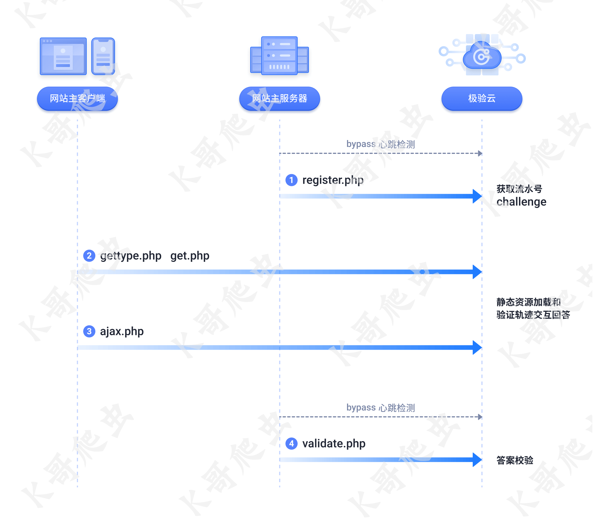

### 开始验证
GET https://jzsc.mohurd.gov.cn/APi/webApi/geetest/startCaptcha
密文:

```
fa8f1891eb026fa5ffabbd521d5acd4dace8066fd57432ad7076b9deb603f489f1a7e36da7f9c5667cafbcba78abcb87c94b7df6d1a41d1f804984aa5208430d26e169d10e9f1107b48fe6b7950cf30540fa7fdb3c5c4f2b6bba26d99de98267e5e5e6204b8efda2630d24e736aa75da2458bc533480256a6f045e20e63388daa80ab53e89db20a52a9c3d8498ac3821dd836dc39df8fcc65babaec2f018b15de4fa7cf2f5d14406c816aa8a26045f7e7d1ab6ca61b67194ce24a75d2c085a2ec92d15d228d78ca922ba91e6e469edc51fcbcac1c5c63b94b2610903bdca1c6b
```
明文
```json
{"code":2000,"data":{"randomId":"1990583228402106368","success":1,"new_captcha":true,"challenge":"29c9b99c89eaa605c58dff53d606ee78","gt":"c0084ad0567738668c18a81b2e9ca4cd"},"message":"初始化成功","success":true}
```

可以通过此接口采集极验的gt和challenge参数

### 极验

##### 执行跟踪

1. 网站主客户端发起调用 startCaptcha(网站主服务器后台和极验通信),返回gt/challenge等关键参数

2. 中间如果长时间停留/无操作,自动触发以下调用刷新验证码

   https://api.geevisit.com/reset.php?gt=c0084ad0567738668c18a81b2e9ca4cd&challenge=29c9b99c89eaa605c58dff53d606ee78&lang=zh-cn&w=5oAfQYr(JaiRP3gi)WGwxPGdb)1NT(XNMhYGdyQwKg02n)W5FYvoRkxAlknG2iaPstmsoYhq9I18k00GbqV5GD7fGcf3QLGP9VRzFUavaNQzKWPjvs(m6bjeDYfYmZe6cUl4DZlPWAVTH2Q9nsvt6I9PpITZS7A78JoPeVXciWAuklApyZyird5KOxikarNFjwEpJ1Bkdkoc9v8uV9Zor9Z16XkK7mgmkMWHmMnZ7eBLXIFpyjZAG8OLPvB72OJ2M)gjgvjibD6Xc)(ABGfHLxM3vsyr5bm7OzFEpHlaRSFCyr2UsU0KCwtoY(3p2sQwpR4SKYaSBGqWuBSXZmrJYDGcxR(U8ZaxmQBhmxHoPELnZ1uFt8dSsx(unaRWSULMOdrnMaQMggb(56vI5e)J5FC8JPAwYCGHdUjg(W0ofEkGzNzY8zet5gd2Zghyyck99f9955700cb31696d532aa90da095bb074c24369d316386060ca7ef25cfdc688b72e7078234328b757759a17a8a10d3e5555c17603aa5e94e55395c1a9912e7ef9b8f14761315a48091bb2288b2c6b09c14af33b06d84990b8219c74983bd66a00315dc5938bc860a99f2a95ba93ad764a4de977c2e97e5de347e8527d6c815c&pt=0&client_type=web&callback=geetest_1763427549634

   https://api.geevisit.com/refresh.php?gt=c0084ad0567738668c18a81b2e9ca4cd&challenge=29c9b99c89eaa605c58dff53d606ee78&lang=zh-cn&type=click&callback=geetest_1763427544246

3. 网站主客户端发起调用(实际应该是极验的jssdk内部完成,jsonp) https://api.geetest.com/gettype.php?gt=c0084ad0567738668c18a81b2e9ca4cd&callback=geetest_1763427006162

响应示例

```
geetest_1763427006162({
    "status": "success",
    "data": {
        "type": "fullpage",
        "static_servers": ["static.geetest.com/", "static.geevisit.com/"],
        "beeline": "/static/js/beeline.1.0.1.js",
        "voice": "/static/js/voice.1.2.6.js",
        "click": "/static/js/click.3.1.2.js",
        "fullpage": "/static/js/fullpage.9.2.0-guwyxh.js",
        "slide": "/static/js/slide.7.9.3.js",
        "geetest": "/static/js/geetest.6.0.9.js",
        "aspect_radio": {
            "slide": 103,
            "click": 128,
            "voice": 128,
            "beeline": 50
        }
    }
})

```

4. 网站主客户端发起调用(极验jssdk) https://api.geevisit.com/ajax.php?gt=c0084ad0567738668c18a81b2e9ca4cd&challenge=29c9b99c89eaa605c58dff53d606ee78&lang=zh-cn&pt=0&client_type=web&w=JFzyNqoYYOH4UMZku)naxxC4Q8GSfidLsp(qMHnq6bts8NgCz8AyNEOVkAHvFB2)6ubXFbjtneAzZ5r1qR0Gfhjw4AZl5LW3aNDvmzxFutHOfgh0k79c)mQbNPhT7D(aMu95bXdbJRLNDqraJfxU7pAOIDu0VgP3vq0RN0h(QHObAtY2KCniU4D6gA3NvBcaOc5(SmfiEtazlg3S4nAnSp1hL7gFDtGJHP(tx8HmlmWmYz)i1GkeQKJ6nxOrHziwuyAwObuXag8tZSE757Lu7mQ2fUxYlRU4q)HtC)EVIbpTMcZV81o3vGQ2IgUlz7LY0dlzP4CZwJxKMCOXXJyNziyBtbqIUyRBSXchq)oVyMQlFjGsq1BhkK3NGZfP09bu8hBdWWD7E6EapS3(XdzKTR1UPsS23XHJUdVNigBDm4PUphp)HD4I0Ur7IT1DMgzjPurWJ3EtyjQ4G795OkeZJuv0)(uC8ZVM2VJEpnLoIjEEnlpnmVsCX42IkjahZKLuSnFyvxuOLrhRtPMHoR7vjEtD5tq2f1vyOq8E(Bdlg6HM8WhS)goOewf0D769z3gAeVVQe5YPp1BHvFZM7pCg3HbFxFGdbSPRH0HzlCHaEbfyjc87ZKwivFLIvYwwz3b(xA)D6o1nkvMnNA)7voeVuidnQuk8HPCziEgJwq5fEhZJYILgODRiom09JKBfgUTpEr)w5s0Sok0h62ac70tFtNPnNfUSX6vkU(gF24FgruTYkDlGl(gzeVgrxczw1SUvfmwJU4PG1lAtDGpycGrDb8(0QhsPicxT5)4pUkPwqJ6SuA6uqYq90txk4KeuraDy2)KqGsVhIleA(JjWP5sBiSa5vHqFDOMcR3o)Yu9Wj(16yQNZXeg5Wunhx4LR6rSgRVv7XE139yW9jIb2xQWz2Oedy2kJGSdwm2rQWU4swhoJj19ppe6WAhr4XXwSSM2K1H4Z6V3k7)6Tb4kDH0p53)0RDemP)XSHq1bsSOyL1DGw03iZA)s6af9UCxjv3QI8R5Jbe26GRqxehugoTTyEgrCNKKRJwKYIhSpA1GH)13UEkZDYPcM8SbCMvbul1Pp9aSQn64WCW2YKwHoOtx600T2)2KL1ZB9UrKtrkxYb)hYitAKmrt3)EmK2s4zdfM0zCPNpnt5OfxhAm7V8q4ASqlPFpMF6p(rr8qIj(SykgtHgFUy)9Y1VHevzw26sC1(pt9G90FbBjqjLvVl(8MD2GDWoWC(dnmuD)6X90W9PyNQ(9zCImywMJBLkuONtPlIt2spYmR9C0n4iZu4kKz1x1EW9tvFHaAkiUO877Z(dEjc8qmyOTXK9KnQ2ZONtiKllaZLGhvCsUIDsL6O2XNIoQj86Be28I9XzjL)ZoM1hY9tnx3nfr)EWMHvaOkmRA9dbMCpy1LWqezmiXbq4jkbyLEX(ctWpG73UjJtWlsaQGlP0Jmcwse(NM7YQ1nIfsv(Olvn2TQXlWcy2IDxSweL1sqeP0SC54cE2C7qm)u2It5ku8TJ(UdIKqn8ow2sinmbVXW901lc9LngRa1XmkSiNHkwF7)tf39Xee3WchTvwnDDL2yKFqwgUp2eFSXmu8GbpURtuS(hFuX1mSdYLq3ixnBmYFlclAW3sH(oIBCnwsF9XrqNm54jYkijg8liMTarQKwCTJrAXzqFjvBvZAm5)Er6)prxFuQbURFjEoUY4V1(Vf74Mo1JR9J6vKHr5igthjW8IcjyWwgceIirg8Q(bAPVPscTCZUF2gY8gPA)1FljdXyzwbdO7CdsEKdJpOwAvcKHgEkpjb)JFdBWuAKlsb2ylNuTUT8XsXh(E9semdAlZMXrRdB)j)XLFyNG5pSZO7fKqDiSDhTXhroPAxHhRUp4v9OGyLEyXZVWaS9xlROgvxhrFiXi1pk7ymu7aQoRrsJryzVYvyb)oX(GquuHkJaWyuiO03R35MwCIm15cUQ2oWN47asOo8ec4CX(CMzD6baS33oHbUqpeHZGp7zTdhdPlSEd2Sdi1X6JXSJXXxc7BQ47P(iqIEauf0V(lFnGdo5k23QtaFMtaZbs7h0Maw1KhqQhS4(Vw9oduVgyl4(DMKfz43VjbaXIprGTuiiRGSEmH6yzZHns2yFry(YJ54mw2XU7VnI8GMiCLUc0ZWMo6RBN0ubAZZiO8eH5qjk9XIZVWMDrwCY)4gS(Ojzhac(A90ZPjsJUBpjL)0gQS(Flx6y4SYgyqhxhJcRIllA0Vt68Jc0zcpOsS6Usw(k2iD5oHSj9j9VhMrnqUlWJqdw4.a7ffb7be34b3757489c1284ce45436bca8fdcabf780f710bd07e3d2f652ce5c194b38746174f240ce496c2e77ae96020ef4ffb428d068f9e43c17aa4c54ba834bd8d991e2da5e8cf69d9a599525d34804fe4a70dbfa86ce5dd11f025c07cef24d79fbd1f232c28f458ff1f9b7b42110e9a0a32632682a9af6525a0d4fb075d25&callback=geetest_1763428826567

响应示例

```jsonp
geetest_1763428826567({
    "status": "success",
    "data": {
        "result": "success",
        "validate": "55eba7ea56213cc3662d5d0518a9d1e6",
        "score": "18",
        "msg": []
    }
})
```

5. 网站主客户端发起调用 verifyLoginCode(网站主服务器后台和极验通信) https://jzsc.mohurd.gov.cn/APi/webApi/geetest/verifyLoginCode?geetest_challenge=29c9b99c89eaa605c58dff53d606ee78&geetest_validate=55eba7ea56213cc3662d5d0518a9d1e6&geetest_seccode=55eba7ea56213cc3662d5d0518a9d1e6%7Cjordan&randomId=1990583228402106368

响应密文

```
638d882f721469a32cd0948d5e35d40e8730fc739f1b92f440817cf7863678d74616ef937b91e28dd54f6921c166c58466ea438769128167415e041afe6dc16d829c6fc117155d1820ff84f130699a9f73c2fbd6e40621113760d70c456081ba64599cf96230393a24e9f0e1049a6080f9ba2efd503de04041d07162a74a98c7a569ae052dc383c96fdd99a9f98e9478e13c0e790bf32c50b4a9bee06371c943561b92b11396b28018b5f18988f1fd96
```

响应明文

```
{"code":2000,"data":{"accessToken":"jkFXxgu9TcpocIyCKmJ+tfpxe/45B9dbWMUXhdY7vLXFMjYCBC0ZyOyHPE7cA+7WhpUUKvcMtoMqfGfwdLCb8g=="},"message":"验证成功","success":true}
```

参考时序图(附1) 

### 补充资料

附1 [【验证码逆向专栏】某验三代、四代点选类验证码逆向分析 - 吾爱破解 - 2023-3-15](https://www.52pojie.cn/thread-1758943-1-1.html)

[[原创\] 某网站极验逆向 v3.1.2-WEB安全-看雪论坛-2025-5-16](https://bbs.kanxue.com/thread-286858.htm)

[[验证码识别\]点选验证码识别的通用解决方案-相似度识别 - 吾爱破解 - 2024-2-5](https://www.52pojie.cn/thread-1888314-1-1.html)

[daisixuan/Geetest-AST-: 一键反混淆所有版本的极验混淆JS](https://github.com/daisixuan/Geetest-AST-)
